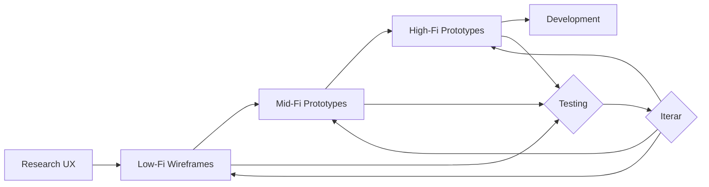

# UNIDAD 3: FUNDAMENTOS DEL DISEÑO WEB (LA ESTRUCTURA)

**Propósito de la Unidad:** Comprender cómo se estructura y organiza el contenido en la web para maximizar la usabilidad y compatibilidad, implementando los principios de UX y UI en layouts funcionales y responsive.

---

## 3.1. Prototipado y Wireframing

El prototipado es el proceso de crear representaciones de un producto digital que permiten explorar ideas, comunicar conceptos y validar soluciones antes de la implementación final. El wireframing constituye una técnica específica de prototipado enfocada en estructura y contenido.

### 3.1.1. Fidelidades: Baja, Media y Alta

La fidelidad de un prototipo se refiere al nivel de detalle, interactividad y similitud con el producto final. Cada nivel de fidelidad sirve propósitos específicos en el proceso de diseño.

**Baja Fidelidad (Low-Fi)**

**Características:**
- Representación esquemática y simplificada
- Sin color (generalmente escala de grises)
- Sin contenido real (texto placeholder: "Lorem ipsum")
- Sin tipografía específica
- Elementos representados con cajas, líneas, símbolos
- Rápido de crear y modificar
- Enfoque en estructura, jerarquía, flujo

**Formatos:**
- Sketches en papel
- Wireframes digitales simples
- Bloques y cajas de contenido

**Ventajas:**
- Muy rápido de crear (minutos a horas)
- Bajo costo de cambio (fácil desechar)
- Enfoca en decisiones estructurales sin distracciones visuales
- Fomenta exploración de múltiples alternativas
- Ideal para colaboración temprana con stakeholders

**Desventajas:**
- No representa experiencia visual final
- Limitado para testear usabilidad detallada
- Difícil evaluar jerarquía visual real
- No adecuado para presentaciones a clientes/ejecutivos

**Cuándo usar:**
- Exploración inicial de conceptos
- Definición de arquitectura de información
- Alineación de equipo en estructura
- Iteración rápida de múltiples ideas
- Workshops de co-diseño

**Ejemplo - Wireframe Baja Fidelidad:**

```
┌─────────────────────────────────────────┐
│  [LOGO]    Navegación  Navegación  [🔍] │
├─────────────────────────────────────────┤
│                                         │
│  ┌───────────────────────────────────┐  │
│  │                                   │  │
│  │    [Imagen Hero Placeholder]      │  │
│  │                                   │  │
│  │    Título Principal               │  │
│  │    Texto descriptivo breve        │  │
│  │    [CTA Principal]                │  │
│  │                                   │  │
│  └───────────────────────────────────┘  │
│                                         │
│  Sección de Características             │
│  ┌────────┐  ┌────────┐  ┌────────┐     │
│  │ [Icon] │  │ [Icon] │  │ [Icon] │     │
│  │ Título │  │ Título │  │ Título │     │
│  │ Texto  │  │ Texto  │  │ Texto  │     │
│  └────────┘  └────────┘  └────────┘     │
│                                         │
│  Lista de Cursos                        │
│  ┌──────────────────────────────────┐   │
│  │ [Img] Título del curso           │   │
│  │       Descripción breve          │   │
│  │       [Ver más]                  │   │
│  └──────────────────────────────────┘   │
│  ┌──────────────────────────────────┐   │
│  │ [Img] Título del curso           │   │
│  │       Descripción breve          │   │
│  │       [Ver más]                  │   │
│  └──────────────────────────────────┘   │
│                                         │
├─────────────────────────────────────────┤
│  Footer Links  |  Links  |  Links       │
└─────────────────────────────────────────┘
```

**Media Fidelidad (Mid-Fi)**

**Características:**

- Estructura más definida
- Contenido real o representativo (no solo "Lorem ipsum")
- Puede incluir color básico (escala de grises o colores de marca)
- Tipografía más cercana a final
- Algunos elementos interactivos básicos
- Iconografía simple

**Ventajas:**
- Balance entre velocidad y detalle
- Permite testear flujos de usuario
- Contenido representativo ayuda a evaluar jerarquía
- Adecuado para validación con stakeholders técnicos
- Base sólida para diseño de alta fidelidad

**Desventajas:**
- Más tiempo de creación que low-fi
- Puede crear falsas expectativas sobre diseño final
- Riesgo de apego prematuro a soluciones específicas

**Cuándo usar:**
- Validación de flujos de usuario
- Testing de usabilidad temprano
- Presentación a stakeholders técnicos
- Documentación de estructura para desarrollo
- Puente entre concepto y diseño visual

**Alta Fidelidad (High-Fi)**

**Características:**
- Diseño visual completo
- Colores, tipografía, imágenes reales
- Interactividad funcional
- Transiciones y animaciones
- Contenido real o muy representativo
- Indistinguible del producto final visualmente

**Ventajas:**
- Representación precisa del producto final
- Permite testing de usabilidad realista
- Adecuado para presentaciones a clientes/ejecutivos
- Útil para handoff a desarrollo
- Puede usarse para marketing/ventas

**Desventajas:**
- Tiempo considerable de creación
- Alto costo de cambios significativos
- Puede frenar exploración de alternativas
- Stakeholders pueden enfocarse en detalles visuales menores

**Cuándo usar:**
- Validación final antes de desarrollo
- Presentaciones a ejecutivos/clientes
- Testing de usabilidad detallado
- Documentación para desarrollo
- Material de marketing

**Comparación de Fidelidades:**

| Aspecto | Low-Fi | Mid-Fi | High-Fi |
|---------|--------|--------|---------|
| **Tiempo creación** | Minutos-Horas | Horas-Días | Días-Semanas |
| **Costo cambio** | Muy bajo | Moderado | Alto |
| **Visual** | Esquemático | Estructurado | Producto final |
| **Interactividad** | Ninguna/Mínima | Básica | Completa |
| **Contenido** | Placeholder | Representativo | Real |
| **Objetivo** | Explorar estructura | Validar flujos | Aprobar diseño final |
| **Testing** | Conceptual | Usabilidad básica | Usabilidad completa |
| **Stakeholders** | Equipo interno | Stakeholders técnicos | Todos, incluyendo ejecutivos |

### 3.1.2. Cuándo Usar Cada Nivel de Fidelidad

**Progresión Típica en Proyecto:**



**Framework de Decisión:**

**Usar Low-Fi cuando:**
- ✓ Estás explorando múltiples conceptos
- ✓ Necesitas feedback rápido sobre estructura
- ✓ Tienes limitaciones de tiempo/presupuesto severas
- ✓ Stakeholders están cómodos con abstracciones
- ✓ Enfoque es arquitectura de información

**Usar Mid-Fi cuando:**
- ✓ Estructura está definida, necesitas validar contenido
- ✓ Vas a hacer testing de usabilidad
- ✓ Necesitas comunicar flujos a desarrollo
- ✓ Stakeholders técnicos necesitan ver funcionalidad
- ✓ Preparas base para diseño visual

**Usar High-Fi cuando:**
- ✓ Diseño visual está aprobado
- ✓ Necesitas aprobar con ejecutivos/clientes
- ✓ Vas a hacer testing final de usabilidad
- ✓ Entregarás specs a desarrollo
- ✓ Usarás para marketing/ventas
- ✓ Producto es crítico y requiere validación exhaustiva

**Excepciones y Consideraciones:**

**Saltar directamente a High-Fi:**
- Producto muy simple (landing page)
- Equipo muy experimentado con dominio
- Presión de tiempo extrema (no recomendado pero realista)
- Redesign menor con estructura establecida

**Permanecer en Low-Fi:**
- Producto muy complejo que requiere exploración extensa
- Presupuesto muy limitado
- Prototipo solo para alineación interna

**Iterar en múltiples fidelidades:**
- Low-Fi para explorar sección nueva
- Mid-Fi para validar
- High-Fi para sección principal
- Enfoque híbrido es común en proyectos grandes

### 3.1.3. Sketching y Paper Prototyping

El sketching (bocetado) y paper prototyping son técnicas de prototipado de bajísima fidelidad que priorizan velocidad y exploración.

**Sketching (Bocetado)**

**Materiales:**
- Papel (preferiblemente grids o dot paper)
- Lápiz/marcadores
- Borrador

**Técnicas de Sketching Efectivo:**

**1. Crazy 8s:**
Método para generar 8 ideas en 8 minutos.

```pseudocode
Proceso:
1. Doblar papel A4 en 8 secciones
2. Timer de 8 minutos
3. Sketch una idea diferente por sección (1 min cada una)
4. No juzgar, solo producir volumen
5. Después de 8 minutos, revisar y seleccionar mejores
```

**Beneficios:**

- Previene apego a primera idea
- Fuerza pensar en alternativas
- Rápido y energizante

**2. Thumbnail Sketches:**
Bocetos muy pequeños (del tamaño de una miniatura) para explorar composiciones.

**3. Storyboarding:**
Secuencia de sketches que muestran flujo de usuario a través del tiempo.

```
┌─────────┐    ┌─────────┐    ┌─────────┐    ┌─────────┐
│ Frame 1 │ →  │ Frame 2 │ →  │ Frame 3 │ →  │ Frame 4 │
│         │    │         │    │         │    │         │
│ Usuario │    │ Busca   │    │ Resulta-│    │ Selec-  │
│ llega   │    │ curso   │    │ dos     │    │ ciona   │
└─────────┘    └─────────┘    └─────────┘    └─────────┘
```

**Principios de Sketching:**

1. **Volumen sobre calidad:** Producir muchos sketches rápidos
2. **No perfeccionar:** Sketch es descartable
3. **Pensar con la mano:** Dibujar ayuda a procesar ideas
4. **Iterar rápido:** Sketch → Evaluar → Sketch mejor versión
5. **Usar anotaciones:** Agregar notas explicativas

**Templates de Sketching:**

Para dispositivos específicos, usar templates pre-impresos:

```
Mobile (iPhone):
┌─────────────┐
│   Status    │
├─────────────┤
│             │
│             │
│   Content   │
│             │
│             │
├─────────────┤
│ Navigation  │
└─────────────┘

Desktop:
┌───────────────────────────────────┐
│  Header                           │
├─────────┬─────────────────────────┤
│         │                         │
│ Sidebar │  Main Content           │
│         │                         │
└─────────┴─────────────────────────┘
```

**Paper Prototyping**

Prototipado en papel que simula interactividad.

**Componentes:**
- Múltiples pantallas dibujadas
- Elementos móviles (popups, modales)
- "Botones" que al tocarse muestran siguiente pantalla
- Facilitador que "ejecuta" el prototipo

**Proceso de Paper Prototyping:**

1. **Preparación:**
   - Diseñar pantallas principales
   - Crear elementos interactivos separados
   - Preparar flujo de navegación

2. **Testing:**
   - Usuario "interactúa" tocando elementos
   - Facilitador cambia pantallas manualmente
   - Observador toma notas

3. **Ventajas:**
   - Extremadamente barato
   - Muy rápido de modificar (dibujar nueva pantalla)
   - Enfoca en flujo, no en visual
   - Accesible para todos (no requiere herramientas)

4. **Limitaciones:**
   - No captura interacciones complejas
   - Depende de facilitador
   - Difícil testear transiciones/animaciones
   - Puede sentirse poco profesional para algunos stakeholders

**Cuándo usar Paper Prototyping:**
- Workshops de diseño colaborativo
- Validación muy temprana de conceptos
- Presupuesto cero para herramientas
- Testing con usuarios internos/amigables
- Exploración de flujos complejos

### 3.1.4. Wireframes Digitales

Los wireframes digitales son representaciones estructurales creadas con software, permitiendo mayor precisión, compartir fácilmente y en algunos casos, interactividad básica.

**Herramientas Populares:**

**Figma (Recomendado para EduConnect):**
- Basado en web, colaborativo
- Gratuito para uso personal/pequeños equipos
- Potente para wireframes y prototipos high-fi
- Componentes y auto-layout

**Balsamiq:**
- Estilo sketch deliberado (parece dibujado a mano)
- Enfoque exclusivo en wireframing
- Previene apego visual prematuro

**Sketch (macOS only):**
- Poderoso para diseño UI
- Ecosistema de plugins extenso
- Requiere licencia

**Adobe XD:**
- Parte de Adobe Creative Cloud
- Buena integración con Photoshop/Illustrator
- Prototipado integrado

**Wireframing en Figma - Mejores Prácticas:**

**1. Crear Sistema de Componentes:**

```
Components Library:
├── Layout
│   ├── Container (1200px, 960px, 720px)
│   ├── Grid (12 columnas)
│   └── Sections
├── Navigation
│   ├── Header
│   ├── Footer
│   └── Sidebar
├── Content
│   ├── Card
│   ├── List Item
│   └── Hero Section
├── Forms
│   ├── Input
│   ├── Button
│   └── Checkbox
└── Placeholders
    ├── Image Placeholder
    ├── Text Block
    └── Icon Placeholder
```

**2. Usar Auto Layout:**

Auto Layout en Figma permite que frames se ajusten automáticamente al contenido.

```
Frame con Auto Layout:
- Padding: 24px
- Spacing: 16px (entre items)
- Dirección: Vertical
- Resizing: Hug contents

→ Agregar/quitar elementos ajusta automáticamente
```

**3. Establecer Convenciones Visuales:**

Para wireframes mid-fi en escala de grises:

```
Jerarquía mediante tonos de gris:
- Texto primario: #1A1A1A (casi negro)
- Texto secundario: #666666 (gris medio)
- Bordes/divisores: #CCCCCC (gris claro)
- Backgrounds: #F5F5F5 (gris muy claro)
- Placeholders de imagen: #E0E0E0

Botones:
- Primario: #333333 (oscuro)
- Secundario: Outline con #666666
- Texto: #666666 sin background
```

**4. Naming Conventions:**

```
Nomenclatura de layers:
[tipo]/[nombre descriptivo]

Ejemplos:
- frame/homepage-hero
- component/card-curso
- text/h1-titulo-principal
- button/cta-inscribirse

Beneficios:
- Fácil búsqueda
- Organización clara
- Handoff más limpio
```

**5. Responsive Wireframing:**

Crear versiones para diferentes breakpoints:

```
Artboard sizes:
- Mobile: 375px width (iPhone)
- Tablet: 768px width (iPad portrait)
- Desktop: 1440px width (laptop estándar)

Organización en Figma:
┌──────────────────────────────────────────┐
│  Página: Homepage                        │
│                                          │
│  [Mobile 375px] [Tablet 768px] [1440px]  │
│                                          │
└──────────────────────────────────────────┘
```

### 3.1.5. Anotaciones y Especificaciones

Las anotaciones son notas que explican funcionalidad, comportamiento o contexto que no es obvio visualmente. Las especificaciones (specs) son documentación técnica para desarrollo.

**Tipos de Anotaciones:**

**1. Anotaciones de Comportamiento:**

```
┌────────────────────────┐
│  [Buscar cursos...]    │ ← Al escribir, autocompletar
│                        │   sugiere 5 resultados máximo
│  Sugerencias:          │   
│  • UX Design           │ ← Click navega a curso
│  • Python              │   
│  • Data Science        │   
└────────────────────────┘
```

**2. Anotaciones de Estado:**

```
┌─────────────────┐
│ [Inscribirse]   │ ← Default state
└─────────────────┘

┌─────────────────┐
│ [Inscribirse]   │ ← Hover: Color más oscuro
└─────────────────┘   + elevación

┌─────────────────┐
│ [Loading...]    │ ← Loading: Spinner + disabled
└─────────────────┘

┌─────────────────┐
│ [Inscrito ✓]    │ ← Success: Check icon + feedback
└─────────────────┘
```

**3. Anotaciones de Contenido Dinámico:**

```
┌──────────────────────────────────────┐
│  Cursos Recomendados                 │
│                                      │
│  [Card 1] [Card 2] [Card 3]          │ ← Mostrar 3 cursos
│                                      │   basados en perfil
│  Lógica:                             │   del usuario
│  - Historial de búsqueda             │   
│  - Cursos completados                │   (ver doc algoritmo)
│  - Categorías de interés             │
└──────────────────────────────────────┘
```

**4. Anotaciones Responsive:**

```
Desktop (>1024px):
┌────────────┬──────────────────┐
│  Sidebar   │  Contenido       │
│  (20%)     │  (80%)           │
└────────────┴──────────────────┘

Tablet (768-1024px):
┌────────────┬──────────────────┐
│  Sidebar   │  Contenido       │
│  (30%)     │  (70%)           │
└────────────┴──────────────────┘

Mobile (<768px):
┌──────────────────────────────┐
│  [≡] Menú Hamburger          │
├──────────────────────────────┤
│  Contenido                   │
│  (100% width)                │
└──────────────────────────────┘
```

**Especificaciones para Desarrollo:**

**Red lines / Specs:**

```
┌─────────────────────────────────┐
│    ← 24px →                     │
│  ↑                              │
│ 16px [Título del Curso]         │ ← H3: 20px/600/1.4
│  ↓                              │   Color: #1A1A1A
│    ← 8px →                      │
│  ↑                              │
│ 12px Descripción del curso...   │ ← Body: 16px/400/1.5
│  ↓                              │   Color: #666666
│    ← 24px →                     │   Max 2 líneas
│                                 │
└─────────────────────────────────┘
```

**Especificaciones Interactivas:**

```markdown
## Botón: Inscribirse al Curso

### Estados

**Default:**
- Background: #2962FF
- Color: #FFFFFF
- Padding: 12px 24px
- Border-radius: 8px
- Font: 16px/600

**Hover:**
- Background: #1E4FCC (blue-600)
- Transform: translateY(-1px)
- Box-shadow: 0 4px 8px rgba(0,0,0,0.15)
- Transition: all 0.15s ease

**Active:**
- Background: #163A99 (blue-700)
- Transform: translateY(0)
- Box-shadow: 0 2px 4px rgba(0,0,0,0.1)

**Focus (keyboard):**
- Outline: 2px solid #2962FF
- Outline-offset: 2px

**Disabled:**
- Background: #CCCCCC
- Color: #666666
- Cursor: not-allowed
- Opacity: 0.6

**Loading:**
- Background: #2962FF
- Color: transparent
- Spinner: 16px white
- Cursor: wait

### Comportamiento

- Click → POST /api/courses/{id}/enroll
- Success → Cambiar a estado "Inscrito" + Mostrar toast
- Error → Mostrar mensaje inline + Mantener botón habilitado
- Loading timeout: 30s (mostrar error después)
```

**Herramientas para Especificaciones:**

**Figma Inspect Mode:**
- CSS properties automáticas
- Medidas y espaciados
- Export de assets

**Zeplin:**
- Sincroniza con Figma/Sketch
- Genera style guide automático
- Collaboration entre diseño y desarrollo

**Abstract:**
- Version control para diseño
- Handoff organizado
- Comentarios en context

**Documentación Complementaria:**

Además de wireframes anotados:

1. **Sitemap:** Estructura completa del sitio
2. **User Flows:** Diagramas de flujo de interacción
3. **Content Inventory:** Lista de todo el contenido
4. **Component Library:** Librería de componentes con specs
5. **Design Tokens:** Variables de diseño (colors, spacing, typography)

---

## 3.2. Diseño Web y Maquetación

La maquetación web es el proceso de organizar elementos visuales en una página para crear jerarquía, guiar la atención y facilitar la comprensión del contenido.

### 3.2.1. Principios de Estructura y Flujo de Contenido

**Flujo de Lectura Natural:**

En culturas occidentales, el flujo de lectura sigue patrones predecibles que deben considerarse en la maquetación.

**Patrón F (F-Pattern):**

Descubierto por Nielsen Norman Group mediante eye-tracking.

```
F═══════════════════
║
F════════════
║
F══════
║
║

Usuarios leen:
1. Horizontalmente la parte superior (barra del F)
2. Hacia abajo del lado izquierdo (tallo del F)
3. Horizontalmente sección media (barra inferior del F)
4. Continúan bajando por izquierda
```

**Implicaciones de diseño:**
- Información más importante en las dos primeras líneas
- Primeras palabras de títulos y párrafos son críticas
- Lado izquierdo es "hot zone"
- Contenido debe ser escaneable

**Aplicación en EduConnect:**

```html
<!-- Optimizado para F-Pattern -->
<article class="course-detail">
  <!-- Primera línea horizontal: Información crítica -->
  <h1>Introducción al Diseño UX</h1>
  
  <!-- Escaneo vertical izquierdo: Estructura clara -->
  <section>
    <h2>¿Qué aprenderás?</h2>
    <ul>
      <li><strong>Fundamentos</strong> de investigación UX</li>
      <li><strong>Metodologías</strong> de diseño centrado en usuario</li>
      <li><strong>Herramientas</strong> profesionales (Figma, Miro)</li>
    </ul>
  </section>
  
  <!-- Segunda línea horizontal: Información secundaria -->
  <section>
    <h2>Requisitos</h2>
    <p>No se requiere experiencia previa...</p>
  </section>
</article>
```

**Patrón Z (Z-Pattern):**

Común en páginas con menos texto, más visuales.

```
1══════════════════> 2
  ╲
    ╲
      ╲
        ╲
          3 ═════════════> 4

Usuarios escanean:
1. Esquina superior izquierda
2. Superior derecha
3. Diagonal hacia inferior izquierda
4. Inferior derecha
```

**Aplicación:** Landing pages, hero sections

```html
<!-- Optimizado para Z-Pattern -->
<section class="hero">
  <div class="hero-content">
    <!-- Punto 1: Logo/Marca -->
    <div class="brand">EduConnect</div>
    
    <!-- Punto 2: CTA navegación -->
    <nav>
      <a href="/login">Iniciar Sesión</a>
    </nav>
  </div>
  
  <div class="hero-main">
    <!-- Punto 3: Mensaje principal -->
    <h1>Aprende Skills del Futuro</h1>
    <p>Más de 1000 cursos en tecnología...</p>
    
    <!-- Punto 4: CTA principal -->
    <button class="cta-primary">Comenzar Gratis</button>
  </div>
</section>
```

**Patrón de Capa (Layer Cake Pattern):**

Secciones horizontales completas que se apilan verticalmente.

```
┌─────────────────────────────────┐
│  Hero Section (full width)      │
├─────────────────────────────────┤
│  Features Section               │
├─────────────────────────────────┤
│  Testimonials Section           │
├─────────────────────────────────┤
│  CTA Section                    │
├─────────────────────────────────┤
│  Footer                         │
└─────────────────────────────────┘
```

**Ventajas:**
- Narrativa clara
- Fácil de hacer responsive
- Guía natural hacia abajo

**Jerarquía Visual:**

**Principios de jerarquía en maquetación:**

1. **Size (Tamaño):**
```html
<h1 class="text-5xl">Más importante</h1>
<h2 class="text-3xl">Importante</h2>
<p class="text-base">Normal</p>
<small class="text-sm">Menos importante</small>
```

2. **Weight (Peso):**
```html
<p class="font-bold">Énfasis fuerte</p>
<p class="font-semibold">Énfasis medio</p>
<p class="font-normal">Normal</p>
<p class="font-light">Secundario</p>
```

3. **Proximity (Proximidad):**
```html
<article class="space-y-6">
  <!-- Grupo 1: Relacionado -->
  <div class="space-y-2">
    <h2>Título</h2>
    <p>Descripción relacionada</p>
  </div>
  
  <!-- Espacio grande: Separación -->
  
  <!-- Grupo 2: Nuevo tema -->
  <div class="space-y-2">
    <h2>Otro Título</h2>
    <p>Nueva descripción</p>
  </div>
</article>
```

4. **Color/Contrast:**
```css
.primary-content {
  color: var(--gray-900);  /* Alto contraste */
}

.secondary-content {
  color: var(--gray-600);  /* Contraste medio */
}

.tertiary-content {
  color: var(--gray-500);  /* Bajo contraste */
}
```

### 3.2.2. Sistemas de Grillas (Columnas, Gutters, Margins)

Las grillas son estructuras invisibles que organizan contenido, crean alineación y establecen ritmo visual.

**Anatomía de una Grilla:**

```
┌────────────────────────────────────────────────────┐
│ ← Margin →                         ← Margin →      │
│           ┌───┬─┬───┬─┬───┬─┬───┬─┬───┐            │
│           │Col│G│Col│G│Col│G│Col│G│Col│            │
│           │   │ │   │ │   │ │   │ │   │            │
│           └───┴─┴───┴─┴───┴─┴───┴─┴───┘            │
│                  ↑                                 │
│                Gutter                              │
└────────────────────────────────────────────────────┘

Componentes:
- Columns: Unidades verticales de contenido
- Gutters: Espacios entre columnas
- Margins: Espacios laterales exteriores
```

**Grilla de 12 Columnas (Estándar Web):**

12 columnas es estándar porque 12 es divisible por 2, 3, 4 y 6, ofreciendo máxima flexibilidad.

```
Layouts posibles con 12 columnas:

2 columnas:
[══════6══════][══════6══════]

3 columnas:
[════4════][════4════][════4════]

4 columnas:
[═══3═══][═══3═══][═══3═══][═══3═══]

Asimétricos:
[════8════════][════4════]  (Contenido principal + Sidebar)
[═══3═══][══════6══════][═══3═══]  (Sidebar + Main + Sidebar)
```

**Especificaciones de Grilla para EduConnect:**

```css
/* Desktop (1200px container) */
.grid-container {
  max-width: 1200px;
  margin: 0 auto;
  padding: 0 24px;  /* Margins */
}

.grid {
  display: grid;
  grid-template-columns: repeat(12, 1fr);
  gap: 24px;  /* Gutters */
}

/* Columna ocupa 6 de 12 (50%) */
.col-6 {
  grid-column: span 6;
}

/* Columna ocupa 4 de 12 (33.33%) */
.col-4 {
  grid-column: span 4;
}

/* Columna ocupa 8 de 12 (66.66%) */
.col-8 {
  grid-column: span 8;
}
```

**Grillas Responsive:**

```css
/* Mobile: 4 columnas */
@media (max-width: 767px) {
  .grid {
    grid-template-columns: repeat(4, 1fr);
    gap: 16px;
  }
  
  .col-md-6 {
    grid-column: span 4;  /* Full width en mobile */
  }
}

/* Tablet: 8 columnas */
@media (min-width: 768px) and (max-width: 1023px) {
  .grid {
    grid-template-columns: repeat(8, 1fr);
    gap: 20px;
  }
  
  .col-md-6 {
    grid-column: span 4;  /* 50% en tablet */
  }
}

/* Desktop: 12 columnas */
@media (min-width: 1024px) {
  .grid {
    grid-template-columns: repeat(12, 1fr);
    gap: 24px;
  }
  
  .col-md-6 {
    grid-column: span 6;  /* 50% en desktop */
  }
}
```

**Breakouts (Salirse de la Grilla):**

A veces necesitas que elementos excedan la grilla regular.

```css
.grid-container {
  display: grid;
  grid-template-columns: 
    [full-start] minmax(24px, 1fr)
    [content-start] repeat(12, minmax(0, 80px))
    [content-end] minmax(24px, 1fr)
    [full-end];
  gap: 24px;
}

/* Contenido normal dentro de grilla */
.content {
  grid-column: content;
}

/* Elemento que ocupa ancho completo */
.full-bleed {
  grid-column: full;
}

/* Ejemplo: Imagen hero full-width */
.hero-image {
  grid-column: full;
  width: 100%;
}
```

### 3.2.3. Layouts: Flexbox y Grid

CSS Grid y Flexbox son las dos tecnologías modernas para crear layouts. Cada una tiene fortalezas específicas.

**Flexbox: Para Layouts Unidimensionales**

Flexbox organiza elementos en una dirección (fila o columna).

**Cuándo usar Flexbox:**
- Navegación horizontal
- Centrar elementos
- Distribuir espacio entre items
- Alinear items en un eje
- Componentes pequeños (cards, buttons groups)

**Propiedades del Container:**

```css
.flex-container {
  display: flex;
  
  /* Dirección */
  flex-direction: row;  /* row | row-reverse | column | column-reverse */
  
  /* Wrap */
  flex-wrap: wrap;  /* nowrap | wrap | wrap-reverse */
  
  /* Alineación eje principal (horizontal si row) */
  justify-content: flex-start;  
  /* flex-start | flex-end | center | space-between | 
     space-around | space-evenly */
  
  /* Alineación eje cruzado (vertical si row) */
  align-items: stretch;  
  /* stretch | flex-start | flex-end | center | baseline */
  
  /* Gap entre items */
  gap: 16px;
}
```

**Propiedades de Items:**

```css
.flex-item {
  /* Crecimiento (ocupar espacio disponible) */
  flex-grow: 1;  /* 0 = no crecer, 1+ = crecer proporcionalmente */
  
  /* Encogimiento */
  flex-shrink: 1;  /* 0 = no encoger, 1 = puede encoger */
  
  /* Tamaño base */
  flex-basis: auto;  /* auto | <length> */
  
  /* Shorthand */
  flex: 1;  /* flex-grow flex-shrink flex-basis */
  
  /* Alineación individual */
  align-self: center;  /* Sobrescribe align-items del container */
}
```

**Ejemplos Prácticos:**

**1. Navegación Horizontal:**

```html
<nav class="main-nav">
  <a href="/">Inicio</a>
  <a href="/cursos">Cursos</a>
  <a href="/comunidad">Comunidad</a>
  <a href="/perfil">Mi Perfil</a>
</nav>
```

```css
.main-nav {
  display: flex;
  gap: 32px;
  align-items: center;
}

.main-nav a {
  padding: 8px 16px;
  text-decoration: none;
  color: var(--gray-700);
}
```

**2. Card con Header y Footer:**

```html
<div class="card">
  <div class="card-header">Título</div>
  <div class="card-body">Contenido que puede crecer...</div>
  <div class="card-footer">
    <button>Acción</button>
  </div>
</div>
```

```css
.card {
  display: flex;
  flex-direction: column;
  height: 100%;
}

.card-header,
.card-footer {
  flex-shrink: 0;  /* No encoger */
}

.card-body {
  flex-grow: 1;  /* Ocupar espacio disponible */
}
```

**3. Centrar Elemento:**

```css
.center-container {
  display: flex;
  justify-content: center;  /* Centrar horizontalmente */
  align-items: center;      /* Centrar verticalmente */
  min-height: 400px;
}
```

**4. Grid de Cards Responsive con Flexbox:**

```html
<div class="card-grid">
  <div class="card">...</div>
  <div class="card">...</div>
  <div class="card">...</div>
</div>
```

```css
.card-grid {
  display: flex;
  flex-wrap: wrap;
  gap: 24px;
}

.card {
  flex: 1 1 300px;  
  /* Crecer, encoger, base 300px */
  /* Crea grid responsive automático */
}
```

**CSS Grid: Para Layouts Bidimensionales**

Grid organiza elementos en filas Y columnas simultáneamente.

**Cuándo usar Grid:**
- Layouts de página completa
- Grids complejos
- Overlapping content
- Alineación precisa en 2 dimensiones

**Propiedades del Container:**

```css
.grid-container {
  display: grid;
  
  /* Definir columnas */
  grid-template-columns: 200px 1fr 200px;
  /* Fijas, flexible, fija */
  
  /* Definir filas */
  grid-template-rows: auto 1fr auto;
  /* Auto, flexible, auto */
  
  /* Gap */
  gap: 24px;  /* row-gap column-gap */
  
  /* Áreas nombradas (opcional) */
  grid-template-areas:
    "header header header"
    "sidebar main aside"
    "footer footer footer";
}
```

**Propiedades de Items:**

```css
.grid-item {
  /* Colocación por líneas */
  grid-column: 1 / 3;  /* De línea 1 a 3 */
  grid-row: 2 / 4;
  
  /* Shorthand con span */
  grid-column: span 2;  /* Ocupar 2 columnas */
  
  /* Colocación por áreas nombradas */
  grid-area: header;
  
  /* Alineación dentro de celda */
  justify-self: center;  /* Horizontal */
  align-self: center;    /* Vertical */
}
```

**Ejemplos Prácticos:**

**1. Layout de Página Clásico:**

```html
<div class="page-layout">
  <header class="header">Header</header>
  <aside class="sidebar">Sidebar</aside>
  <main class="main">Main Content</main>
  <footer class="footer">Footer</footer>
</div>
```

```css
.page-layout {
  display: grid;
  grid-template-columns: 250px 1fr;
  grid-template-rows: auto 1fr auto;
  grid-template-areas:
    "header header"
    "sidebar main"
    "footer footer";
  min-height: 100vh;
  gap: 0;
}

.header { grid-area: header; }
.sidebar { grid-area: sidebar; }
.main { grid-area: main; }
.footer { grid-area: footer; }
```

**2. Grid de Cursos (Catálogo EduConnect):**

```html
<div class="course-grid">
  <article class="course-card">...</article>
  <article class="course-card">...</article>
  <article class="course-card">...</article>
  <!-- ... más cards -->
</div>
```

```css
.course-grid {
  display: grid;
  grid-template-columns: repeat(auto-fill, minmax(300px, 1fr));
  gap: 24px;
}

/* auto-fill: Crea tantas columnas como quepan */
/* minmax(300px, 1fr): Mínimo 300px, máximo 1 fracción */
/* Resultado: Grid totalmente responsive sin media queries */
```

**3. Hero Section con Overlay:**

```html
<section class="hero">
  
  <div class="hero-content">
    <h1>Título Hero</h1>
    <p>Descripción...</p>
    <button>CTA</button>
  </div>
</section>
```

```css
.hero {
  display: grid;
  grid-template-columns: 1fr;
  grid-template-rows: 1fr;
  min-height: 500px;
}

.hero-image,
.hero-content {
  grid-column: 1;
  grid-row: 1;
  /* Ambos en misma celda = overlap */
}

.hero-image {
  object-fit: cover;
  width: 100%;
  height: 100%;
  filter: brightness(0.7);
}

.hero-content {
  z-index: 1;
  display: flex;
  flex-direction: column;
  justify-content: center;
  align-items: center;
  padding: 48px;
  color: white;
}
```

**Flexbox vs. Grid: Guía de Decisión**

| Situación | Usar |
|-----------|------|
| Navegación horizontal | Flexbox |
| Centrar elemento | Flexbox |
| Distribuir espacio entre items | Flexbox |
| Layout 1D (solo filas O columnas) | Flexbox |
| Layout completo de página | Grid |
| Gallery de imágenes | Grid |
| Layout 2D (filas Y columnas) | Grid |
| Overlapping elements | Grid |
| Alineación precisa en 2 ejes | Grid |

**Combinar Flexbox y Grid:**

No son mutuamente excluyentes. Común usar Grid para layout macro y Flexbox para componentes.

```html
<div class="page-layout">  <!-- Grid -->
  <header class="header">  <!-- Flexbox -->
    <nav class="nav">...</nav>  <!-- Flexbox -->
  </header>
  
  <main class="main">  <!-- Grid area -->
    <div class="card-grid">  <!-- Grid -->
      <div class="card">  <!-- Flexbox -->
        ...
      </div>
    </div>
  </main>
</div>
```

### 3.2.4. Espaciado Consistente (Regla del 8pt Grid)

Ya exploramos el 8pt grid en Unidad 2 desde perspectiva de tokens. Aquí veremos su aplicación práctica en layouts.

**Sistema de Espaciado de EduConnect:**

```css
:root {
  --space-1: 4px;
  --space-2: 8px;
  --space-3: 12px;
  --space-4: 16px;
  --space-5: 20px;
  --space-6: 24px;
  --space-8: 32px;
  --space-10: 40px;
  --space-12: 48px;
  --space-16: 64px;
  --space-20: 80px;
  --space-24: 96px;
}
```

**Aplicación en Componentes:**

```css
/* Card de Curso */
.course-card {
  padding: var(--space-6);  /* 24px interno */
  margin-bottom: var(--space-6);  /* 24px entre cards */
  border-radius: var(--space-2);  /* 8px bordes */
}

.course-card-title {
  margin-bottom: var(--space-2);  /* 8px después de título */
}

.course-card-meta {
  margin-top: var(--space-4);  /* 16px antes de metadata */
  gap: var(--space-4);  /* 16px entre meta items */
}

.course-card-button {
  margin-top: var(--space-6);  /* 24px antes de botón */
}
```

**Utilidades de Espaciado (Tailwind-style):**

```css
/* Padding */
.p-2 { padding: var(--space-2); }
.p-4 { padding: var(--space-4); }
.p-6 { padding: var(--space-6); }

/* Padding específico */
.px-4 { padding-left: var(--space-4); padding-right: var(--space-4); }
.py-6 { padding-top: var(--space-6); padding-bottom: var(--space-6); }

/* Margin */
.m-4 { margin: var(--space-4); }
.mt-6 { margin-top: var(--space-6); }
.mb-8 { margin-bottom: var(--space-8); }

/* Gap (Flexbox/Grid) */
.gap-4 { gap: var(--space-4); }
.gap-6 { gap: var(--space-6); }
```

**Espaciado Vertical Rhythmico:**

```css
/* Espacio vertical entre secciones */
.section {
  padding: var(--space-16) 0;  /* 64px arriba/abajo */
}

.section + .section {
  padding-top: var(--space-20);  /* 80px entre secciones */
}

/* Espacio dentro de contenido */
.content > * + * {
  margin-top: var(--space-4);  /* 16px entre elementos */
}

.content > h2 + * {
  margin-top: var(--space-6);  /* 24px después de headings */
}
```

### 3.2.5. Composición y Alineación

**Reglas de Composición:**

**1. Regla de Tercios:**

Dividir espacio en tercios crea composiciones más interesantes que centrar siempre.

```
┌────────┬────────┬────────┐
│        │        │        │
│   1/3  │  1/3   │  1/3   │
│        │        │        │
├────────┼────────┼────────┤
│        │        │        │
│        │  ✓     │        │  ← Punto focal en intersección
│        │        │        │
├────────┼────────┼────────┤
│        │        │        │
│        │        │        │
│        │        │        │
└────────┴────────┴────────┘
```

**2. Golden Ratio (1:1.618):**

Para proporciones de sidebars, columnas asimétricas:

```
Desktop layout:
┌──────────────┬───────────────────────────┐
│   Sidebar    │   Main Content            │
│   (382px)    │   (618px)                 │
│              │   (Total: 1000px)         │
│   38.2%      │   61.8%                   │
└──────────────┴───────────────────────────┘
```

**3. Alignment (Alineación):**

**Edge Alignment (Alineación por Borde):**

```
Elementos alineados por borde izquierdo:

┌──────────────────┐
│ Título           │
└──────────────────┘
┌────────────────────────────┐
│ Descripción larga...       │
└────────────────────────────┘
[Botón]

↑ Todo alineado al mismo borde
```

**Center Alignment (Alineación Central):**

```
Uso apropiado: Contenido corto, simétrico

        Título Corto
    Texto centrado breve
       [  Botón  ]

✗ Evitar en texto largo (difícil de leer)
```

**4. Proximity y Agrupación:**

```
Relacionado visualmente mediante proximidad:

Título del Artículo  ← 8px de espacio
Metadata del artículo

                      ← 24px de espacio (separador)

Párrafo del contenido ← 16px entre párrafos
que continúa aquí...

Párrafo siguiente...
```

**Composiciones Comunes:**

**Split Screen (Pantalla Dividida):**

```html
<section class="split-screen">
  <div class="split-content">
    <h2>Aprende a tu Ritmo</h2>
    <p>Accede a cursos...</p>
  </div>
  <div class="split-media">
    
  </div>
</section>
```

```css
.split-screen {
  display: grid;
  grid-template-columns: 1fr 1fr;
  gap: 48px;
  align-items: center;
}

@media (max-width: 768px) {
  .split-screen {
    grid-template-columns: 1fr;
    gap: 32px;
  }
}
```

**Bento Grid (Grid Asimétrico):**

```css
.bento-grid {
  display: grid;
  grid-template-columns: repeat(4, 1fr);
  grid-template-rows: repeat(3, 200px);
  gap: 16px;
}

.bento-item-large {
  grid-column: span 2;
  grid-row: span 2;
}

.bento-item-wide {
  grid-column: span 2;
}

.bento-item-tall {
  grid-row: span 2;
}
```

**Card Masonry (Estilo Pinterest):**

```css
.masonry-grid {
  column-count: 3;
  column-gap: 24px;
}

.masonry-item {
  break-inside: avoid;
  margin-bottom: 24px;
}

@media (max-width: 1024px) {
  .masonry-grid {
    column-count: 2;
  }
}

@media (max-width: 640px) {
  .masonry-grid {
    column-count: 1;
  }
}
```

---

## 3.3. Usabilidad y Navegación

La navegación es el sistema que permite a usuarios moverse por un producto digital. Una navegación efectiva es invisible cuando funciona bien, pero frustrante cuando falla.

### 3.3.1. Patrones de Navegación

**Horizontal/Top Navigation (Navegación Superior):**

El patrón más común en web desktop.

```html
<header class="site-header">
  <div class="header-container">
    <a href="/" class="logo">
      
    </a>
    
    <nav class="main-nav" aria-label="Navegación principal">
      <a href="/cursos">Cursos</a>
      <a href="/categorias">Categorías</a>
      <a href="/instructores">Instructores</a>
      <a href="/comunidad">Comunidad</a>
    </nav>
    
    <div class="header-actions">
      <button class="search-btn" aria-label="Buscar">
        <svg><!-- search icon --></svg>
      </button>
      <a href="/perfil" class="user-menu">
        
      </a>
    </div>
  </div>
</header>
```

```css
.site-header {
  position: sticky;
  top: 0;
  background: white;
  box-shadow: 0 2px 4px rgba(0,0,0,0.1);
  z-index: 100;
}

.header-container {
  max-width: 1200px;
  margin: 0 auto;
  padding: 16px 24px;
  display: flex;
  align-items: center;
  gap: 48px;
}

.logo {
  flex-shrink: 0;
}

.main-nav {
  display: flex;
  gap: 32px;
  flex-grow: 1;
}

.main-nav a {
  padding: 8px 0;
  color: var(--gray-700);
  text-decoration: none;
  font-weight: 500;
  border-bottom: 2px solid transparent;
  transition: all 0.2s;
}

.main-nav a:hover {
  color: var(--blue-600);
  border-bottom-color: var(--blue-600);
}

.main-nav a[aria-current="page"] {
  color: var(--blue-600);
  border-bottom-color: var(--blue-600);
}

.header-actions {
  display: flex;
  gap: 16px;
  align-items: center;
}
```

**Hamburger Menu (Menú Móvil):**

Patrón estándar para navegación móvil.

```html
<button 
  class="mobile-menu-toggle"
  aria-expanded="false"
  aria-controls="mobile-menu"
  aria-label="Abrir menú"
>
  <span class="hamburger-icon"></span>
</button>

<nav 
  id="mobile-menu" 
  class="mobile-nav"
  aria-label="Navegación principal"
  hidden
>
  <a href="/cursos">Cursos</a>
  <a href="/categorias">Categorías</a>
  <a href="/instructores">Instructores</a>
  <a href="/comunidad">Comunidad</a>
</nav>
```

```css
.mobile-menu-toggle {
  display: none;  /* Oculto en desktop */
  background: none;
  border: none;
  padding: 8px;
  cursor: pointer;
}

.hamburger-icon {
  display: block;
  width: 24px;
  height: 2px;
  background: var(--gray-900);
  position: relative;
}

.hamburger-icon::before,
.hamburger-icon::after {
  content: '';
  position: absolute;
  width: 100%;
  height: 2px;
  background: var(--gray-900);
  left: 0;
  transition: transform 0.3s;
}

.hamburger-icon::before {
  top: -8px;
}

.hamburger-icon::after {
  bottom: -8px;
}

/* Animación a X */
.mobile-menu-toggle[aria-expanded="true"] .hamburger-icon {
  background: transparent;
}

.mobile-menu-toggle[aria-expanded="true"] .hamburger-icon::before {
  transform: rotate(45deg) translateY(8px);
}

.mobile-menu-toggle[aria-expanded="true"] .hamburger-icon::after {
  transform: rotate(-45deg) translateY(-8px);
}

/* Mobile nav */
.mobile-nav {
  position: fixed;
  top: 64px;  /* Altura del header */
  left: 0;
  right: 0;
  bottom: 0;
  background: white;
  padding: 24px;
  overflow-y: auto;
  transform: translateX(-100%);
  transition: transform 0.3s;
}

.mobile-nav:not([hidden]) {
  transform: translateX(0);
}

.mobile-nav a {
  display: block;
  padding: 16px 0;
  font-size: 18px;
  color: var(--gray-900);
  text-decoration: none;
  border-bottom: 1px solid var(--gray-200);
}

@media (max-width: 768px) {
  .main-nav {
    display: none;  /* Ocultar nav horizontal */
  }
  
  .mobile-menu-toggle {
    display: block;  /* Mostrar hamburger */
  }
}
```

```javascript
// JavaScript para toggle
const menuToggle = document.querySelector('.mobile-menu-toggle');
const mobileNav = document.querySelector('.mobile-nav');

menuToggle.addEventListener('click', () => {
  const isExpanded = menuToggle.getAttribute('aria-expanded') === 'true';
  
  menuToggle.setAttribute('aria-expanded', !isExpanded);
  menuToggle.setAttribute('aria-label', isExpanded ? 'Abrir menú' : 'Cerrar menú');
  
  mobileNav.hidden = isExpanded;
  
  // Prevenir scroll del body cuando menú abierto
  document.body.style.overflow = isExpanded ? '' : 'hidden';
});
```

**Tab Bar (iOS) / Bottom Navigation (Android):**

Navegación inferior en móvil para apps o PWAs.

```html
<nav class="bottom-nav" aria-label="Navegación principal">
  <a href="/" class="nav-item" aria-current="page">
    <svg><!-- home icon --></svg>
    <span>Inicio</span>
  </a>
  <a href="/explorar" class="nav-item">
    <svg><!-- explore icon --></svg>
    <span>Explorar</span>
  </a>
  <a href="/aprendizaje" class="nav-item">
    <svg><!-- book icon --></svg>
    <span>Mi Aprendizaje</span>
  </a>
  <a href="/perfil" class="nav-item">
    <svg><!-- profile icon --></svg>
    <span>Perfil</span>
  </a>
</nav>
```

```css
.bottom-nav {
  position: fixed;
  bottom: 0;
  left: 0;
  right: 0;
  display: flex;
  background: white;
  border-top: 1px solid var(--gray-200);
  padding: 8px 0;
  z-index: 100;
}

.nav-item {
  flex: 1;
  display: flex;
  flex-direction: column;
  align-items: center;
  gap: 4px;
  padding: 8px;
  color: var(--gray-600);
  text-decoration: none;
  font-size: 12px;
  transition: color 0.2s;
}

.nav-item svg {
  width: 24px;
  height: 24px;
}

.nav-item:hover,
.nav-item[aria-current="page"] {
  color: var(--blue-600);
}

/* Añadir padding al body para compensar nav fijo */
body {
  padding-bottom: 72px;  /* Altura del bottom-nav */
}

@media (min-width: 768px) {
  .bottom-nav {
    display: none;  /* Ocultar en desktop */
  }
  
  body {
    padding-bottom: 0;
  }
}
```

**Sidebar Navigation:**

Común en dashboards y aplicaciones complejas.

```html
<div class="app-layout">
  <aside class="sidebar">
    <div class="sidebar-header">
      
    </div>
    
    <nav class="sidebar-nav" aria-label="Navegación principal">
      <a href="/dashboard" class="nav-link" aria-current="page">
        <svg><!-- dashboard icon --></svg>
        <span>Dashboard</span>
      </a>
      <a href="/cursos" class="nav-link">
        <svg><!-- courses icon --></svg>
        <span>Mis Cursos</span>
      </a>
      <a href="/progreso" class="nav-link">
        <svg><!-- progress icon --></svg>
        <span>Progreso</span>
      </a>
      
      <div class="nav-section-title">Comunidad</div>
      
      <a href="/mensajes" class="nav-link">
        <svg><!-- messages icon --></svg>
        <span>Mensajes</span>
        <span class="badge">3</span>
      </a>
      <a href="/foros" class="nav-link">
        <svg><!-- forum icon --></svg>
        <span>Foros</span>
      </a>
    </nav>
    
    <div class="sidebar-footer">
      <a href="/configuracion" class="nav-link">
        <svg><!-- settings icon --></svg>
        <span>Configuración</span>
      </a>
    </div>
  </aside>
  
  <main class="main-content">
    <!-- Contenido principal -->
  </main>
</div>
```

```css
.app-layout {
  display: grid;
  grid-template-columns: 260px 1fr;
  min-height: 100vh;
}

.sidebar {
  display: flex;
  flex-direction: column;
  background: var(--gray-50);
  border-right: 1px solid var(--gray-200);
  position: sticky;
  top: 0;
  height: 100vh;
  overflow-y: auto;
}

.sidebar-header {
  padding: 24px;
  border-bottom: 1px solid var(--gray-200);
}

.sidebar-nav {
  flex-grow: 1;
  padding: 16px 0;
}

.nav-section-title {
  padding: 16px 24px 8px;
  font-size: 12px;
  font-weight: 600;
  text-transform: uppercase;
  letter-spacing: 0.05em;
  color: var(--gray-500);
}

.nav-link {
  display: flex;
  align-items: center;
  gap: 12px;
  padding: 12px 24px;
  color: var(--gray-700);
  text-decoration: none;
  transition: all 0.2s;
  position: relative;
}

.nav-link svg {
  width: 20px;
  height: 20px;
  flex-shrink: 0;
}

.nav-link:hover {
  background: var(--gray-100);
  color: var(--gray-900);
}

.nav-link[aria-current="page"] {
  background: white;
  color: var(--blue-600);
  font-weight: 600;
}

.nav-link[aria-current="page"]::before {
  content: '';
  position: absolute;
  left: 0;
  top: 0;
  bottom: 0;
  width: 4px;
  background: var(--blue-600);
}

.badge {
  margin-left: auto;
  background: var(--error-500);
  color: white;
  padding: 2px 8px;
  border-radius: 12px;
  font-size: 12px;
  font-weight: 600;
}

.sidebar-footer {
  padding: 16px 0;
  border-top: 1px solid var(--gray-200);
}

/* Sidebar colapsable en tablet */
@media (max-width: 1024px) {
  .sidebar {
    position: fixed;
    transform: translateX(-100%);
    z-index: 1000;
    transition: transform 0.3s;
  }
  
  .sidebar.is-open {
    transform: translateX(0);
  }
  
  .app-layout {
    grid-template-columns: 1fr;
  }
}
```

**Mega Menu (Menú Expandido):**

Para sitios con muchas opciones, especialmente e-commerce.

```html
<nav class="main-nav">
  <button 
    class="nav-link"
    aria-expanded="false"
    aria-controls="cursos-menu"
  >
    Cursos
    <svg><!-- chevron down --></svg>
  </button>
  
  <div id="cursos-menu" class="mega-menu" hidden>
    <div class="mega-menu-section">
      <h3>Por Categoría</h3>
      <ul>
        <li><a href="/programacion">Programación</a></li>
        <li><a href="/diseno">Diseño</a></li>
        <li><a href="/data">Data Science</a></li>
        <li><a href="/negocios">Negocios</a></li>
      </ul>
    </div>
    
    <div class="mega-menu-section">
      <h3>Por Nivel</h3>
      <ul>
        <li><a href="/principiante">Principiante</a></li>
        <li><a href="/intermedio">Intermedio</a></li>
        <li><a href="/avanzado">Avanzado</a></li>
      </ul>
    </div>
    
    <div class="mega-menu-section mega-menu-featured">
      <h3>Destacados</h3>
      <div class="featured-course">
        
        <h4>Nuevo: UX Design Avanzado</h4>
        <a href="#">Ver curso →</a>
      </div>
    </div>
  </div>
</nav>
```

```css
.mega-menu {
  position: absolute;
  top: 100%;
  left: 0;
  right: 0;
  background: white;
  box-shadow: 0 8px 24px rgba(0,0,0,0.15);
  padding: 32px;
  display: grid;
  grid-template-columns: repeat(auto-fit, minmax(200px, 1fr));
  gap: 32px;
  max-width: 1200px;
  margin: 0 auto;
  opacity: 0;
  transform: translateY(-10px);
  transition: opacity 0.2s, transform 0.2s;
  pointer-events: none;
}

.mega-menu:not([hidden]) {
  opacity: 1;
  transform: translateY(0);
  pointer-events: auto;
}

.mega-menu-section h3 {
  font-size: 12px;
  font-weight: 600;
  text-transform: uppercase;
  color: var(--gray-500);
  margin-bottom: 16px;
}

.mega-menu-section ul {
  list-style: none;
  padding: 0;
}

.mega-menu-section li {
  margin-bottom: 8px;
}

.mega-menu-section a {
  color: var(--gray-700);
  text-decoration: none;
  transition: color 0.2s;
}

.mega-menu-section a:hover {
  color: var(--blue-600);
}

.mega-menu-featured {
  grid-column: span 1;
  background: var(--gray-50);
  padding: 16px;
  border-radius: 8px;
}
```

### 3.3.2. Patrones de Interacción

**Dropdowns y Selects:**

```html
<!-- Dropdown nativo -->
<div class="form-field">
  <label for="categoria">Categoría</label>
  <select id="categoria" name="categoria">
    <option value="">Selecciona una categoría</option>
    <option value="programacion">Programación</option>
    <option value="diseno">Diseño</option>
    <option value="data">Data Science</option>
  </select>
</div>

<!-- Dropdown custom (mejor UX) -->
<div class="custom-select">
  <button 
    class="select-trigger"
    aria-haspopup="listbox"
    aria-expanded="false"
  >
    <span class="select-value">Selecciona una categoría</span>
    <svg class="select-icon"><!-- chevron down --></svg>
  </button>
  
  <ul class="select-options" role="listbox" hidden>
    <li role="option" data-value="programacion">Programación</li>
    <li role="option" data-value="diseno">Diseño</li>
    <li role="option" data-value="data">Data Science</li>
  </ul>
</div>
```

**Modales (Diálogos):**

```html
<button class="open-modal" data-modal="inscripcion">
  Inscribirse
</button>

<div 
  id="modal-inscripcion" 
  class="modal" 
  role="dialog"
  aria-labelledby="modal-title"
  aria-modal="true"
  hidden
>
  <div class="modal-overlay" aria-hidden="true"></div>
  
  <div class="modal-container">
    <div class="modal-header">
      <h2 id="modal-title">Inscripción al Curso</h2>
      <button class="modal-close" aria-label="Cerrar">
        <svg><!-- X icon --></svg>
      </button>
    </div>
    
    <div class="modal-body">
      <p>¿Confirmas tu inscripción a este curso?</p>
    </div>
    
    <div class="modal-footer">
      <button class="btn btn-secondary modal-cancel">
        Cancelar
      </button>
      <button class="btn btn-primary modal-confirm">
        Confirmar Inscripción
      </button>
    </div>
  </div>
</div>
```

```css
.modal {
  position: fixed;
  top: 0;
  left: 0;
  right: 0;
  bottom: 0;
  z-index: 1000;
  display: flex;
  align-items: center;
  justify-content: center;
  padding: 24px;
}

.modal-overlay {
  position: absolute;
  top: 0;
  left: 0;
  right: 0;
  bottom: 0;
  background: rgba(0, 0, 0, 0.6);
  animation: fadeIn 0.2s;
}

.modal-container {
  position: relative;
  background: white;
  border-radius: 12px;
  max-width: 500px;
  width: 100%;
  max-height: 90vh;
  overflow-y: auto;
  box-shadow: 0 20px 60px rgba(0, 0, 0, 0.3);
  animation: slideUp 0.3s;
}

@keyframes fadeIn {
  from { opacity: 0; }
  to { opacity: 1; }
}

@keyframes slideUp {
  from {
    opacity: 0;
    transform: translateY(20px);
  }
  to {
    opacity: 1;
    transform: translateY(0);
  }
}

.modal-header {
  display: flex;
  align-items: center;
  justify-content: space-between;
  padding: 24px;
  border-bottom: 1px solid var(--gray-200);
}

.modal-close {
  background: none;
  border: none;
  padding: 8px;
  cursor: pointer;
  color: var(--gray-500);
  transition: color 0.2s;
}

.modal-close:hover {
  color: var(--gray-900);
}

.modal-body {
  padding: 24px;
}

.modal-footer {
  padding: 24px;
  border-top: 1px solid var(--gray-200);
  display: flex;
  gap: 12px;
  justify-content: flex-end;
}
```

**Tooltips:**

```html
<button 
  class="btn-icon"
  aria-describedby="tooltip-favorito"
>
  <svg><!-- heart icon --></svg>
</button>

<div id="tooltip-favorito" role="tooltip" class="tooltip" hidden>
  Guardar en favoritos
</div>
```

```css
.tooltip {
  position: absolute;
  background: var(--gray-900);
  color: white;
  padding: 8px 12px;
  border-radius: 6px;
  font-size: 14px;
  white-space: nowrap;
  z-index: 1000;
  pointer-events: none;
}

.tooltip::after {
  content: '';
  position: absolute;
  top: 100%;
  left: 50%;
  transform: translateX(-50%);
  border: 6px solid transparent;
  border-top-color: var(--gray-900);
}

/* Mostrar tooltip con JavaScript */
.tooltip:not([hidden]) {
  animation: tooltipFadeIn 0.2s;
}

@keyframes tooltipFadeIn {
  from {
    opacity: 0;
    transform: translateY(-4px);
  }
  to {
    opacity: 1;
    transform: translateY(0);
  }
}
```

**Accordions (Acordeones):**

```html
<div class="accordion">
  <div class="accordion-item">
    <button 
      class="accordion-trigger"
      aria-expanded="false"
      aria-controls="panel-1"
    >
      ¿Qué incluye el curso?
      <svg class="accordion-icon"><!-- chevron down --></svg>
    </button>
    
    <div id="panel-1" class="accordion-panel" hidden>
      <div class="accordion-content">
        <p>El curso incluye 8 módulos de video...</p>
      </div>
    </div>
  </div>
  
  <div class="accordion-item">
    <button 
      class="accordion-trigger"
      aria-expanded="false"
      aria-controls="panel-2"
    >
      ¿Cuánto dura el curso?
      <svg class="accordion-icon"><!-- chevron down --></svg>
    </button>
    
    <div id="panel-2" class="accordion-panel" hidden>
      <div class="accordion-content">
        <p>El curso tiene una duración de...</p>
      </div>
    </div>
  </div>
</div>
```

```css
.accordion-item {
  border-bottom: 1px solid var(--gray-200);
}

.accordion-trigger {
  width: 100%;
  display: flex;
  align-items: center;
  justify-content: space-between;
  padding: 20px 0;
  background: none;
  border: none;
  text-align: left;
  font-size: 16px;
  font-weight: 600;
  color: var(--gray-900);
  cursor: pointer;
  transition: color 0.2s;
}

.accordion-trigger:hover {
  color: var(--blue-600);
}

.accordion-icon {
  width: 20px;
  height: 20px;
  transition: transform 0.3s;
}

.accordion-trigger[aria-expanded="true"] .accordion-icon {
  transform: rotate(180deg);
}

.accordion-panel {
  overflow: hidden;
  max-height: 0;
  transition: max-height 0.3s ease-out;
}

.accordion-panel:not([hidden]) {
  max-height: 500px;  /* Ajustar según contenido */
}

.accordion-content {
  padding-bottom: 20px;
  color: var(--gray-700);
}
```

### 3.3.3. Leyes de UX Aplicadas

**Ley de Fitts:**

El tiempo para alcanzar un objetivo es función de la distancia y tamaño del objetivo.

**Fórmula:** `T = a + b × log₂(D/W + 1)`
- T = Tiempo
- D = Distancia al objetivo
- W = Ancho del objetivo
- a, b = constantes empíricas

**Implicaciones de diseño:**

1. **Botones importantes deben ser grandes:**

```css
/* ✗ MALO: Botón primario pequeño */
.btn-primary-bad {
  padding: 4px 8px;
  font-size: 12px;
}

/* ✓ BUENO: Botón primario prominente */
.btn-primary {
  padding: 12px 32px;
  font-size: 16px;
  min-height: 44px;  /* Tappable en móvil */
}
```

2. **Colocar acciones frecuentes cerca:**

```html
<!-- ✓ BUENO: Acción cerca del contenido relacionado -->
<article class="course-card">
  
  <h3>Título del Curso</h3>
  <p>Descripción...</p>
  <button>Ver Curso</button>  <!-- Cerca del contenido -->
</article>

<!-- ✗ MALO: Acción lejana -->
<article class="course-card">
  
  <h3>Título del Curso</h3>
  <p>Descripción...</p>
</article>
<button>Ver Curso</button>  <!-- Desconectado visualmente -->
```

3. **Bordes de pantalla son infinitamente grandes:**

```css
/* Aprovechar esquinas/bordes */
.fixed-cta {
  position: fixed;
  bottom: 0;
  right: 0;
  /* Esquina inferior derecha = fácil de alcanzar */
}
```

**Ley de Hick:**

El tiempo de decisión aumenta con el número y complejidad de opciones.

**Fórmula:** `T = b × log₂(n + 1)`
- T = Tiempo de decisión
- n = Número de opciones
- b = constante empírica

**Implicaciones de diseño:**

1. **Reducir opciones cuando sea posible:**

```html
<!-- ✗ MALO: Demasiadas opciones en nav -->
<nav>
  <a>Cursos</a>
  <a>Categorías</a>
  <a>Instructores</a>
  <a>Comunidad</a>
  <a>Blog</a>
  <a>Eventos</a>
  <a>Recursos</a>
  <a>Soporte</a>
  <a>Sobre Nosotros</a>
</nav>

<!-- ✓ BUENO: Opciones agrupadas -->
<nav>
  <a>Cursos</a>
  <a>Comunidad</a>
  <a>Mi Aprendizaje</a>
  <a>Más</a>  <!-- Agrupa opciones secundarias -->
</nav>
```

2. **Progressive disclosure (Revelación progresiva):**

```html
<!-- Mostrar solo lo esencial primero -->
<form>
  <input placeholder="Email">
  <button>Comenzar</button>
  
  <!-- Opciones avanzadas ocultas -->
  <details>
    <summary>Opciones avanzadas</summary>
    <label>
      <input type="checkbox">
      Recibir newsletter
    </label>
  </details>
</form>
```

3. **Defaults inteligentes:**

```html
<!-- Reducir decisiones con defaults sensatos -->
<select name="nivel">
  <option value="principiante" selected>Principiante</option>
  <option value="intermedio">Intermedio</option>
  <option value="avanzado">Avanzado</option>
</select>
```

**Ley de Miller (7±2):**

La memoria de trabajo puede mantener aproximadamente 7 ítems simultáneamente.

**Implicaciones de diseño:**

1. **Limitar items en menús:**

```html
<!-- ✓ BUENO: 5-7 items principales -->
<nav>
  <a>Inicio</a>
  <a>Explorar</a>
  <a>Mi Aprendizaje</a>
  <a>Comunidad</a>
  <a>Perfil</a>
</nav>
```

2. **Chunking (Agrupar información):**

```html
<!-- Número de teléfono chunked -->
<input 
  type="tel" 
  pattern="[0-9]{3}-[0-9]{3}-[0-9]{4}"
  placeholder="123-456-7890"
>

<!-- Vs. sin chunks (difícil de recordar/verificar) -->
<input 
  type="tel" 
  placeholder="1234567890"
>
```

3. **Pagination:**

```html
<!-- Limitar opciones visibles en paginación -->
<nav aria-label="Paginación">
  <a href="?page=1">1</a>
  <a href="?page=2" aria-current="page">2</a>
  <a href="?page=3">3</a>
  <span>...</span>
  <a href="?page=10">10</a>
  <a href="?page=3" aria-label="Página siguiente">→</a>
</nav>
```

**Ley de Jakob:**

Los usuarios pasan la mayor parte de su tiempo en otros sitios, por lo que prefieren que tu sitio funcione de la misma manera que los sitios que ya conocen.

**Implicaciones de diseño:**

1. **Seguir convenciones establecidas:**

```html
<!-- ✓ BUENO: Logo en esquina superior izquierda (convención) -->
<header>
  <a href="/" class="logo">EduConnect</a>
  <!-- ... -->
</header>

<!-- ✗ MALO: Logo en ubicación inusual -->
<footer>
  <a href="/" class="logo">EduConnect</a>
</footer>
```

2. **Iconos estándar para acciones comunes:**

```html
<!-- ✓ BUENO: Lupa = Buscar (universal) -->
<button aria-label="Buscar">
  <svg><!-- magnifying glass icon --></svg>
</button>

<!-- ✗ MALO: Ícono no estándar para buscar -->
<button aria-label="Buscar">
  <svg><!-- binoculars icon --></svg>
</button>
```

3. **Patrones de formulario familiares:**

```html
<!-- ✓ BUENO: Checkout flow estándar -->
<form>
  <fieldset>
    <legend>1. Información de contacto</legend>
    <!-- ... -->
  </fieldset>
  
  <fieldset>
    <legend>2. Método de pago</legend>
    <!-- ... -->
  </fieldset>
  
  <fieldset>
    <legend>3. Revisión</legend>
    <!-- ... -->
  </fieldset>
</form>
```

**Ley de Proximidad (Gestalt):**

Objetos próximos se perciben como relacionados.

```css
/* Usar spacing para indicar relaciones */
.form-group {
  margin-bottom: 24px;  /* Separación entre grupos */
}

.form-group label,
.form-group input {
  margin-bottom: 4px;  /* Proximidad indica relación */
}
```

### 3.3.4. F-Pattern y Z-Pattern de Lectura

Ya cubiertos en sección 3.2.1, pero vale enfatizar aplicaciones prácticas:

**Optimizar para F-Pattern:**

```html
<!-- Contenido optimizado para escaneo F -->
<article class="blog-post">
  <!-- Primera línea horizontal: Más importante -->
  <h1>Cómo Aprender UX Design en 2025</h1>
  
  <!-- Escaneando verticalmente por izquierda -->
  <ul class="key-points">
    <li><strong>Fundamentos</strong> primero, herramientas después</li>
    <li><strong>Practica</strong> con proyectos reales</li>
    <li><strong>Construye</strong> portfolio desde día uno</li>
  </ul>
  
  <!-- Segunda línea horizontal -->
  <h2>1. Comienza con los Fundamentos</h2>
  <p>Antes de saltar a Figma...</p>
</article>
```

**Optimizar para Z-Pattern:**

```html
<!-- Landing page con Z-Pattern -->
<section class="hero">
  <!-- Punto 1: Superior izquierda -->
  <div class="hero-badge">Nuevo</div>
  
  <!-- Punto 2: Superior derecha -->
  <button class="hero-cta-secondary">Ver Demo</button>
  
  <!-- Punto 3: Centro-izquierda (después de diagonal) -->
  <h1>Aprende Skills del Futuro</h1>
  <p>Más de 1000 cursos...</p>
  
  <!-- Punto 4: Inferior derecha -->
  <button class="hero-cta-primary">Comenzar Gratis →</button>
</section>
```

---

## 3.4. Diseño de Interacción

El diseño de interacción (IxD) define cómo los usuarios y el sistema se comunican a través del tiempo, enfocándose en comportamientos, feedback y transiciones.

### 3.4.1. Fundamentos de Interaction Design

**Los 5 Dimensiones de Interaction Design (Gillian Crampton Smith + Kevin Silver):**

1. **Words (1D):** Texto utilizado en interacciones
2. **Visual Representations (2D):** Gráficos, íconos, imágenes
3. **Physical Objects/Space (3D):** Hardware (mouse, touch, voz)
4. **Time (4D):** Duración de interacciones, animaciones
5. **Behavior (5D):** Cómo responde el sistema a acciones de usuario

**Principios de Diseño de Interacción:**

**1. Feedback (Retroalimentación):**

El sistema debe informar al usuario sobre resultado de acciones.

```css
/* Feedback visual en botón */
.button {
  transition: all 0.15s ease;
}

.button:hover {
  transform: scale(1.05);
  box-shadow: 0 4px 8px rgba(0,0,0,0.15);
  /* Feedback: "Puedo hacer click aquí" */
}

.button:active {
  transform: scale(0.98);
  /* Feedback: "Estoy presionando" */
}

.button.loading {
  cursor: wait;
  /* Feedback: "Procesando..." */
}

.button.success {
  background: var(--success-500);
  /* Feedback: "Acción completada" */
}
```

**2. Affordances:**

Las propiedades que sugieren cómo debe usarse algo.

```css
/* Botón con affordance clara */
.button {
  /* Parece presionable */
  padding: 12px 24px;
  background: var(--blue-500);
  border-radius: 8px;
  box-shadow: 0 2px 4px rgba(0,0,0,0.1);
  cursor: pointer;
}

/* Link con affordance */
.link {
  color: var(--blue-600);
  text-decoration: underline;
  cursor: pointer;
  /* Claramente clickeable */
}

/* Input con affordance */
.input {
  background: white;
  border: 1px solid var(--gray-300);
  padding: 12px;
  /* Invita a escribir */
}
```

**3. Constraints (Restricciones):**

Limitar acciones posibles para prevenir errores.

```html
<!-- Constraint: Solo números -->
<input 
  type="number" 
  min="1" 
  max="100"
  step="1"
>

<!-- Constraint: Solo fechas futuras -->
<input 
  type="date" 
  min="2025-01-01"
>

<!-- Constraint: Deshabilitar acción hasta completar requisito -->
<button disabled>
  Publicar Curso
</button>
<p class="helper-text">
  Completa todos los campos requeridos para publicar
</p>
```

**4. Mapping (Mapeo):**

Relación entre controles y sus efectos debe ser obvia.

```html
<!-- Buen mapeo: Controles de volumen -->
<div class="volume-control">
  <button aria-label="Bajar volumen">−</button>
  <input 
    type="range" 
    min="0" 
    max="100" 
    aria-label="Volumen"
  >
  <button aria-label="Subir volumen">+</button>
</div>

<!-- Mapeo visual claro -->
<div class="rating">
  <button aria-label="1 estrella">★</button>
  <button aria-label="2 estrellas">★★</button>
  <button aria-label="3 estrellas">★★★</button>
  <button aria-label="4 estrellas">★★★★</button>
  <button aria-label="5 estrellas">★★★★★</button>
</div>
```

**5. Consistency (Consistencia):**

Elementos similares se comportan de manera similar.

```css
/* Consistencia en botones */
.btn-primary,
.btn-secondary,
.btn-text {
  /* Todos comparten base */
  padding: 12px 24px;
  border-radius: 8px;
  font-weight: 600;
  cursor: pointer;
  transition: all 0.15s;
}

/* Consistencia en estados hover */
.btn-primary:hover,
.btn-secondary:hover,
.btn-text:hover {
  transform: translateY(-1px);
  /* Mismo comportamiento hover */
}
```

### 3.4.2. Microinteracciones y Feedback del Usuario

Las microinteracciones son pequeños momentos de interacción que tienen una función específica. Dan vida a la interfaz y hacen que la experiencia se sienta pulida.

**Estructura de una Microinteracción (Dan Saffer):**

1. **Trigger (Disparador):** Qué inicia la microinteracción
2. **Rules (Reglas):** Qué sucede
3. **Feedback:** Cómo el usuario sabe qué está pasando
4. **Loops & Modes:** Meta-reglas que gobiernan la microinteracción

**Ejemplos de Microinteracciones:**

**1. Like/Favorito:**

```html
<button class="favorite-btn" aria-pressed="false">
  <svg class="heart-icon">
    <path d="..."/>
  </svg>
</button>
```

```css
.favorite-btn {
  background: none;
  border: none;
  padding: 8px;
  cursor: pointer;
  transition: transform 0.1s;
}

.heart-icon {
  width: 24px;
  height: 24px;
  fill: none;
  stroke: var(--gray-400);
  stroke-width: 2;
  transition: all 0.3s cubic-bezier(0.68, -0.55, 0.265, 1.55);
}

/* Active state */
.favorite-btn[aria-pressed="true"] .heart-icon {
  fill: var(--error-500);
  stroke: var(--error-500);
  animation: heartBeat 0.3s;
}

@keyframes heartBeat {
  0%, 100% { transform: scale(1); }
  25% { transform: scale(1.3); }
  50% { transform: scale(1.1); }
  75% { transform: scale(1.2); }
}

.favorite-btn:active {
  transform: scale(0.9);
}
```

```javascript
const favoriteBtn = document.querySelector('.favorite-btn');

favoriteBtn.addEventListener('click', () => {
  const isPressed = favoriteBtn.getAttribute('aria-pressed') === 'true';
  favoriteBtn.setAttribute('aria-pressed', !isPressed);
  
  // Haptic feedback en móvil
  if (navigator.vibrate) {
    navigator.vibrate(50);
  }
  
  // Mostrar toast
  showToast(isPressed ? 'Removido de favoritos' : 'Añadido a favoritos');
});
```

**2. Button Loading State:**

```html
<button class="btn-primary" id="save-btn">
  <span class="btn-text">Guardar Cambios</span>
  <span class="btn-loader" hidden>
    <svg class="spinner"><!-- spinner --></svg>
  </span>
</button>
```

```css
.btn-primary {
  position: relative;
  min-width: 120px;
  transition: all 0.15s;
}

.btn-primary.is-loading {
  pointer-events: none;
}

.btn-primary.is-loading .btn-text {
  opacity: 0;
}

.btn-primary.is-loading .btn-loader {
  position: absolute;
  left: 50%;
  top: 50%;
  transform: translate(-50%, -50%);
}

.spinner {
  width: 20px;
  height: 20px;
  border: 2px solid rgba(255,255,255,0.3);
  border-top-color: white;
  border-radius: 50%;
  animation: spin 0.6s linear infinite;
}

@keyframes spin {
  to { transform: rotate(360deg); }
}
```

```javascript
async function saveChanges() {
  const btn = document.getElementById('save-btn');
  
  // Trigger
  btn.classList.add('is-loading');
  btn.querySelector('.btn-loader').hidden = false;
  
  try {
    // Rules: Hacer request
    await fetch('/api/save', { method: 'POST' });
    
    // Feedback: Éxito
    btn.classList.remove('is-loading');
    btn.classList.add('is-success');
    btn.querySelector('.btn-text').textContent = 'Guardado ✓';
    
    setTimeout(() => {
      btn.classList.remove('is-success');
      btn.querySelector('.btn-text').textContent = 'Guardar Cambios';
    }, 2000);
    
  } catch (error) {
    // Feedback: Error
    btn.classList.remove('is-loading');
    btn.querySelector('.btn-text').textContent = 'Error al guardar';
    showErrorMessage(error);
  }
}
```

**3. Form Field Validation:**

```html
<div class="form-field">
  <label for="email">Email</label>
  <input 
    type="email" 
    id="email"
    aria-describedby="email-error"
  >
  <span id="email-error" class="field-error" hidden></span>
  <span class="field-success" hidden>
    <svg><!-- checkmark --></svg>
  </span>
</div>
```

```css
.form-field {
  position: relative;
}

.form-field input {
  transition: border-color 0.2s, box-shadow 0.2s;
}

/* Estados con transiciones suaves */
.form-field.is-validating input {
  border-color: var(--blue-400);
}

.form-field.is-valid input {
  border-color: var(--success-500);
  padding-right: 40px; /* Espacio para checkmark */
}

.form-field.is-error input {
  border-color: var(--error-500);
  animation: shake 0.3s;
}

@keyframes shake {
  0%, 100% { transform: translateX(0); }
  25% { transform: translateX(-10px); }
  75% { transform: translateX(10px); }
}

.field-success {
  position: absolute;
  right: 12px;
  top: 50%;
  transform: translateY(-50%);
  color: var(--success-600);
  opacity: 0;
  animation: fadeInScale 0.3s forwards;
}

@keyframes fadeInScale {
  from {
    opacity: 0;
    transform: translateY(-50%) scale(0);
  }
  to {
    opacity: 1;
    transform: translateY(-50%) scale(1);
  }
}

.field-error {
  color: var(--error-600);
  font-size: 14px;
  margin-top: 4px;
  animation: slideDown 0.2s;
}

@keyframes slideDown {
  from {
    opacity: 0;
    transform: translateY(-4px);
  }
  to {
    opacity: 1;
    transform: translateY(0);
  }
}
```

**4. Pull to Refresh:**

```javascript
let startY = 0;
let currentY = 0;
let pulling = false;

const refreshContainer = document.querySelector('.pull-to-refresh');
const content = document.querySelector('.content');

content.addEventListener('touchstart', (e) => {
  if (content.scrollTop === 0) {
    startY = e.touches[0].pageY;
    pulling = true;
  }
});

content.addEventListener('touchmove', (e) => {
  if (!pulling) return;
  
  currentY = e.touches[0].pageY;
  const diff = currentY - startY;
  
  if (diff > 0) {
    e.preventDefault();
    const pullDistance = Math.min(diff, 100);
    
    // Visual feedback
    refreshContainer.style.height = `${pullDistance}px`;
    refreshContainer.style.opacity = pullDistance / 100;
    
    if (pullDistance >= 80) {
      refreshContainer.classList.add('ready');
    }
  }
});

content.addEventListener('touchend', async () => {
  if (!pulling) return;
  
  const diff = currentY - startY;
  
  if (diff >= 80) {
    // Trigger refresh
    refreshContainer.classList.add('loading');
    await fetchNewContent();
    refreshContainer.classList.remove('loading', 'ready');
  }
  
  // Reset
  refreshContainer.style.height = '0';
  refreshContainer.style.opacity = '0';
  pulling = false;
  startY = 0;
  currentY = 0;
});
```

**5. Toast Notifications:**

```javascript
function showToast(message, type = 'info', duration = 3000) {
  const toast = document.createElement('div');
  toast.className = `toast toast-${type}`;
  toast.innerHTML = `
    <div class="toast-content">
      <svg class="toast-icon"><!-- icon based on type --></svg>
      <span class="toast-message">${message}</span>
      <button class="toast-close" aria-label="Cerrar">×</button>
    </div>
  `;
  
  document.body.appendChild(toast);
  
  // Trigger animation
  setTimeout(() => toast.classList.add('show'), 10);
  
  // Auto dismiss
  const timeoutId = setTimeout(() => {
    dismissToast(toast);
  }, duration);
  
  // Manual close
  toast.querySelector('.toast-close').addEventListener('click', () => {
    clearTimeout(timeoutId);
    dismissToast(toast);
  });
}

function dismissToast(toast) {
  toast.classList.remove('show');
  toast.classList.add('hide');
  
  setTimeout(() => {
    toast.remove();
  }, 300);
}
```

```css
.toast {
  position: fixed;
  bottom: 24px;
  right: 24px;
  background: white;
  border-radius: 8px;
  padding: 16px;
  box-shadow: 0 8px 24px rgba(0,0,0,0.15);
  max-width: 400px;
  transform: translateY(100px);
  opacity: 0;
  transition: all 0.3s cubic-bezier(0.68, -0.55, 0.265, 1.55);
  z-index: 1000;
}

.toast.show {
  transform: translateY(0);
  opacity: 1;
}

.toast.hide {
  transform: translateX(400px);
  opacity: 0;
}

.toast-content {
  display: flex;
  align-items: center;
  gap: 12px;
}

.toast-icon {
  width: 20px;
  height: 20px;
  flex-shrink: 0;
}

.toast-success {
  border-left: 4px solid var(--success-500);
}

.toast-success .toast-icon {
  color: var(--success-600);
}

.toast-error {
  border-left: 4px solid var(--error-500);
}

.toast-error .toast-icon {
  color: var(--error-600);
}

.toast-close {
  background: none;
  border: none;
  font-size: 20px;
  color: var(--gray-500);
  cursor: pointer;
  padding: 0;
  margin-left: auto;
}
```

**Principios de Buenas Microinteracciones:**

1. **Propósito:** Cada microinteracción debe tener función clara
2. **Sutileza:** No distraer de tarea principal
3. **Rapidez:** Completarse en <300ms generalmente
4. **Naturalidad:** Sentirse física y predecible
5. **Humanidad:** Agregar personalidad sin ser molesto

### 3.4.3. Transiciones y Animaciones UX

Las animaciones y transiciones guían la atención, proporcionan feedback y crean continuidad entre estados.

**Cuándo Animar:**

✓ **SÍ animar:**
- Cambios de estado (hover, active, focus)
- Transiciones entre pantallas/vistas
- Feedback de acciones (like, save, delete)
- Revelar/ocultar contenido
- Guiar atención a nuevo contenido
- Loading states

✗ **NO animar:**
- Texto de contenido (dificulta lectura)
- Navegación crítica (retrasa tarea)
- Elementos que cambian frecuentemente
- Cuando usuario prefiere reduced motion

**Propiedades Animables con Buen Performance:**

```css
/* ✓ BUENO: Animar estas propiedades (GPU-accelerated) */
.element {
  /* Transform */
  transform: translateX(100px);
  transform: scale(1.1);
  transform: rotate(45deg);
  
  /* Opacity */
  opacity: 0.5;
}

/* ✗ MALO: Animar estas propiedades (causa reflow/repaint) */
.element-bad {
  /* Layout properties */
  width: 200px;
  height: 100px;
  top: 50px;
  left: 100px;
  margin: 20px;
  padding: 10px;
  
  /* Paint properties */
  background-color: red;
  border: 1px solid blue;
  box-shadow: 0 2px 4px rgba(0,0,0,0.1);
}
```

**Duraciones y Timing Functions:**

```css
:root {
  /* Duraciones */
  --duration-instant: 100ms;
  --duration-fast: 150ms;
  --duration-normal: 250ms;
  --duration-slow: 350ms;
  --duration-slower: 500ms;
  
  /* Easing functions */
  --ease-in: cubic-bezier(0.4, 0, 1, 1);
  --ease-out: cubic-bezier(0, 0, 0.2, 1);
  --ease-in-out: cubic-bezier(0.4, 0, 0.2, 1);
  --ease-bounce: cubic-bezier(0.68, -0.55, 0.265, 1.55);
}

/* Aplicación */
.fade {
  transition: opacity var(--duration-normal) var(--ease-in-out);
}

.slide {
  transition: transform var(--duration-normal) var(--ease-out);
}

.bounce {
  transition: transform var(--duration-slow) var(--ease-bounce);
}
```

**Patrones de Animación Comunes:**

**1. Fade In/Out:**

```css
@keyframes fadeIn {
  from {
    opacity: 0;
  }
  to {
    opacity: 1;
  }
}

.fade-in {
  animation: fadeIn 0.3s ease-out;
}

/* Combinado con movimiento */
@keyframes fadeInUp {
  from {
    opacity: 0;
    transform: translateY(20px);
  }
  to {
    opacity: 1;
    transform: translateY(0);
  }
}
```

**2. Slide In/Out:**

```css
@keyframes slideInRight {
  from {
    transform: translateX(100%);
  }
  to {
    transform: translateX(0);
  }
}

@keyframes slideOutLeft {
  from {
    transform: translateX(0);
  }
  to {
    transform: translateX(-100%);
  }
}

/* Mobile menu slide */
.mobile-menu {
  transform: translateX(-100%);
  transition: transform 0.3s cubic-bezier(0, 0, 0.2, 1);
}

.mobile-menu.is-open {
  transform: translateX(0);
}
```

**3. Scale/Zoom:**

```css
@keyframes scaleIn {
  from {
    opacity: 0;
    transform: scale(0.8);
  }
  to {
    opacity: 1;
    transform: scale(1);
  }
}

/* Modal entrance */
.modal {
  animation: scaleIn 0.3s cubic-bezier(0.68, -0.55, 0.265, 1.55);
}
```

**4. Skeleton Loading:**

```css
@keyframes shimmer {
  0% {
    background-position: -1000px 0;
  }
  100% {
    background-position: 1000px 0;
  }
}

.skeleton {
  background: linear-gradient(
    90deg,
    var(--gray-200) 0%,
    var(--gray-100) 50%,
    var(--gray-200) 100%
  );
  background-size: 1000px 100%;
  animation: shimmer 2s infinite linear;
}
```

**5. Progress Indication:**

```css
@keyframes progress {
  from {
    transform: scaleX(0);
    transform-origin: left;
  }
  to {
    transform: scaleX(1);
  }
}

.progress-bar {
  animation: progress 2s ease-out forwards;
}
```

**Transiciones de Página (Page Transitions):**

```css
/* View Transition API (moderno) */
@supports (view-transition-name: auto) {
  ::view-transition-old(root),
  ::view-transition-new(root) {
    animation-duration: 0.3s;
  }
  
  ::view-transition-old(root) {
    animation-name: fadeOut;
  }
  
  ::view-transition-new(root) {
    animation-name: fadeIn;
  }
}

/* Fallback tradicional */
.page-enter {
  opacity: 0;
  transform: translateX(30px);
}

.page-enter-active {
  opacity: 1;
  transform: translateX(0);
  transition: all 0.3s ease-out;
}

.page-exit {
  opacity: 1;
  transform: translateX(0);
}

.page-exit-active {
  opacity: 0;
  transform: translateX(-30px);
  transition: all 0.3s ease-in;
}
```

**Respetar Preferencias de Usuario:**

```css
/* Reducir animaciones para usuarios que lo prefieran */
@media (prefers-reduced-motion: reduce) {
  *,
  *::before,
  *::after {
    animation-duration: 0.01ms !important;
    animation-iteration-count: 1 !important;
    transition-duration: 0.01ms !important;
    scroll-behavior: auto !important;
  }
}

/* Alternativamente, diseño específico para reduced motion */
@media (prefers-reduced-motion: reduce) {
  .animated-element {
    animation: none;
    /* Usar cambio instantáneo o fade simple */
    transition: opacity 0.15s;
  }
}
```

### 3.4.4. Motion Design Básico Aplicado

Motion design es el uso intencional de movimiento para comunicar, guiar y deleitar.

**12 Principios de Animación (Disney) Aplicados a UI:**

**1. Squash and Stretch:**
Exageración de forma para enfatizar movimiento.

```css
@keyframes buttonPress {
  0% { transform: scale(1); }
  50% { transform: scale(0.95, 1.05); }
  100% { transform: scale(1); }
}

.button:active {
  animation: buttonPress 0.2s;
}
```

**2. Anticipation:**
Preparar al usuario para una acción próxima.

```css
/* Botón que "se prepara" antes de acción */
.submit-btn:active {
  transform: scale(0.95);
}

.submit-btn.submitting {
  transform: scale(1.05);
  /* Luego transición a loading */
}
```

**3. Staging:**
Dirigir atención a lo importante.

```css
/* Nuevo mensaje llama atención */
.new-message {
  animation: highlight 0.6s;
}

@keyframes highlight {
  0%, 100% { background: transparent; }
  50% { background: var(--blue-100); }
}
```

**4. Follow Through:**
Partes del objeto continúan moviéndose después del objeto principal se detiene.

```css
/* Menu items se animan secuencialmente */
.menu-item:nth-child(1) { animation-delay: 0s; }
.menu-item:nth-child(2) { animation-delay: 0.05s; }
.menu-item:nth-child(3) { animation-delay: 0.1s; }
.menu-item:nth-child(4) { animation-delay: 0.15s; }

.menu-item {
  animation: slideIn 0.3s ease-out backwards;
}
```

**5. Easing:**
Nada en naturaleza se mueve linealmente.

```css
/* Linear (robótico) */
.linear {
  transition: all 0.3s linear;
}

/* Ease-out (natural, desacelera al final) */
.natural {
  transition: all 0.3s cubic-bezier(0, 0, 0.2, 1);
}

/* Bounce (juguetón) */
.playful {
  transition: all 0.5s cubic-bezier(0.68, -0.55, 0.265, 1.55);
}
```

**6. Arcs:**
Movimiento en arcos es más natural que líneas rectas.

```css
/* Combinación de translate para crear arco */
@keyframes arcMove {
  0% {
    transform: translate(0, 0);
  }
  50% {
    transform: translate(100px, -50px);
  }
  100% {
    transform: translate(200px, 0);
  }
}
```

**Choreography (Coreografía):**

Múltiples elementos animándose en secuencia armoniosa.

```css
/* Cards apareciendo en cascada */
.card {
  opacity: 0;
  animation: fadeInUp 0.5s ease-out forwards;
}

.card:nth-child(1) { animation-delay: 0.1s; }
.card:nth-child(2) { animation-delay: 0.2s; }
.card:nth-child(3) { animation-delay: 0.3s; }
.card:nth-child(4) { animation-delay: 0.4s; }

@keyframes fadeInUp {
  to {
    opacity: 1;
    transform: translateY(0);
  }
}
```

**Parallax Scrolling:**

```javascript
window.addEventListener('scroll', () => {
  const scrolled = window.pageYOffset;
  
  // Elementos se mueven a diferentes velocidades
  document.querySelector('.layer-bg').style.transform = 
    `translateY(${scrolled * 0.5}px)`;
  
  document.querySelector('.layer-mid').style.transform = 
    `translateY(${scrolled * 0.3}px)`;
  
  document.querySelector('.layer-fg').style.transform = 
    `translateY(${scrolled * 0.1}px)`;
});
```

**Scroll-Triggered Animations:**

```javascript
// Intersection Observer para animar al entrar viewport
const observer = new IntersectionObserver((entries) => {
  entries.forEach(entry => {
    if (entry.isIntersecting) {
      entry.target.classList.add('animate-in');
      observer.unobserve(entry.target);
    }
  });
}, {
  threshold: 0.1
});

document.querySelectorAll('.animate-on-scroll').forEach(el => {
  observer.observe(el);
});
```

```css
.animate-on-scroll {
  opacity: 0;
  transform: translateY(30px);
  transition: all 0.6s ease-out;
}

.animate-on-scroll.animate-in {
  opacity: 1;
  transform: translateY(0);
}
```

### 3.4.5. Principios de Animación (Easing, Timing, Choreography)

**Easing (Aceleración):**

Las easing functions determinan la velocidad del cambio a través del tiempo.

**Tipos de Easing:**

```css
/* Linear: Velocidad constante (robótico) */
.linear {
  animation-timing-function: linear;
  /* cubic-bezier(0, 0, 1, 1) */
}

/* Ease: Inicio lento, rápido en medio, final lento */
.ease {
  animation-timing-function: ease;
  /* cubic-bezier(0.25, 0.1, 0.25, 1) */
}

/* Ease-in: Inicio lento, acelera */
.ease-in {
  animation-timing-function: ease-in;
  /* cubic-bezier(0.42, 0, 1, 1) */
  /* Uso: Elementos saliendo de pantalla */
}

/* Ease-out: Inicio rápido, desacelera */
.ease-out {
  animation-timing-function: ease-out;
  /* cubic-bezier(0, 0, 0.58, 1) */
  /* Uso: Elementos entrando a pantalla */
}

/* Ease-in-out: Lento al inicio y final */
.ease-in-out {
  animation-timing-function: ease-in-out;
  /* cubic-bezier(0.42, 0, 0.58, 1) */
  /* Uso: Cambios de estado */
}
```

**Material Design Easing:**

```css
:root {
  /* Standard easing */
  --md-easing-standard: cubic-bezier(0.4, 0.0, 0.2, 1);
  
  /* Deceleration (entering) */
  --md-easing-decelerate: cubic-bezier(0.0, 0.0, 0.2, 1);
  
  /* Acceleration (exiting) */
  --md-easing-accelerate: cubic-bezier(0.4, 0.0, 1, 1);
  
  /* Sharp (quick, decisive) */
  --md-easing-sharp: cubic-bezier(0.4, 0.0, 0.6, 1);
}

/* Aplicación */
.entering {
  animation-timing-function: var(--md-easing-decelerate);
}

.exiting {
  animation-timing-function: var(--md-easing-accelerate);
}
```

**iOS Easing:**

```css
:root {
  /* iOS standard */
  --ios-easing: cubic-bezier(0.36, 0.66, 0.04, 1);
}
```

**Custom Cubic Bezier:**

Herramientas: cubic-bezier.com, easings.net

```css
/* Bounce personalizado */
.custom-bounce {
  animation-timing-function: cubic-bezier(0.68, -0.55, 0.265, 1.55);
}

/* Anticipation */
.anticipation {
  animation-timing-function: cubic-bezier(0.36, 0, 0.66, -0.56);
}
```

**Timing (Duración):**

La duración afecta percepción de peso y distancia.

**Guías de Duración:**

```css
:root {
  /* Mobile (más rápido) */
  --duration-mobile-simple: 100ms;
  --duration-mobile-complex: 200ms;
  --duration-mobile-entrance: 225ms;
  --duration-mobile-exit: 195ms;
  
  /* Desktop (ligeramente más lento) */
  --duration-desktop-simple: 150ms;
  --duration-desktop-complex: 250ms;
  --duration-desktop-entrance: 300ms;
  --duration-desktop-exit: 250ms;
}

/* Ajustar según dispositivo */
@media (max-width: 768px) {
  .transition {
    transition-duration: var(--duration-mobile-simple);
  }
}

@media (min-width: 769px) {
  .transition {
    transition-duration: var(--duration-desktop-simple);
  }
}
```

**Reglas de Duración:**

```
Elementos pequeños: 150-250ms
Elementos medianos: 250-350ms
Elementos grandes: 350-500ms
Fullscreen: 400-600ms

Distancia corta: -50ms
Distancia larga: +50ms

Entrada: +25ms (más tiempo)
Salida: -25ms (más rápido)
```

**Choreography (Coreografía):**

Orquestar múltiples animaciones para crear narrativa cohesiva.

**Secuencial (Sequential):**

Elementos animan uno después del otro.

```css
.item-1 { animation-delay: 0ms; }
.item-2 { animation-delay: 100ms; }
.item-3 { animation-delay: 200ms; }
.item-4 { animation-delay: 300ms; }

/* O usando calc */
.item {
  animation-delay: calc(var(--index) * 100ms);
}
```

**Paralelo (Parallel):**

Múltiples elementos animan simultáneamente.

```css
.group > * {
  animation: fadeIn 0.3s ease-out;
  /* Todos al mismo tiempo */
}
```

**Cascada (Cascade):**

Combinación de secuencial con overlapping.

```css
.cascade-item {
  opacity: 0;
  animation: cascadeIn 0.5s ease-out forwards;
  animation-delay: calc(var(--index) * 0.05s);
}

@keyframes cascadeIn {
  to {
    opacity: 1;
    transform: translateY(0);
  }
}
```

**Ejemplo Completo: Lista de Cursos Animada**

```html
<div class="course-list">
  <article class="course-card" style="--index: 0">...</article>
  <article class="course-card" style="--index: 1">...</article>
  <article class="course-card" style="--index: 2">...</article>
  <article class="course-card" style="--index: 3">...</article>
</div>
```

```css
.course-card {
  opacity: 0;
  transform: translateY(20px) scale(0.95);
  animation: courseCardEnter 0.4s var(--md-easing-decelerate) forwards;
  animation-delay: calc(var(--index) * 0.08s);
}

@keyframes courseCardEnter {
  to {
    opacity: 1;
    transform: translateY(0) scale(1);
  }
}

/* Hover individual */
.course-card {
  transition: transform 0.2s var(--md-easing-standard);
}

.course-card:hover {
  transform: translateY(-4px) scale(1.02);
}
```

---

## 3.5. Responsive Web Design

Responsive design es el enfoque que asegura que interfaces funcionen bien en cualquier dispositivo y tamaño de pantalla.

### 3.5.1. Diseño Adaptable vs. Responsivo

**Responsive Design (Fluido):**

Layout se adapta fluidamente a cualquier tamaño de pantalla usando porcentajes, flexbox, grid.

```css
/* Responsive: Se adapta a cualquier ancho */
.container {
  width: 100%;
  max-width: 1200px;
  margin: 0 auto;
  padding: 0 5%;  /* Padding fluido */
}

.grid {
  display: grid;
  grid-template-columns: repeat(auto-fit, minmax(300px, 1fr));
  /* Se adapta automáticamente */
}
```

**Ventajas:**
- Funciona en cualquier dispositivo
- Una sola codebase
- Futuro-proof

**Desventajas:**
- Más complejo de diseñar
- Requiere testing extensivo

**Adaptive Design (Adaptativo):**

Layouts fijos para breakpoints específicos.

```css
/* Adaptive: Diseños específicos por breakpoint */
.container {
  width: 320px;  /* Mobile */
}

@media (min-width: 768px) {
  .container {
    width: 768px;  /* Tablet */
  }
}

@media (min-width: 1024px) {
  .container {
    width: 1024px;  /* Desktop */
  }
}
```

**Ventajas:**
- Más control sobre diseño exacto
- Optimización específica por dispositivo

**Desventajas:**
- No funciona bien entre breakpoints
- Más trabajo de mantenimiento

**Enfoque Híbrido (Recomendado):**

Combinar lo mejor de ambos.

```css
/* Base fluida con ajustes adaptativos */
.container {
  width: 100%;
  max-width: 1200px;
  padding: 0 5%;
}

.grid {
  display: grid;
  gap: 24px;
}

/* Mobile first: 1 columna por default */
.grid {
  grid-template-columns: 1fr;
}

/* Tablet: 2 columnas */
@media (min-width: 768px) {
  .grid {
    grid-template-columns: repeat(2, 1fr);
  }
}

/* Desktop: 3 columnas */
@media (min-width: 1024px) {
  .grid {
    grid-template-columns: repeat(3, 1fr);
  }
}
```

### 3.5.2. Mobile First vs. Desktop First

**Mobile First:**

Diseñar primero para móvil, luego expandir para pantallas mayores.

```css
/* Mobile first: Estilos base para móvil */
.nav {
  flex-direction: column;
  /* Mobile: Navegación vertical */
}

.nav-item {
  width: 100%;
  padding: 16px;
}

/* Tablet y mayores: Navegación horizontal */
@media (min-width: 768px) {
  .nav {
    flex-direction: row;
  }
  
  .nav-item {
    width: auto;
    padding: 8px 16px;
  }
}
```

**Ventajas Mobile First:**
- Fuerza priorización de contenido
- Performance: Móvil carga menos CSS
- Más fácil expandir que comprimir
- Alineado con uso predominante móvil

**Desktop First:**

Diseñar primero para desktop, luego adaptar para móvil.

```css
/* Desktop first: Estilos base para desktop */
.nav {
  flex-direction: row;
}

.nav-item {
  width: auto;
  padding: 8px 16px;
}

/* Mobile: Override para pantallas pequeñas */
@media (max-width: 767px) {
  .nav {
    flex-direction: column;
  }
  
  .nav-item {
    width: 100%;
    padding: 16px;
  }
}
```

**Desventajas Desktop First:**
- Móvil hereda CSS innecesario
- Fácil descuidar experiencia móvil
- Más trabajo adaptar diseño complejo a pequeño

**Recomendación para EduConnect: Mobile First**

```css
/* Sistema Mobile First de EduConnect */

/* Base: Mobile (320px+) */
:root {
  --container-padding: 16px;
  --grid-columns: 1;
  --font-size-base: 16px;
}

.container {
  padding: var(--container-padding);
}

/* Tablet (768px+) */
@media (min-width: 768px) {
  :root {
    --container-padding: 24px;
    --grid-columns: 2;
  }
}

/* Desktop (1024px+) */
@media (min-width: 1024px) {
  :root {
    --container-padding: 32px;
    --grid-columns: 3;
  }
}

/* Large Desktop (1440px+) */
@media (min-width: 1440px) {
  :root {
    --grid-columns: 4;
  }
}
```

### 3.5.3. Breakpoints Estratégicos

Los breakpoints definen puntos donde el layout cambia.

**Breakpoints Comunes:**

```css
/* Breakpoints basados en dispositivos comunes */

/* Extra Small (Phones portrait) */
/* 320px - 575px */
/* No media query needed (mobile first) */

/* Small (Phones landscape, small tablets) */
@media (min-width: 576px) {
  /* ... */
}

/* Medium (Tablets) */
@media (min-width: 768px) {
  /* ... */
}

/* Large (Desktop) */
@media (min-width: 1024px) {
  /* ... */
}

/* Extra Large (Large desktop) */
@media (min-width: 1440px) {
  /* ... */
}
```

**Breakpoints de EduConnect:**

```css
:root {
  /* Mobile */
  --breakpoint-sm: 640px;
  
  /* Tablet */
  --breakpoint-md: 768px;
  
  /* Desktop */
  --breakpoint-lg: 1024px;
  
  /* Large Desktop */
  --breakpoint-xl: 1280px;
  
  /* Extra Large */
  --breakpoint-2xl: 1536px;
}

/* Uso con media queries */
@media (min-width: 640px) {  /* sm */
  /* ... */
}

@media (min-width: 768px) {  /* md */
  /* ... */
}

@media (min-width: 1024px) {  /* lg */
  /* ... */
}

@media (min-width: 1280px) {  /* xl */
  /* ... */
}

@media (min-width: 1536px) {  /* 2xl */
  /* ... */
}
```

**Breakpoints Basados en Contenido (Mejor Práctica):**

En lugar de dispositivos específicos, breakpoints donde el diseño se rompe.

```css
/* Rompe cuando sidebar se vuelve muy estrecha */
@media (min-width: 850px) {
  .layout {
    grid-template-columns: 250px 1fr;
  }
}

/* Cards se vuelven muy anchas para 1 columna */
@media (min-width: 680px) {
  .card-grid {
    grid-template-columns: repeat(2, 1fr);
  }
}
```

**Container Queries (Futuro/Presente):**

Breakpoints basados en contenedor padre, no viewport.

```css
.sidebar {
  container-type: inline-size;
  container-name: sidebar;
}

.widget {
  padding: 16px;
}

/* Cuando sidebar > 300px */
@container sidebar (min-width: 300px) {
  .widget {
    display: grid;
    grid-template-columns: auto 1fr;
  }
}
```

**Testing de Breakpoints:**

```javascript
// JavaScript para detectar breakpoint actual
const getBreakpoint = () => {
  const width = window.innerWidth;
  
  if (width < 640) return 'mobile';
  if (width < 768) return 'sm';
  if (width < 1024) return 'md';
  if (width < 1280) return 'lg';
  if (width < 1536) return 'xl';
  return '2xl';
};

// Ejecutar lógica específica por breakpoint
window.addEventListener('resize', () => {
  const bp = getBreakpoint();
  document.body.dataset.breakpoint = bp;
});
```

### 3.5.4. Imágenes y Medios Responsivos

**Imágenes Responsive:**

**1. Width 100% con max-width:**

```css
img {
  max-width: 100%;
  height: auto;
  /* Se adapta al contenedor sin exceder tamaño original */
}
```

**2. srcset para diferentes resoluciones:**

```html

```

**Explicación sizes:**
- Mobile (<640px): Imagen ocupa 100% viewport width
- Tablet (640-1024px): Imagen ocupa 50% viewport width
- Desktop (>1024px): Imagen ocupa 33% viewport width

**3. picture para art direction:**

```html
<picture>
  <!-- Mobile: Imagen vertical -->
  <source 
    media="(max-width: 640px)"
    srcset="hero-mobile.jpg"
  >
  
  <!-- Tablet: Imagen cuadrada -->
  <source 
    media="(max-width: 1024px)"
    srcset="hero-tablet.jpg"
  >
  
  <!-- Desktop: Imagen horizontal -->
  <source 
    media="(min-width: 1025px)"
    srcset="hero-desktop.jpg"
  >
  
  <!-- Fallback -->
  
</picture>
```

**4. object-fit para control de aspect ratio:**

```css
.course-thumbnail {
  width: 100%;
  aspect-ratio: 16 / 9;
  object-fit: cover;  
  /* cover | contain | fill | none | scale-down */
}
```

**Video Responsive:**

```html
<!-- Wrapper para mantener aspect ratio -->
<div class="video-container">
  <iframe 
    src="https://www.youtube.com/embed/..."
    title="Video tutorial"
    allowfullscreen
  ></iframe>
</div>
```

```css
.video-container {
  position: relative;
  padding-bottom: 56.25%;  /* 16:9 aspect ratio */
  height: 0;
  overflow: hidden;
}

.video-container iframe {
  position: absolute;
  top: 0;
  left: 0;
  width: 100%;
  height: 100%;
}
```

**Background Images Responsive:**

```css
.hero {
  background-image: url('hero-mobile.jpg');
  background-size: cover;
  background-position: center;
}

@media (min-width: 768px) {
  .hero {
    background-image: url('hero-tablet.jpg');
  }
}

@media (min-width: 1024px) {
  .hero {
    background-image: url('hero-desktop.jpg');
  }
}

/* O con image-set */
.hero {
  background-image: image-set(
    url('hero.webp') type('image/webp'),
    url('hero.jpg') type('image/jpeg')
  );
}
```

**Lazy Loading:**

```html
<!-- Native lazy loading -->


<!-- Intersection Observer (mayor control) -->

```

```javascript
const lazyImages = document.querySelectorAll('img.lazy');

const imageObserver = new IntersectionObserver((entries) => {
  entries.forEach(entry => {
    if (entry.isIntersecting) {
      const img = entry.target;
      img.src = img.dataset.src;
      img.classList.remove('lazy');
      imageObserver.unobserve(img);
    }
  });
});

lazyImages.forEach(img => imageObserver.observe(img));
```

### 3.5.5. Prototipado Responsive

**Herramientas para Prototipar Responsive:**

**Figma:**

1. **Frames por breakpoint:**
```
Organización:
├── 📱 Mobile (375px)
├── 📱 Tablet (768px)
└── 💻 Desktop (1440px)
```

2. **Constraints:**
- Left: Fijo a izquierda
- Right: Fijo a derecha
- Left & Right: Escala con contenedor
- Center: Centrado
- Scale: Escala proporcionalmente

3. **Auto Layout:**
- Permite que contenedores se adapten a contenido
- Simula flexbox/grid
- Padding y spacing responsivos

**Proceso de Diseño Responsive:**

1. **Mobile first en Figma:**
```
Paso 1: Diseñar mobile (375px)
Paso 2: Duplicar y expandir a tablet (768px)
Paso 3: Duplicar y expandir a desktop (1440px)
Paso 4: Ajustar elementos por breakpoint
Paso 5: Crear componentes responsivos
```

2. **Componentes Responsive:**

```
Componente: Card de Curso

Variantes:
├── Mobile (1 columna, vertical)
├── Tablet (2 columnas, más compacta)
└── Desktop (3 columnas, horizontal)

Auto Layout:
- Direction: Vertical (mobile) → Horizontal (desktop)
- Padding: 16px (mobile) → 24px (desktop)
- Spacing: 12px (mobile) → 16px (desktop)
```

3. **Grids Responsivos en Figma:**

```
Mobile Grid:
- Columns: 4
- Gutter: 16px
- Margin: 16px

Tablet Grid:
- Columns: 8
- Gutter: 20px
- Margin: 24px

Desktop Grid:
- Columns: 12
- Gutter: 24px
- Margin: 24px
```

**Documentar Comportamiento Responsive:**

```markdown
## Course Card - Responsive Behavior

### Mobile (<640px)
- Full width (100%)
- Vertical layout
- Image aspect: 16:9
- CTA button: Full width

### Tablet (640-1024px)
- 2 columns grid
- Image aspect: 4:3
- CTA button: Auto width

### Desktop (1024px+)
- 3 columns grid
- Hover: Elevate card
- Image aspect: 16:9
- CTA button appears on hover
```

**Prototipado Interactivo Responsive:**

```
Figma Prototype:
1. Crear flows para cada breakpoint
2. Conectar interacciones
3. Configurar device frames
4. Testear en dispositivos reales

Testing:
- Chrome DevTools (Device Mode)
- BrowserStack (Dispositivos reales)
- Figma Mirror (iOS/Android)
```

---

## 3.6. Performance y Experiencia Técnica

El performance percibido afecta directamente la experiencia de usuario. Un sitio lento se siente defectuoso, incluso si es hermoso.

### 3.6.1. Rendimiento Percibido vs. Rendimiento Real

**Rendimiento Real:**
Tiempo objetivo medido (segundos, milisegundos).

**Rendimiento Percibido:**
Qué tan rápido se SIENTE el sitio para el usuario.

**Paradoja:** Sitio puede ser rápido pero sentirse lento, o lento pero sentirse rápido.

**Estrategias para Mejorar Percepción:**

**1. Mostrar algo inmediatamente:**

```html
<!-- Skeleton screen mientras carga -->
<div class="course-list">
  <div class="skeleton-card"></div>
  <div class="skeleton-card"></div>
  <div class="skeleton-card"></div>
</div>
```

```css
.skeleton-card {
  height: 300px;
  background: linear-gradient(
    90deg,
    var(--gray-200) 25%,
    var(--gray-100) 50%,
    var(--gray-200) 75%
  );
  background-size: 200% 100%;
  animation: shimmer 1.5s infinite;
  border-radius: 12px;
}

@keyframes shimmer {
  0% { background-position: -200% 0; }
  100% { background-position: 200% 0; }
}
```

**2. Progressive Enhancement:**

```html
<!-- HTML base funcional SIN JavaScript -->
<form action="/search" method="GET">
  <input type="search" name="q" required>
  <button type="submit">Buscar</button>
</form>

<!-- JavaScript mejora experiencia -->
<script>
  // Agregar autocompletado, búsqueda instantánea, etc.
  enhanceSearch();
</script>
```

**3. Optimistic UI:**

Asumir éxito antes de confirmación del servidor.

```javascript
async function likePost(postId) {
  // 1. Actualizar UI inmediatamente (optimistic)
  updateLikeButton(postId, true);
  incrementLikeCount(postId);
  
  try {
    // 2. Enviar al servidor
    await fetch(`/api/posts/${postId}/like`, { method: 'POST' });
    
  } catch (error) {
    // 3. Revertir si falla
    updateLikeButton(postId, false);
    decrementLikeCount(postId);
    showError('No se pudo guardar. Intenta de nuevo.');
  }
}
```

**4. Perceived Performance con Animaciones:**

```css
/* Transición suave cubre latencia */
.page-transition {
  opacity: 0;
  transition: opacity 0.3s;
}

.page-transition.loaded {
  opacity: 1;
}
```

**Métricas de Performance Percibido:**

**Core Web Vitals (Google):**

1. **LCP (Largest Contentful Paint):**
   - Cuánto tarda elemento más grande en cargar
   - Objetivo: <2.5s

2. **FID (First Input Delay):**
   - Tiempo hasta que sitio responde a primera interacción
   - Objetivo: <100ms

3. **CLS (Cumulative Layout Shift):**
   - Cuánto se mueve contenido mientras carga
   - Objetivo: <0.1

**Prevenir Layout Shift:**

```css
/* Reservar espacio para imágenes */
img {
  width: 100%;
  aspect-ratio: 16 / 9;
  /* Previene shift cuando imagen carga */
}

/* Skeleton con dimensiones exactas */
.skeleton {
  width: 300px;
  height: 200px;
}
```

### 3.6.2. Carga Progresiva y Lazy Loading

**Critical Rendering Path:**

Optimizar el camino crítico de renderizado.

```html
<!DOCTYPE html>
<html>
<head>
  <!-- 1. CSS crítico inline -->
  <style>
    /* Solo estilos above-the-fold */
    body { font-family: sans-serif; }
    .header { background: white; }
  </style>
  
  <!-- 2. Preload recursos críticos -->
  <link rel="preload" href="font.woff2" as="font" crossorigin>
  
  <!-- 3. CSS no crítico async -->
  <link rel="stylesheet" href="styles.css" media="print" onload="this.media='all'">
  
  <!-- 4. Defer JavaScript -->
  <script src="app.js" defer></script>
</head>
<body>
  <!-- Contenido above-the-fold primero -->
  <header class="header">...</header>
  <main>...</main>
  
  <!-- Contenido below-the-fold después -->
  <footer>...</footer>
</body>
</html>
```

**Lazy Loading de Imágenes:**

```html
<!-- Native lazy loading -->


<!-- Con placeholder -->

```

```javascript
// Intersection Observer para lazy load
const lazyLoad = (entries, observer) => {
  entries.forEach(entry => {
    if (entry.isIntersecting) {
      const img = entry.target;
      img.src = img.dataset.src;
      img.classList.remove('lazy-load');
      observer.unobserve(img);
    }
  });
};

const observer = new IntersectionObserver(lazyLoad, {
  rootMargin: '50px'  // Cargar 50px antes de entrar viewport
});

document.querySelectorAll('.lazy-load').forEach(img => {
  observer.observe(img);
});
```

**Lazy Loading de Componentes (Code Splitting):**

```javascript
// Dynamic import
const loadCourseDetail = async (courseId) => {
  // Solo cargar cuando se necesita
  const { CourseDetail } = await import('./CourseDetail.js');
  return new CourseDetail(courseId);
};

// Route-based splitting
const router = {
  '/': () => import('./pages/Home.js'),
  '/courses': () => import('./pages/Courses.js'),
  '/course/:id': () => import('./pages/CourseDetail.js'),
};
```

**Progressive Web App (PWA) Strategies:**

```javascript
// Service Worker para caching
self.addEventListener('install', (event) => {
  event.waitUntil(
    caches.open('educonnect-v1').then((cache) => {
      return cache.addAll([
        '/',
        '/styles.css',
        '/app.js',
        '/logo.svg',
      ]);
    })
  );
});

// Servir desde cache primero, red como fallback
self.addEventListener('fetch', (event) => {
  event.respondWith(
    caches.match(event.request).then((response) => {
      return response || fetch(event.request);
    })
  );
});
```

### 3.6.3. Optimización de Assets Visuales

**Imágenes:**

**1. Formato correcto:**

```
JPEG: Fotografías, imágenes complejas
PNG: Logos, iconos con transparencia
SVG: Iconos, logos simples, gráficos
WebP: Moderno, mejor compresión (con fallback)
AVIF: Futuro, compresión superior
```

**2. Compresión:**

```bash
# ImageMagick para optimización
convert input.jpg -quality 85 -strip output.jpg

# WebP
cwebp -q 80 input.jpg -o output.webp

# Herramientas:
# - TinyPNG/TinyJPG (online)
# - ImageOptim (Mac)
# - Squoosh (Google, online)
```

**3. Responsive images:**

```html
<picture>
  <!-- Formato moderno con fallback -->
  <source 
    type="image/avif"
    srcset="img-400.avif 400w, img-800.avif 800w"
  >
  <source 
    type="image/webp"
    srcset="img-400.webp 400w, img-800.webp 800w"
  >
  
</picture>
```

**CSS:**

**1. Minificación:**

```css
/* Antes (desarrollo) */
.button {
  padding: 12px 24px;
  background: #2962FF;
  border-radius: 8px;
}

/* Después (producción) */
.button{padding:12px 24px;background:#2962FF;border-radius:8px}
```

**2. Purge CSS no usado:**

```javascript
// PurgeCSS config
module.exports = {
  content: ['./**/*.html'],
  css: ['./styles.css'],
  output: './styles.min.css'
}
```

**3. Critical CSS:**

```html
<head>
  <!-- CSS crítico inline -->
  <style>
    /* Solo above-the-fold */
  </style>
  
  <!-- CSS completo async -->
  <link rel="preload" href="styles.css" as="style" onload="this.onload=null;this.rel='stylesheet'">
  <noscript><link rel="stylesheet" href="styles.css"></noscript>
</head>
```

**JavaScript:**

**1. Minificación y compresión:**

```bash
# Terser para minificar
terser input.js -o output.min.js --compress --mangle

# Gzip/Brotli compresión (servidor)
```

**2. Code splitting:**

```javascript
// Webpack config
module.exports = {
  optimization: {
    splitChunks: {
      chunks: 'all',
      cacheGroups: {
        vendor: {
          test: /[\\/]node_modules[\\/]/,
          name: 'vendors',
        },
      },
    },
  },
};
```

**3. Tree shaking:**

```javascript
// Solo importar lo necesario
import { map, filter } from 'lodash-es';

// NO todo lodash
// import _ from 'lodash';
```

**Fonts:**

```css
/* Preload font crítica */
@font-face {
  font-family: 'Inter';
  src: url('/fonts/inter-var.woff2') format('woff2');
  font-weight: 100 900;
  font-display: swap;  /* Mostrar fallback mientras carga */
}

/* Subset solo caracteres necesarios */
@font-face {
  font-family: 'Inter';
  src: url('/fonts/inter-latin.woff2') format('woff2');
  unicode-range: U+0000-00FF;  /* Solo Latin */
}
```

### 3.6.4. Skeleton Screens y Progressive Disclosure

**Skeleton Screens:**

Placeholders que reflejan estructura de contenido final.

```html
<!-- Skeleton para card de curso -->
<div class="course-card skeleton">
  <div class="skeleton-image"></div>
  <div class="skeleton-content">
    <div class="skeleton-title"></div>
    <div class="skeleton-text"></div>
    <div class="skeleton-text short"></div>
    <div class="skeleton-button"></div>
  </div>
</div>
```

```css
.skeleton {
  pointer-events: none;
  user-select: none;
}

.skeleton > * {
  background: linear-gradient(
    90deg,
    var(--gray-200) 0%,
    var(--gray-100) 50%,
    var(--gray-200) 100%
  );
  background-size: 200% 100%;
  animation: shimmer 1.5s ease-in-out infinite;
  border-radius: 4px;
}

@keyframes shimmer {
  0% { background-position: -200% 0; }
  100% { background-position: 200% 0; }
}

.skeleton-image {
  width: 100%;
  height: 180px;
  border-radius: 8px 8px 0 0;
}

.skeleton-title {
  height: 24px;
  width: 70%;
  margin-bottom: 12px;
}

.skeleton-text {
  height: 16px;
  width: 100%;
  margin-bottom: 8px;
}

.skeleton-text.short {
  width: 60%;
}

.skeleton-button {
  height: 40px;
  width: 120px;
  margin-top: 16px;
  border-radius: 8px;
}
```

**Transición de Skeleton a Contenido Real:**

```javascript
async function loadCourses() {
  const container = document.getElementById('course-list');
  
  // 1. Mostrar skeletons
  container.innerHTML = generateSkeletons(6);
  
  // 2. Cargar datos
  const courses = await fetch('/api/courses').then(r => r.json());
  
  // 3. Fade out skeletons
  const skeletons = container.querySelectorAll('.skeleton');
  skeletons.forEach(sk => sk.classList.add('fade-out'));
  
  // 4. Después de fade, reemplazar con contenido real
  setTimeout(() => {
    container.innerHTML = courses.map(renderCourse).join('');
    
  // 5. Fade in contenido real
  const cards = container.querySelectorAll('.course-card');
    cards.forEach((card, i) => {
      card.style.animationDelay = `${i * 0.05}s`;
      card.classList.add('fade-in');
    });
  }, 300);
}
```

**Progressive Disclosure:**

Revelar información progresivamente para reducir carga cognitiva.

**1. Accordion/Collapsible:**

```html
<div class="faq">
  <details>
    <summary>¿Qué incluye el curso?</summary>
    <p>El curso incluye 8 módulos de video...</p>
  </details>
  
  <details>
    <summary>¿Cuánto dura?</summary>
    <p>Aproximadamente 10 horas de contenido...</p>
  </details>
</div>
```

**2. "Show More" Pattern:**

```html
<div class="course-description">
  <p class="preview">
    Este curso te enseñará los fundamentos...
  </p>
  
  <div class="full-content" hidden>
    <p>Contenido extenso completo...</p>
  </div>
  
  <button class="show-more">
    Leer más
  </button>
</div>
```

```javascript
document.querySelector('.show-more').addEventListener('click', (e) => {
  const btn = e.target;
  const content = document.querySelector('.full-content');
  const preview = document.querySelector('.preview');
  
  if (content.hidden) {
    content.hidden = false;
    preview.hidden = true;
    btn.textContent = 'Leer menos';
    
    // Scroll suave al contenido expandido
    content.scrollIntoView({ behavior: 'smooth', block: 'nearest' });
  } else {
    content.hidden = true;
    preview.hidden = false;
    btn.textContent = 'Leer más';
  }
});
```

**3. Lazy Load de Tabs:**

```javascript
// Solo cargar contenido de tab cuando se activa
const tabs = document.querySelectorAll('[role="tab"]');

tabs.forEach(tab => {
  tab.addEventListener('click', async (e) => {
    const tabId = e.target.getAttribute('aria-controls');
    const panel = document.getElementById(tabId);
    
    // Si no está cargado
    if (!panel.dataset.loaded) {
      // Mostrar skeleton
      panel.innerHTML = '<div class="skeleton">Cargando...</div>';
      
      // Cargar contenido
      const content = await loadTabContent(tabId);
      panel.innerHTML = content;
      panel.dataset.loaded = 'true';
    }
  });
});
```

### 3.6.5. Colaboración UI/Front-end (Handoff)

El handoff es el proceso de transferir diseños de diseñadores a desarrolladores.

**Mejores Prácticas de Handoff:**

**1. Documentación Clara:**

```markdown
# Component: Button Primary

## Visual Specs
- Background: #2962FF (blue-500)
- Color: #FFFFFF
- Padding: 12px 24px
- Border-radius: 8px
- Font: 16px/600 Inter

## States
- Default: [specs above]
- Hover: Background #1E4FCC, translateY(-1px)
- Active: Background #163A99
- Focus: Outline 2px #2962FF, offset 2px
- Disabled: Background #CCCCCC, opacity 0.6
- Loading: Spinner 16px white

## Accessibility
- Min touch target: 44x44px
- ARIA: role="button"
- Keyboard: Enter/Space to activate
- Screen reader: Announce loading state

## Responsive
- Mobile: Full width
- Desktop: Auto width, min 120px
```

**2. Design Tokens Exportables:**

```json
{
  "color": {
    "primary": {
      "500": "#2962FF",
      "600": "#1E4FCC",
      "700": "#163A99"
    }
  },
  "spacing": {
    "3": "12px",
    "6": "24px"
  },
  "borderRadius": {
    "md": "8px"
  },
  "fontSize": {
    "base": "16px"
  },
  "fontWeight": {
    "semibold": 600
  }
}
```

**3. Componentes en Figma con Specs:**

```
Figma Component: btn-primary

Variants:
├── State: default | hover | active | focus | disabled | loading
├── Size: sm | md | lg
└── Width: auto | full

Inspect panel muestra:
- CSS properties
- Medidas exactas
- Espaciados
- Assets exportables
```

**4. Herramientas de Handoff:**

**Figma Inspect Mode:**
- Automáticamente genera CSS
- Export de assets
- Medidas y espaciados

**Zeplin:**
- Sincroniza con Figma/Sketch
- Style guide automático
- Comentarios en contexto
- Export de código

**Abstract:**
- Version control para diseño
- Branching y merging
- Review process

**Storybook:**
- Componentes vivos documentados
- Visual testing
- Casos de uso demostrados

**5. Proceso de Handoff:**

```
Pre-handoff:
1. Diseño completo en Figma
2. Componentes organizados
3. Design tokens documentados
4. Specs escritas

Handoff Meeting:
1. Walkthrough del diseño
2. Demostrar interacciones
3. Aclarar edge cases
4. Responder preguntas

Post-handoff:
1. Developers implementan
2. Diseñador revisa implementación
3. QA conjunto
4. Iteraciones si necesario
```

**6. Checklist de Handoff:**

```
Design:
□ Todos los estados diseñados
□ Responsive behavior definido
□ Interacciones documentadas
□ Animaciones especificadas (duration, easing)
□ Accessibility considerada
□ Edge cases cubiertos
□ Assets exportados

Development:
□ HTML semántico
□ CSS sigue design tokens
□ JavaScript accesible
□ Responsive funcional
□ Performance optimizado
□ Cross-browser testing
□ Accesibilidad validada

Ambos:
□ Diseño/código coinciden
□ Interacciones funcionan como diseñado
□ Responsive coincide con diseños
□ Accesibilidad cumple WCAG AA
□ Performance es aceptable
```

---

## EJEMPLO PRÁCTICO COMPLETO: Homepage Responsive de EduConnect

### Contexto

Diseñaremos e implementaremos la homepage completa de EduConnect aplicando todos los conceptos de esta unidad.

### Fase 1: Wireframing (Low-Fi)

**Mobile (375px):**

```
┌─────────────────────────────┐
│ [≡] LOGO         [🔍] [👤] │
├─────────────────────────────┤
│                             │
│  ┌───────────────────────┐  │
│  │   [Hero Image]        │  │
│  │   Aprende Skills      │  │
│  │   del Futuro          │  │
│  │   [CTA: Comenzar]     │  │
│  └───────────────────────┘  │
│                             │
│  Categorías Populares       │
│  ┌──────┐ ┌──────┐          │
│  │ Prog │ │Design│          │
│  └──────┘ └──────┘          │
│  ┌──────┐ ┌──────┐          │
│  │ Data │ │ Biz  │          │
│  └──────┘ └──────┘          │
│                             │
│  Cursos Destacados          │
│  ┌───────────────────────┐  │
│  │ [IMG] Título Curso    │  │
│  │ ⭐ 4.8  8h  Princ.    │  │
│  │ [Ver Curso]           │  │
│  └───────────────────────┘  │
│  ┌───────────────────────┐  │
│  │ [IMG] Título Curso    │  │
│  └───────────────────────┘  │
│                             │
│  [Ver Todos los Cursos]     │
│                             │
├─────────────────────────────┤
│ FOOTER                      │
│ Links | Links | Links       │
└─────────────────────────────┘
```

**Desktop (1440px):**

```
┌──────────────────────────────────────────────────────────────┐
│  LOGO    Cursos  Categorías  Comunidad    [Buscar] [Perfil]  │
├──────────────────────────────────────────────────────────────┤
│                                                              │
│  ┌─────────────────────────────────────────────────────────┐ │
│  │                                                         │ │
│  │  [Hero Background Image]                                │ │
│  │                                                         │ │
│  │  Aprende Skills del Futuro                              │ │
│  │  Más de 1000 cursos en tecnología, diseño y negocios    │ │
│  │                                                         │ │
│  │  [Explorar Cursos]  [Ver Demo]                          │ │
│  │                                                         │ │
│  └─────────────────────────────────────────────────────────┘ │
│                                                              │
│  Explora por Categoría                                       │
│  ┌──────────┐  ┌──────────┐  ┌──────────┐  ┌──────────┐      │
│  │ [Icon]   │  │ [Icon]   │  │ [Icon]   │  │ [Icon]   │      │
│  │ Programa.│  │ Diseño   │  │ Data Sci.│  │ Negocios │      │
│  │ 230 curs │  │ 180 curs │  │ 150 curs │  │ 120 curs │      │
│  └──────────┘  └──────────┘  └──────────┘  └──────────┘      │
│                                                              │
│  Cursos Populares                                            │
│  ┌────────┐  ┌────────┐  ┌────────┐  ┌────────┐              │
│  │ [IMG]  │  │ [IMG]  │  │ [IMG]  │  │ [IMG]  │              │
│  │ Título │  │ Título │  │ Título │  │ Título │              │
│  │ ⭐4.8  │  │ ⭐4.9  │  │ ⭐4.7 │  │ ⭐4.8  │              │
│  │ [Ver]  │  │ [Ver]  │  │ [Ver]  │  │ [Ver]  │              │
│  └────────┘  └────────┘  └────────┘  └────────┘              │
│                                                              │
│  [Ver Más Cursos →]                                          │
│                                                              │
├──────────────────────────────────────────────────────────────┤
│  Footer: Links | Sobre Nosotros | Contacto | Social Media    │
└──────────────────────────────────────────────────────────────┘
```

### Fase 2: High-Fi Design (Figma)

**Componentes Diseñados:**

1. **Header Component:**
   - Mobile: Hamburger menu
   - Desktop: Horizontal navigation

2. **Hero Section:**
   - Background image con overlay
   - Tipografía grande (Display)
   - Dos CTAs (primary + secondary)

3. **Category Cards:**
   - Grid responsive (2x2 mobile, 4x1 desktop)
   - Icon + Title + Count

4. **Course Cards:**
   - Grid responsive (1 column mobile, 4 columns desktop)
   - Image + Title + Rating + Metadata + CTA

### Fase 3: Implementación HTML

```html
<!DOCTYPE html>
<html lang="es">
<head>
  <meta charset="UTF-8">
  <meta name="viewport" content="width=device-width, initial-scale=1.0">
  <title>EduConnect - Aprende Skills del Futuro</title>
  
  <!-- Preload critical resources -->
  <link rel="preload" href="/fonts/inter-var.woff2" as="font" type="font/woff2" crossorigin>
  
  <!-- Critical CSS inline (omitido por brevedad) -->
  <link rel="stylesheet" href="/css/main.css">
  
  <!-- Favicon -->
  <link rel="icon" href="/favicon.svg" type="image/svg+xml">
  
  <!-- Meta tags -->
  <meta name="description" content="Aprende programación, diseño, data science y más con EduConnect. Más de 1000 cursos online.">
</head>
<body>
  <!-- Header -->
  <header class="site-header">
    <div class="container">
      <a href="/" class="logo">
        
      </a>
      
      <!-- Desktop Navigation -->
      <nav class="main-nav" aria-label="Navegación principal">
        <a href="/cursos">Cursos</a>
        <a href="/categorias">Categorías</a>
        <a href="/comunidad">Comunidad</a>
      </nav>
      
      <!-- Header Actions -->
      <div class="header-actions">
        <button class="btn-icon search-toggle" aria-label="Buscar">
          <svg><!-- search icon --></svg>
        </button>
        <a href="/perfil" class="btn-icon" aria-label="Mi perfil">
          <svg><!-- user icon --></svg>
        </a>
        <button class="mobile-menu-toggle" aria-label="Abrir menú">
          <span class="hamburger-icon"></span>
        </button>
      </div>
    </div>
    
    <!-- Mobile Navigation -->
    <nav class="mobile-nav" hidden>
      <a href="/cursos">Cursos</a>
      <a href="/categorias">Categorías</a>
      <a href="/comunidad">Comunidad</a>
      <a href="/perfil">Mi Perfil</a>
    </nav>
  </header>
  
  <!-- Main Content -->
  <main id="main-content">
    <!-- Hero Section -->
    <section class="hero">
      <div class="hero-background">
        <picture>
          <source media="(min-width: 1024px)" srcset="/images/hero-desktop.webp" type="image/webp">
          <source media="(min-width: 768px)" srcset="/images/hero-tablet.webp" type="image/webp">
          <source srcset="/images/hero-mobile.webp" type="image/webp">
          
        </picture>
      </div>
      
      <div class="hero-content container">
        <h1 class="hero-title">
          Aprende Skills del Futuro
        </h1>
        <p class="hero-description">
          Más de 1000 cursos en tecnología, diseño y negocios.
          Aprende a tu ritmo con los mejores instructores.
        </p>
        <div class="hero-actions">
          <a href="/cursos" class="btn btn-primary btn-lg">
            Explorar Cursos
          </a>
          <button class="btn btn-secondary btn-lg" data-video="intro">
            Ver Demo
          </button>
        </div>
      </div>
    </section>
    
    <!-- Categories Section -->
    <section class="section categories-section">
      <div class="container">
        <h2 class="section-title">Explora por Categoría</h2>
        
        <div class="categories-grid">
          <a href="/categoria/programacion" class="category-card">
            <div class="category-icon">
              <svg><!-- code icon --></svg>
            </div>
            <h3 class="category-title">Programación</h3>
            <p class="category-count">230 cursos</p>
          </a>
          
          <a href="/categoria/diseno" class="category-card">
            <div class="category-icon">
              <svg><!-- design icon --></svg>
            </div>
            <h3 class="category-title">Diseño</h3>
            <p class="category-count">180 cursos</p>
          </a>
          
          <a href="/categoria/data" class="category-card">
            <div class="category-icon">
              <svg><!-- chart icon --></svg>
            </div>
            <h3 class="category-title">Data Science</h3>
            <p class="category-count">150 cursos</p>
          </a>
          
          <a href="/categoria/negocios" class="category-card">
            <div class="category-icon">
              <svg><!-- briefcase icon --></svg>
            </div>
            <h3 class="category-title">Negocios</h3>
            <p class="category-count">120 cursos</p>
          </a>
        </div>
      </div>
    </section>
    
    <!-- Featured Courses Section -->
    <section class="section courses-section">
      <div class="container">
        <div class="section-header">
          <h2 class="section-title">Cursos Populares</h2>
          <a href="/cursos" class="link-arrow">
            Ver todos los cursos →
          </a>
        </div>
        
        <div class="courses-grid" id="courses-grid">
          <!-- Skeleton while loading -->
          <div class="course-card skeleton">
            <div class="skeleton-image"></div>
            <div class="skeleton-content">
              <div class="skeleton-title"></div>
              <div class="skeleton-text"></div>
              <div class="skeleton-button"></div>
            </div>
          </div>
          <!-- Repeat skeleton 3 more times -->
        </div>
      </div>
    </section>
  </main>
  
  <!-- Footer -->
  <footer class="site-footer">
    <div class="container">
      <div class="footer-grid">
        <div class="footer-column">
          
          <p>Aprende skills del futuro con los mejores instructores.</p>
        </div>
        
        <div class="footer-column">
          <h3>Producto</h3>
          <ul>
            <li><a href="/cursos">Cursos</a></li>
            <li><a href="/categorias">Categorías</a></li>
            <li><a href="/instructores">Instructores</a></li>
          </ul>
        </div>
        
        <div class="footer-column">
          <h3>Compañía</h3>
          <ul>
            <li><a href="/sobre-nosotros">Sobre Nosotros</a></li>
            <li><a href="/blog">Blog</a></li>
            <li><a href="/contacto">Contacto</a></li>
          </ul>
        </div>
        
        <div class="footer-column">
          <h3>Legal</h3>
          <ul>
            <li><a href="/privacidad">Privacidad</a></li>
            <li><a href="/terminos">Términos</a></li>
          </ul>
        </div>
      </div>
      
      <div class="footer-bottom">
        <p>&copy; 2025 EduConnect. Todos los derechos reservados.</p>
      </div>
    </div>
  </footer>
  
  <!-- Scripts -->
  <script src="/js/main.js" defer></script>
</body>
</html>
```

### Fase 4: Implementación CSS

```css
/* Variables y Tokens */
:root {
  /* Colors */
  --blue-500: hsl(224, 100%, 58%);
  --blue-600: hsl(224, 90%, 48%);
  --gray-50: hsl(220, 10%, 98%);
  --gray-700: hsl(220, 10%, 32%);
  --gray-900: hsl(220, 15%, 13%);
  
  /* Spacing */
  --space-4: 16px;
  --space-6: 24px;
  --space-8: 32px;
  --space-12: 48px;
  --space-16: 64px;
  
  /* Typography */
  --font-sans: 'Inter', -apple-system, sans-serif;
  
  /* Breakpoints */
  --bp-md: 768px;
  --bp-lg: 1024px;
}

/* Reset */
*,
*::before,
*::after {
  box-sizing: border-box;
  margin: 0;
  padding: 0;
}

img {
  max-width: 100%;
  height: auto;
  display: block;
}

body {
  font-family: var(--font-sans);
  font-size: 16px;
  line-height: 1.5;
  color: var(--gray-900);
  background: white;
}

/* Utilities */
.container {
  width: 100%;
  max-width: 1200px;
  margin: 0 auto;
  padding: 0 var(--space-4);
}

@media (min-width: 768px) {
  .container {
    padding: 0 var(--space-6);
  }
}

.section {
  padding: var(--space-12) 0;
}

@media (min-width: 1024px) {
  .section {
    padding: var(--space-16) 0;
  }
}

.section-title {
  font-size: 32px;
  font-weight: 700;
  margin-bottom: var(--space-8);
}

/* Header */
.site-header {
  position: sticky;
  top: 0;
  background: white;
  border-bottom: 1px solid var(--gray-200);
  z-index: 100;
}

.site-header .container {
  display: flex;
  align-items: center;
  gap: var(--space-6);
  padding-top: var(--space-4);
  padding-bottom: var(--space-4);
}

.logo img {
  height: 32px;
  width: auto;
}

.main-nav {
  display: none;
  gap: var(--space-8);
  margin-right: auto;
}

@media (min-width: 768px) {
  .main-nav {
    display: flex;
  }
  
  .mobile-menu-toggle {
    display: none;
  }
}

.main-nav a {
  color: var(--gray-700);
  text-decoration: none;
  font-weight: 500;
  transition: color 0.2s;
}

.main-nav a:hover {
  color: var(--blue-600);
}

.header-actions {
  display: flex;
  gap: var(--space-4);
  align-items: center;
  margin-left: auto;
}

/* Hero */
.hero {
  position: relative;
  min-height: 500px;
  display: flex;
  align-items: center;
  justify-content: center;
  overflow: hidden;
}

.hero-background {
  position: absolute;
  inset: 0;
  z-index: -1;
}

.hero-background img {
  width: 100%;
  height: 100%;
  object-fit: cover;
  filter: brightness(0.7);
}

.hero-content {
  text-align: center;
  color: white;
  padding: var(--space-16) var(--space-4);
}

.hero-title {
  font-size: clamp(32px, 5vw, 56px);
  font-weight: 700;
  line-height: 1.2;
  margin-bottom: var(--space-4);
}

.hero-description {
  font-size: clamp(16px, 2vw, 20px);
  max-width: 600px;
  margin: 0 auto var(--space-8);
  opacity: 0.95;
}

.hero-actions {
  display: flex;
  flex-direction: column;
  gap: var(--space-4);
  align-items: center;
}

@media (min-width: 640px) {
  .hero-actions {
    flex-direction: row;
    justify-content: center;
  }
}

/* Categories Grid */
.categories-grid {
  display: grid;
  grid-template-columns: repeat(2, 1fr);
  gap: var(--space-4);
}

@media (min-width: 768px) {
  .categories-grid {
    grid-template-columns: repeat(4, 1fr);
    gap: var(--space-6);
  }
}

.category-card {
  background: var(--gray-50);
  border-radius: 12px;
  padding: var(--space-6);
  text-align: center;
  text-decoration: none;
  transition: all 0.2s;
}

.category-card:hover {
  background: white;
  box-shadow: 0 4px 12px rgba(0,0,0,0.1);
  transform: translateY(-2px);
}

.category-icon {
  width: 48px;
  height: 48px;
  margin: 0 auto var(--space-4);
  color: var(--blue-500);
}

.category-title {
  font-size: 18px;
  font-weight: 600;
  color: var(--gray-900);
  margin-bottom: 4px;
}

.category-count {
  font-size: 14px;
  color: var(--gray-600);
}

/* Courses Grid */
.courses-grid {
  display: grid;
  gap: var(--space-6);
}

@media (min-width: 640px) {
  .courses-grid {
    grid-template-columns: repeat(2, 1fr);
  }
}

@media (min-width: 1024px) {
  .courses-grid {
    grid-template-columns: repeat(4, 1fr);
  }
}

.course-card {
  background: white;
  border-radius: 12px;
  overflow: hidden;
  box-shadow: 0 2px 8px rgba(0,0,0,0.1);
  transition: all 0.2s;
}

.course-card:hover {
  box-shadow: 0 8px 24px rgba(0,0,0,0.15);
  transform: translateY(-4px);
}

/* Skeleton Styles */
.skeleton > * {
  background: linear-gradient(
    90deg,
    var(--gray-200) 0%,
    var(--gray-100) 50%,
    var(--gray-200) 100%
  );
  background-size: 200% 100%;
  animation: shimmer 1.5s infinite;
}

@keyframes shimmer {
  0% { background-position: -200% 0; }
  100% { background-position: 200% 0; }
}

.skeleton-image {
  width: 100%;
  aspect-ratio: 16 / 9;
}

.skeleton-content {
  padding: var(--space-6);
}

.skeleton-title {
  height: 24px;
  width: 70%;
  margin-bottom: var(--space-4);
  border-radius: 4px;
}

.skeleton-text {
  height: 16px;
  width: 100%;
  margin-bottom: 8px;
  border-radius: 4px;
}

.skeleton-button {
  height: 40px;
  width: 120px;
  margin-top: var(--space-4);
  border-radius: 8px;
}

/* Footer */
.site-footer {
  background: var(--gray-900);
  color: white;
  padding: var(--space-16) 0 var(--space-8);
}

.footer-grid {
  display: grid;
  gap: var(--space-8);
  margin-bottom: var(--space-8);
}

@media (min-width: 768px) {
  .footer-grid {
    grid-template-columns: 2fr 1fr 1fr 1fr;
  }
}

.footer-column h3 {
  font-size: 14px;
  font-weight: 600;
  text-transform: uppercase;
  letter-spacing: 0.05em;
  margin-bottom: var(--space-4);
}

.footer-column ul {
  list-style: none;
}

.footer-column li {
  margin-bottom: 8px;
}

.footer-column a {
  color: rgba(255,255,255,0.7);
  text-decoration: none;
  transition: color 0.2s;
}

.footer-column a:hover {
  color: white;
}

.footer-bottom {
  padding-top: var(--space-6);
  border-top: 1px solid rgba(255,255,255,0.1);
  text-align: center;
  color: rgba(255,255,255,0.6);
  font-size: 14px;
}

/* Buttons */
.btn {
  display: inline-flex;
  align-items: center;
  justify-content: center;
  padding: 12px 24px;
  font-size: 16px;
  font-weight: 600;
  border-radius: 8px;
  text-decoration: none;
  transition: all 0.15s;
  cursor: pointer;
  border: none;
  font-family: inherit;
}

.btn-primary {
  background: var(--blue-500);
  color: white;
}

.btn-primary:hover {
  background: var(--blue-600);
  transform: translateY(-1px);
  box-shadow: 0 4px 12px rgba(41, 98, 255, 0.3);
}

.btn-secondary {
  background: white;
  color: var(--blue-600);
  border: 2px solid white;
}

.btn-secondary:hover {
  background: rgba(255,255,255,0.1);
}

.btn-lg {
  padding: 16px 32px;
  font-size: 18px;
}

/* Responsive Utilities */
@media (prefers-reduced-motion: reduce) {
  * {
    animation-duration: 0.01ms !important;
    transition-duration: 0.01ms !important;
  }
}
```

### Fase 5: Implementación JavaScript

```javascript
// main.js

// Mobile Menu Toggle
const mobileMenuToggle = document.querySelector('.mobile-menu-toggle');
const mobileNav = document.querySelector('.mobile-nav');

if (mobileMenuToggle) {
  mobileMenuToggle.addEventListener('click', () => {
    const isExpanded = mobileMenuToggle.getAttribute('aria-expanded') === 'true';
    
    mobileMenuToggle.setAttribute('aria-expanded', !isExpanded);
    mobileNav.hidden = isExpanded;
    
    // Prevent body scroll when menu open
    document.body.style.overflow = isExpanded ? '' : 'hidden';
  });
}

// Load Featured Courses
async function loadFeaturedCourses() {
  const grid = document.getElementById('courses-grid');
  
  try {
    // Fetch courses from API
    const response = await fetch('/api/courses/featured');
    const courses = await response.json();
    
    // Replace skeleton with actual content
    grid.innerHTML = courses.map(course => `
      <article class="course-card">
        
        <div class="course-card-content">
          <span class="course-badge">${course.category}</span>
          <h3 class="course-title">${course.title}</h3>
          <div class="course-instructor">
            
            <span>${course.instructor.name}</span>
          </div>
          <div class="course-rating">
            <span class="stars">⭐</span>
            <span>${course.rating}</span>
            <span class="rating-count">(${course.reviewCount})</span>
          </div>
          <div class="course-meta">
            <span>🕐 ${course.duration}h</span>
            <span>📊 ${course.level}</span>
          </div>
          <a href="/curso/${course.id}" class="btn btn-primary btn-full">
            Ver Curso
          </a>
        </div>
      </article>
    `).join('');
    
    // Animate cards in
    const cards = grid.querySelectorAll('.course-card');
    cards.forEach((card, index) => {
      card.style.opacity = '0';
      card.style.transform = 'translateY(20px)';
      
      setTimeout(() => {
        card.style.transition = 'all 0.4s ease-out';
        card.style.opacity = '1';
        card.style.transform = 'translateY(0)';
      }, index * 100);
    });
    
  } catch (error) {
    console.error('Error loading courses:', error);
    grid.innerHTML = `
      <div class="error-message">
        <p>No se pudieron cargar los cursos. Por favor, intenta de nuevo.</p>
        <button onclick="loadFeaturedCourses()">Reintentar</button>
      </div>
    `;
  }
}

// Load courses on page load
if (document.getElementById('courses-grid')) {
  loadFeaturedCourses();
}

// Smooth scroll for anchor links
document.querySelectorAll('a[href^="#"]').forEach(anchor => {
  anchor.addEventListener('click', function (e) {
    e.preventDefault();
    const target = document.querySelector(this.getAttribute('href'));
    if (target) {
      target.scrollIntoView({
        behavior: 'smooth',
        block: 'start'
      });
    }
  });
});

// Video modal
const videoButtons = document.querySelectorAll('[data-video]');

videoButtons.forEach(button => {
  button.addEventListener('click', () => {
    const videoId = button.dataset.video;
    openVideoModal(videoId);
  });
});

function openVideoModal(videoId) {
  // Create modal
  const modal = document.createElement('div');
  modal.className = 'video-modal';
  modal.innerHTML = `
    <div class="modal-overlay"></div>
    <div class="modal-container">
      <button class="modal-close" aria-label="Cerrar">×</button>
      <div class="video-container">
        <iframe 
          src="https://www.youtube.com/embed/${videoId}?autoplay=1"
          frameborder="0"
          allow="autoplay; encrypted-media"
          allowfullscreen
        ></iframe>
      </div>
    </div>
  `;
  
  document.body.appendChild(modal);
  document.body.style.overflow = 'hidden';
  
  // Close handlers
  const closeBtn = modal.querySelector('.modal-close');
  const overlay = modal.querySelector('.modal-overlay');
  
  const closeModal = () => {
    modal.remove();
    document.body.style.overflow = '';
  };
  
  closeBtn.addEventListener('click', closeModal);
  overlay.addEventListener('click', closeModal);
  
  // ESC key
  const handleEsc = (e) => {
    if (e.key === 'Escape') {
      closeModal();
      document.removeEventListener('keydown', handleEsc);
    }
  };
  document.addEventListener('keydown', handleEsc);
}

// Intersection Observer for scroll animations
const observerOptions = {
  threshold: 0.1,
  rootMargin: '0px 0px -50px 0px'
};

const observer = new IntersectionObserver((entries) => {
  entries.forEach(entry => {
    if (entry.isIntersecting) {
      entry.target.classList.add('animate-in');
      observer.unobserve(entry.target);
    }
  });
}, observerOptions);

// Observe all sections
document.querySelectorAll('.section').forEach(section => {
  observer.observe(section);
});
```

### Fase 6: Testing y Optimización

**Performance Checklist:**

```
□ Lighthouse score > 90
□ First Contentful Paint < 1.8s
□ Largest Contentful Paint < 2.5s
□ Cumulative Layout Shift < 0.1
□ Time to Interactive < 3.8s
□ Images optimized (WebP con fallback)
□ CSS minificado
□ JavaScript minificado
□ Gzip/Brotli compression habilitado
□ Lazy loading implementado
□ Critical CSS inline
□ Fonts preloaded
```

**Accessibility Checklist:**

```
□ HTML semántico
□ Landmarks ARIA
□ Navegación por teclado funcional
□ Focus visible en todos los interactivos
□ Alt text en imágenes
□ Contraste WCAG AA
□ Screen reader testeado (NVDA/VoiceOver)
□ Form labels presentes
□ ARIA labels donde necesario
□ Skip links implementados
```

**Responsive Checklist:**

```
□ Testeado en Chrome DevTools (todos los breakpoints)
□ Testeado en iPhone (Safari)
□ Testeado en Android (Chrome)
□ Testeado en iPad (Safari)
□ Orientación landscape funcional
□ Touch targets ≥ 44x44px
□ Sin scroll horizontal
□ Viewport meta tag correcto
```

---

## Referencias y Lecturas Complementarias

### Referencias Fundamentales

**Libros Esenciales:**

86. Marcotte, E. (2011). *Responsive Web Design*. A Book Apart.
    - El libro que definió responsive web design.

87. Wroblewski, L. (2011). *Mobile First*. A Book Apart.
    - Metodología mobile-first comprehensiva.

88. Keith, J. (2010). *HTML5 for Web Designers*. A Book Apart.
    - Fundamentos de HTML semántico moderno.

89. Cederholm, D. (2010). *CSS3 for Web Designers*. A Book Apart.
    - CSS moderno aplicado al diseño web.

90. Clark, J. (2010). *Designing with Web Standards* (3rd ed.). New Riders.
    - Estándares web y mejores prácticas.

**Wireframing y Prototipado:**

91. Buxton, B. (2007). *Sketching User Experiences: Getting the Design Right and the Right Design*. Morgan Kaufmann.
    - Filosofía y técnicas de sketching para diseño.

92. Snyder, C. (2003). *Paper Prototyping*. Morgan Kaufmann.
    - Guía completa de paper prototyping.

93. Warfel, T.Z. (2009). *Prototyping: A Practitioner's Guide*. Rosenfeld Media.
    - Técnicas de prototipado de diferentes fidelidades.

**Responsive Design:**

94. Jehl, S. (2014). *Responsible Responsive Design*. A Book Apart.
    - Responsive design con performance en mente.

95. Hay, S. (2012). *Responsive Design Workflow*. New Riders.
    - Proceso completo de diseño responsive.

96. Rieger, B. (2011). *Mobile Design and Development*. O'Reilly Media.
    - Diseño y desarrollo para móviles.

**CSS Grid y Flexbox:**

97. House, J. (2018). *CSS Grid Layout*. A Book Apart.
    - Guía comprehensiva de CSS Grid.

98. Winkler, S. (2016). *Flexbox in CSS*. O'Reilly Media.
    - Flexbox explicado en profundidad.

**Performance:**

99. Souders, S. (2007). *High Performance Web Sites*. O'Reilly Media.
    - Técnicas fundamentales de optimización web.

100. Grigorik, I. (2013). *High Performance Browser Networking*. O'Reilly Media.
     - Performance de red para web developers.

101. Osmani, A. (2017). *Image Optimization*. O'Reilly Media.
     - Guía completa de optimización de imágenes.

### Recursos Online Esenciales

**Documentación y Guías:**

102. MDN Web Docs (developer.mozilla.org)
     - La referencia definitiva de tecnologías web.
     - HTML, CSS, JavaScript documentado exhaustivamente.

103. Web.dev (web.dev)
     - Guías de Google sobre web moderna.
     - Performance, accessibility, best practices.

104. CSS-Tricks (css-tricks.com)
     - Tutoriales, snippets, guías de CSS.
     - Almanac completo de propiedades CSS.

105. A List Apart (alistapart.com)
     - Artículos de diseño y desarrollo web.
     - Archivo histórico valioso.

106. Smashing Magazine (smashingmagazine.com)
     - Artículos técnicos de diseño y desarrollo.
     - Libros y conferencias.

**Herramientas de Desarrollo:**

107. Chrome DevTools (developers.google.com/web/tools/chrome-devtools)
     - Documentación oficial de DevTools.
     - Tutoriales de debugging y performance.

108. Firefox Developer Tools (developer.mozilla.org/docs/Tools)
     - Herramientas de desarrollo de Firefox.
     - Excelente para CSS Grid debugging.

109. Lighthouse (developers.google.com/web/tools/lighthouse)
     - Auditoría automatizada de web apps.
     - Performance, accessibility, SEO.

**Performance:**

110. PageSpeed Insights (pagespeed.web.dev)
     - Análisis de performance de Google.
     - Core Web Vitals medición.

111. WebPageTest (webpagetest.org)
     - Testing de performance detallado.
     - Filmstrip view, waterfall charts.

112. GTmetrix (gtmetrix.com)
     - Análisis de performance con recomendaciones.

**CSS Tools:**

113. Can I Use (caniuse.com)
     - Compatibilidad de features entre browsers.
     - Essential para desarrollo cross-browser.

114. Flexbox Froggy (flexboxfroggy.com)
     - Juego interactivo para aprender Flexbox.

115. Grid Garden (cssgridgarden.com)
     - Juego interactivo para aprender CSS Grid.

116. CSS Grid Generator (cssgrid-generator.netlify.app)
     - Generador visual de CSS Grid.

**Responsive Design:**

117. Responsively App (responsively.app)
     - Browser para desarrollo responsive.
     - Ver múltiples viewports simultáneamente.

118. BrowserStack (browserstack.com)
     - Testing en dispositivos reales remotos.

119. LambdaTest (lambdatest.com)
     - Cross-browser testing cloud.

**Prototyping:**

120. Figma (figma.com)
     - Herramienta de diseño y prototipado colaborativa.
     - Gratuita para uso personal.

121. Framer (framer.com)
     - Prototipado interactivo avanzado.
     - Code-based prototypes.

122. ProtoPie (protopie.io)
     - Prototipado de interacciones complejas.

### Artículos y Guías Específicas

**Responsive Web Design:**

123. Marcotte, E. (2010). "Responsive Web Design". A List Apart.
     - Artículo original que definió RWD.
     - https://alistapart.com/article/responsive-web-design/

124. Wroblewski, L. (2011). "Mobile First". Luke W.
     - Argumentos para diseño mobile-first.

**CSS Grid:**

125. Weyl, E. (2017). "The Complete Guide to Grid". CSS-Tricks.
     - Guía exhaustiva de CSS Grid.
     - https://css-tricks.com/snippets/css/complete-guide-grid/

**Flexbox:**

126. Coyier, C. (2013). "A Complete Guide to Flexbox". CSS-Tricks.
     - Referencia completa de Flexbox.
     - https://css-tricks.com/snippets/css/a-guide-to-flexbox/

**Performance:**

127. Osmani, A. (2018). "The Cost of JavaScript in 2018". Medium.
     - Impacto de JavaScript en performance.

128. Grigorik, I. (2014). "Optimizing Content Efficiency". Web Fundamentals.
     - Optimización de recursos web.

**Accessibility:**

129. WebAIM. "Keyboard Accessibility".
     - https://webaim.org/articles/keyboard/
     - Guía completa de accesibilidad de teclado.

130. Pickering, H. (2016). "Flexbox & the Keyboard Navigation Disconnect". 
     - Problemas de a11y con Flexbox order.

---

## Ejercicios Prácticos

### Ejercicio 1: Wireframing Completo

**Objetivo:** Crear wireframes de diferentes fidelidades para una aplicación.

**Pasos:**

1. **Seleccionar proyecto:**
   - Dashboard de estudiante para EduConnect
   - Debe incluir: cursos en progreso, calendario, estadísticas

2. **Low-fi (papel):**
   - Sketches de 3 variantes diferentes
   - Mobile y desktop
   - Tiempo: 30 minutos

3. **Mid-fi (Figma):**
   - Digitalizar mejor variante
   - Escala de grises
   - Contenido representativo
   - Mobile, tablet, desktop

4. **Anotaciones:**
   - Documentar comportamientos
   - Estados de componentes
   - Responsive behaviors

**Entregable:**
- Sketches fotografiados
- Wireframes digitales en Figma
- Documento de anotaciones

---

### Ejercicio 2: Sistema de Grillas Responsive

**Objetivo:** Implementar sistema de grillas flexible.

**Pasos:**

1. **Definir breakpoints:**
   - Mobile: 320px - 639px
   - Tablet: 640px - 1023px
   - Desktop: 1024px+

2. **Crear grid system:**
   ```css
   /* Mobile: 4 columnas */
   /* Tablet: 8 columnas */
   /* Desktop: 12 columnas */
   ```

3. **Implementar layouts:**
   - Header (logo + nav + actions)
   - Hero (imagen + contenido)
   - Grid de cards (1/2/3/4 columnas según breakpoint)
   - Footer (1/2/4 columnas)

4. **Testear responsividad:**
   - Chrome DevTools
   - Dispositivos reales
   - Orientación landscape/portrait

**Entregable:**
- HTML + CSS funcional
- Screenshots de todos los breakpoints
- Documentación del sistema de grillas

---

### Ejercicio 3: Microinteracciones

**Objetivo:** Implementar 5 microinteracciones pulidas.

**Microinteracciones a crear:**

1. **Button loading state:**
   - Click → Loading spinner → Success/Error

2. **Like button:**
   - Click → Animación corazón → Feedback

3. **Form validation:**
   - Blur → Validar → Mostrar error/success

4. **Toast notification:**
   - Trigger → Slide in → Auto-dismiss → Slide out

5. **Skeleton loading:**
   - Mostrar skeleton → Cargar datos → Fade transition

**Requisitos:**
- Animaciones suaves (easing apropiado)
- Duraciones adecuadas (<300ms mayoría)
- Feedback claro
- Accesibilidad (estados anunciados)

**Entregable:**
- CodePen/JSFiddle con cada microinteracción
- Documentación de timing y easing

---

### Ejercicio 4: Página Responsive Completa

**Objetivo:** Diseñar e implementar página landing responsive.

**Especificaciones:**

**Contenido:**
- Hero section
- Features section (3-4 features)
- Testimonials (2-3 testimonios)
- CTA section
- Footer

**Requisitos técnicos:**
- Mobile-first approach
- CSS Grid + Flexbox
- Imágenes responsive (srcset/picture)
- Performance optimizado (Lighthouse > 90)
- Accesibilidad WCAG AA

**Breakpoints:**
- Mobile: <640px
- Tablet: 640-1023px
- Desktop: 1024px+

**Entregable:**
- Wireframes (low/mid-fi)
- Diseño high-fi (Figma)
- Implementación (HTML/CSS/JS)
- Lighthouse report

---

### Ejercicio 5: Componente Card Responsive

**Objetivo:** Crear componente card altamente flexible.

**Variantes a diseñar:**

1. **Layout:**
   - Vertical (imagen top)
   - Horizontal (imagen left)
   - Minimal (solo texto)

2. **States:**
   - Default
   - Hover
   - Active
   - Disabled
   - Loading

3. **Responsive:**
   - Mobile: Vertical siempre
   - Tablet: Horizontal si espacio
   - Desktop: Grid de 3 columnas

**Características:**
- Componente reutilizable (CSS class-based)
- Datos dinámicos (JavaScript)
- Animaciones de entrada
- Accesible (keyboard, screen reader)

**Entregable:**
- Componente documentado (Storybook-style)
- HTML/CSS/JS
- Ejemplos de uso

---

### Ejercicio 6: Optimización de Performance

**Objetivo:** Optimizar página existente.

**Pasos:**

1. **Auditoría inicial:**
   - Lighthouse
   - WebPageTest
   - Documentar métricas baseline

2. **Optimizar imágenes:**
   - Comprimir
   - Convertir a WebP
   - Implementar srcset
   - Lazy loading

3. **Optimizar CSS:**
   - Minificar
   - Critical CSS inline
   - Eliminar CSS no usado

4. **Optimizar JavaScript:**
   - Minificar
   - Code splitting
   - Defer non-critical

5. **Optimizar carga:**
   - Preload recursos críticos
   - Font-display: swap
   - Skeleton screens

6. **Auditoría final:**
   - Medir mejoras
   - Documentar cambios

**Meta:** Mejorar Lighthouse score en 20+ puntos

**Entregable:**
- Reporte antes/después
- Lista de optimizaciones implementadas
- Código optimizado

---

## Checklist de Aprendizaje - Unidad 3

### Prototipado y Wireframing

- [ ] Comprendo diferencias entre low-fi, mid-fi y high-fi
- [ ] Puedo crear wireframes efectivos en papel
- [ ] Domino wireframing digital en Figma
- [ ] Sé cuándo usar cada nivel de fidelidad
- [ ] Puedo anotar wireframes apropiadamente
- [ ] Entiendo anotaciones de comportamiento e interacción

### Diseño Web y Maquetación

- [ ] Comprendo F-pattern y Z-pattern
- [ ] Puedo implementar sistemas de grillas (12 columnas)
- [ ] Domino CSS Grid para layouts bidimensionales
- [ ] Domino Flexbox para layouts unidimensionales
- [ ] Sé cuándo usar Grid vs. Flexbox
- [ ] Puedo implementar 8pt grid system
- [ ] Comprendo principios de composición (regla de tercios, golden ratio)

### Usabilidad y Navegación

- [ ] Conozco patrones de navegación principales (horizontal, hamburger, sidebar)
- [ ] Puedo implementar mega menus
- [ ] Comprendo dropdowns, modales, accordions
- [ ] Entiendo y aplico Ley de Fitts
- [ ] Entiendo y aplico Ley de Hick
- [ ] Comprendo importancia de Ley de Jakob

### Diseño de Interacción

- [ ] Comprendo 5 dimensiones de Interaction Design
- [ ] Puedo implementar microinteracciones efectivas
- [ ] Domino transiciones y animaciones UX
- [ ] Entiendo easing functions y su aplicación
- [ ] Comprendo timing apropiado para animaciones
- [ ] Puedo implementar choreography

### Responsive Web Design

- [ ] Comprendo diferencia entre responsive y adaptive
- [ ] Domino enfoque mobile-first
- [ ] Puedo definir breakpoints estratégicos
- [ ] Implemento imágenes responsive (srcset, picture)
- [ ] Comprendo container queries
- [ ] Puedo prototipar diseños responsive en Figma

### Performance

- [ ] Comprendo diferencia entre performance real y percibido
- [ ] Puedo implementar skeleton screens
- [ ] Domino lazy loading (imágenes y código)
- [ ] Comprendo critical rendering path
- [ ] Puedo optimizar imágenes (formatos, compresión)
- [ ] Entiendo Core Web Vitals (LCP, FID, CLS)

### Aplicación Práctica

- [ ] He completado homepage de EduConnect
- [ ] Puedo crear wireframes de diferentes fidelidades
- [ ] Soy capaz de implementar layouts responsive completos
- [ ] Puedo optimizar performance de páginas web

---

## Glosario de Términos Clave

- **Above the Fold:** Contenido visible sin hacer scroll en una página web.

- **Breakpoint:** Punto en el que el diseño cambia para adaptarse a diferente tamaño de pantalla.

- **Card Sorting:** Técnica de UX para organizar información basándose en modelos mentales de usuarios (ya definido en Unidad 1).

- **Container Query:** Media query basada en tamaño del contenedor padre, no del viewport.

- **Critical CSS:** CSS mínimo necesario para renderizar contenido above-the-fold.

- **Critical Rendering Path:** Secuencia de pasos que el browser sigue para convertir HTML/CSS/JS en píxeles en pantalla.

- **Cumulative Layout Shift (CLS):** Métrica que mide cuánto se mueve contenido mientras página carga.
- **Easing:** Función que determina ritmo de cambio en animación (linear, ease-in, ease-out, etc.).

- **First Contentful Paint (FCP):** Tiempo hasta que primer contenido DOM es renderizado.

- **First Input Delay (FID):** Tiempo desde primera interacción de usuario hasta que browser puede responder.

- **Flexbox:** Sistema de layout CSS unidimensional (filas O columnas).

- **Grid (CSS Grid):** Sistema de layout CSS bidimensional (filas Y columnas).

- **Hamburger Menu:** Ícono de tres líneas horizontales que representa menú colapsado en móvil.

- **Handoff:** Proceso de transferir diseños de diseñadores a desarrolladores.

- **Lazy Loading:** Técnica de cargar recursos solo cuando son necesarios (no inicialmente).

- **Largest Contentful Paint (LCP):** Tiempo hasta que elemento de contenido más grande es renderizado.

- **Media Query:** Técnica CSS para aplicar estilos basándose en características del dispositivo.

- **Microinteracción:** Pequeña animación o feedback que responde a acción de usuario.

- **Mobile First:** Enfoque de diseñar primero para móvil, luego expandir para pantallas mayores.

- **Progressive Disclosure:** Revelar información progresivamente para reducir carga cognitiva.

- **Progressive Web App (PWA):** Web app que usa capacidades modernas para proveer experiencia similar a app nativa.

- **Responsive Web Design:** Diseño que se adapta fluidamente a diferentes tamaños de pantalla.

- **Skeleton Screen:** Placeholder que muestra estructura de contenido mientras carga.

- **Srcset:** Atributo HTML que permite especificar múltiples fuentes de imagen para diferentes resoluciones.

- **Tree Shaking:** Eliminación de código JavaScript no utilizado.

- **Viewport:** Área visible de página web en dispositivo.

- **Wireframe:** Representación esquemática de estructura de interfaz, sin diseño visual final.

---

## Notas Finales de la Unidad 3

Esta unidad ha transformado los fundamentos de UX (Unidad 1) y UI (Unidad 2) en estructuras web concretas, funcionales y optimizadas. La implementación técnica es donde la teoría se encuentra con la realidad.

### Puntos Clave para Recordar

1. **La estructura antes que el estilo:** Wireframes y arquitectura sólida son prerequisitos para diseño visual efectivo. Resolver problemas de estructura primero ahorra tiempo y frustración.

2. **Mobile first es más que breakpoints:** Es una filosofía de priorización de contenido. Fuerza decisiones sobre qué es verdaderamente esencial.

3. **Performance es experiencia de usuario:** Un sitio lento es un sitio defectuoso, sin importar cuán hermoso sea. Performance percibido importa tanto como performance real.

4. **Las microinteracciones importan:** Los detalles pulidos distinguen experiencias excepcionales de meramente funcionales. Invertir en microinteracciones bien ejecutadas vale la pena.

5. **Responsive es estándar, no opcional:** En 2025, diseño no-responsive es diseño incompleto. La web es inherentemente fluida; nuestros diseños deben serlo también.

6. **Accesibilidad desde el inicio:** HTML semántico y navegación por teclado no son "extras". Son fundamentos que deben considerarse desde wireframes iniciales.

7. **Herramientas son medios, no fines:** Figma, CSS Grid, JavaScript son herramientas para resolver problemas de usuarios. Dominar herramientas es importante, pero resolver problemas es primordial.

### Integración con Otras Unidades

**De Unidad 1 (UX) a Unidad 3 (Web):**
- User flows → Wireframes → Implementación
- Journey maps → Identificar puntos de interacción → Microinteracciones
- Card sorting → Arquitectura de navegación

**De Unidad 2 (UI) a Unidad 3 (Web):**
- Design tokens → CSS variables
- Componentes visuales → Componentes HTML/CSS
- Paleta de color → Implementación en código
- Tipografía → Web fonts y escalas responsive

**A Unidad 4 (Integración):**
- Prototipo funcional completo
- Testing de usabilidad
- Optimización basada en métricas
- Handoff a desarrollo

### Evolución del Caso EduConnect

**Lo Logrado en Unidad 3:**

- Homepage completamente responsive (mobile, tablet, desktop)
- Sistema de grillas implementado (4/8/12 columnas)
- Navegación responsive (horizontal desktop, hamburger mobile)
- Microinteracciones pulidas (loading, hover, animations)
- Performance optimizado (skeleton screens, lazy loading)
- Código accesible (HTML semántico, ARIA, keyboard nav)

**Próximos Pasos (Unidad 4):**

- Completar flujo completo de usuario (browse → select → enroll)
- Prototipo de alta fidelidad interactivo
- Testing con usuarios reales
- Iteración basada en feedback
- Documentación completa para handoff
- Presentación de caso de estudio

### Habilidades Técnicas Desarrolladas

Al completar esta unidad, has desarrollado competencias en:

**HTML:**
- Estructura semántica
- Accesibilidad (ARIA, roles)
- SEO básico (meta tags, structured data)
- Forms y validación

**CSS:**
- Flexbox y Grid
- Responsive design (mobile-first)
- Animaciones y transiciones
- Variables CSS
- Metodologías (BEM, utility-first)

**JavaScript:**
- Manipulación DOM
- Event handling
- Async/await para data fetching
- Intersection Observer
- Progressive enhancement

**Herramientas:**
- Figma (wireframing, prototyping)
- Chrome DevTools (debugging, performance)
- Lighthouse (auditing)
- Git (version control básico)

### Errores Comunes a Evitar

**En Wireframing:**
- Saltar directo a high-fi sin explorar alternativas
- Sobre-diseñar wireframes (añadir color, visual innecesario)
- No documentar comportamientos e interacciones

**En Responsive:**
- Desktop-first thinking
- Breakpoints basados en dispositivos específicos en vez de contenido
- No testear en dispositivos reales
- Olvidar landscape orientation

**En Performance:**
- Optimización prematura (optimizar antes de medir)
- Ignorar performance percibido (solo enfocarse en métricas)
- No lazy load imágenes below-the-fold
- Cargar JavaScript innecesario upfront

**En Accesibilidad:**
- Solo testear con mouse (nunca keyboard)
- Confiar solo en testing automatizado
- No testear con screen readers
- Usar divs para todo (HTML no-semántico)

**En Implementación:**
- Código no mantenible (sin organización)
- CSS demasiado específico (problemas de override)
- JavaScript bloqueante
- No considerar Progressive Enhancement

### Reflexión sobre el Proceso

El diseño web es iterativo. Rara vez se acierta a la primera. El proceso típico:

1. **Wireframe** → Descubrir que flujo no tiene sentido → Rediseñar
2. **Prototipo** → Testear con usuarios → Identificar problemas → Iterar
3. **Implementar** → Descubrir limitaciones técnicas → Adaptar diseño
4. **Optimizar** → Medir performance → Encontrar cuellos de botella → Refinar
5. **Lanzar** → Recopilar analytics → Identificar mejoras → Repetir

Esto no es fracaso, es el proceso. Cada iteración acerca al producto a la excelencia.

### Recursos para Profundización

**Para dominar Responsive:**
- Hacer 10 sitios responsive desde cero
- Testear cada uno en 5+ dispositivos reales
- Leer todo de Ethan Marcotte y Luke Wroblewski

**Para dominar CSS Grid/Flexbox:**
- Completar todos los niveles de Flexbox Froggy y Grid Garden
- Replicar 20 layouts de sitios reales
- Leer especificaciones W3C (sí, son densas, pero definitivas)

**Para dominar Performance:**
- Auditar 10 sitios con Lighthouse
- Implementar todas las recomendaciones
- Medir impacto de cada optimización
- Seguir a Addy Osmani, Katie Hempenius, Paul Irish

**Para dominar Microinteracciones:**
- Estudiar animaciones de apps best-in-class (Stripe, Linear, Superhuman)
- Implementar 50 microinteracciones diferentes
- Leer "Microinteractions" de Dan Saffer

### Preparación para Unidad 4

Antes de avanzar a la Unidad 4 (Aplicaciones Prácticas e Integración):

**Técnico:**
- [ ] Tener implementación funcional de homepage EduConnect
- [ ] Familiaridad con Figma prototyping
- [ ] Comprensión de testing de usabilidad
- [ ] Conocimiento básico de analytics

**Conceptual:**
- [ ] Entender ciclo completo: Research → Design → Build → Test → Iterate
- [ ] Apreciar importancia de data-driven decisions
- [ ] Reconocer valor de testing con usuarios reales

**Práctico:**
- [ ] Completar al menos 3 de los 6 ejercicios
- [ ] Revisar referencias (mínimo 10 recursos)
- [ ] Auditar un sitio web con Lighthouse
- [ ] Crear un prototipo responsive completo

---

## Recursos Complementarios

### Templates y Starter Kits

**HTML/CSS:**
- HTML5 Boilerplate
- Normalize.css
- CSS Reset

**Grid Systems:**
- Bootstrap Grid (solo grid)
- Foundation Grid
- Custom grid generators

**Component Libraries:**
- Tailwind CSS (utility-first)
- Bulma (CSS-only)
- PureCSS (minimal)

### Checklists Descargables

1. **Responsive Design Checklist**
2. **Performance Optimization Checklist**
3. **Accessibility Testing Checklist**
4. **Cross-browser Testing Checklist**
5. **Pre-launch Website Checklist**

### Cursos y Tutoriales Recomendados

**Responsive Web Design:**
- Responsive Web Design Fundamentals (Google)
- CSS Grid (Wes Bos - gratuito)
- What the Flexbox?! (Wes Bos - gratuito)

**Performance:**
- Web Performance Optimization (Udacity)
- JavaScript Performance (Frontend Masters)

**Figma:**
- Figma for Beginners (oficial)
- Advanced Prototyping in Figma

### Comunidades y Foros

- Frontend Mentor (proyectos prácticos)
- CodePen (inspiración y aprendizaje)
- Stack Overflow (Q&A técnico)
- Dev.to (artículos y comunidad)
- CSS-Tricks Forums

---

## Agradecimientos

Esta unidad se ha beneficiado del trabajo pionero de:

- **Ethan Marcotte** por definir Responsive Web Design
- **Luke Wroblewski** por Mobile First
- **Rachel Andrew** y **Jen Simmons** por evangelizar CSS Grid
- **Chris Coyier** por CSS-Tricks y toda su educación gratuita
- **Paul Irish**, **Addy Osmani** por performance advocacy
- Comunidad open-source que hace posible aprender gratuitamente

El conocimiento compartido eleva a todos. Continuemos compartiendo.


