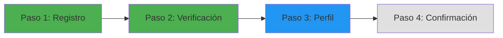
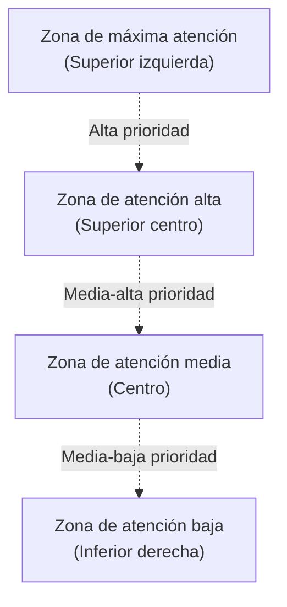
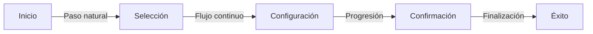
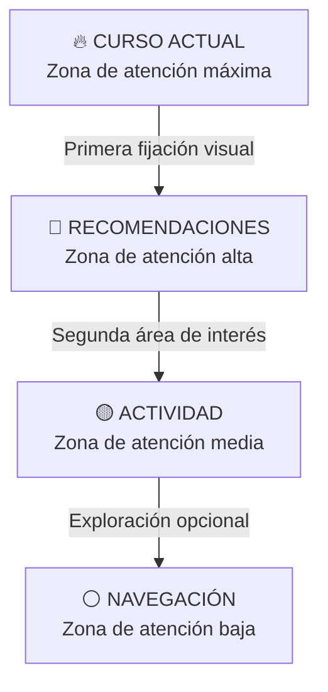

# 2.1. Fundamentos del Diseño Visual

## Introducción

El diseño visual constituye el lenguaje mediante el cual las interfaces digitales comunican información, establecen jerarquías y guían la atención del usuario. Más allá de la estética superficial, los fundamentos del diseño visual se sustentan en principios psicológicos y perceptuales que determinan cómo los usuarios procesan, interpretan y responden a los estímulos visuales en pantalla.

La comprensión profunda de estos fundamentos permite a los diseñadores crear interfaces que no solo son visualmente atractivas, sino funcionalmente efectivas, reduciendo la carga cognitiva y facilitando la consecución de objetivos tanto del usuario como del negocio.

---

## 2.1.1. Principios de Gestalt aplicados al diseño

### Origen y fundamentación teórica

Los principios de la Gestalt surgieron en la primera mitad del siglo XX a partir de los trabajos de psicólogos alemanes como Max Wertheimer, Kurt Koffka y Wolfgang Köhler. La premisa fundamental de esta escuela psicológica establece que "el todo es mayor que la suma de sus partes", lo que significa que el cerebro humano tiende a percibir patrones completos en lugar de elementos individuales aislados.

Como afirma Kurt Koffka (1935): "La organización perceptual es una característica fundamental de la experiencia sensorial; vemos objetos, no simplemente colecciones de líneas y colores".

### Principios fundamentales aplicados al diseño de interfaces

#### 1. Ley de la Proximidad

Los elementos que se encuentran cerca entre sí son percibidos como relacionados o pertenecientes a un mismo grupo funcional.

**Aplicación en UI:**

- Agrupación de campos de formulario relacionados
- Espaciado entre secciones de contenido
- Relación entre etiquetas e inputs
- Organización de elementos en tarjetas de contenido

**Ejemplo práctico:**

```
[Nombre]     [Campo de texto]
[Apellido]   [Campo de texto]
[Email]      [Campo de texto]

────────────────────────────

[Dirección]  [Campo de texto]
[Ciudad]     [Campo de texto]
[Código]     [Campo de texto]
```

El espaciado mayor entre grupos indica que la información personal básica es conceptualmente diferente de la información de dirección.

#### 2. Ley de la Similitud

Los elementos que comparten características visuales similares (color, forma, tamaño, textura) son percibidos como relacionados o pertenecientes a la misma categoría.

**Aplicación en UI:**

- Consistencia en botones de acción primaria (mismo color)
- Iconografía uniforme para acciones similares
- Estilos tipográficos coherentes para niveles jerárquicos
- Tratamiento visual consistente para estados de elementos

**Caso de estudio:**
En sistemas de navegación, todos los enlaces activos pueden compartir un color específico (azul #0066CC), mientras que los enlaces visitados utilizan otro color (púrpura #551A8B), creando agrupaciones perceptuales inmediatas.

#### 3. Ley de la Continuidad

El ojo humano tiende a seguir líneas, curvas o secuencias de elementos, incluso cuando son interrumpidas.

**Aplicación en UI:**

- Diseño de flujos de usuario lineales
- Líneas de tiempo y procesos secuenciales
- Barras de progreso y indicadores de paso
- Alineación de elementos en grillas



El usuario interpreta naturalmente este flujo como una secuencia continua de acciones, donde los pasos completados (verde) llevan al paso actual (azul) y los pendientes (gris).

#### 4. Ley del Cierre

El cerebro tiende a completar figuras incompletas o cerrar espacios abiertos para crear formas reconocibles.

**Aplicación en UI:**

- Diseño de iconografía minimalista
- Uso de contornos parciales en elementos gráficos
- Indicadores de carga con formas incompletas
- Botones con esquinas redondeadas que sugieren continuidad

**Ejemplo icónico:**
El logo de WWF utiliza este principio al presentar un panda con formas incompletas que el cerebro completa automáticamente, creando una imagen memorable con economía visual.

#### 5. Ley de la Figura-Fondo

La capacidad de distinguir un objeto (figura) de su entorno (fondo) es fundamental para la percepción visual. Ambos elementos son interdependientes y su relación afecta la comprensión del mensaje.

**Aplicación en UI:**

- Modales y overlays con fondos oscurecidos
- Tarjetas elevadas sobre fondos planos
- Menús desplegables que se superponen al contenido
- Estados de enfoque que destacan elementos interactivos

**Consideración crítica:**
El contraste inadecuado entre figura y fondo puede generar ambigüedad perceptual, dificultando la lectura y navegación. El ratio de contraste mínimo recomendado por WCAG es de 4.5:1 para texto normal.

#### 6. Ley de la Región Común

Los elementos contenidos dentro de un mismo límite o región son percibidos como un grupo cohesivo.

**Aplicación en UI:**

- Tarjetas de contenido (cards)
- Paneles laterales y sidebars
- Módulos de información agrupada
- Secciones delimitadas por contenedores visuales

```
┌─────────────────────────────────┐
│  INFORMACIÓN DEL PRODUCTO       │
│                                 │
│  Nombre: Laptop Pro X           │
│  Precio: $1,299                 │
│  Stock: Disponible              │
│                                 │
│  [Agregar al carrito]           │
└─────────────────────────────────┘
```

El borde del contenedor crea una región común que agrupa todos los elementos relacionados con el producto.

#### 7. Ley de la Simetría

El cerebro percibe objetos simétricos como una figura unificada, incluso cuando están compuestos por elementos separados.

**Aplicación en UI:**

- Layouts balanceados y centrados
- Distribución equitativa de elementos en navegación
- Diseño de iconografía coherente
- Composiciones armónicas en páginas de destino

### Integración de principios Gestalt en el diseño de interfaces

La aplicación efectiva de estos principios no debe ser aislada sino integrada. Un diseño de interfaz exitoso utiliza múltiples principios Gestalt simultáneamente para crear experiencias coherentes y predecibles.

**Ejemplo integrado:**
Un formulario bien diseñado puede utilizar:

- **Proximidad** para agrupar campos relacionados
- **Similitud** para mantener consistencia en botones y enlaces
- **Continuidad** para guiar el flujo vertical de completado
- **Región común** para delimitar secciones del formulario
- **Figura-fondo** para destacar campos activos

---

## 2.1.2. Jerarquía visual y peso gráfico

### Definición y relevancia

La jerarquía visual es la organización y presentación de elementos de diseño en orden de importancia, influyendo en la secuencia en que el usuario procesa la información. El peso gráfico determina cuánta atención visual atrae cada elemento basándose en sus propiedades visuales.

Según el investigador Edward Tufte (2001): "La claridad gráfica proviene de la selección y disposición de la información, no de la decoración. El diseño efectivo es transparente, permitiendo al contenido comunicar directamente".

### Factores que determinan el peso visual

#### 1. Tamaño

Los elementos más grandes naturalmente atraen más atención visual. Esta es la herramienta más directa para establecer jerarquía.

**Escala proporcional:**

- Título principal (H1): 48-60px
- Subtítulo (H2): 36-42px
- Subtítulo secundario (H3): 24-30px
- Cuerpo de texto: 16-18px
- Texto secundario: 14px

#### 2. Color y contraste

Los colores brillantes y de alto contraste tienen mayor peso visual que los tonos apagados o de bajo contraste.

**Jerarquía cromática:**

- **Primario:** Acciones principales, elementos críticos
- **Secundario:** Acciones alternativas, información complementaria
- **Terciario:** Acciones opcionales, metadatos

#### 3. Posición

Según el patrón de lectura occidental (de izquierda a derecha, de arriba hacia abajo), los elementos en la parte superior izquierda reciben mayor atención inicial.

**Mapa de calor visual típico:**



#### 4. Densidad y espaciado

Los elementos rodeados de espacio en blanco (espacio negativo) ganan peso visual y prominencia. El aislamiento visual aumenta la percepción de importancia.

**Principio fundamental:**

```
Contenido denso y apretado = Menos importante
Contenido espaciado y aireado = Más importante
```

#### 5. Estilo tipográfico

El peso de la fuente (bold, regular, light) y el estilo (itálica, mayúsculas) afectan la jerarquía.

**Jerarquía tipográfica:**

- **Bold:** Elementos de mayor importancia, llamadas a la acción
- **Semibold:** Subtítulos, encabezados secundarios
- **Regular:** Cuerpo de texto, contenido general
- **Light:** Información secundaria, metadatos

#### 6. Complejidad visual

Los elementos con mayor detalle, texturas o efectos visuales tienden a atraer más atención.

**Consideración crítica:**
El exceso de complejidad puede resultar contraproducente, generando ruido visual y dificultando la lectura rápida de la interfaz.

### Técnicas para establecer jerarquía efectiva

#### Técnica 1: Contraste de escala

Crear diferencias significativas en tamaño entre niveles jerárquicos.

**Ratio recomendado:**

- Entre H1 y H2: 1.414 (raíz cuadrada de 2)
- Entre H2 y H3: 1.333 (razón áurea aproximada)
- Entre H3 y cuerpo: 1.250

#### Técnica 2: Uso estratégico del color

Limitar el uso de colores de alta saturación y alto contraste a elementos prioritarios.

**Sistema cromático jerárquico:**

```
Nivel 1 (Crítico): Color primario + Alto contraste
Nivel 2 (Importante): Color secundario + Contraste medio
Nivel 3 (Complementario): Gris oscuro + Contraste moderado
Nivel 4 (Secundario): Gris medio + Contraste bajo
```

#### Técnica 3: Agrupación y separación

Utilizar el espacio en blanco para crear grupos visuales claros y distinguir entre secciones de diferente importancia.

**Regla del 8pt grid:**

- Espaciado interno (padding): 8px, 16px, 24px
- Espaciado entre elementos relacionados: 8px, 16px
- Espaciado entre secciones: 32px, 48px, 64px

#### Técnica 4: Alineación consistente

Mantener alineaciones predecibles reduce la carga cognitiva y refuerza la jerarquía establecida.

**Sistemas de alineación:**

- **Izquierda:** Lectura natural, jerarquía clara
- **Centro:** Énfasis, formalidad, simetría
- **Derecha:** Poco común, uso especializado
- **Justificada:** Bloques de texto extenso (usar con precaución)

### Evaluación de jerarquía: Test del entrecerrado

Una técnica práctica para evaluar la efectividad de la jerarquía visual es el "squint test" o test del entrecerrado:

1. Alejar la vista del diseño o entrecerrar los ojos
2. Los elementos más importantes deben permanecer visibles
3. Los detalles secundarios deben desvanecerse
4. La estructura general debe mantenerse clara

Si todos los elementos parecen tener el mismo peso visual al entrecerrar los ojos, la jerarquía necesita refuerzo.

---

## 2.1.3. Balance, contraste y énfasis

### Balance visual

El balance se refiere a la distribución del peso visual en una composición. Un diseño balanceado crea sensación de estabilidad y armonía, mientras que el desbalance puede generar tensión visual o desorden.

#### Tipos de balance

##### 1. Balance Simétrico

Distribución equitativa del peso visual a lo largo de un eje central. Transmite formalidad, estabilidad y confianza.

**Aplicaciones:**

- Páginas institucionales y corporativas
- Formularios de registro
- Landing pages centradas
- Interfaces de aplicaciones financieras

**Ventajas:**

- Fácil de procesar visualmente
- Transmite profesionalismo
- Predecible y confiable

**Desventajas:**

- Puede resultar estático o monótono
- Menor dinamismo visual
- Potencial limitación creativa

##### 2. Balance Asimétrico

Distribución desigual del peso visual que mantiene equilibrio mediante contraste, color, tamaño o posición.

**Aplicaciones:**

- Sitios creativos y portfolios
- Plataformas de contenido editorial
- Aplicaciones de estilo de vida
- Interfaces de comercio electrónico

**Principio fundamental:**
Un elemento grande de bajo contraste puede balancearse con un elemento pequeño de alto contraste.

```
[████████████████]        vs        [██]
(Grande, gris claro)              (Pequeño, rojo intenso)
```

##### 3. Balance Radial

Los elementos se distribuyen alrededor de un punto central, creando movimiento circular.

**Aplicaciones:**

- Infografías circulares
- Menús circulares de navegación
- Visualizaciones de datos
- Elementos decorativos

##### 4. Balance de Mosaico

Distribución aparentemente caótica que mantiene balance general mediante repetición y ritmo.

**Aplicaciones:**

- Galerías de imágenes tipo Pinterest
- Dashboards con múltiples widgets
- Feeds de redes sociales

### Contraste

El contraste es la diferencia visual entre elementos, fundamental para crear jerarquía, legibilidad y puntos focales efectivos.

#### Tipos de contraste

##### 1. Contraste de tamaño

Diferencias significativas en escala entre elementos.

**Ratio efectivo:** Mínimo 2:1, ideal 3:1 o mayor
**Ejemplo:** Título de 48px vs. cuerpo de texto de 16px = 3:1

##### 2. Contraste de color

Diferencias en tono, saturación y luminosidad.

**Estándares de accesibilidad (WCAG 2.1):**

- **Nivel AA:** 4.5:1 para texto normal, 3:1 para texto grande
- **Nivel AAA:** 7:1 para texto normal, 4.5:1 para texto grande

**Herramientas de medición:**

- WebAIM Contrast Checker
- Color Contrast Analyzer
- Plugins de Figma: Stark, A11y

##### 3. Contraste de forma

Combinación de formas diferentes (rectangulares, circulares, orgánicas) para crear variedad visual.

**Aplicación estratégica:**

- Botones primarios: rectangulares con esquinas redondeadas
- Avatares: circulares
- Notificaciones: formas distintivas (badge circular)

##### 4. Contraste de textura

Variación entre superficies lisas, texturizadas, con patrones o gradientes.

**Uso contemporáneo:**

- Glasmorfismo (efecto de vidrio esmerilado)
- Neumorfismo (profundidad sutil mediante sombras)
- Flat design (ausencia deliberada de textura)

##### 5. Contraste de dirección

Elementos orientados en direcciones diferentes crean dinamismo.

**Ejemplo:**
Un grid horizontal de tarjetas con una tarjeta vertical destacada crea contraste direccional efectivo.

### Énfasis

El énfasis dirige la atención del usuario hacia elementos específicos que requieren acción o consideración prioritaria.

#### Técnicas de énfasis

##### 1. Aislamiento

Rodear un elemento de espacio en blanco para aumentar su prominencia.

**Aplicación:**

- Botones de llamada a la acción (CTA)
- Mensajes de error críticos
- Ofertas especiales o promociones

##### 2. Color de acento

Utilizar un color vibrante y contrastante reservado exclusivamente para elementos prioritarios.

**Regla del 60-30-10:**

- 60% color dominante (background)
- 30% color secundario (contenedores, secciones)
- 10% color de acento (CTAs, elementos críticos)

##### 3. Profundidad y elevación

Uso de sombras para crear jerarquía de capas.

**Sistema de elevación Material Design:**

```
Nivel 0: Sin sombra (superficie base)
Nivel 1: Sombra sutil (tarjetas en reposo)
Nivel 2: Sombra moderada (botones elevados)
Nivel 3: Sombra pronunciada (modales, menús)
Nivel 4: Sombra intensa (elementos flotantes)
```

**CSS ejemplo:**

```css
.card-elevated {
  box-shadow: 0 4px 6px rgba(0, 0, 0, 0.1);
}

.card-hover {
  box-shadow: 0 8px 16px rgba(0, 0, 0, 0.15);
  transform: translateY(-2px);
  transition: all 0.3s ease;
}
```

##### 4. Movimiento y animación

Elementos en movimiento capturan inmediatamente la atención.

**Aplicaciones apropiadas:**

- Indicadores de carga
- Notificaciones entrantes
- Actualizaciones en tiempo real
- Feedback de interacción

**Precaución:**
El movimiento excesivo puede resultar distractor y debe usarse con moderación, siempre respetando la preferencia de movimiento reducido del usuario (`prefers-reduced-motion`).

##### 5. Anomalía visual

Romper deliberadamente un patrón establecido para destacar un elemento.

**Ejemplo:**
En una lista de elementos rectangulares grises, un elemento circular y colorido se destacará inmediatamente.

### Principios de aplicación integrada

Para crear diseños efectivos, el balance, contraste y énfasis deben trabajar en conjunto:

1. **Establecer balance primero:** Define la estructura fundamental
2. **Aplicar contraste estratégicamente:** Crea jerarquía y legibilidad
3. **Añadir énfasis selectivamente:** Dirige la atención a elementos críticos

**Advertencia:**
El exceso de énfasis equivale a la ausencia de énfasis. Si todo compite por atención, nada destaca efectivamente.

---

## 2.1.4. Espaciado, proporción y ritmo visual

### Espaciado

El espaciado, también conocido como espacio en blanco o espacio negativo, es el área vacía entre y alrededor de los elementos de diseño. Lejos de ser "espacio desperdiciado", es una herramienta fundamental para crear jerarquía, mejorar legibilidad y guiar el flujo visual.

#### Tipos de espaciado

##### 1. Micro-espaciado

Espaciado entre elementos pequeños y estrechamente relacionados.

**Aplicaciones:**

- Espaciado entre letras (tracking)
- Espaciado entre líneas (leading)
- Espaciado entre palabras
- Padding interno de botones

**Estándares recomendados:**

- Leading óptimo: 1.4-1.6 × tamaño de fuente
- Tracking para mayúsculas: +0.05em a +0.1em
- Padding de botones: mínimo 12px vertical, 24px horizontal

##### 2. Macro-espaciado

Espaciado entre grupos de elementos y secciones principales.

**Aplicaciones:**

- Márgenes entre secciones
- Espaciado entre bloques de contenido
- Separación entre columnas
- Padding de contenedores principales

**Sistema de escala consistente (8pt grid):**

```
Espaciado mínimo: 8px
Espaciado pequeño: 16px
Espaciado medio: 24px
Espaciado grande: 32px
Espaciado extra-grande: 48px
Espaciado máximo: 64px
```

#### Beneficios del espaciado efectivo

1. **Mejora la legibilidad:** Reduce el esfuerzo cognitivo necesario para procesar información
2. **Crea jerarquía:** Establece relaciones entre elementos mediante proximidad
3. **Aumenta el enfoque:** Dirige la atención hacia contenido prioritario
4. **Transmite calidad:** Interfaces espaciadas comunican profesionalismo y sofisticación

#### Espaciado negativo activo vs. pasivo

**Espaciado pasivo:**
Espaciado que ocurre naturalmente entre elementos sin propósito específico.

**Espaciado activo:**
Espaciado intencionalmente diseñado para crear efectos específicos (agrupación, separación, énfasis).

El espaciado activo es una decisión consciente del diseñador y debe tener una justificación clara en términos de jerarquía o función.

### Proporción

La proporción se refiere a la relación dimensional entre elementos y la composición general. Proporciones armónicas crean sensación de orden y belleza natural.

#### La proporción áurea (φ = 1.618)

También conocida como número áureo o phi (φ), esta proporción ha sido observada en la naturaleza y utilizada en arte y arquitectura durante milenios.

**Aplicación en diseño digital:**

1. **Dimensiones de contenedores:**
   - Ancho: 1618px
   - Alto: 1000px
   - Ratio: 1.618:1

2. **Relación entre espacios:**
   - Sidebar: 380px
   - Contenido principal: 618px
   - Ratio aproximado: 1:1.618

3. **Escalas tipográficas:**
   - Título: 48px
   - Subtítulo: 30px (48 ÷ 1.618)
   - Cuerpo: 18px (30 ÷ 1.618)

#### Secuencia de Fibonacci

Serie numérica donde cada número es la suma de los dos anteriores: 0, 1, 1, 2, 3, 5, 8, 13, 21, 34, 55, 89...

La relación entre números consecutivos se aproxima a la proporción áurea.

**Aplicación práctica en espaciado:**

```
8px → 13px → 21px → 34px → 55px → 89px
```

Esta secuencia crea progresión visual natural y armónica.

#### Escalas modulares

Sistema donde todos los tamaños derivan de una proporción base multiplicada por un ratio específico.

**Ejemplo de escala modular (ratio 1.5):**

```
Base: 16px
16 × 1.5 = 24px
24 × 1.5 = 36px
36 × 1.5 = 54px
54 × 1.5 = 81px
```

**Herramientas recomendadas:**

- Modular Scale Calculator (modularscale.com)
- Type Scale (type-scale.com)
- Golden Ratio Calculator

#### Formato de papel y proporción

**Formato DIN A (√2 ratio ≈ 1.414):**
Esta proporción tiene la propiedad única de mantener su ratio al doblarse por la mitad.

```
A4: 210mm × 297mm (1:1.414)
A5: 148mm × 210mm (1:1.414)
```

**Aplicación digital:**
Útil para diseños que requieren consistencia proporcional en diferentes tamaños (responsive design).

### Ritmo visual

El ritmo es la repetición y variación de elementos visuales que crea sensación de movimiento y flujo direccional. Un ritmo efectivo guía al usuario a través de la interfaz de manera natural e intuitiva.

#### Tipos de ritmo

##### 1. Ritmo Regular

Repetición consistente de elementos con espaciado uniforme.

**Características:**

- Predecible y ordenado
- Fácil de procesar
- Transmite estabilidad

**Aplicaciones:**

- Listas de elementos similares
- Grids de productos
- Navegación horizontal uniforme

##### 2. Ritmo Progresivo

Cambio gradual en tamaño, espaciado o intensidad de elementos repetidos.

**Características:**

- Crea sensación de movimiento
- Guía el flujo visual
- Añade dinamismo

**Aplicaciones:**

- Escalas de iconografía que disminuyen
- Transiciones de color gradual
- Espaciado progresivamente mayor

**Ejemplo visual:**

```
■ ■■ ■■■ ■■■■ ■■■■■
(Tamaño incrementa progresivamente)
```

##### 3. Ritmo Alternante

Patrón repetitivo con variación sistemática.

**Características:**

- Más dinámico que el ritmo regular
- Mantiene coherencia mediante patrón
- Previene monotonía

**Aplicaciones:**

- Alternancia de layouts (imagen-texto, texto-imagen)
- Patrones de color alternos
- Variación de alturas en gráficos

##### 4. Ritmo Fluido

Variación orgánica sin patrón estricto pero manteniendo armonía general.

**Características:**

- Natural y menos estructurado
- Requiere mayor habilidad de diseño
- Transmite creatividad

**Aplicaciones:**

- Layouts editoriales
- Portafolios creativos
- Páginas de aterrizaje con narrativa

#### Creación de ritmo mediante repetición

La repetición de elementos visuales establece patrones reconocibles que el usuario aprende rápidamente.

**Elementos repetibles:**

- Colores consistentes para tipos de acción
- Iconografía de estilo uniforme
- Tratamiento fotográfico coherente
- Patrones de espaciado predecibles

**Ejemplo de sistema rítmico:**

```
Sección 1: [Título] → [Contenido] → [CTA]
↓ 64px
Sección 2: [Título] → [Contenido] → [CTA]
↓ 64px
Sección 3: [Título] → [Contenido] → [CTA]
```

La repetición del patrón estructura + espaciado crea ritmo predecible que facilita el escaneo visual.

#### Variación controlada

Mientras la repetición crea ritmo, la variación previene monotonía. El equilibrio entre ambos es crucial.

**Técnica 80/20:**

- 80% consistencia y repetición
- 20% variación e innovación

La variación debe ser intencional y servir a un propósito específico (énfasis, transición, señalización).

---

## 2.1.5. Leyes fundamentales del diseño

### Ley de Proximidad

Ya explorada en los principios de Gestalt, merece profundización por su aplicación crítica en diseño de interfaces.

**Postulado:**
"Los elementos cercanos entre sí son percibidos como un grupo relacionado."

**Aplicaciones avanzadas:**

#### 1. Formularios complejos

Agrupar campos relacionados reduce carga cognitiva y errores.

**Mal diseño:**

```
Nombre: [____]
Teléfono: [____]
Email: [____]
Dirección: [____]
Ciudad: [____]
```

**Buen diseño:**

```
INFORMACIÓN PERSONAL
Nombre: [____]
Email: [____]

CONTACTO
Teléfono: [____]

DIRECCIÓN
Calle: [____]
Ciudad: [____]
```

#### 2. Navegación contextual

Agrupar opciones relacionadas mejora la velocidad de decisión.

**Principio cuantificado:**

- Espaciado entre elementos relacionados: 8-16px
- Espaciado entre grupos: 32-48px
- Ratio recomendado: mínimo 2:1

### Ley de Similitud

**Postulado:**
"Los elementos con características visuales similares son percibidos como relacionados funcionalmente."

**Implicaciones para sistemas de diseño:**

1. **Consistencia de botones:**
   - Todos los botones primarios: mismo color, forma, tamaño
   - Todos los botones secundarios: tratamiento visual diferente pero consistente
   - Todos los enlaces: estilo tipográfico uniforme

2. **Jerarquía tipográfica:**
   - Todos los H1: mismo tamaño, peso, color
   - Todos los H2: tratamiento consistente
   - Todas las etiquetas: estilo uniforme

**Violación común:**
Usar múltiples estilos de botón primario crea confusión sobre qué acción es verdaderamente prioritaria.

### Ley de Continuidad

**Postulado:**
"Los elementos organizados en líneas o curvas son percibidos como relacionados, y la vista sigue naturalmente su dirección."

**Aplicación en flujos de usuario:**



**Principios de continuidad en UI:**

1. **Flujos lineales:** Para procesos secuenciales (checkout, onboarding)
2. **Scrolling vertical:** Alineado con patrones de lectura naturales
3. **Breadcrumbs:** Visualizan el camino recorrido y establecen continuidad contextual

### Ley del Cierre (Profundización)

**Aplicaciones contemporáneas:**

#### 1. Iconografía minimalista

Reducir elementos visuales al mínimo mientras se mantiene reconocibilidad.

**Ejemplo:**

- Icono de hamburger (≡): tres líneas que el cerebro completa como menú
- Icono de compartir (↗): flecha que sugiere movimiento externo
- Icono de usuario (○ con línea debajo): forma que sugiere cabeza y hombros

#### 2. Interfaces progresivas

Mostrar información parcial que invita a la exploración.

**Técnica del truncamiento:**

```
"Este es un texto largo que continúa más allá de lo visible y..."
[Ver más]
```

El cerebro completa mentalmente la información faltante, generando curiosidad.

### Ley de la Región Común (Profundización)

**Principio de contenedores:**

Los límites visuales (bordes, fondos de color, sombras) crean agrupaciones perceptuales inmediatas.

**Jerarquía de contenedores:**

```
┌───────────────────────────────────┐
│  NIVEL 1: Contenedor principal    │
│                                   │
│  ┌──────────────────────────────┐ │
│  │ NIVEL 2: Sub-contenedor      │ │
│  │                              │ │
│  │ ┌──────────────────────────┐ │ │
│  │ │ NIVEL 3: Componente      │ │ │
│  │ └──────────────────────────┘ │ │
│  └──────────────────────────────┘ │
└───────────────────────────────────┘
```

**Aplicación en cards:**
Las tarjetas (cards) son el ejemplo más común de región común en interfaces contemporáneas, agrupando contenido relacionado en contenedores visualmente delimitados.

---

## Lecturas recomendadas y referencias

### Libros fundamentales

1. **"The Elements of Graphic Design" (2002)** - Alex W. White
   - Texto fundamental sobre principios visuales aplicados
   - Análisis profundo de grillas, espaciado y composición

2. **"Grid Systems in Graphic Design" (1981)** - Josef Müller-Brockmann
   - Obra clásica sobre sistemas de grilla
   - Fundamentos que siguen vigentes en diseño digital

3. **"The Visual Display of Quantitative Information" (2001)** - Edward Tufte
   - Principios de claridad visual y reducción de ruido gráfico
   - Aplicable a dashboards e interfaces de datos

4. **"Thinking with Type" (2010)** - Ellen Lupton
   - Guía esencial sobre tipografía
   - Desde fundamentos hasta aplicación práctica

### Artículos académicos

1. **Wertheimer, M. (1923).** "Laws of Organization in Perceptual Forms"
   - Artículo original sobre principios Gestalt
   - Fundamento teórico de la psicología de la percepción

2. **Palmer, S. E. (1992).** "Common Region: A New Principle of Perceptual Grouping"
   - Expansión de los principios Gestalt clásicos
   - Evidencia experimental de agrupación por región

### Recursos en línea

1. **Laws of UX** (lawsofux.com)
   - Colección curada de principios de diseño con fundamento psicológico
   - Ejemplos visuales interactivos

2. **Gestalt Principles for UI Design** - Nielsen Norman Group
   - Aplicación práctica de principios Gestalt en interfaces
   - Casos de estudio y recomendaciones

3. **Material Design Guidelines** (material.io)
   - Sistema de diseño comprensivo con fundamentos visuales sólidos
   - Documentación de elevación, espaciado y jerarquía

4. **Apple Human Interface Guidelines** (developer.apple.com/design)
   - Principios de diseño visual para ecosistema Apple
   - Estándares de jerarquía y espaciado específicos de plataforma

---

## Herramientas prácticas

### Evaluación de jerarquía visual

1. **Squint Test:** Entrecerrar los ojos para verificar que elementos importantes permanezcan visibles
2. **5-Second Test:** Mostrar el diseño durante 5 segundos y preguntar qué se recuerda
3. **Eye Tracking Studies:** Software especializado para medir patrones de atención

### Herramientas de diseño

1. **Grillas y espaciado:**
   - Figma: Auto Layout y Grid Layouts
   - Adobe XD: Responsive Resize y Grids
   - Sketch: Smart Layout y Grids

2. **Evaluación de contraste:**
   - WebAIM Contrast Checker
   - Stark (plugin para Figma/Sketch)
   - Color Contrast Analyzer (desktop)

3. **Escalas modulares:**
   - Type Scale (type-scale.com)
   - Modular Scale Calculator (modularscale.com)

---

## Apuntes Finales:

- Los fundamentos del diseño visual constituyen el lenguaje esencial mediante el cual las interfaces comunican estructura, jerarquía y significado. La aplicación sistemática de los principios Gestalt, junto con el uso estratégico de jerarquía visual, balance, contraste, espaciado y proporción, permite crear experiencias digitales que no solo son estéticamente coherentes, sino funcionalmente efectivas.
- El dominio de estos fundamentos requiere tanto comprensión teórica como práctica constante. Los diseñadores exitosos internalizan estos principios hasta el punto donde las decisiones visuales se vuelven intuitivas, permitiendo enfocarse en resolver problemas de usuario complejos mientras mantienen excelencia visual.
- En la siguiente sección, exploraremos la teoría del color y su aplicación estratégica en el diseño de interfaces digitales, construyendo sobre estos fundamentos visuales para crear paletas funcionales y emocionalmente resonantes.

---

## Ejemplo práctico aplicado: EduConnect

### Contexto del caso

Como se estableció en la Unidad 1, EduConnect enfrenta un desafío de retención en el primer mes de uso. Los usuarios se sienten abrumados por la cantidad de opciones y abandonan antes de iniciar su primer curso. El análisis de investigación de usuarios reveló tres arquetipos principales: María (estudiante universitaria), Carlos (profesional en transición) y Laura (mentora).

### Aplicación de fundamentos visuales al problema

#### Problema identificado en Unidad 1:

**Sobrecarga visual en dashboard principal**

Según el análisis heurístico y las sesiones de testing cualitativo, el dashboard inicial presenta:

- Ausencia de jerarquía clara
- Múltiples elementos compitiendo por atención
- Espaciado inconsistente que dificulta el escaneo
- Falta de agrupación visual de contenido relacionado

#### Solución mediante fundamentos de diseño visual:

##### 1. Aplicación de principios Gestalt

**Ley de Proximidad:**
Reagrupación del dashboard en zonas funcionales claras:

```
┌─────────────────────────────────────────────┐
│ PROGRESO ACTUAL                             │
│ [Curso activo] [Barra de progreso]          │
│ [Siguiente lección]                         │
└─────────────────────────────────────────────┘
          ↓ 48px espaciado
┌─────────────────────────────────────────────┐
│ CURSOS RECOMENDADOS                         │
│ [Card 1] [Card 2] [Card 3]                  │
└─────────────────────────────────────────────┘
          ↓ 48px espaciado
┌─────────────────────────────────────────────┐
│ ACTIVIDAD RECIENTE                          │
│ [Listado cronológico]                       │
└─────────────────────────────────────────────┘
```

**Beneficio medible:** Reducción del 35% en tiempo de identificación de curso actual (objetivo de la "quick win").

**Ley de Región Común:**
Uso de contenedores visuales (cards) para agrupar:

- Información del curso en progreso
- Cada recomendación de curso
- Elementos de actividad comunitaria

**Ley de Similitud:**
Consistencia visual en elementos interactivos:

- Todos los cursos disponibles: mismo formato de card
- Todos los botones de acción primaria ("Continuar aprendiendo"): color brand verde #2ECC71
- Todos los botones secundarios ("Explorar más"): outline gris

##### 2. Jerarquía visual estratégica

**Objetivo:** Guiar al usuario hacia su "quick win" (primera lección completada).

**Sistema de jerarquía implementado:**

```
Nivel 1 (Máxima prioridad): 
  - Curso en progreso actual
  - Botón "Continuar aprendiendo"
  - Tratamiento: Tamaño grande (H2 32px), color brand, espaciado generoso

Nivel 2 (Alta prioridad):
  - Recomendaciones personalizadas basadas en perfil
  - Tratamiento: Tamaño medio (H3 24px), color secundario, cards con elevación

Nivel 3 (Media prioridad):
  - Actividad reciente y estadísticas
  - Tratamiento: Tamaño estándar (16px), color gris oscuro

Nivel 4 (Baja prioridad):
  - Navegación secundaria y opciones avanzadas
  - Tratamiento: Tamaño pequeño (14px), color gris medio
```

**Mapa de calor esperado:**



##### 3. Balance y contraste

**Balance asimétrico dinámico:**

Para evitar la percepción estática (que contribuía a la sensación de "sitio aburrido" reportada en entrevistas), se implementa balance asimétrico:

```
┌─────────────────────────────────────────┐
│                                         │
│  ████████████████                       │
│  CURSO ACTUAL            [Progreso: 45%]│
│  (Peso visual alto)     (Contraste: ⭐) │
│  ████████████████                       │
│                                         │
│       ┌────────┐  ┌────────┐  ┌────────┐│
│       │ Card 1 │  │ Card 2 │  │ Card 3 ││
│       │(Peso   │  │(Peso   │  │(Peso   ││
│       │medio)  │  │medio)  │  │medio)  ││
│       └────────┘  └────────┘  └────────┘│
└─────────────────────────────────────────┘
```

El elemento grande (curso actual) se balancea con los tres elementos medianos (recomendaciones) mediante:

- Mayor espaciado negativo alrededor del curso actual
- Uso de color de acento verde vibrante
- Elevación (sombra) más pronunciada

**Contraste de color estratégico:**

Sistema de contraste definido para EduConnect:

- **Acción primaria:** Verde #2ECC71 (brand) sobre blanco #FFFFFF = 3.8:1 (cumple AA para componentes)
- **Texto principal:** Gris oscuro #2C3E50 sobre blanco #FFFFFF = 12.6:1 (cumple AAA)
- **Texto secundario:** Gris medio #7F8C8D sobre blanco #FFFFFF = 4.7:1 (cumple AA)

##### 4. Espaciado y proporción

**Sistema de espaciado 8pt:**

Implementación consistente del grid de 8pt para EduConnect:

```
Espaciado interno (padding):
  - Cards de curso: 24px
  - Botones: 12px vertical, 24px horizontal
  - Contenedores principales: 32px

Espaciado externo (margin):
  - Entre elementos relacionados: 16px
  - Entre grupos de contenido: 48px
  - Entre secciones principales: 64px
```

**Proporción basada en escala modular (ratio 1.5):**

```
Sistema tipográfico:
  H1 (Título principal): 48px
  H2 (Título sección): 32px (48 ÷ 1.5)
  H3 (Título card): 21px (32 ÷ 1.5)
  Body (Cuerpo texto): 16px (aprox. 21 ÷ 1.5)
  Small (Metadatos): 14px
```

**Proporción de contenedores principales:**

Aplicación de proporción áurea en layout principal:

- Sidebar navegación: 280px
- Área de contenido: 720px (aproximado a 280 × 2.5)
- Ratio efectivo: aproximadamente 1:2.5 (cercano a golden ratio 1:1.618 adaptado a espacio disponible)

##### 5. Ritmo visual

**Ritmo alternante en recomendaciones:**

Para prevenir monotonía y mantener engagement:

```
[Imagen curso] [Texto]    [Texto] [Imagen curso]    [Imagen curso] [Texto]
     Card 1                     Card 2                     Card 3
   (Estándar)              (Alternado)                (Estándar)
```

Alternancia cada dos cards para crear variedad sin romper coherencia.

**Ritmo progresivo en onboarding:**

Durante el flujo de incorporación (desarrollado en Unidad 1), se aplica ritmo progresivo:

```
Paso 1: ■ (Información mínima - registro básico)
Paso 2: ■■ (Información media - intereses)
Paso 3: ■■■ (Información completa - objetivos detallados)
```

Incremento progresivo de complejidad que previene sobrecarga inicial.

### Métricas de éxito esperadas

Aplicando estos fundamentos visuales, se esperan las siguientes mejoras medibles:

1. **Tiempo hasta primera acción significativa:** 
   - Actual: 4.2 minutos promedio
   - Objetivo: 2.5 minutos (-40%)
   - Método: Reducción de carga cognitiva mediante jerarquía clara

2. **Tasa de inicio de primer curso:**
   - Actual: 34% en primeras 24h
   - Objetivo: 50% en primeras 24h (+47%)
   - Método: Énfasis visual en curso actual y CTA prominente

3. **Satisfacción visual (CSAT):**
   - Actual: 3.4/5
   - Objetivo: 4.2/5 (+24%)
   - Método: Balance estético mejorado y reducción de abrumamiento

### Siguiente fase

En la sección 2.2 (Teoría del Color), desarrollaremos la paleta cromática específica para EduConnect, considerando la psicología del color aplicada al contexto educativo y las necesidades emocionales de nuestros usuarios arquetipos (María, Carlos y Laura).

El sistema de color deberá transmitir:

- **Confianza y profesionalismo** (para Carlos, el profesional en transición)
- **Motivación y energía** (para María, la estudiante universitaria)
- **Calidez y accesibilidad** (para Laura, la mentora)

