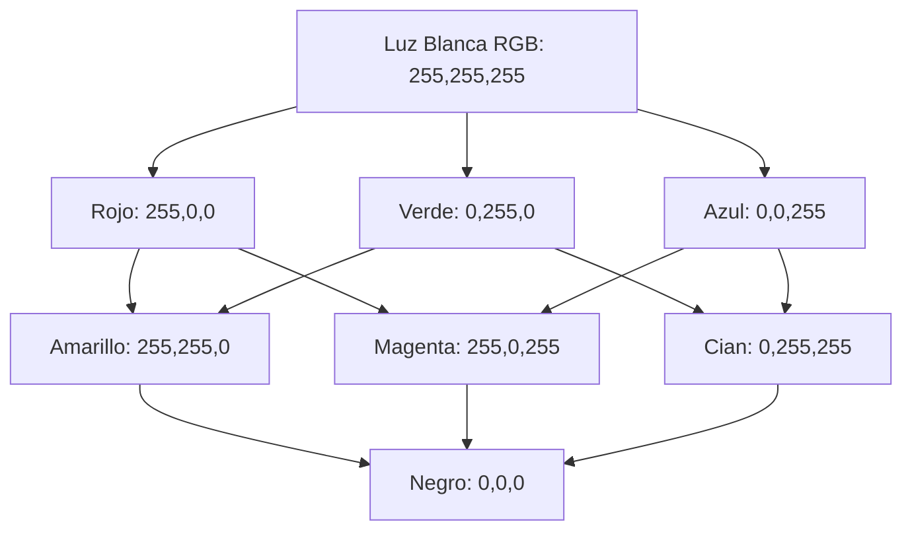
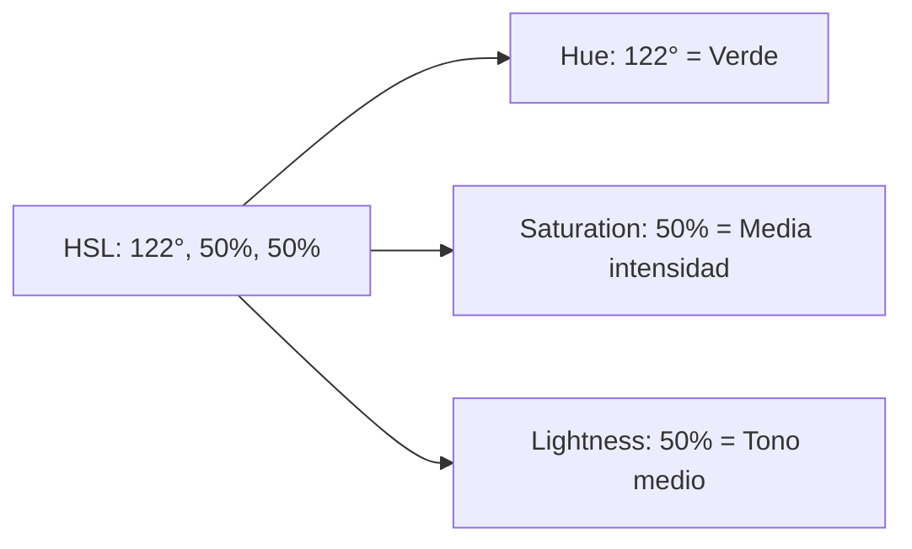
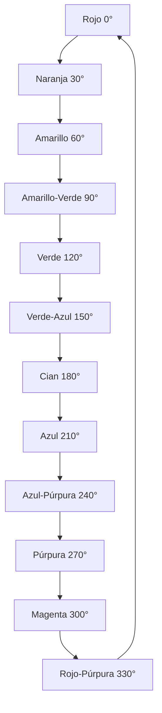
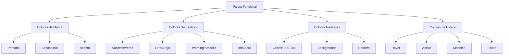

# 2.2. Teoría del Color

## Introducción

El color es uno de los elementos más poderosos y complejos del diseño de interfaces digitales. Más allá de su función estética, el color cumple roles fundamentales en la comunicación visual: establece jerarquías, transmite significados, evoca emociones, refuerza la identidad de marca y, críticamente, determina la accesibilidad y usabilidad de los productos digitales.

La teoría del color para diseño UI/UX requiere una comprensión multidisciplinaria que integra física (cómo se produce la luz), fisiología (cómo el ojo humano percibe el color), psicología (cómo el color afecta emociones y comportamiento), y cultura (cómo los significados del color varían entre sociedades).

Como afirma Josef Albers en su obra seminal "Interaction of Color" (1963): "En la percepción visual, un color casi nunca se ve tal como es realmente, como es físicamente. Esto hace del color el medio más relativo en el arte."

---

## 2.2.1. Modelos de color: RGB, HSL, HSB

### Fundamentos de los modelos de color

Los modelos de color son sistemas matemáticos que permiten representar y especificar colores de manera consistente y reproducible. En diseño digital, diferentes modelos de color sirven propósitos distintos, desde la reproducción técnica en pantallas hasta la selección intuitiva de colores en herramientas de diseño.

### Modelo RGB (Red, Green, Blue)

#### Fundamento técnico

RGB es un modelo de color **aditivo** basado en la forma en que las pantallas digitales producen color mediante la emisión de luz. Los tres canales primarios (rojo, verde, azul) se combinan en diferentes intensidades para crear el espectro completo de colores visibles.

**Principio físico:**
Cuando los tres canales están al máximo (255, 255, 255), se produce luz blanca. Cuando están a mínimo (0, 0, 0), se produce ausencia de luz (negro).



#### Especificación RGB

**Formato decimal:**

- Rango: 0-255 para cada canal
- Ejemplo: `rgb(76, 175, 80)` → Color verde material

**Formato hexadecimal:**

- Rango: 00-FF para cada canal
- Ejemplo: `#4CAF50` → Mismo color verde
- Conversión: 4C (hex) = 76 (dec), AF (hex) = 175 (dec), 50 (hex) = 80 (dec)

**Formato hexadecimal abreviado:**

- Cuando los pares de dígitos son idénticos: `#AABBCC` → `#ABC`
- Ejemplo: `#FF0000` → `#F00` (rojo puro)

#### Ventajas y limitaciones

**Ventajas:**

- Modelo nativo de dispositivos digitales
- Precisión técnica absoluta
- Reproducibilidad exacta
- Amplio soporte en código y herramientas

**Limitaciones:**

- No intuitivo para diseñadores (difícil predecir resultado de combinaciones numéricas)
- No representa directamente propiedades perceptuales (brillo, saturación)
- Dificulta la creación de variaciones armónicas

**Casos de uso óptimos:**

- Definición de colores en código (CSS, código de interfaces)
- Comunicación técnica entre diseño y desarrollo
- Especificaciones precisas en design systems

### Modelo HSL (Hue, Saturation, Lightness)

#### Fundamento conceptual

HSL organiza el color de manera más alineada con la percepción humana, separando el **tono** (tipo de color), la **saturación** (intensidad del color) y la **luminosidad** (cantidad de luz).

**Componentes:**

1. **Hue (Tono):** 0-360°
   - Posición en la rueda cromática
   - 0°/360° = Rojo
   - 120° = Verde
   - 240° = Azul

2. **Saturation (Saturación):** 0-100%
   - 0% = Gris (sin color)
   - 100% = Color puro (máxima intensidad)

3. **Lightness (Luminosidad):** 0-100%
   - 0% = Negro
   - 50% = Color verdadero
   - 100% = Blanco



#### Representación cilíndrica

El modelo HSL se visualiza como un cilindro donde:

- El ángulo alrededor del eje representa el **tono**
- La distancia desde el eje representa la **saturación**
- La altura en el eje representa la **luminosidad**

**Ventaja conceptual:**
Esta estructura permite modificaciones intuitivas: para crear un color más claro, se incrementa L; para reducir intensidad, se reduce S; para cambiar el tipo de color, se modifica H.

#### Sintaxis y ejemplos

**Formato CSS:**

```css
.color-primary {
  background-color: hsl(122, 50%, 50%);
}

/* Con transparencia (HSLA) */
.color-overlay {
  background-color: hsla(122, 50%, 50%, 0.8);
}
```

**Ejemplos comparativos:**

| Color        | HSL                   | RGB                  | Hex       |
| ------------ | --------------------- | -------------------- | --------- |
| Rojo puro    | `hsl(0, 100%, 50%)`   | `rgb(255, 0, 0)`     | `#FF0000` |
| Verde pálido | `hsl(120, 40%, 80%)`  | `rgb(194, 230, 194)` | `#C2E6C2` |
| Azul oscuro  | `hsl(240, 100%, 25%)` | `rgb(0, 0, 128)`     | `#000080` |
| Gris neutro  | `hsl(0, 0%, 50%)`     | `rgb(128, 128, 128)` | `#808080` |

#### Ventajas y limitaciones

**Ventajas:**

- Intuitivo para diseñadores
- Facilita creación de variaciones sistemáticas
- Simplifica ajustes de accesibilidad (modificando L)
- Ideal para paletas armónicas (variando H en intervalos predecibles)

**Limitaciones:**

- La luminosidad percibida no es uniforme (azul puro parece más oscuro que amarillo puro a igual L)
- Saturación no es perceptualmente uniforme
- Conversión a RGB puede producir resultados inesperados en extremos

**Casos de uso óptimos:**

- Generación de paletas cromáticas
- Creación de temas (light/dark mode)
- Sistemas de tokens de diseño escalables
- Variaciones de color programáticas

### Modelo HSB/HSV (Hue, Saturation, Brightness/Value)

#### Diferencias con HSL

Aunque similar a HSL, HSB utiliza **Brightness (Brillo)** en lugar de Lightness (Luminosidad), lo que resulta en un comportamiento diferente:

**HSL:**

- 50% Lightness = Color verdadero
- 100% Lightness = Blanco siempre

**HSB:**

- 100% Brightness + 100% Saturation = Color puro
- 100% Brightness + 0% Saturation = Blanco
- 0% Brightness = Negro siempre

**Representación geométrica:**
HSB se visualiza como un cono invertido, donde:

- La punta (abajo) es negro
- La base (arriba) contiene todos los colores puros y blancos
- El centro del eje es gris

#### Comparación visual

```
HSL (Cilindro):          HSB (Cono):
    Blanco                   Colores puros
      │                          /\
      │                         /  \
   Colores                     /    \
      │                       /      \
      │                      /        \
    Negro                  Negro

L=100% siempre blanco    B=100% puede ser color o blanco
```

#### Aplicación en herramientas de diseño

**Figma, Sketch, Adobe XD:** Utilizan HSB como modelo primario en selectores de color, permitiendo:

- Selección de tono en barra lateral (0-360°)
- Ajuste de saturación (horizontal) y brillo (vertical) en cuadro bidimensional
- Feedback visual inmediato

**Ventajas en workflow de diseño:**
HSB permite exploración visual más intuitiva que RGB, especialmente al buscar variaciones de un color base.

#### Sintaxis y conversión

**Formato en herramientas:**

```
H: 122°
S: 61%
B: 69%
```

**No tiene sintaxis CSS nativa**, requiere conversión a RGB o HSL.

**Algoritmo de conversión HSB → RGB (simplificado):**

```javascript
function hsbToRgb(h, s, b) {
  h = h / 360;
  const c = b * s;
  const x = c * (1 - Math.abs((h * 6) % 2 - 1));
  const m = b - c;
  
  let r, g, blue;
  if (h < 1/6) [r, g, blue] = [c, x, 0];
  else if (h < 2/6) [r, g, blue] = [x, c, 0];
  else if (h < 3/6) [r, g, blue] = [0, c, x];
  else if (h < 4/6) [r, g, blue] = [0, x, c];
  else if (h < 5/6) [r, g, blue] = [x, 0, c];
  else [r, g, blue] = [c, 0, x];
  
  return [
    Math.round((r + m) * 255),
    Math.round((g + m) * 255),
    Math.round((blue + m) * 255)
  ];
}
```

### Otros modelos relevantes

#### CMYK (Cyan, Magenta, Yellow, Key/Black)

Modelo **sustractivo** utilizado en impresión. Cada tinta absorbe (sustrae) longitudes de onda específicas de luz blanca.

**Relevancia para UI/UX:**

- Limitada en diseño digital puro
- Importante para assets que se imprimirán (marketing materials)
- Gamut (rango de colores) más limitado que RGB

**Nota crítica:**
Colores brillantes en RGB pueden ser imposibles de reproducir en CMYK. Siempre verificar conversión si el diseño se imprimirá.

#### LAB (Lightness, A, B)

Modelo perceptualmente uniforme diseñado para aproximar la visión humana.

**Componentes:**

- L: Luminosidad (0-100)
- A: Eje verde-rojo (-128 a +127)
- B: Eje azul-amarillo (-128 a +127)

**Ventaja crítica:**
Cambios numéricos iguales producen cambios perceptuales equivalentes, a diferencia de RGB/HSL.

**Uso en UI/UX:**

- Cálculos precisos de contraste (WCAG utiliza luminancia derivada de LAB)
- Generación algorítmica de gradientes perceptualmente uniformes
- Sistemas de color avanzados

### Selección de modelo según contexto

| Contexto                     | Modelo recomendado | Razón                                 |
| ---------------------------- | ------------------ | ------------------------------------- |
| Definición en código CSS     | RGB o HSL          | Soporte nativo, precisión             |
| Exploración de diseño        | HSB                | Intuitividad en herramientas          |
| Generación de paletas        | HSL                | Facilidad de variaciones sistemáticas |
| Cálculos de accesibilidad    | LAB (internamente) | Precisión perceptual                  |
| Comunicación técnica         | Hex                | Brevedad, universalidad               |
| Temas dinámicos (light/dark) | HSL                | Facilidad de ajuste de luminosidad    |

---

## 2.2.2. Psicología del color y significados culturales

### Fundamentos de la psicología del color

La psicología del color estudia cómo los colores afectan el comportamiento humano, las emociones y las decisiones. En el contexto del diseño de interfaces, comprender estos efectos es crucial para crear experiencias que resuenen emocionalmente con los usuarios y guíen sus acciones efectivamente.

**Premisa fundamental:**
"El color no es una propiedad del objeto, sino una construcción del cerebro que interpreta longitudes de onda específicas de luz." - Semir Zeki, neurocientífico.

### Efectos psicológicos de colores principales

#### Rojo

**Asociaciones primarias:**

- Energía, pasión, urgencia, peligro, amor, poder

**Efectos fisiológicos documentados:**

- Incremento de ritmo cardíaco y presión arterial
- Estimulación del sistema nervioso simpático
- Aumento de apetito (razón de su uso en restaurantes)

**Aplicaciones en UI/UX:**

✅ **Uso efectivo:**

- Botones de llamada a la acción de alta prioridad
- Notificaciones de error o advertencia
- Indicadores de estados críticos
- Señalización de descuentos o urgencia ("¡Última unidad!")

❌ **Evitar:**

- Uso excesivo (genera ansiedad)
- Fondos extensos de color rojo (fatiga visual)
- Como color primario en aplicaciones de salud mental
- En contextos donde se requiere calma y reflexión

**Ejemplo cuantificado:**
Estudio de Mehta & Zhu (2009) demostró que exposición breve a color rojo mejora atención a detalles y tareas de memoria, pero reduce creatividad y pensamiento abstracto.

**Caso de estudio: YouTube**
El botón rojo de "Suscribirse" utiliza psicología del color para crear urgencia y llamar a la acción, destacando sobre el fondo blanco con contraste alto.

#### Azul

**Asociaciones primarias:**

- Confianza, seguridad, profesionalismo, estabilidad, tecnología, comunicación

**Efectos fisiológicos documentados:**

- Reducción de ritmo cardíaco
- Efecto calmante sobre el sistema nervioso
- Percepción de tiempo transcurrido más lento
- Supresión de apetito

**Aplicaciones en UI/UX:**

✅ **Uso efectivo:**

- Branding corporativo y financiero (transmite confianza)
- Interfaces de productividad y herramientas profesionales
- Aplicaciones de salud y bienestar
- Redes sociales y plataformas de comunicación

❌ **Evitar:**

- En aplicaciones de comida (suprime apetito)
- Uso excesivo en espacios creativos (puede parecer frío)
- Como único color en interfaces para niños

**Dato cultural crítico:**
Azul es el color más universalmente aceptado transculturalmente, con asociaciones positivas en la mayoría de culturas.

**Caso de estudio: Facebook, Twitter, LinkedIn**
Todas utilizan azul como color primario para transmitir confiabilidad en el contexto de compartir información personal.

#### Verde

**Asociaciones primarias:**

- Naturaleza, crecimiento, salud, sostenibilidad, éxito, riqueza, tranquilidad

**Efectos fisiológicos documentados:**

- Color más relajante para el ojo humano (menor esfuerzo de enfoque)
- Asociado con reducción de estrés
- Mejora de creatividad en algunos estudios

**Aplicaciones en UI/UX:**

✅ **Uso efectivo:**

- Indicadores de éxito y confirmación
- Aplicaciones de finanzas y banca (crecimiento, estabilidad)
- Productos eco-friendly y sostenibles
- Plataformas de salud y bienestar
- Botones de acciones positivas ("Aceptar", "Continuar")

❌ **Evitar:**

- En contextos médicos (puede asociarse con náusea en tonos específicos)
- Como color único en interfaces tecnológicas avanzadas (puede parecer anticuado)

**Variación crítica por tono:**

- Verde azulado (teal): Tecnología, modernidad
- Verde brillante: Energía, juventud
- Verde oscuro: Lujo, sofisticación
- Verde oliva: Natural, orgánico

**Caso de estudio: Spotify**
El verde vibrante de Spotify transmite energía y modernidad, diferenciándose de competidores y evocando experiencia dinámica.

#### Amarillo

**Asociaciones primarias:**

- Optimismo, alegría, advertencia, atención, energía, juventud

**Efectos fisiológicos documentados:**

- Color más visible al ojo humano
- Estimulación mental y energética
- En exceso: puede causar ansiedad y fatiga visual

**Aplicaciones en UI/UX:**

✅ **Uso efectivo:**

- Destacar información importante (no crítica)
- Elementos de navegación que requieren atención
- Marcadores y resaltados
- Llamadas a la acción secundarias
- Branding juvenil y optimista

❌ **Evitar:**

- Fondos extensos (fatiga visual severa)
- Texto sobre fondos claros (pobre contraste)
- Como color primario único (puede resultar abrumador)

**Advertencia de accesibilidad:**
Amarillo presenta desafíos significativos de contraste. Ratio de contraste de amarillo puro sobre blanco es insuficiente para cumplir WCAG AA.

**Caso de estudio: Snapchat**
El amarillo intenso transmite energía juvenil y diferenciación, pero se usa estratégicamente en branding y acentos, no en fondos.

#### Naranja

**Asociaciones primarias:**

- Entusiasmo, creatividad, aventura, accesibilidad, calidez, diversión

**Efectos psicológicos:**

- Menos agresivo que rojo pero más energético que amarillo
- Asociado con creatividad y pensamiento innovador
- Estimula conversación y compromiso social

**Aplicaciones en UI/UX:**

✅ **Uso efectivo:**

- Llamadas a la acción (menos urgente que rojo)
- Marcas creativas y juveniles
- Elementos interactivos y gamificación
- Notificaciones de importancia media

**Caso de estudio: SoundCloud**
Naranja como color primario transmite creatividad y accesibilidad, diferenciándose de plataformas musicales más corporativas.

#### Púrpura/Morado

**Asociaciones primarias:**

- Creatividad, lujo, espiritualidad, misterio, sofisticación, imaginación

**Efectos psicológicos:**

- Asociado con pensamiento creativo e innovación
- Transmite exclusividad y premium
- Históricamente asociado con realeza (pigmento era costoso)

**Aplicaciones en UI/UX:**

✅ **Uso efectivo:**

- Productos premium y de lujo
- Plataformas creativas y artísticas
- Aplicaciones de meditación y espiritualidad
- Branding que busca diferenciación

**Caso de estudio: Twitch**
El púrpura distintivo transmite creatividad, entretenimiento y cultura gamer, creando identidad única en espacio de streaming.

#### Negro

**Asociaciones primarias:**

- Sofisticación, elegancia, poder, modernidad, misterio, formalidad

**Aplicaciones en UI/UX:**

✅ **Uso efectivo:**

- Productos de lujo y alta gama
- Tipografía y contenido textual principal
- Fondos para contenido visual (modo oscuro)
- Branding minimalista y moderno

**Consideraciones:**
En diseño digital contemporáneo, negro puro (`#000000`) raramente se usa. Se prefieren "casi-negros" como `#1a1a1a` o `#2d2d2d` para reducir contraste extremo y fatiga visual.

#### Blanco

**Asociaciones primarias:**

- Pureza, simplicidad, limpieza, minimalismo, modernidad, espacio

**Aplicaciones en UI/UX:**

✅ **Uso efectivo:**

- Fondos para maximizar legibilidad
- Espaciado y respiración visual
- Branding minimalista y limpio
- Interfaces médicas y sanitarias

**Tendencia contemporary:**
El "blanco roto" (off-white) como `#fafafa` o `#f5f5f5` reduce brillo extremo en pantallas, mejorando confort visual.

### Variaciones culturales en significados del color

#### Tabla comparativa: Significados culturales del color

| Color        | Occidente                       | Asia Oriental                             | Medio Oriente              | África                                  | América Latina                           |
| ------------ | ------------------------------- | ----------------------------------------- | -------------------------- | --------------------------------------- | ---------------------------------------- |
| **Rojo**     | Pasión, peligro, amor           | Buena fortuna, celebración, prosperidad   | Peligro, advertencia       | Muerte (en algunas culturas), vitalidad | Pasión, religión                         |
| **Blanco**   | Pureza, boda, paz               | Muerte, luto (China, Corea)               | Pureza, luto               | Paz, espiritualidad                     | Paz, pureza                              |
| **Negro**    | Luto, elegancia, formalidad     | Salud, prosperidad (en algunos contextos) | Misterio, rebelión         | Madurez, masculinidad                   | Luto, formalidad                         |
| **Azul**     | Confianza, masculinidad, calma  | Inmortalidad (China), limpieza            | Protección, espiritualidad | Amor, armonía                           | Confianza, cielo                         |
| **Verde**    | Naturaleza, crecimiento, dinero | Fertilidad, armonía, familia              | Fertilidad, fuerza, suerte | Prosperidad, lluvia                     | Esperanza, naturaleza                    |
| **Amarillo** | Felicidad, precaución           | Realeza (China), sagrado                  | Felicidad, prosperidad     | Riqueza, fertilidad                     | Muerte (en algunos países), luto         |
| **Púrpura**  | Realeza, lujo, creatividad      | Riqueza, nobleza                          | Riqueza, sofisticación     | Realeza                                 | Muerte, luto (Brasil, algunos contextos) |

#### Implicaciones para diseño global

**Principio fundamental:**
No existe una paleta de color "universal". El diseño para audiencias internacionales requiere investigación cultural específica y potencialmente localización de color.

**Casos críticos de localización:**

1. **WhatsApp en India:**
   - Verde como color primario funciona bien (asociado con prosperidad y fertilidad)
   - Si fuera amarillo (como Snapchat), podría tener connotaciones negativas en algunos contextos

2. **Aplicaciones de comercio electrónico en China:**
   - Uso extensivo de rojo para promociones (buena fortuna y celebración)
   - Contrasta con Occidente donde rojo se reserva para urgencias

3. **Plataformas financieras:**
   - Occidente: Verde = ganancia, Rojo = pérdida
   - Algunos mercados asiáticos: Rojo = ganancia, Verde = pérdida
   - Requiere inversión completa de esquema cromático

**Estrategia recomendada:**

- Investigación etnográfica del mercado objetivo
- Testing con usuarios culturalmente relevantes
- Flexibilidad en sistemas de diseño para adaptación regional
- Documentación de rationale cultural en design system

### Efectos del color en conversión y comportamiento

#### Evidencia empírica

**Estudio de Juliet Zhu (2004):**
Demostró que color afecta disposición a tomar riesgos:

- Rojo: Aumenta aversión al riesgo, mejor para evitar errores
- Azul: Aumenta apertura al riesgo, mejor para creatividad

**Implicación para CTA:**
Botones rojos pueden ser más efectivos para acciones de bajo riesgo con consecuencias claras. Botones azules pueden funcionar mejor para exploraciones creativas.

**Estudio de Satyendra Singh (2006):**
"Color influences 62-90% of consumers' assessment of products and environments."

#### Color en tests A/B: advertencia metodológica

**Mito común:**
"Cambiar el color de un botón a rojo aumenta conversiones 21%"

**Realidad:**
Estos estudios raramente se replican. El impacto del color es **altamente contextual** y depende de:

- Contexto visual circundante
- Expectativas culturales del usuario
- Sector industrial
- Contraste relativo, no color absoluto

**Principio validado:**
El contraste y la distinción visual impactan conversión más consistentemente que el color específico.

---

## 2.2.3. Armonías cromáticas

### Fundamentos de la armonía del color

Las armonías cromáticas son combinaciones de colores que producen efectos estéticamente agradables basados en sus relaciones en la rueda cromática. Estas relaciones no son arbitrarias; se fundamentan en principios de percepción visual y proporción matemática.

**Rueda cromática básica:**



### Armonía Monocromática

**Definición:**
Variaciones de un solo tono mediante ajustes de saturación y luminosidad.

**Estructura:**

- Tono base: Fijo (ej: 220° - azul)
- Saturación: Varía (100%, 70%, 40%, 20%)
- Luminosidad: Varía (20%, 40%, 60%, 80%)

**Ejemplo práctico:**

```
Color base: hsl(220, 100%, 50%) - Azul puro
Variantes:
- Oscuro:  hsl(220, 100%, 30%)
- Medio:   hsl(220, 80%, 50%)
- Claro:   hsl(220, 60%, 70%)
- Muy claro: hsl(220, 40%, 90%)
```

**Ventajas:**

- Máxima cohesión visual
- Fácil de implementar
- Transmite profesionalismo y sofisticación
- Reduce carga cognitiva

**Desventajas:**

- Puede carecer de dinamismo
- Dificulta creación de contraste suficiente
- Riesgo de monotonía visual

**Aplicaciones óptimas:**

- Interfaces minimalistas
- Aplicaciones corporativas conservadoras
- Fondos y texturas
- Temas oscuros (dark mode)

**Caso de estudio: Medium**
Utiliza armonía casi monocromática basada en grises con acentos mínimos de verde, maximizando enfoque en contenido.

### Armonía Análoga

**Definición:**
Colores adyacentes en la rueda cromática (típicamente dentro de 30-60° entre sí).

**Estructura típica:**

- Color principal: 180° (Cian)
- Análogo 1: 150° (Verde-azulado)
- Análogo 2: 210° (Azul)

**Relación angular:**

```
Color A ←30°→ Color B ←30°→ Color C
```

**Ventajas:**

- Armonía natural (similar a lo observado en naturaleza)
- Más variedad que monocromático
- Transiciones visuales suaves
- Versatilidad para diferentes estados UI

**Desventajas:**

- Puede carecer de contraste fuerte
- Dificulta jerarquización si no se combina con luminosidad variable
- Menos impacto visual que esquemas contrastantes

**Aplicaciones óptimas:**

- Gradientes naturales
- Ilustraciones y fondos decorativos
- Temas relajantes (apps de bienestar)
- Visualizaciones de datos secuenciales

**Técnica avanzada: Análogo asimétrico**

```
Color principal: 180°
Análogo cercano: 160° (20° diferencia)
Análogo lejano: 120° (60° diferencia)
```

Crea más dinamismo manteniendo armonía.

### Armonía Complementaria

**Definición:**
Colores opuestos en la rueda cromática (180° de diferencia).

**Estructura:**

- Color primario: 0° (Rojo)
- Complementario: 180° (Cian)

**Fundamento perceptual:**
Los colores complementarios contienen todos los colores primarios (RGB) cuando se combinan, creando contraste máximo mientras mantienen balance.

**Ventajas:**

- Contraste visual máximo
- Alto impacto y energía
- Excelente para jerarquización
- Facilita énfasis de elementos críticos

**Desventajas:**

- Puede resultar vibrante en exceso
- Difícil de balancear armónicamente
- Fatiga visual si ambos colores son igualmente saturados
- Riesgo de efecto "vibrante" en bordes

**Regla de aplicación 60-30-10:**

```
60% Color dominante (desaturado o con luminosidad ajustada)
30% Color neutro (grises, blancos)
10% Color complementario (saturado, para énfasis)
```

**Aplicaciones óptimas:**

- Llamadas a la acción destacadas
- Interfaces deportivas o de alto impacto
- Visualizaciones que requieren separación clara de categorías

**Caso de estudio: FedEx**
Logo clásico usando naranja y púrpura (casi complementarios), creando impacto memorable mientras mantiene profesionalismo.

**Precaución técnica:**
Colores complementarios de alta saturación yuxtapuestos pueden crear vibración óptica incómoda. Solución: desaturar uno o ajustar luminosidad.

### Armonía Complementaria Dividida (Split-Complementary)

**Definición:**
Un color base más los dos colores adyacentes a su complementario.

**Estructura:**

- Color base: 0° (Rojo)
- Complementario dividido 1: 150° (Verde-azulado)
- Complementario dividido 2: 210° (Azul)

**Relación angular:**

```
Color base: 0°
Complementarios divididos: 0° + 180° ± 30° = 150° y 210°
```

**Ventajas:**

- Contraste significativo pero menos tenso que complementario puro
- Mayor riqueza que complementario simple
- Más fácil de balancear que triádico
- Versátil para diferentes niveles de jerarquía

**Aplicaciones óptimas:**

- Interfaces que requieren contraste pero no agresividad
- Sistemas con tres niveles de jerarquía claros
- Branding con personalidad distintiva pero accesible

**Proporción recomendada:**

```
65% Color dominante
25% Complementario dividido 1
10% Complementario dividido 2 (énfasis)
```

### Armonía Triádica

**Definición:**
Tres colores equidistantes en la rueda cromática (120° entre cada uno).

**Estructura clásica:**

- Color 1: 0° (Rojo)
- Color 2: 120° (Verde)
- Color 3: 240° (Azul)

**Fundamento:**
Triadas primarias (RYB) o secundarias (RGB) crean balance visual perfecto al distribuir peso cromático uniformemente.

**Ventajas:**

- Balance visual inherente
- Alto impacto y vitalidad
- Rica paleta con amplia flexibilidad
- Excelente para visualizaciones complejas

**Desventajas:**

- Difícil de dominar (requiere habilidad para balancear)
- Puede resultar caótica si todos los colores son igualmente prominentes
- Riesgo de parecer infantil si se usan tonos saturados

**Estrategia de aplicación:**

```
Primario (dominante): 60% - Un color ligeramente desaturado
Secundario: 30% - Segundo color en intensidad media
Acento: 10% - Tercer color en máxima saturación
```

**Aplicaciones óptimas:**

- Interfaces juveniles y dinámicas
- Dashboards con múltiples categorías de datos
- Aplicaciones educativas para niños
- Branding que busca energía y optimismo

**Caso de estudio: Google (logo original)**
Usa triádico de colores primarios (rojo, amarillo, azul) más verde, creando identidad vibrante y accesible.

### Armonía Tetrádica (Rectangular)

**Definición:**
Cuatro colores formando un rectángulo en la rueda cromática: dos pares complementarios.

**Estructura:**

- Color 1: 0° (Rojo)
- Color 2: 60° (Amarillo)
- Color 3: 180° (Cian)
- Color 4: 240° (Azul)

**Ventajas:**

- Máxima riqueza cromática
- Permite expresión compleja
- Ideal para sistemas con múltiples categorías

**Desventajas:**

- Muy difícil de equilibrar
- Riesgo alto de caos visual
- Requiere jerarquización cuidadosa

**Aplicaciones óptimas:**

- Sistemas de categorización complejos
- Visualizaciones de datos multivariables
- Ilustraciones ricas
- Uso limitado en UI (más común en branding e ilustración)

### Armonía Acromática

**Definición:**
Paleta basada exclusivamente en negro, blanco y grises (saturación = 0%).

**Variantes:**

```
Pure achromatic: Grises neutros puros
Warm achromatic: Grises con tinte cálido (tono hacia amarillo/rojo)
Cool achromatic: Grises con tinte frío (tono hacia azul)
```

**Ventajas:**

- Máxima elegancia y sofisticación
- Enfoque total en jerarquía, tipografía y espaciado
- Timeless (no sujeto a tendencias cromáticas)
- Reducción de carga cognitiva al mínimo

**Desventajas:**

- Puede parecer frío o carente de personalidad
- Dificulta diferenciación de marca
- Requiere excelencia en otros aspectos del diseño

**Aplicaciones óptimas:**

- Fotografía y portfolios (color en contenido, no en UI)
- Interfaces de lujo y alta gama
- Herramientas profesionales que priorizan contenido
- Base para sistemas con color de acento único

**Caso de estudio: Apple.com**
Predominantemente acromático con fotografía de producto en color, permitiendo que productos sean protagonistas.

### Selección de armonía según contexto

| Objetivo de diseño                          | Armonía recomendada             | Razón                     |
| ------------------------------------------- | ------------------------------- | ------------------------- |
| Máxima legibilidad y concentración          | Monocromática                   | Mínima distracción        |
| Naturaleza, relajación, transiciones suaves | Análoga                         | Armonía orgánica          |
| Alto impacto, jerarquía clara               | Complementaria                  | Máximo contraste          |
| Balance entre contraste y armonía           | Complementaria dividida         | "Sweet spot" de contraste |
| Energía, juventud, complejidad              | Triádica                        | Vitalidad balanceada      |
| Categorización compleja                     | Tetrádica o múltiples triádicas | Riqueza categórica        |
| Elegancia, sofisticación, timelessness      | Acromática + acento único       | Refinamiento              |

---

## 2.2.4. Paletas de color funcionales

### Anatomía de una paleta funcional para UI

Una paleta de color funcional para diseño de interfaces va más allá de la estética; debe cumplir roles específicos en la comunicación visual y la usabilidad del producto.

**Componentes esenciales:**



### Colores de marca (Brand colors)

#### Color Primario

**Función:**
Representa la identidad principal de la marca y se utiliza para elementos de máxima prioridad.

**Aplicaciones típicas:**

- Botones de acción primaria (CTAs principales)
- Enlaces primarios
- Elementos de navegación activos
- Barras de progreso y indicadores de selección
- Iconos de marca

**Consideraciones técnicas:**

1. **Accesibilidad como requisito:**
   - Sobre fondo blanco: ratio mínimo 4.5:1 si contiene texto
   - Sobre fondo oscuro: verificar contraste igualmente

2. **Sistema de variaciones:**

```
primary-900: Muy oscuro (para texto sobre fondos claros)
primary-700: Oscuro (hover states sobre claro)
primary-500: Base (color principal)
primary-300: Claro (backgrounds sutiles)
primary-100: Muy claro (highlights, badges)
```

**Ejemplo numérico (Material Design style):**

```css
--primary-50:  hsl(220, 100%, 95%);
--primary-100: hsl(220, 100%, 90%);
--primary-200: hsl(220, 100%, 80%);
--primary-300: hsl(220, 100%, 70%);
--primary-400: hsl(220, 100%, 60%);
--primary-500: hsl(220, 100%, 50%); /* Base */
--primary-600: hsl(220, 100%, 45%);
--primary-700: hsl(220, 100%, 40%);
--primary-800: hsl(220, 100%, 35%);
--primary-900: hsl(220, 100%, 25%);
```

**Método de generación:**
Variaciones en luminosidad (L) manteniendo tono (H) y saturación (S) relativamente constantes.

#### Color Secundario

**Función:**
Complementa el color primario, utilizado para acciones de menor prioridad o elementos diferenciadores.

**Aplicaciones típicas:**

- Botones de acción secundaria
- Elementos decorativos
- Badges y pills informativos
- Ilustraciones y fondos de sección

**Relación con primario:**
Debe ser claramente distinguible pero armónico. Opciones comunes:

- Análogo al primario (30-60° de diferencia)
- Complementario dividido
- Variación de saturación/luminosidad del primario

**Regla de uso:**
Si el secundario compite visualmente con el primario, la jerarquía se rompe. Usar con moderación.

#### Color de Acento

**Función:**
Llamar atención a elementos específicos de alta prioridad o novedad.

**Aplicaciones típicas:**

- Notificaciones importantes
- Badges de "nuevo" o "beta"
- Highlights especiales
- Microinteracciones de feedback positivo

**Características:**

- Alta saturación
- Contraste fuerte con primario y secundario
- Uso estratégico y limitado (regla del 10% máximo)

### Colores semánticos (Semantic colors)

Los colores semánticos comunican significado universalmente reconocido en interfaces digitales.

#### Success (Éxito)

**Color típico:** Verde
**Tono recomendado:** 120-150° (verde a verde-azulado)

**Aplicaciones:**

- Confirmaciones de acciones completadas
- Mensajes de éxito
- Indicadores de estado positivo
- Validación de formularios correctos

**Ejemplo de paleta:**

```css
--success-light:  hsl(140, 60%, 90%); /* Fondo mensaje éxito */
--success-base:   hsl(140, 70%, 45%); /* Color principal */
--success-dark:   hsl(140, 80%, 30%); /* Texto sobre fondos claros */
```

**Consideración cultural:**
Verde para éxito es relativamente universal, pero verificar en mercados donde verde tiene connotaciones negativas.

#### Error (Error)

**Color típico:** Rojo
**Tono recomendado:** 0-10° (rojo a rojo-naranja)

**Aplicaciones:**

- Mensajes de error
- Validación de formularios incorrectos
- Estados de fallo en operaciones
- Alertas de seguridad o peligro

**Ejemplo de paleta:**

```css
--error-light:  hsl(0, 70%, 95%); /* Fondo mensaje error */
--error-base:   hsl(0, 80%, 50%); /* Color principal */
--error-dark:   hsl(0, 85%, 35%); /* Texto sobre fondos claros */
```

**Precaución de accesibilidad:**

- No usar color como único indicador de error
- Acompañar con iconografía y texto descriptivo
- Considerar daltonismo (rojo-verde especialmente)

#### Warning (Advertencia)

**Color típico:** Amarillo/Naranja
**Tono recomendado:** 30-50° (amarillo-naranja a naranja)

**Aplicaciones:**

- Advertencias que no son errores críticos
- Solicitudes de confirmación antes de acciones irreversibles
- Limitaciones próximas (cuota casi alcanzada)
- Información importante pero no bloqueante

**Ejemplo de paleta:**

```css
--warning-light:  hsl(45, 90%, 90%); /* Fondo advertencia */
--warning-base:   hsl(45, 100%, 50%); /* Color principal */
--warning-dark:   hsl(45, 85%, 35%); /* Texto sobre fondos claros */
```

**Desafío de contraste:**
Amarillo puro tiene pobre contraste sobre blanco. Soluciones:

- Usar naranja en lugar de amarillo puro
- Oscurecer significativamente para texto
- Usar amarillo solo como fondo con texto oscuro sobre él

#### Info (Información)

**Color típico:** Azul
**Tono recomendado:** 190-220° (azul-cian a azul)

**Aplicaciones:**

- Mensajes informativos neutrales
- Tooltips y hints
- Notificaciones de sistema no críticas
- Badges informativos

**Ejemplo de paleta:**

```css
--info-light:  hsl(210, 70%, 95%); /* Fondo mensaje info */
--info-base:   hsl(210, 80%, 50%); /* Color principal */
--info-dark:   hsl(210, 85%, 30%); /* Texto sobre fondos claros */
```

### Colores neutrales (Neutral colors)

Los neutrales constituyen la columna vertebral de cualquier sistema de color, utilizados extensivamente para texto, fondos, bordes y elementos estructurales.

#### Sistema de grises

**Escala recomendada: 10 niveles**

```css
--gray-50:  hsl(0, 0%, 98%); /* Casi blanco */
--gray-100: hsl(0, 0%, 95%); /* Backgrounds sutiles */
--gray-200: hsl(0, 0%, 90%); /* Borders sutiles */
--gray-300: hsl(0, 0%, 80%); /* Borders estándar */
--gray-400: hsl(0, 0%, 70%); /* Borders prominentes */
--gray-500: hsl(0, 0%, 60%); /* Texto deshabilitado */
--gray-600: hsl(0, 0%, 50%); /* Texto placeholder */
--gray-700: hsl(0, 0%, 40%); /* Texto secundario */
--gray-800: hsl(0, 0%, 25%); /* Texto primario */
--gray-900: hsl(0, 0%, 10%); /* Casi negro */
```

**Consideración avanzada: Grises teñidos**

En lugar de grises neutros puros, usar grises con tinte sutil del color primario:

```css
/* Si primario es azul (220°) */
--gray-50:  hsl(220, 15%, 98%);
--gray-100: hsl(220, 12%, 95%);
--gray-200: hsl(220, 10%, 90%);
...
--gray-900: hsl(220, 15%, 10%);
```

**Beneficio:**
Crea cohesión visual sutil entre neutrales y colores de marca, resultando en paleta más armónica.

### Colores de estado (State colors)

Los estados interactivos requieren variaciones sistemáticas de colores para feedback visual.

#### Estados de componentes interactivos

**Default (Predeterminado):**
Color base del elemento en reposo.

**Hover (Sobrevolado):**

```
Estrategia 1: Oscurecer (reducir L en 5-10%)
Estrategia 2: Aumentar saturación (aumentar S en 10-15%)
Estrategia 3: Combinación (oscurecer + saturar ligeramente)
```

**Ejemplo:**

```css
.button-primary {
  background: hsl(220, 100%, 50%); /* Default */
}

.button-primary:hover {
  background: hsl(220, 100%, 45%); /* Hover: 5% más oscuro */
}
```

**Active (Activo/Presionado):**

```
Estrategia: Oscurecer más que hover (reducir L en 10-15%)
```

**Focus (Enfocado):**

```
Estrategia: Outline o box-shadow en color de acento
No alterar el color de fondo (mantener claridad visual)
```

**Ejemplo completo:**

```css
.button-primary {
  background: hsl(220, 100%, 50%);
  border: none;
  outline: none;
}

.button-primary:hover {
  background: hsl(220, 100%, 45%);
}

.button-primary:active {
  background: hsl(220, 100%, 40%);
}

.button-primary:focus {
  background: hsl(220, 100%, 50%); /* Mantener color base */
  box-shadow: 0 0 0 3px hsla(220, 100%, 50%, 0.3);
  outline: 2px solid hsl(220, 100%, 50%);
  outline-offset: 2px;
}
```

**Disabled (Deshabilitado):**

```
Estrategia: Desaturar completamente y reducir opacidad
```

```css
.button-primary:disabled {
  background: hsl(220, 10%, 70%); /* Desaturado, más claro */
  color: hsl(0, 0%, 50%); /* Texto gris */
  cursor: not-allowed;
  opacity: 0.6;
}
```

### Documentación de paleta funcional

**Template de documentación:**

```markdown
# Paleta de Color - [Nombre del Producto]

## Colores de Marca

### Primario
- **Base:** #3b82f6 (hsl(217, 91%, 60%))
- **Uso:** CTAs principales, links, navegación activa
- **Accesibilidad:** AA sobre blanco (4.6:1)
- **Variaciones:** 50, 100, 200, ..., 900

### Secundario
- **Base:** #8b5cf6 (hsl(258, 90%, 66%))
- **Uso:** CTAs secundarias, badges, decoración
- **Relación con primario:** Complementario dividido

## Colores Semánticos

### Success
- **Base:** #10b981 (hsl(160, 84%, 39%))
- **Accesibilidad:** AAA sobre blanco (4.8:1)

[Continuar con todos los colores...]

## Ejemplos de Uso

[Screenshots o código de implementación]

## Restricciones

- Nunca usar color como único diferenciador
- Mínimo ratio de contraste 4.5:1 para texto
- Testear con simuladores de daltonismo
```

---

## 2.2.5. Color y accesibilidad (ratios de contraste WCAG)

### Fundamentos de accesibilidad cromática

La accesibilidad del color no es opcional; es un requisito legal en muchas jurisdicciones y, más importante, un imperativo ético para crear productos verdaderamente inclusivos.

**Estadísticas críticas:**

- 1 de cada 12 hombres (8%) tiene alguna forma de daltonismo
- 1 de cada 200 mujeres (0.5%) tiene daltonismo
- Aproximadamente 4.5% de la población global
- Millones de personas con discapacidades visuales adicionales

### WCAG (Web Content Accessibility Guidelines)

Las WCAG son estándares internacionales desarrollados por el W3C para hacer el contenido web accesible.

**Versión actual relevante:** WCAG 2.1 (Junio 2018), con WCAG 2.2 (Octubre 2023) añadiendo requisitos adicionales.

#### Criterios de contraste: 1.4.3 y 1.4.6

**WCAG 2.1 - Criterio 1.4.3 (Contraste Mínimo) - Nivel AA**

Ratios mínimos requeridos:

- **Texto normal** (< 18pt o < 14pt bold): 4.5:1
- **Texto grande** (≥ 18pt o ≥ 14pt bold): 3:1
- **Componentes UI esenciales**: 3:1

**WCAG 2.1 - Criterio 1.4.6 (Contraste Mejorado) - Nivel AAA**

Ratios mínimos requeridos:

- **Texto normal**: 7:1
- **Texto grande**: 4.5:1

**WCAG 2.1 - Criterio 1.4.11 (Contraste No Textual) - Nivel AA**

Componentes de interfaz y gráficos:

- **Componentes UI**: 3:1 contra colores adyacentes
- **Gráficos informativos**: 3:1 para elementos críticos

#### Cálculo del ratio de contraste

**Fórmula (WCAG):**

```
Ratio = (L1 + 0.05) / (L2 + 0.05)
```

Donde:

- L1 = Luminancia relativa del color más claro
- L2 = Luminancia relativa del color más oscuro
- Luminancia relativa se calcula en espacio de color linearizado

**Cálculo de luminancia relativa:**

```javascript
function getLuminance(r, g, b) {
  // Normalizar valores RGB a 0-1
  const [rs, gs, bs] = [r, g, b].map(val => {
    const normalized = val / 255;
    return normalized <= 0.03928
      ? normalized / 12.92
      : Math.pow((normalized + 0.055) / 1.055, 2.4);
  });
  
  // Calcular luminancia
  return 0.2126 * rs + 0.7152 * gs + 0.0722 * bs;
}

function getContrastRatio(rgb1, rgb2) {
  const lum1 = getLuminance(rgb1.r, rgb1.g, rgb1.b);
  const lum2 = getLuminance(rgb2.r, rgb2.g, rgb2.b);
  
  const brightest = Math.max(lum1, lum2);
  const darkest = Math.min(lum1, lum2);
  
  return (brightest + 0.05) / (darkest + 0.05);
}

// Ejemplo
const white = {r: 255, g: 255, b: 255};
const blue = {r: 0, g: 112, b: 201};

console.log(getContrastRatio(white, blue)); // ~4.6:1 (cumple AA)
```

### Ejemplos prácticos de contraste

#### Cumplimiento AA para texto normal (4.5:1)

| Color de texto  | Color de fondo   | Ratio  | ¿Cumple AA?   |
| --------------- | ---------------- | ------ | ------------- |
| #000000 (Negro) | #FFFFFF (Blanco) | 21:1   | ✅ AAA         |
| #333333         | #FFFFFF          | 12.6:1 | ✅ AAA         |
| #595959         | #FFFFFF          | 7.0:1  | ✅ AAA         |
| #767676         | #FFFFFF          | 4.5:1  | ✅ AA (límite) |
| #999999         | #FFFFFF          | 2.8:1  | ❌ Falla       |
| #0066CC         | #FFFFFF          | 4.6:1  | ✅ AA          |
| #FFFF00         | #FFFFFF          | 1.1:1  | ❌ Falla       |

#### Problemas comunes de contraste

**Problema 1: Amarillo sobre blanco**

```css
/* ❌ Falla accesibilidad */
.alert-warning {
  background: #ffffff;
  color: #ffc107; /* Ratio: ~1.8:1 */
}

/* ✅ Solución */
.alert-warning {
  background: #fffbf0; /* Fondo amarillo muy claro */
  color: #8b6f00; /* Amarillo oscuro - Ratio: 4.6:1 */
  border: 1px solid #ffc107;
}
```

**Problema 2: Enlaces sutiles**

```css
/* ❌ Falla accesibilidad */
.link-subtle {
  color: #999999; /* Ratio sobre blanco: 2.8:1 */
}

/* ✅ Solución */
.link-subtle {
  color: #595959; /* Ratio: 7.0:1 */
  text-decoration: underline; /* No depender solo de color */
}
```

**Problema 3: Botones deshabilitados**

```css
/* ⚠️ Problema común pero generalmente aceptado */
.button:disabled {
  background: #e0e0e0;
  color: #a0a0a0; /* Puede no cumplir 4.5:1 */
}

/* Excepción: WCAG permite contraste reducido en elementos 
   deshabilitados (criterio 1.4.3 no aplica a controles inactivos) */
```

### Daltonismo y diseño inclusivo

#### Tipos de daltonismo

1. **Protanopia** (1% hombres)
   - Ausencia de fotorreceptores rojos
   - Dificultad para distinguir rojo-verde

2. **Deuteranopia** (1% hombres)
   - Deficiencia de fotorreceptores verdes
   - Dificultad similar a protanopia

3. **Tritanopia** (0.001% población)
   - Ausencia de fotorreceptores azules
   - Dificultad para distinguir azul-amarillo

4. **Acromatopsia** (extremadamente raro)
   - Visión completamente sin color

**Combinación más problemática:**
Rojo y verde son indistinguibles para ~8% de hombres.

#### Principios de diseño para daltonismo

**Principio 1: Nunca usar color como único diferenciador**

```
❌ MAL: "Los campos en rojo son obligatorios"
✅ BIEN: "Los campos marcados con * (asterisco) son obligatorios"
         [Los campos también pueden tener color rojo como refuerzo visual]
```

**Principio 2: Usar patrones, texturas o iconografía**

```
Gráfico de líneas con múltiples series:
❌ MAL: Solo diferenciadas por color
✅ BIEN: Cada línea tiene estilo diferente (sólida, punteada, rayada)
         + color + etiquetas textuales
```

**Principio 3: Preferir azul-naranja sobre rojo-verde**

Azul y naranja son distinguibles para todos los tipos de daltonismo.

```css
/* ✅ Paleta amigable con daltonismo */
--color-primary: #0066cc; /* Azul */
--color-secondary: #ff8c00; /* Naranja */
--color-success: #0066cc; /* Azul en lugar de verde */
--color-error: #ff8c00; /* Naranja en lugar de rojo */
```

**Nota:** Esto puede contravenir convenciones establecidas. Solución: usar iconografía distintiva adicional.

#### Herramientas de simulación

**Simuladores de daltonismo:**

1. **Figma:** Plugins como "Color Blind" y "Stark"
2. **Chrome DevTools:** Emulación de deficiencias visuales
3. **Coblis (Color Blindness Simulator):** Web-based
4. **Sim Daltonism:** Aplicación macOS

**Proceso recomendado:**

1. Diseñar normalmente
2. Verificar con simulador de protanopia (más común)
3. Verificar con simulador de deuteranopia
4. Verificar con simulador de tritanopia
5. Verificar en escala de grises (acromatopsia)

### Herramientas de evaluación de contraste

#### Herramientas en línea

1. **WebAIM Contrast Checker**
   - URL: webaim.org/resources/contrastchecker
   - Verificación de ratios WCAG
   - Sugerencias de colores alternativos

2. **Contrast Ratio by Lea Verou**
   - URL: contrast-ratio.com
   - Interfaz simple y rápida
   - Visualización del ratio en tiempo real

3. **Coolors Contrast Checker**
   - URL: coolors.co/contrast-checker
   - Integrado con generador de paletas
   - Sugerencias automáticas de ajuste

#### Plugins de herramientas de diseño

1. **Stark (Figma, Sketch, Adobe XD)**
   - Verificación de contraste en tiempo real
   - Simulación de daltonismo
   - Sugerencias de mejora
   - Suite completa de accesibilidad

2. **A11y - Color Contrast Checker (Figma)**
   - Verificación automática de capas
   - Etiquetado de problemas de contraste
   - Gratuito

3. **Contrast (Figma)**
   - Análisis de contraste entre capas
   - Reporte de cumplimiento WCAG

#### Herramientas de desarrollo

1. **Chrome DevTools - Lighthouse**
   - Auditoría automática de accesibilidad
   - Identificación de problemas de contraste en páginas completas

2. **axe DevTools**
   - Extensión de navegador
   - Análisis exhaustivo de accesibilidad incluyendo contraste

3. **WAVE (Web Accessibility Evaluation Tool)**
   - Extensión de navegador
   - Visualización overlay de problemas de accesibilidad

### Requisitos legales y cumplimiento

#### Legislación relevante

**Estados Unidos:**

- **Section 508** (Rehabilitation Act)
- **ADA** (Americans with Disabilities Act)

**Europa:**

- **EN 301 549** (European Accessibility Standard)
- **European Accessibility Act**

**Otros:**

- **Accessibility for Ontarians with Disabilities Act (AODA)** - Canadá
- **Disability Discrimination Act** - Reino Unido, Australia

**Tendencia global:**
Cada vez más países adoptan WCAG 2.1 Nivel AA como estándar legal mínimo.

#### Implicaciones para organizaciones

**Requisitos típicos:**

- Sitios web gubernamentales: WCAG 2.1 AA (mínimo)
- Sitios de educación superior: WCAG 2.1 AA
- Comercio electrónico: Recomendado AA, creciente requisito legal
- Aplicaciones empresariales B2B: Crecientemente obligatorio

**Consecuencias del incumplimiento:**

- Demandas legales (creciente en EE.UU.)
- Multas gubernamentales
- Exclusión de contratos públicos
- Daño reputacional

### Estrategias para garantizar accesibilidad cromática

#### 1. Incorporar verificación en proceso de diseño

```
Flujo recomendado:
Diseño inicial → Verificación de contraste → Ajuste → 
→ Simulación de daltonismo → Ajuste → Revisión final
```

#### 2. Establecer tokens de color pre-validados

```css
/* Design tokens con contraste garantizado */
:root {
  /* Texto sobre fondo blanco - Todos cumplen AA */
  --text-primary: #1a1a1a;     /* 16.1:1 */
  --text-secondary: #4a4a4a;   /* 9.2:1 */
  --text-tertiary: #6a6a6a;    /* 5.7:1 */
  --text-disabled: #9a9a9a;    /* 2.8:1 - permitido para disabled */
  
  /* Enlaces sobre fondo blanco */
  --link-default: #0066cc;     /* 4.6:1 AA ✓ */
  --link-visited: #551a8b;     /* 6.2:1 AA ✓ */
}
```

#### 3. Documentar casos extremos y excepciones

```markdown
## Excepciones de Contraste Documentadas

### Logos y marcas
- Logo de la empresa puede no cumplir contraste en todos los contextos
- Justificación: Identidad de marca crítica
- Mitigación: Versiones alternativas para fondos problemáticos

### Elementos decorativos
- Iconografía puramente decorativa no requiere ratio mínimo
- Criterio: Si la información permanece clara sin el elemento, es decorativo

### Estados deshabilitados
- Controles deshabilitados pueden tener contraste reducido
- Justificación: WCAG permite contraste reducido en componentes inactivos
```

#### 4. Testing con usuarios reales

La simulación de daltonismo es útil pero imperfecta. Testing con usuarios que tienen deficiencias visuales proporciona insights invaluables.

**Proceso recomendado:**

- Incluir usuarios con deficiencias visuales en testing de usabilidad
- Testear con lectores de pantalla (screen readers)
- Verificar navegación por teclado (muchos usuarios con baja visión no usan mouse)

---

## Apuntes Finales:

- La teoría del color en diseño UI/UX es una disciplina compleja que integra física, fisiología, psicología y cultura. Los modelos de color (RGB, HSL, HSB) proporcionan frameworks técnicos para especificar y manipular colores, mientras que la comprensión de la psicología cromática y las variaciones culturales permite crear experiencias emocionalmente resonantes y culturalmente apropiadas.
- Las armonías cromáticas ofrecen estructuras probadas para crear paletas estéticamente coherentes, pero una paleta funcional para UI debe ir más allá de la estética, incorporando colores de marca, semánticos, neutrales y de estado que cumplan roles específicos en la comunicación visual.
- Finalmente, la accesibilidad del color no es una consideración secundaria sino un requisito fundamental. El cumplimiento de estándares WCAG garantiza que nuestros diseños sean utilizables por la mayor cantidad posible de personas, independientemente de sus capacidades visuales. Como afirma Kat Holmes en "Mismatch": "El diseño exclusivo es el resultado de ignorar la variabilidad humana."

En la siguiente sección (2.3), exploraremos la tipografía y legibilidad, construyendo sobre estos fundamentos cromáticos para crear jerarquías visuales completamente realizadas que integren color y texto de manera armónica y accesible.

---

## Referencias y lecturas recomendadas

### Libros fundamentales

1. **"Interaction of Color" (1963)** - Josef Albers
   - Texto seminal sobre percepción del color
   - Ejercicios prácticos de teoría cromática

2. **"The Secret Lives of Color" (2016)** - Kassia St Clair
   - Historia cultural del color
   - Contexto para significados cromáticos

3. **"A Designer's Guide to Color Theory" (2020)** - Linda Holtzschue
   - Aplicación práctica de teoría cromática
   - Ejercicios para diseñadores

### Artículos y estudios académicos

1. **Elliot, A. J., & Maier, M. A. (2014).** "Color Psychology: Effects of Perceiving Color on Psychological Functioning in Humans"
   - Annual Review of Psychology
   - Revisión comprensiva de efectos psicológicos del color

2. **Mehta, R., & Zhu, R. (2009).** "Blue or Red? Exploring the Effect of Color on Cognitive Task Performances"
   - Science, 323(5918)
   - Evidencia experimental de efectos cognitivos del color

3. **Palmer, S. E., & Schloss, K. B. (2010).** "An Ecological Valence Theory of Human Color Preference"
   - Proceedings of the National Academy of Sciences
   - Teoría evolutiva de preferencias cromáticas

### Recursos web esenciales

1. **WebAIM - Contrast and Color Accessibility**
   - URL: webaim.org/articles/contrast
   - Guía comprensiva de accesibilidad cromática

2. **Material Design - Color System**
   - URL: material.io/design/color
   - Sistema de color implementado y documentado

3. **Refactoring UI - Color Guide**
   - URL: refactoringui.com/previews/building-your-color-palette
   - Guía práctica de construcción de paletas funcionales

4. **WCAG 2.1 Guidelines**
   - URL: w3.org/WAI/WCAG21/Understanding
   - Documentación oficial de estándares de accesibilidad

### Herramientas mencionadas

- **WebAIM Contrast Checker:** webaim.org/resources/contrastchecker
- **Coolors:** coolors.co
- **Adobe Color:** color.adobe.com
- **Paletton:** paletton.com
- **Stark:** getstark.co
- **Coblis:** color-blindness.com/coblis-color-blindness-simulator

---

## Ejemplo práctico aplicado: EduConnect

### Contexto de continuidad

En la sección 2.1, establecimos los fundamentos visuales para EduConnect, incluyendo jerarquía, balance y espaciado. Identificamos la necesidad de una paleta cromática que transmita:

- **Confianza y profesionalismo** (Carlos, profesional en transición)
- **Motivación y energía** (María, estudiante universitaria)
- **Calidez y accesibilidad** (Laura, mentora)

### Objetivos cromáticos específicos

Basándonos en la investigación de usuarios de la Unidad 1:

1. **Reducir abrumamiento visual** mediante paleta cohesiva y calmante
2. **Destacar progreso y logros** con colores motivadores
3. **Facilitar navegación** mediante jerarquía cromática clara
4. **Garantizar accesibilidad** cumpliendo WCAG 2.1 AA mínimo

### Desarrollo de la paleta funcional para EduConnect

#### Paso 1: Selección del color primario

**Análisis de opciones:**

| Color   | Psicología                             | Pros para EduConnect                                         | Contras                                                      |
| ------- | -------------------------------------- | ------------------------------------------------------------ | ------------------------------------------------------------ |
| Azul    | Confianza, conocimiento, calma         | ✅ Universal en edu-tech<br>✅ Transmite profesionalismo<br>✅ Asociado con aprendizaje | ⚠️ Común (Coursera, Udemy usan azul)<br>⚠️ Puede parecer corporativo/frío |
| Verde   | Crecimiento, éxito, progreso           | ✅ Asociado con progreso<br>✅ Calming para UX prolongado<br>✅ Diferenciación de competidores | ⚠️ Puede asociarse excesivamente con "eco"                    |
| Púrpura | Creatividad, innovación, sofisticación | ✅ Distintivo en espacio educativo<br>✅ Asociado con creatividad<br>✅ Diferenciación fuerte | ⚠️ Menos universalmente aceptado<br>⚠️ Podría parecer menos "serio" |
| Naranja | Energía, accesibilidad, entusiasmo     | ✅ Energético y motivador<br>✅ Accesible y amigable           | ⚠️ Puede ser demasiado intenso<br>⚠️ Difícil para accesibilidad en variaciones claras |

**Decisión: Verde-azulado (Teal) como primario**

**Justificación:**

- **Tono: 175°** (HSL) - Verde-azulado
- Combina confianza del azul con crecimiento del verde
- Distintivo en mercado (competidores usan principalmente azul puro)
- Asociación con progreso y aprendizaje continuo
- Excelente versatilidad para estados de accesibilidad

**Color primario base:**

```css
--primary-500: hsl(175, 65%, 45%); /* #2B9E94 */
```

**Verificación de contraste:**

- Sobre blanco (#FFFFFF): **4.8:1** ✅ Cumple AA
- Como texto sobre fondos claros: Usar variación 700+ para garantizar contraste

#### Paso 2: Generación de sistema de primario

Utilizando variaciones sistemáticas de luminosidad:

```css
/* Sistema de color primario (Teal) */
--primary-50:  hsl(175, 60%, 95%); /* #E6F7F5 - Backgrounds sutiles */
--primary-100: hsl(175, 60%, 90%); /* #CCEFEB - Backgrounds ligeros */
--primary-200: hsl(175, 62%, 80%); /* #99DFD7 - Borders, badges */
--primary-300: hsl(175, 63%, 70%); /* #66CFC3 - Hover states suaves */
--primary-400: hsl(175, 64%, 57%); /* #3FBFAF - Links, elementos interactivos */
--primary-500: hsl(175, 65%, 45%); /* #2B9E94 - Color principal */
--primary-600: hsl(175, 66%, 38%); /* #228177 - Hover primario */
--primary-700: hsl(175, 70%, 30%); /* #176860 - Active, texto enfático */
--primary-800: hsl(175, 75%, 22%); /* #0E4C46 - Texto primario oscuro */
--primary-900: hsl(175, 85%, 15%); /* #072E2B - Casi negro teal */
```

**Ratios de contraste verificados:**

- 500 sobre blanco: 4.8:1 ✅
- 600 sobre blanco: 6.2:1 ✅
- 700 sobre blanco: 8.8:1 ✅ (AAA)
- 800 sobre blanco: 12.4:1 ✅ (AAA)

#### Paso 3: Color secundario (Complementario dividido)

Para añadir variedad sin romper armonía, usamos complementario dividido:

**Análisis de opciones:**

- Complementario puro de 175°: **355°** (rojo-rosado)
- Complementarios divididos: **355° ± 30° = 325° y 25°**

**Selección:** **25°** (Naranja cálido)

**Justificación:**

- Evita rojo (asociado con error)
- Naranja transmite energía y motivación (perfecto para celebración de logros)
- Contraste suficiente con teal sin conflicto visual

**Color secundario base:**

```css
--secondary-500: hsl(25, 75%, 55%); /* #E68A4D */
```

**Sistema completo de secundario:**

```css
--secondary-50:  hsl(25, 70%, 95%);
--secondary-100: hsl(25, 70%, 88%);
--secondary-200: hsl(25, 72%, 78%);
--secondary-300: hsl(25, 73%, 68%);
--secondary-400: hsl(25, 74%, 61%);
--secondary-500: hsl(25, 75%, 55%); /* Base */
--secondary-600: hsl(25, 76%, 48%);
--secondary-700: hsl(25, 78%, 40%);
--secondary-800: hsl(25, 80%, 32%);
--secondary-900: hsl(25, 85%, 24%);
```

**Uso específico en EduConnect:**

- Badges de logros y certificaciones
- Indicadores de "nuevo contenido"
- Highlights de progreso completado
- Botones de celebración ("¡Completaste tu primera lección!")

#### Paso 4: Colores semánticos

##### Success (Éxito)

Mantener verde pero distinguible del teal primario:

```css
/* Más saturado y ligeramente más amarillento */
--success-light: hsl(145, 60%, 92%);
--success-base:  hsl(145, 70%, 42%); /* #24A854 */
--success-dark:  hsl(145, 75%, 32%);
```

**Uso en EduConnect:**

- Confirmación de lecciones completadas
- Mensajes de "¡Buen trabajo!"
- Indicadores de metas alcanzadas
- Estados de validación correcta en formularios

**Contraste sobre blanco:** 5.2:1 ✅ (AA)

##### Error (Error)

Rojo estándar, optimizado para máximo contraste:

```css
--error-light: hsl(0, 75%, 93%);
--error-base:  hsl(0, 75%, 48%); /* #D92C2C */
--error-dark:  hsl(0, 80%, 35%);
```

**Uso en EduConnect:**

- Errores de validación en formularios
- Mensajes de operaciones fallidas
- Alertas críticas de sistema

**Importante:** Siempre acompañar con iconografía y texto descriptivo, nunca solo color.

**Contraste sobre blanco:** 5.8:1 ✅ (AA)

##### Warning (Advertencia)

Amarillo-naranja oscurecido para accesibilidad:

```css
--warning-light: hsl(42, 85%, 90%);
--warning-base:  hsl(42, 100%, 45%); /* #E6A100 */
--warning-dark:  hsl(42, 100%, 32%);
```

**Uso en EduConnect:**

- "Estás a punto de perder tu racha de aprendizaje"
- "Confirma antes de abandonar esta lección"
- Avisos de cuota de almacenamiento próxima a límite

**Contraste sobre blanco:** 4.9:1 ✅ (AA)

##### Info (Información)

Azul diferenciado del teal primario:

```css
--info-light: hsl(210, 75%, 92%);
--info-base:  hsl(210, 80%, 48%); /* #1976D2 */
--info-dark:  hsl(210, 85%, 35%);
```

**Uso en EduConnect:**

- Tips de aprendizaje
- Explicaciones contextuales
- Notificaciones neutras del sistema
- Tooltips informativos

**Contraste sobre blanco:** 5.4:1 ✅ (AA)

#### Paso 5: Neutrales con tinte teal

Para máxima cohesión visual, los grises incorporan tinte sutil del primario:

```css
/* Grises con tinte teal (175°) */
--gray-50:  hsl(175, 12%, 98%); /* #FAFBFB */
--gray-100: hsl(175, 10%, 95%); /* #F2F4F4 */
--gray-200: hsl(175, 8%, 90%);  /* #E3E7E7 */
--gray-300: hsl(175, 7%, 82%);  /* #CDD3D3 */
--gray-400: hsl(175, 6%, 70%);  /* #AFBABA */
--gray-500: hsl(175, 5%, 55%);  /* #8A9494 */
--gray-600: hsl(175, 6%, 45%);  /* #6C7878 */
--gray-700: hsl(175, 8%, 32%);  /* #4B5555 */
--gray-800: hsl(175, 12%, 20%); /* #2E3636 */
--gray-900: hsl(175, 18%, 10%); /* #151A1A */
```

**Beneficio perceptual:**
El tinte sutil crea coherencia con el color primario sin ser evidente conscientemente.

#### Paso 6: Aplicación contextual en EduConnect

##### Dashboard principal

```css
/* Fondo general */
background-color: var(--gray-50); /* Casi blanco con tinte teal */

/* Tarjetas de contenido */
.course-card {
  background: #FFFFFF;
  border: 1px solid var(--gray-200);
}

/* Título de sección */
.section-title {
  color: var(--gray-900); /* Casi negro con tinte teal */
}

/* Botón de acción primaria (Continuar aprendiendo) */
.btn-primary {
  background: var(--primary-500);
  color: #FFFFFF;
}

.btn-primary:hover {
  background: var(--primary-600);
}

/* Badge de progreso */
.progress-badge {
  background: var(--secondary-100);
  color: var(--secondary-800);
  border: 1px solid var(--secondary-300);
}
```

##### Barra de progreso (elemento crítico para motivación)

```css
.progress-container {
  background: var(--gray-200);
  border-radius: 8px;
  height: 12px;
}

.progress-fill {
  background: linear-gradient(
    90deg,
    var(--primary-500),
    var(--primary-400)
  );
  border-radius: 8px;
  transition: width 0.6s cubic-bezier(0.65, 0, 0.35, 1);
}

/* Estado cuando se completa */
.progress-fill.complete {
  background: linear-gradient(
    90deg,
    var(--success-base),
    var(--secondary-500)
  );
}
```

**Psicología aplicada:**
El gradiente de teal a teal más claro crea sensación de movimiento hacia adelante. Cuando se completa, transición a verde-naranja celebra el logro.

##### Estados de interacción

```css
/* Link default */
.link {
  color: var(--primary-600);
  text-decoration: underline;
}

.link:hover {
  color: var(--primary-700);
}

.link:visited {
  color: var(--primary-800);
}

/* Botón secundario */
.btn-secondary {
  background: transparent;
  color: var(--primary-600);
  border: 2px solid var(--primary-600);
}

.btn-secondary:hover {
  background: var(--primary-50);
  color: var(--primary-700);
  border-color: var(--primary-700);
}

/* Input en focus */
.input:focus {
  outline: none;
  border-color: var(--primary-500);
  box-shadow: 0 0 0 3px var(--primary-100);
}
```

#### Paso 7: Verificación de accesibilidad completa

**Test con simuladores de daltonismo:**

1. **Protanopia (ausencia de rojo):**
   - ✅ Teal primario → Verde-azulado (distinguible)
   - ✅ Naranja secundario → Amarillo-marrón (distinguible)
   - ⚠️ Error (rojo) → Marrón oscuro (similar a texto normal)
   - **Mitigación:** Iconografía de error distintiva (⚠️ triángulo, ❌ cruz)

2. **Deuteranopia (deficiencia de verde):**
   - ✅ Teal primario → Azul-gris (distinguible)
   - ✅ Naranja secundario → Naranja-rosa (distinguible)
   - ✅ Success verde → Gris claro (pero con iconografía ✓ checkmark)

3. **Tritanopia (ausencia de azul):**
   - ✅ Teal primario → Verde (distinguible)
   - ✅ Todos los colores mantienen suficiente diferenciación

**Resultado:** Paleta aprobada con requisito de iconografía reforzada para estados semánticos.

#### Paso 8: Documentación del sistema cromático

```markdown
# Sistema de Color - EduConnect

## Filosofía

La paleta de EduConnect equilibra confianza (teal) con motivación (naranja),
creando una experiencia que es profesional pero accesible, calmante pero 
energizante. El teal como primario evoca tanto conocimiento (azul) como 
crecimiento (verde), alineándose con la misión de aprendizaje continuo.

## Color Primario: Teal (#2B9E94)

**Psicología:** Confianza, crecimiento, innovación, profesionalismo accesible
**Uso principal:** CTAs, navegación activa, elementos de marca
**Contraste mínimo:** 4.8:1 sobre blanco ✓

### Sistema de variaciones
[Tabla con --primary-50 a --primary-900, usos específicos y ratios de contraste]

## Color Secundario: Naranja (#E68A4D)

**Psicología:** Motivación, celebración, energía, calidez
**Uso principal:** Logros, badges, highlights de progreso
**Contraste mínimo:** 4.2:1 sobre blanco ✓

[Continuar con todos los colores...]

## Restricciones de uso

- Nunca usar color como único diferenciador de información crítica
- Acompañar estados semánticos (success, error, warning) con iconografía
- Mantener ratio mínimo 4.5:1 para texto normal
- Mantener ratio mínimo 3:1 para componentes UI

## Tests de accesibilidad

✅ WCAG 2.1 AA - Completo
✅ Protanopia - Aprobado con iconografía reforzada
✅ Deuteranopia - Aprobado
✅ Tritanopia - Aprobado
```

### Métricas de éxito esperadas

**Impacto cromático en KPIs:**

1. **Percepción de profesionalismo:**
   - Actual (colores inconsistentes): 3.2/5
   - Objetivo (sistema cohesivo): 4.3/5 (+34%)

2. **Claridad de navegación:**
   - Actual: 68% encuentran CTA principal en <3s
   - Objetivo: 85% (+25%)
   - Método: Jerarquía cromática clara con teal

3. **Motivación percibida:**
   - Objetivo: 40% reportan sentir motivación por feedback visual de progreso
   - Método: Uso de naranja en celebración de logros
