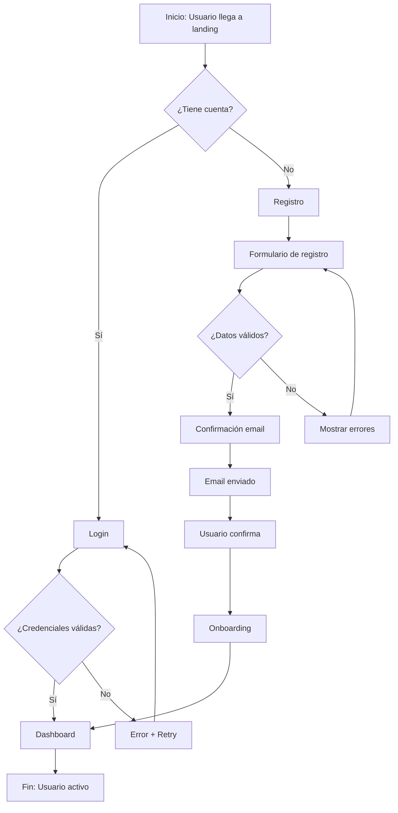
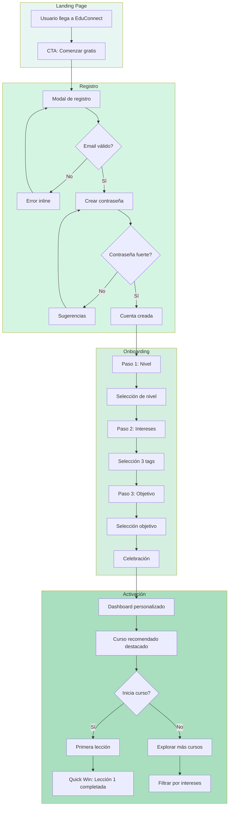

# 4.1. Integración UX + UI

## Introducción

La integración entre Experiencia de Usuario (UX) y Diseño de Interfaz (UI) representa el punto de convergencia donde la investigación estratégica se materializa en soluciones visuales tangibles. Esta síntesis no es meramente la suma de sus partes, sino un proceso deliberado de traducción donde los insights de usuario se transforman en decisiones de diseño fundamentadas y verificables.

En las unidades anteriores, se establecieron los fundamentos de UX (la estrategia centrada en el usuario) y UI (el sistema visual coherente). Esta sección aborda el proceso metodológico mediante el cual ambas disciplinas se entrelazan para crear experiencias digitales cohesivas y efectivas.

---

## 4.1.1. De la investigación al diseño: Metodología de síntesis

### El puente entre investigación y visualización

La transición de la investigación UX al diseño UI constituye uno de los momentos más críticos del proceso de diseño. Sin una metodología estructurada, existe el riesgo de que los hallazgos de investigación se pierdan o malinterpreten durante la fase de visualización.

**Marco conceptual de traducción:**

```
┌─────────────────────────────────────────────────────────────────────────┐
│                    PROCESO DE SÍNTESIS UX → UI                         │
├─────────────────────────────────────────────────────────────────────────┤
│                                                                         │
│  INVESTIGACIÓN UX          SÍNTESIS            DISEÑO UI               │
│  ─────────────────   ──────────────────   ─────────────────            │
│                                                                         │
│  • User Personas    →  Principios de     →  Sistema de diseño          │
│  • Journey Maps        Diseño derivados     personalizado              │
│  • Pain Points      →  Requerimientos    →  Componentes UI             │
│  • Necesidades         funcionales          específicos                │
│  • Contextos de     →  Restricciones     →  Adaptaciones               │
│    uso                 técnicas             contextuales               │
│  • Modelos          →  Arquitectura de   →  Patrones de                │
│    mentales            información          navegación                 │
│                                                                         │
└─────────────────────────────────────────────────────────────────────────┘
```

### Metodología de síntesis en cinco fases

**Fase 1: Consolidación de hallazgos**

Esta fase implica la recopilación sistemática de todos los artefactos de investigación generados en la fase UX:

- Síntesis de entrevistas y observaciones
- Mapas de empatía consolidados
- Journey maps por persona
- Análisis competitivo
- Métricas baseline y objetivos

**Documentación requerida:**

| Artefacto | Propósito | Formato recomendado |
|-----------|-----------|---------------------|
| Matriz de hallazgos | Centralizar insights | Spreadsheet categorizado |
| Mapa de oportunidades | Priorizar intervenciones | Matriz 2x2 (impacto/esfuerzo) |
| Declaraciones HMW | Enmarcar desafíos | Lista priorizada |
| Principios de diseño | Guiar decisiones | Documento narrativo |

**Fase 2: Derivación de principios de diseño**

Los principios de diseño emergen directamente de los hallazgos de investigación y funcionan como criterios de decisión durante todo el proceso de diseño.

**Estructura de un principio de diseño:**

```
┌─────────────────────────────────────────────────────────────────┐
│                   PRINCIPIO DE DISEÑO                          │
├─────────────────────────────────────────────────────────────────┤
│                                                                 │
│  NOMBRE: [Título memorable y accionable]                       │
│                                                                 │
│  ORIGEN: [Hallazgo de investigación que lo fundamenta]         │
│                                                                 │
│  DECLARACIÓN: [Descripción clara del principio]                │
│                                                                 │
│  IMPLICACIONES UI:                                              │
│    • [Decisión de diseño derivada 1]                           │
│    • [Decisión de diseño derivada 2]                           │
│    • [Decisión de diseño derivada 3]                           │
│                                                                 │
│  EJEMPLO: [Aplicación concreta]                                │
│                                                                 │
│  ANTI-PATRÓN: [Qué evitar]                                     │
│                                                                 │
└─────────────────────────────────────────────────────────────────┘
```

**Fase 3: Definición de requerimientos de experiencia**

Los requerimientos de experiencia (Experience Requirements) traducen las necesidades de usuario en especificaciones funcionales que guiarán el diseño.

**Categorías de requerimientos:**

1. **Requerimientos funcionales**: Qué debe hacer el sistema
2. **Requerimientos emocionales**: Cómo debe sentirse la experiencia
3. **Requerimientos contextuales**: Dónde y cuándo se usará
4. **Requerimientos de accesibilidad**: Quién debe poder usarlo
5. **Requerimientos de rendimiento**: Qué tan rápido debe responder

**Fase 4: Mapeo de soluciones**

El mapeo de soluciones conecta cada requerimiento con decisiones específicas de diseño UI.

```
REQUERIMIENTO → SOLUCIÓN UI → COMPONENTE → ESPECIFICACIÓN

Ejemplo:
"El usuario necesita      →  Feedback visual   →  Barra de      →  Ancho: 100%
sentir progreso              inmediato de         progreso         Color: #16A085
constante"                   avance               animada          Animación: 300ms
```

**Fase 5: Validación cruzada**

Antes de avanzar al diseño detallado, se verifica que:

- Cada hallazgo de investigación tiene al menos una respuesta de diseño
- Cada decisión de diseño puede trazarse a un hallazgo
- No existen conflictos entre principios o requerimientos
- Las restricciones técnicas están documentadas

---

## 4.1.2. User Flows a Task Flows: Documentación del comportamiento

### Distinción conceptual

**User Flow:** Representa el recorrido completo de un usuario a través del sistema para lograr un objetivo. Incluye múltiples decisiones, ramificaciones y posibles caminos.

**Task Flow:** Documenta la secuencia específica de pasos para completar una tarea singular, sin ramificaciones. Representa el "camino feliz" (happy path).

```
USER FLOW                              TASK FLOW
─────────────────                      ─────────────────
Múltiples caminos                      Camino único
Puntos de decisión                     Sin decisiones
Maneja errores                         Solo éxito
Vista holística                        Vista específica
Planificación UX                       Especificación UI
```

### Diagramación de User Flows

**Notación estándar:**

```
┌─────────────────────────────────────────────────────────────────┐
│                 SÍMBOLOS DE USER FLOW                          │
├─────────────────────────────────────────────────────────────────┤
│                                                                 │
│   ○        Inicio/Fin (círculo)                                │
│                                                                 │
│   ┌───┐    Pantalla/Página (rectángulo)                        │
│   └───┘                                                         │
│                                                                 │
│   ◇        Punto de decisión (diamante)                        │
│                                                                 │
│   →        Flujo/Transición (flecha)                           │
│                                                                 │
│   ─ ─ →    Flujo opcional (flecha punteada)                    │
│                                                                 │
│   ⟳        Loop/Repetición                                     │
│                                                                 │
│   ▭        Acción del sistema (rectángulo redondeado)          │
│                                                                 │
│   ┊        Conector fuera de página                            │
│                                                                 │
└─────────────────────────────────────────────────────────────────┘
```

**Estructura de un User Flow completo:**



### Documentación de Task Flows

Los Task Flows son más granulares y específicos. Documentan exactamente qué hace el usuario y qué responde el sistema en cada paso.

**Formato de documentación:**

```
┌─────────────────────────────────────────────────────────────────┐
│                    TASK FLOW DOCUMENT                          │
├─────────────────────────────────────────────────────────────────┤
│                                                                 │
│  TAREA: [Nombre descriptivo]                                   │
│  PERSONA: [Quién realiza la tarea]                             │
│  TRIGGER: [Qué inicia la tarea]                                │
│  RESULTADO: [Estado final esperado]                            │
│  FRECUENCIA: [Con qué frecuencia ocurre]                       │
│  CRITICIDAD: [Alta/Media/Baja]                                 │
│                                                                 │
│  SECUENCIA:                                                     │
│  ┌──────┬────────────────────┬────────────────────┐            │
│  │ Paso │ Acción Usuario     │ Respuesta Sistema  │            │
│  ├──────┼────────────────────┼────────────────────┤            │
│  │  1   │ [Descripción]      │ [Descripción]      │            │
│  │  2   │ [Descripción]      │ [Descripción]      │            │
│  │  3   │ [Descripción]      │ [Descripción]      │            │
│  └──────┴────────────────────┴────────────────────┘            │
│                                                                 │
│  TIEMPO ESTIMADO: [Segundos/Minutos]                           │
│  MÉTRICAS DE ÉXITO: [KPIs específicos]                         │
│                                                                 │
└─────────────────────────────────────────────────────────────────┘
```

---

## 4.1.3. Prototipado de alta fidelidad

### Niveles de fidelidad: Cuándo usar cada uno

La selección del nivel de fidelidad depende del propósito del prototipo y la etapa del proyecto:

| Fidelidad | Cuándo usar | Herramientas | Tiempo |
|-----------|-------------|--------------|--------|
| Baja (Lo-Fi) | Exploración inicial, validación de concepto | Papel, Balsamiq | Horas |
| Media (Mid-Fi) | Validación de flujos, arquitectura | Figma wireframes | Días |
| Alta (Hi-Fi) | Testing de usabilidad, presentación | Figma con UI final | Semanas |
| Funcional | Validación técnica, desarrollo | HTML/CSS, React | Semanas |

### Características del prototipo de alta fidelidad

Un prototipo Hi-Fi debe incluir:

**Elementos visuales completos:**
- Tipografía final
- Paleta de colores definitiva
- Iconografía real
- Imágenes representativas (no placeholders)
- Espaciado y layout precisos

**Interactividad realista:**
- Transiciones y animaciones
- Estados de componentes (hover, active, disabled)
- Feedback visual de acciones
- Carga de datos simulada
- Manejo de errores visualizado

**Contenido representativo:**
- Texto real (no lorem ipsum)
- Datos realistas
- Escenarios de edge cases

### Proceso de construcción Hi-Fi

```
FLUJO DE CONSTRUCCIÓN DE PROTOTIPO HI-FI

1. PREPARACIÓN
   ├── Revisar Design System
   ├── Inventariar componentes necesarios
   ├── Definir estados de cada pantalla
   └── Mapear transiciones requeridas

2. CONSTRUCCIÓN
   ├── Ensamblar pantallas con componentes
   ├── Aplicar contenido real
   ├── Configurar estados interactivos
   └── Implementar transiciones

3. CONEXIÓN
   ├── Vincular pantallas según flows
   ├── Configurar triggers de interacción
   ├── Implementar overlays y modales
   └── Agregar micro-interacciones

4. REFINAMIENTO
   ├── Revisar consistencia visual
   ├── Verificar flujos completos
   ├── Testear en diferentes viewports
   └── Optimizar performance del prototipo

5. DOCUMENTACIÓN
   ├── Anotar comportamientos especiales
   ├── Documentar lógica de estados
   ├── Preparar guía de navegación
   └── Crear versión de presentación
```

---

## 4.1.4. Especificaciones de diseño (Redlines)

### Definición y propósito

Las especificaciones de diseño, también conocidas como "redlines" o "specs", constituyen la documentación técnica que permite a los desarrolladores implementar el diseño con precisión milimétrica. El término "redlines" proviene de la práctica tradicional de marcar medidas en rojo sobre los diseños.

### Elementos a especificar

**1. Dimensiones y espaciado:**

```
┌─────────────────────────────────────────────────────────────────┐
│                                                                 │
│    ←── 24px ──→                                                │
│    ┌─────────────────────────────────────────┐                 │
│    │                                         │ ↑               │
│    │   ┌─────────────────────────┐          │ │               │
│    │   │                         │ ←16px→   │ 48px            │
│    │   │       BOTÓN             │          │ │               │
│    │   │                         │          │ ↓               │
│    │   └─────────────────────────┘          │                 │
│    │                                         │                 │
│    └─────────────────────────────────────────┘                 │
│                                                                 │
│    Especificaciones:                                            │
│    • Padding horizontal: 24px                                   │
│    • Padding vertical: 16px                                     │
│    • Altura del botón: 48px                                     │
│    • Border-radius: 8px                                         │
│                                                                 │
└─────────────────────────────────────────────────────────────────┘
```

**2. Tipografía:**

```
ESPECIFICACIÓN TIPOGRÁFICA

Componente: Título de tarjeta de curso
─────────────────────────────────────
Fuente: Inter
Peso: 600 (SemiBold)
Tamaño: 18px
Line-height: 1.4 (25.2px)
Letter-spacing: -0.01em
Color: #1A1A1A
Truncamiento: 2 líneas máximo
Overflow: ellipsis
```

**3. Colores y estados:**

```
ESTADOS DEL BOTÓN PRIMARIO

                Normal      Hover       Active      Disabled
─────────────────────────────────────────────────────────────
Background      #16A085     #138D75     #117A65     #B2D4CE
Text            #FFFFFF     #FFFFFF     #FFFFFF     #FFFFFF
Border          none        none        none        none
Shadow          0 2px 4px   0 4px 8px   0 1px 2px   none
               rgba(0,0,0   rgba(0,0,0  rgba(0,0,0
               ,0.1)        ,0.15)      ,0.05)
Cursor          pointer     pointer     pointer     not-allowed
Transition      all 200ms ease-in-out
```

**4. Comportamiento responsive:**

```
BREAKPOINTS Y ADAPTACIONES

Componente: Grid de cursos
──────────────────────────

Mobile (< 640px):
  • Columnas: 1
  • Gap: 16px
  • Padding lateral: 16px

Tablet (640px - 1024px):
  • Columnas: 2
  • Gap: 24px
  • Padding lateral: 24px

Desktop (> 1024px):
  • Columnas: 3
  • Gap: 32px
  • Padding lateral: 32px
  • Max-width: 1200px
  • Centrado horizontal
```

### Herramientas de especificación

**En Figma:**
- Inspect panel (modo Dev Mode)
- Plugins como "Redlines" o "Measure"
- Exportación de CSS
- Design tokens

**Formato de documentación:**
- Zeplin
- Abstract
- Avocode
- Exportación nativa de Figma

---

## 4.1.5. Handoff diseño-desarrollo

### El proceso de handoff moderno

El handoff (transferencia de diseño a desarrollo) ha evolucionado de ser un momento puntual a un proceso colaborativo continuo.

**Modelo tradicional vs. moderno:**

```
MODELO TRADICIONAL (Waterfall)
─────────────────────────────────
Diseñador → [Entrega specs] → Desarrollador → [Implementa] → [Revisión]
           └─── Una vez ───┘

MODELO MODERNO (Colaborativo)
─────────────────────────────────
Diseñador ←→ Desarrollador
     ↓            ↓
  [Figma]  ←→  [Código]
     ↓            ↓
  [Review] ←→ [Feedback]
     └──── Continuo ────┘
```

### Checklist de handoff

```
┌─────────────────────────────────────────────────────────────────┐
│                    CHECKLIST DE HANDOFF                        │
├─────────────────────────────────────────────────────────────────┤
│                                                                 │
│  ORGANIZACIÓN DEL ARCHIVO                                       │
│  □ Páginas nombradas consistentemente                          │
│  □ Frames organizados por flujo/sección                        │
│  □ Componentes en librería separada                            │
│  □ Versión del archivo documentada                             │
│                                                                 │
│  COMPONENTES                                                    │
│  □ Todos los estados documentados                              │
│  □ Variantes configuradas                                      │
│  □ Propiedades nombradas semánticamente                        │
│  □ Auto-layout implementado                                    │
│                                                                 │
│  ESPECIFICACIONES                                               │
│  □ Design tokens definidos                                     │
│  □ Espaciados usando sistema (4px, 8px, 16px...)              │
│  □ Tipografía especificada completamente                       │
│  □ Colores con nombres semánticos                              │
│                                                                 │
│  INTERACTIVIDAD                                                 │
│  □ Prototipo funcional para referencia                        │
│  □ Transiciones documentadas                                   │
│  □ Estados hover/active/focus especificados                   │
│  □ Animaciones con timing y easing                            │
│                                                                 │
│  RESPONSIVE                                                     │
│  □ Breakpoints definidos                                       │
│  □ Comportamiento de cada componente documentado              │
│  □ Prioridad de contenido en mobile                           │
│                                                                 │
│  EDGE CASES                                                     │
│  □ Estados vacíos                                              │
│  □ Estados de carga                                            │
│  □ Estados de error                                            │
│  □ Contenido largo/truncamiento                               │
│                                                                 │
│  ASSETS                                                         │
│  □ Iconos exportados (SVG)                                    │
│  □ Imágenes optimizadas                                        │
│  □ Fuentes identificadas                                       │
│                                                                 │
│  DOCUMENTACIÓN                                                  │
│  □ Notas de diseño adjuntas                                   │
│  □ Decisiones de diseño explicadas                            │
│  □ Comportamientos complejos descritos                        │
│                                                                 │
└─────────────────────────────────────────────────────────────────┘
```

### Design Tokens

Los design tokens son variables de diseño que capturan decisiones de diseño en formato que puede ser consumido tanto por diseñadores como por desarrolladores.

**Estructura de tokens:**

```json
{
  "color": {
    "primary": {
      "base": { "value": "#16A085" },
      "hover": { "value": "#138D75" },
      "active": { "value": "#117A65" }
    },
    "neutral": {
      "100": { "value": "#F5F5F5" },
      "200": { "value": "#E0E0E0" },
      "900": { "value": "#1A1A1A" }
    }
  },
  "spacing": {
    "xs": { "value": "4px" },
    "sm": { "value": "8px" },
    "md": { "value": "16px" },
    "lg": { "value": "24px" },
    "xl": { "value": "32px" }
  },
  "typography": {
    "heading": {
      "h1": {
        "fontSize": { "value": "32px" },
        "fontWeight": { "value": "700" },
        "lineHeight": { "value": "1.2" }
      }
    }
  },
  "borderRadius": {
    "sm": { "value": "4px" },
    "md": { "value": "8px" },
    "lg": { "value": "16px" },
    "full": { "value": "9999px" }
  }
}
```

---

## Aplicación al Caso EduConnect

### Síntesis de investigación a diseño

A partir de la investigación UX desarrollada en la Unidad 1, se derivan los siguientes principios de diseño para EduConnect:

**Principio 1: Claridad sobre completitud**

```
NOMBRE: Claridad sobre completitud

ORIGEN: María (persona primaria) se siente abrumada por 
        demasiadas opciones. 78% de usuarios abandonan 
        en el primer mes por "parálisis de decisión".

DECLARACIÓN: Presentar opciones limitadas y claramente 
             diferenciadas en cada punto de decisión, 
             revelando complejidad progresivamente.

IMPLICACIONES UI:
• Máximo 3-5 opciones por pantalla
• Cards de curso muestran solo información esencial
• Filtros ocultos por defecto, revelados al solicitar
• Onboarding de máximo 3 pasos visibles

EJEMPLO: En selección de nivel, mostrar solo "Principiante",
         "Intermedio", "Avanzado" con descripciones breves.

ANTI-PATRÓN: Mostrar todos los cursos disponibles en una
             grilla infinita sin categorización.
```

**Principio 2: Progreso visible constante**

```
NOMBRE: Progreso visible constante

ORIGEN: Carlos necesita estructura y claridad en su avance.
        Los usuarios que ven su progreso tienen 3x más 
        probabilidad de completar cursos.

DECLARACIÓN: El usuario debe poder ver exactamente dónde 
             está, qué ha logrado y qué sigue, en todo momento.

IMPLICACIONES UI:
• Barra de progreso persistente en header durante cursos
• Dashboard con visualización de logros y próximos pasos
• Celebraciones visuales al completar hitos
• Indicadores de tiempo estimado para completar

EJEMPLO: Progress ring en cada módulo mostrando % completado,
         con animación al avanzar.

ANTI-PATRÓN: Contenido lineal sin indicación de posición
             o progreso en el recorrido.
```

**Principio 3: Conexión humana facilitada**

```
NOMBRE: Conexión humana facilitada

ORIGEN: Laura (mentora) busca herramientas para conectar 
        con estudiantes. El aprendizaje colaborativo 
        aumenta retención en 40%.

DECLARACIÓN: Facilitar interacciones significativas entre 
             estudiantes y mentores sin fricción innecesaria.

IMPLICACIONES UI:
• Perfiles de mentor visibles y accesibles
• Botón de contacto prominente en contexto de curso
• Espacios de discusión integrados en cada lección
• Notificaciones de respuestas en tiempo real

EJEMPLO: Al terminar una lección, CTA "¿Tienes dudas? 
         Pregunta a [Nombre del mentor]" con foto y 
         tiempo de respuesta promedio.

ANTI-PATRÓN: Foros separados de la experiencia de curso
             que requieren navegación adicional.
```

### Task Flow: Onboarding completo

```
┌─────────────────────────────────────────────────────────────────┐
│              TASK FLOW: ONBOARDING NUEVO USUARIO               │
├─────────────────────────────────────────────────────────────────┤
│                                                                 │
│  TAREA: Completar registro y configuración inicial             │
│  PERSONA: María (estudiante universitaria)                     │
│  TRIGGER: Click en "Comenzar gratis" desde landing page       │
│  RESULTADO: Usuario en dashboard con primer curso recomendado  │
│  FRECUENCIA: Una vez por usuario                               │
│  CRITICIDAD: Alta (determina retención)                        │
│                                                                 │
├─────────────────────────────────────────────────────────────────┤
│                                                                 │
│  SECUENCIA:                                                     │
│  ┌──────┬─────────────────────────┬──────────────────────────┐ │
│  │ Paso │ Acción Usuario          │ Respuesta Sistema        │ │
│  ├──────┼─────────────────────────┼──────────────────────────┤ │
│  │  1   │ Click "Comenzar gratis" │ Modal de registro        │ │
│  │  2   │ Ingresa email           │ Validación en tiempo     │ │
│  │      │                         │ real (formato válido)    │ │
│  │  3   │ Crea contraseña         │ Indicador de fortaleza   │ │
│  │  4   │ Click "Crear cuenta"    │ Animación de carga,      │ │
│  │      │                         │ transición a Paso 1/3    │ │
│  │  5   │ Selecciona nivel        │ Descripción expandida    │ │
│  │      │ (Principiante/          │ al hover, transición     │ │
│  │      │ Intermedio/Avanzado)    │ a Paso 2/3               │ │
│  │  6   │ Selecciona 3 intereses  │ Tags animados al         │ │
│  │      │ de lista sugerida       │ seleccionar, contador    │ │
│  │      │                         │ "3/3", transición 3/3    │ │
│  │  7   │ Define objetivo         │ Opciones con iconos,     │ │
│  │      │ principal               │ feedback de selección    │ │
│  │  8   │ Click "Ver mis cursos"  │ Animación celebratoria,  │ │
│  │      │                         │ transición a Dashboard   │ │
│  │      │                         │ con curso destacado      │ │
│  └──────┴─────────────────────────┴──────────────────────────┘ │
│                                                                 │
│  TIEMPO ESTIMADO: 90-120 segundos                              │
│                                                                 │
│  MÉTRICAS DE ÉXITO:                                             │
│  • Tasa de completación > 85%                                  │
│  • Tiempo promedio < 2 minutos                                 │
│  • Abandono por paso < 10%                                     │
│                                                                 │
└─────────────────────────────────────────────────────────────────┘
```

### Diagrama de User Flow: Registro y primer curso



---

## Lecturas Sugeridas

1. **Cooper, A., Reimann, R., Cronin, D., & Noessel, C.** (2014). *About Face: The Essentials of Interaction Design*. Wiley. Capítulos 10-12 sobre flujos y documentación.

2. **Buley, L.** (2013). *The User Experience Team of One*. Rosenfeld Media. Capítulo sobre colaboración diseño-desarrollo.

3. **Kholmatova, A.** (2017). *Design Systems*. Smashing Magazine. Secciones sobre handoff y documentación.

4. **Figma.** (2024). *Best Practices for Design Handoff*. Documentación oficial de Figma.

5. **InVision.** (2023). *The New Design Frontier Report*. Perspectivas sobre colaboración moderna.

---

## Referencias

- Norman, D. (2013). *The Design of Everyday Things*. Basic Books.
- Garrett, J. J. (2010). *The Elements of User Experience*. New Riders.
- ISO 9241-210:2019. *Ergonomics of human-system interaction*.
- Nielsen Norman Group. (2024). *UX Documentation Guidelines*.
- Google Material Design. (2024). *Design to Development Handoff*.

---

**Metadata del documento:**
- **Unidad:** 4 de 4
- **Sección:** 4.1 - Integración UX + UI
- **Palabras clave:** Integración, User Flows, Task Flows, Prototipado Hi-Fi, Especificaciones, Redlines, Handoff, Design Tokens
- **Nivel:** Aplicado
- **Tiempo estimado de estudio:** 8-10 horas
- **Prerequisitos:** Unidades 1, 2 y 3 completadas
- **Caso de estudio:** EduConnect - Flujo de onboarding

---

**Siguiente sección:** 4.2 - Herramientas Profesionales
