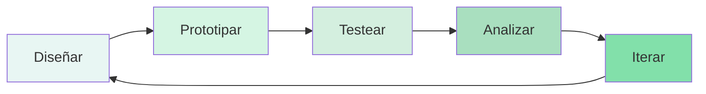

# 4.3. Testing de Usabilidad

## Introducción

El testing de usabilidad constituye el proceso metodológico mediante el cual se evalúa la facilidad de uso de un producto digital observando a usuarios reales mientras intentan completar tareas específicas. A diferencia de las revisiones heurísticas o las opiniones de expertos, el testing de usabilidad proporciona evidencia empírica directa sobre cómo los usuarios reales interactúan con el diseño.

Jakob Nielsen, pionero en la disciplina, establece que "el testing con 5 usuarios descubre aproximadamente el 85% de los problemas de usabilidad". Esta premisa fundamenta la importancia de incorporar testing iterativo en el proceso de diseño, permitiendo identificar y corregir problemas antes de que se conviertan en costosos errores de implementación.

---

## 4.3.1. Tipos de testing de usabilidad

### Clasificación por metodología

```
┌─────────────────────────────────────────────────────────────────┐
│              TAXONOMÍA DEL TESTING DE USABILIDAD               │
├─────────────────────────────────────────────────────────────────┤
│                                                                 │
│  POR MODERACIÓN                                                 │
│  ├── Moderado: Facilitador guía la sesión                      │
│  └── No moderado: Usuario completa tareas autónomamente        │
│                                                                 │
│  POR UBICACIÓN                                                  │
│  ├── Presencial: Usuario y facilitador en mismo espacio       │
│  └── Remoto: Conexión vía videoconferencia/plataforma         │
│                                                                 │
│  POR FORMALIDAD                                                 │
│  ├── Formal: Laboratorio, protocolo estricto, métricas        │
│  ├── Informal: Hallway testing, feedback rápido               │
│  └── Guerrilla: En campo, usuarios reales, contexto real      │
│                                                                 │
│  POR OBJETIVO                                                   │
│  ├── Exploratorio: Descubrir comportamientos y necesidades    │
│  ├── Comparativo: Evaluar alternativas de diseño              │
│  ├── Validación: Confirmar que el diseño cumple objetivos     │
│  └── Benchmarking: Establecer métricas de referencia          │
│                                                                 │
│  POR ETAPA DEL PROYECTO                                         │
│  ├── Concept testing: Validar conceptos iniciales             │
│  ├── Prototype testing: Evaluar flujos y estructura           │
│  └── Live testing: Testear producto en producción             │
│                                                                 │
└─────────────────────────────────────────────────────────────────┘
```

### Testing moderado vs. no moderado

**Testing moderado:**

El facilitador está presente (física o virtualmente) durante la sesión, guiando al participante y realizando preguntas de seguimiento.

```
VENTAJAS                          DESVENTAJAS
──────────────────────────        ──────────────────────────
• Insights profundos              • Mayor costo por sesión
• Preguntas de seguimiento        • Requiere facilitador experto
• Observar lenguaje corporal      • Posible sesgo del moderador
• Adaptar tareas en tiempo real   • Menos escalable
• Clarificar confusiones          • Coordinación de horarios
```

**Testing no moderado:**

Los participantes completan las tareas de forma autónoma, típicamente a través de una plataforma especializada.

```
VENTAJAS                          DESVENTAJAS
──────────────────────────        ──────────────────────────
• Escalabilidad                   • Sin preguntas de seguimiento
• Menor costo por participante    • Menor contexto cualitativo
• Mayor diversidad geográfica     • Posibles abandonos
• Resultados rápidos              • Tareas deben ser muy claras
• Sin sesgo del moderador         • No se observa frustración real
```

**Cuándo usar cada tipo:**

| Escenario | Recomendación |
|-----------|---------------|
| Proyecto nuevo, concepto sin validar | Moderado |
| Validación rápida de flujo específico | No moderado |
| Presupuesto limitado, muchos usuarios | No moderado |
| Producto complejo, dominio especializado | Moderado |
| Testing internacional, múltiples idiomas | No moderado |
| Iteración durante sprint | Guerrilla/No moderado |
| Presentación a stakeholders | Moderado (grabado) |

### Testing remoto

El testing remoto se ha convertido en estándar de la industria, especialmente post-pandemia.

**Modalidades de testing remoto:**

```
┌─────────────────────────────────────────────────────────────────┐
│                    TESTING REMOTO                              │
├─────────────────────────────────────────────────────────────────┤
│                                                                 │
│  SÍNCRONO (Tiempo real)                                        │
│  └── Facilitador y participante conectados simultáneamente     │
│      • Videoconferencia (Zoom, Google Meet)                    │
│      • Screen sharing                                          │
│      • Chat/mensajería                                         │
│      │                                                         │
│      Herramientas:                                              │
│      • Lookback                                                │
│      • UserZoom                                                │
│      • Zoom + protocolo manual                                 │
│                                                                 │
│  ASÍNCRONO (Diferido)                                          │
│  └── Participante completa en su tiempo                       │
│      • Grabación automática de pantalla                        │
│      • Think-aloud grabado                                     │
│      • Cuestionarios post-tarea                                │
│      │                                                         │
│      Herramientas:                                              │
│      • Maze                                                    │
│      • UserTesting                                             │
│      • Optimal Workshop                                        │
│      • Lyssna (ex UsabilityHub)                               │
│                                                                 │
└─────────────────────────────────────────────────────────────────┘
```

### Guerrilla testing

El guerrilla testing es una forma de testing informal, rápido y de bajo costo, realizado "en la calle" con participantes encontrados en el momento.

**Características:**

- Duración: 5-15 minutos por participante
- Participantes: 3-8 usuarios encontrados en contexto
- Ubicación: Cafeterías, espacios públicos, oficinas
- Incentivo: Café, pequeño obsequio, o nada
- Formalidad: Mínima, sin consentimiento formal extenso

**Protocolo de guerrilla testing:**

```
1. PREPARACIÓN (5 min)
   • Identificar 2-3 tareas críticas
   • Preparar prototipo funcional
   • Tener dispositivo cargado y listo

2. RECLUTAMIENTO (Variable)
   • Acercarse cortésmente
   • Explicar brevemente el propósito
   • Confirmar que tienen 5-10 minutos

3. CONTEXTO (1 min)
   • "Estamos diseñando [producto]"
   • "Me gustaría ver cómo intentas [tarea]"
   • "No te estamos evaluando a ti, sino al diseño"

4. OBSERVACIÓN (5-10 min)
   • Presentar tarea sin explicar el diseño
   • Observar sin intervenir
   • Notar dónde duda, qué pregunta

5. CIERRE (1 min)
   • Agradecer
   • Una pregunta: "¿Qué cambiarías?"
   • Entregar incentivo si aplica

6. DOCUMENTACIÓN (2 min)
   • Anotar inmediatamente hallazgos clave
   • Capturar citas textuales
   • Fotografiar notas si es necesario
```

---

## 4.3.2. Diseño de estudios de usabilidad

### Planificación del estudio

Un estudio de usabilidad bien diseñado requiere planificación cuidadosa para obtener resultados válidos y accionables.

**Documento de planificación:**

```
┌─────────────────────────────────────────────────────────────────┐
│              PLAN DE ESTUDIO DE USABILIDAD                     │
├─────────────────────────────────────────────────────────────────┤
│                                                                 │
│  INFORMACIÓN GENERAL                                            │
│  ├── Proyecto: [Nombre del proyecto]                           │
│  ├── Versión: [Número de iteración]                            │
│  ├── Fecha: [Fecha del estudio]                                │
│  └── Investigador: [Nombre]                                    │
│                                                                 │
│  OBJETIVOS                                                      │
│  ├── Objetivo principal:                                       │
│  │   [Qué pregunta específica queremos responder]              │
│  │                                                              │
│  └── Objetivos secundarios:                                    │
│      • [Objetivo 2]                                            │
│      • [Objetivo 3]                                            │
│                                                                 │
│  HIPÓTESIS                                                      │
│  ├── H1: [Hipótesis a validar]                                 │
│  └── H2: [Hipótesis a validar]                                 │
│                                                                 │
│  METODOLOGÍA                                                    │
│  ├── Tipo: [Moderado/No moderado]                              │
│  ├── Formato: [Remoto/Presencial]                              │
│  ├── Duración sesión: [Minutos]                                │
│  └── Número participantes: [N]                                 │
│                                                                 │
│  PARTICIPANTES                                                  │
│  ├── Perfil objetivo:                                          │
│  │   • Demografía: [Rango edad, ubicación]                     │
│  │   • Experiencia: [Nivel con tecnología/dominio]             │
│  │   • Criterios inclusión: [Requisitos]                       │
│  │   • Criterios exclusión: [Filtros]                          │
│  │                                                              │
│  └── Reclutamiento:                                            │
│      • Fuente: [Cómo se reclutarán]                           │
│      • Incentivo: [Compensación]                               │
│      • Timeline: [Fechas de reclutamiento]                     │
│                                                                 │
│  TAREAS                                                         │
│  ├── Tarea 1: [Descripción]                                    │
│  │   • Objetivo: [Qué validamos]                               │
│  │   • Criterio éxito: [Cómo sabemos que completó]            │
│  │   • Tiempo máximo: [Minutos]                                │
│  │                                                              │
│  ├── Tarea 2: [Descripción]                                    │
│  └── Tarea N: [Descripción]                                    │
│                                                                 │
│  MÉTRICAS                                                       │
│  ├── Cuantitativas:                                            │
│  │   • Tasa de éxito                                           │
│  │   • Tiempo en tarea                                         │
│  │   • Número de errores                                       │
│  │   • SUS score                                               │
│  │                                                              │
│  └── Cualitativas:                                              │
│      • Puntos de confusión                                     │
│      • Feedback verbal                                         │
│      • Sugerencias de mejora                                   │
│                                                                 │
│  ENTREGABLES                                                    │
│  ├── Reporte ejecutivo                                         │
│  ├── Clips de video                                            │
│  ├── Lista priorizada de hallazgos                            │
│  └── Recomendaciones de diseño                                 │
│                                                                 │
│  CRONOGRAMA                                                     │
│  ├── Planificación: [Fechas]                                   │
│  ├── Reclutamiento: [Fechas]                                   │
│  ├── Sesiones: [Fechas]                                        │
│  ├── Análisis: [Fechas]                                        │
│  └── Presentación: [Fecha]                                     │
│                                                                 │
└─────────────────────────────────────────────────────────────────┘
```

### Diseño de tareas

Las tareas son el corazón del estudio de usabilidad. Deben ser realistas, específicas y medibles.

**Principios de diseño de tareas:**

1. **Basadas en escenarios reales:** Reflejar cómo los usuarios realmente usarían el producto.

2. **Sin revelar la solución:** No indicar qué hacer, sino qué lograr.

3. **Concretas y medibles:** Debe ser claro cuándo la tarea está completa.

4. **Independientes:** El éxito de una tarea no debe depender de otra.

5. **Priorizadas:** Las más críticas primero (efecto de fatiga).

**Formato de tarea:**

```
ESTRUCTURA DE TAREA
───────────────────────────────────────

CONTEXTO (Escenario):
"Imagina que acabas de escuchar sobre EduConnect de un 
compañero de trabajo. Quieres ver si tienen cursos que 
te ayuden a mejorar tus habilidades de diseño."

OBJETIVO:
"Encuentra un curso de diseño UX para principiantes y 
mira qué temas cubre."

CRITERIOS DE ÉXITO:
• Usuario llega a página de detalle del curso ✓
• Usuario ve el temario/syllabus ✓
• Tiempo < 3 minutos

PREGUNTAS POST-TAREA:
• "En una escala de 1-7, ¿qué tan fácil fue encontrar
  el curso?" (SEQ - Single Ease Question)
• "¿Qué información buscabas que no encontraste?"
```

**Errores comunes en tareas:**

```
❌ INCORRECTO                      ✓ CORRECTO
───────────────────────────        ───────────────────────────
"Haz clic en el botón de          "Quieres crear una cuenta
registro y llena el               para acceder a los cursos.
formulario"                        ¿Cómo lo harías?"

"Usa el filtro de categoría       "Busca un curso de Python
para encontrar cursos de          que sea para principiantes
programación"                      y dure menos de 10 horas"

"Navega al dashboard y mira       "Quieres ver cuánto has
tu progreso"                       avanzado en tus cursos.
                                   Encuentra esa información"
```

### Scripts de moderación

Un script bien estructurado asegura consistencia entre sesiones mientras permite flexibilidad para seguir líneas de investigación interesantes.

**Estructura del script:**

```
┌─────────────────────────────────────────────────────────────────┐
│              SCRIPT DE SESIÓN DE USABILIDAD                    │
├─────────────────────────────────────────────────────────────────┤
│                                                                 │
│  INTRODUCCIÓN (5 minutos)                                       │
│  ─────────────────────────────────────────────────────────────  │
│                                                                 │
│  "Hola [Nombre], gracias por participar hoy. Mi nombre es      │
│  [Nombre] y estaré facilitando esta sesión.                    │
│                                                                 │
│  Antes de comenzar, quiero explicarte algunas cosas:           │
│                                                                 │
│  • Estamos evaluando el diseño, NO a ti. No hay respuestas     │
│    correctas o incorrectas.                                    │
│                                                                 │
│  • Tu feedback honesto es muy valioso. Si algo te confunde     │
│    o frustra, es exactamente lo que necesitamos saber.         │
│                                                                 │
│  • Voy a pedirte que pienses en voz alta mientras navegas.     │
│    Dime qué estás viendo, qué esperas que pase, qué te         │
│    confunde.                                                    │
│                                                                 │
│  • [Si aplica] Vamos a grabar la sesión para poder revisar     │
│    después. La grabación es confidencial y solo para uso       │
│    interno del equipo de diseño.                               │
│                                                                 │
│  • La sesión durará aproximadamente [X] minutos.               │
│                                                                 │
│  ¿Tienes alguna pregunta antes de comenzar?"                   │
│                                                                 │
│  WARM-UP (3 minutos)                                            │
│  ─────────────────────────────────────────────────────────────  │
│                                                                 │
│  "Antes de ver el prototipo, me gustaría conocerte un poco:    │
│                                                                 │
│  • ¿Podrías contarme brevemente sobre ti y tu experiencia      │
│    con [dominio relevante]?                                    │
│                                                                 │
│  • ¿Has usado plataformas de aprendizaje online antes?         │
│    ¿Cuáles? ¿Qué te gustó o no te gustó de ellas?"            │
│                                                                 │
│  TAREAS (X minutos por tarea)                                   │
│  ─────────────────────────────────────────────────────────────  │
│                                                                 │
│  [Leer escenario y tarea textualmente]                         │
│                                                                 │
│  Durante la tarea:                                              │
│  • Observar sin intervenir                                     │
│  • Recordar: "¿Qué estás pensando ahora?"                     │
│  • Si se traba completamente: "¿Qué esperarías encontrar?"    │
│  • NO dar pistas sobre cómo completar la tarea                 │
│                                                                 │
│  Después de cada tarea:                                         │
│  • Aplicar escala SEQ (1-7)                                    │
│  • "¿Hubo algo confuso en ese proceso?"                       │
│  • "¿Qué cambiarías?"                                         │
│                                                                 │
│  CIERRE (5 minutos)                                             │
│  ─────────────────────────────────────────────────────────────  │
│                                                                 │
│  "Ya terminamos con las tareas. Antes de finalizar:            │
│                                                                 │
│  • En general, ¿cómo describirías tu experiencia?             │
│                                                                 │
│  • Si pudieras cambiar UNA cosa del diseño, ¿cuál sería?      │
│                                                                 │
│  • ¿Hay algo que esperabas poder hacer y no pudiste?          │
│                                                                 │
│  • ¿Algún comentario final que quieras compartir?"            │
│                                                                 │
│  [Aplicar cuestionario SUS si corresponde]                     │
│                                                                 │
│  "Muchas gracias por tu tiempo. Tu feedback es muy valioso    │
│  para mejorar el producto."                                    │
│                                                                 │
└─────────────────────────────────────────────────────────────────┘
```

---

## 4.3.3. Herramientas de testing

### Plataformas de testing no moderado

**Maze**

Maze es una plataforma de testing rápido que se integra directamente con Figma.

```
CARACTERÍSTICAS DE MAZE
───────────────────────────────────────

Integración:     Figma, Sketch, InVision, Adobe XD
Tipo de tests:   Usability, Tree testing, Card sorting,
                 Surveys, 5-second test

Métricas:
• Misclick rate (% de clics incorrectos)
• Time on task (segundos)
• Task success rate (%)
• Heatmaps de clics
• Paths de navegación

Precio:          Freemium (3 proyectos activos gratis)
Ideal para:      Equipos de producto, validación rápida
```

**UserTesting**

Plataforma robusta con panel de participantes propio.

```
CARACTERÍSTICAS DE USERTESTING
───────────────────────────────────────

Panel:           Acceso a millones de testers
Tipos de test:   Moderado y no moderado
Entregables:     Video + transcripción + highlights

Diferenciadores:
• Reclutamiento de participantes incluido
• Análisis con IA para patrones
• Clips de video automáticos
• Benchmarking vs competidores

Precio:          Enterprise (consultar)
Ideal para:      Empresas grandes, investigación continua
```

**Lyssna (antes UsabilityHub)**

Enfocada en tests rápidos y específicos.

```
CARACTERÍSTICAS DE LYSSNA
───────────────────────────────────────

Tests disponibles:
• First click test
• 5-second test
• Design surveys
• Preference test
• Navigation test
• Card sorting
• Tree testing

Precio:          Freemium (respuestas limitadas)
Ideal para:      Validación rápida de decisiones puntuales
```

**Comparativa de plataformas:**

| Característica | Maze | UserTesting | Lyssna |
|---------------|------|-------------|--------|
| Integración Figma | ★★★★★ | ★★★☆☆ | ★★★☆☆ |
| Panel de testers | ★★☆☆☆ | ★★★★★ | ★★★★☆ |
| Tests moderados | ★★☆☆☆ | ★★★★★ | ★☆☆☆☆ |
| Precio accesible | ★★★★☆ | ★★☆☆☆ | ★★★★★ |
| Análisis automático | ★★★★☆ | ★★★★★ | ★★★☆☆ |
| Curva aprendizaje | Baja | Media | Baja |

### Herramientas de grabación y análisis

**Lookback**

Especializada en sesiones de testing moderado remoto.

```
CARACTERÍSTICAS
───────────────────────────────────────
• Videoconferencia optimizada para research
• Grabación de pantalla + cara + audio
• Timestamped notes durante sesión
• Clips y highlights compartibles
• Transcripción automática
• Integración con calendario
```

**Hotjar / Microsoft Clarity**

Herramientas de analítica de comportamiento para productos en producción.

```
HOTJAR                               MICROSOFT CLARITY
───────────────────────              ───────────────────────
• Heatmaps (clics, scroll, movimiento)   • Heatmaps
• Session recordings                      • Session recordings
• Surveys y feedback widgets             • Dashboard analítico
• Funnels de conversión                  • Integración GA4
• Precio: Freemium                       • Precio: Gratuito

Ideal para testing en producción, identificar patrones de
comportamiento real, complementar testing cualitativo.
```

---

## 4.3.4. Análisis e interpretación de resultados

### Framework de análisis

```
┌─────────────────────────────────────────────────────────────────┐
│               PROCESO DE ANÁLISIS DE RESULTADOS                │
├─────────────────────────────────────────────────────────────────┤
│                                                                 │
│  1. RECOPILACIÓN                                                │
│     ├── Consolidar todas las notas                             │
│     ├── Revisar grabaciones                                    │
│     ├── Extraer métricas cuantitativas                        │
│     └── Transcribir citas relevantes                          │
│                                                                 │
│  2. CODIFICACIÓN                                                │
│     ├── Identificar temas recurrentes                         │
│     ├── Categorizar observaciones                              │
│     │   • Problemas de usabilidad                              │
│     │   • Confusiones                                          │
│     │   • Frustraciones                                        │
│     │   • Éxitos / Momentos de satisfacción                   │
│     │   • Sugerencias                                          │
│     └── Contar frecuencia de cada tema                        │
│                                                                 │
│  3. PRIORIZACIÓN                                                │
│     ├── Evaluar severidad de cada problema                    │
│     │   • Crítico: Bloquea completar tarea                    │
│     │   • Alto: Causa frustración significativa               │
│     │   • Medio: Causa confusión o ineficiencia               │
│     │   • Bajo: Molestia menor o cosmético                    │
│     └── Cruzar con frecuencia y impacto en negocio           │
│                                                                 │
│  4. SÍNTESIS                                                    │
│     ├── Agrupar problemas relacionados                        │
│     ├── Identificar causas raíz                               │
│     ├── Proponer soluciones                                   │
│     └── Estimar esfuerzo de implementación                    │
│                                                                 │
│  5. PRESENTACIÓN                                                │
│     ├── Reporte ejecutivo (1-2 páginas)                       │
│     ├── Hallazgos detallados                                  │
│     ├── Clips de video como evidencia                         │
│     └── Roadmap de mejoras sugerido                           │
│                                                                 │
└─────────────────────────────────────────────────────────────────┘
```

### Matriz de priorización de hallazgos

```
                    FRECUENCIA
                    Bajo (1-2)    Medio (3-4)   Alto (5+)
                 ┌────────────┬────────────┬────────────┐
         Crítico │    P2      │     P1     │    P1      │
                 │  Resolver  │  Resolver  │ Resolver   │
    S            │  pronto    │  urgente   │ inmediato  │
    E            ├────────────┼────────────┼────────────┤
    V    Alto    │    P3      │     P2     │    P1      │
    E            │  Planificar│  Resolver  │  Resolver  │
    R            │            │  pronto    │  urgente   │
    I            ├────────────┼────────────┼────────────┤
    D    Medio   │    P4      │     P3     │    P2      │
    A            │  Backlog   │ Planificar │  Resolver  │
    D            │            │            │  pronto    │
                 ├────────────┼────────────┼────────────┤
         Bajo    │    P5      │     P4     │    P3      │
                 │  Opcional  │  Backlog   │ Planificar │
                 └────────────┴────────────┴────────────┘

P1 = Prioridad inmediata (Sprint actual)
P2 = Prioridad alta (Próximo sprint)
P3 = Prioridad media (Este quarter)
P4 = Prioridad baja (Backlog)
P5 = Nice to have (Evaluar)
```

### Métricas de usabilidad

**Métricas cuantitativas:**

```
MÉTRICAS FUNDAMENTALES
───────────────────────────────────────

EFECTIVIDAD
├── Task Success Rate (TSR)
│   Fórmula: (Tareas completadas / Total tareas) × 100
│   Benchmark: > 78% (según Nielsen)
│
├── Error Rate
│   Fórmula: (Errores / Oportunidades de error) × 100
│   Objetivo: Minimizar
│
└── Misclick Rate
    Fórmula: (Clics incorrectos / Total clics) × 100
    Benchmark: < 10%

EFICIENCIA
├── Time on Task
│   Promedio de segundos para completar tarea
│   Comparar vs baseline o competidores
│
├── Task-Level Satisfaction (SEQ)
│   Escala 1-7 después de cada tarea
│   Benchmark: > 5.5
│
└── Lostness Score
    Mide qué tan perdido está el usuario
    Fórmula: √[(N/S-1)² + (R/N-1)²] / 2
    N = Nodos visitados, S = Mínimos necesarios,
    R = Revisitas

SATISFACCIÓN
├── System Usability Scale (SUS)
│   Cuestionario de 10 ítems, escala 0-100
│   Benchmark: > 68 (promedio), > 80 (bueno)
│
├── Net Promoter Score (NPS)
│   "¿Qué tan probable es que recomiendes...?"
│   Escala 0-10, Score = %Promoters - %Detractors
│
└── Customer Satisfaction (CSAT)
    "¿Qué tan satisfecho estás con...?"
    Escala 1-5, reportar % satisfechos (4-5)
```

**System Usability Scale (SUS):**

El SUS es el cuestionario de usabilidad más utilizado en la industria por su simplicidad y confiabilidad.

```
CUESTIONARIO SUS
───────────────────────────────────────

Instrucción: Marcar de 1 (Totalmente en desacuerdo) a 
             5 (Totalmente de acuerdo)

1. Creo que me gustaría usar este sistema frecuentemente.
2. Encontré el sistema innecesariamente complejo.
3. Pensé que el sistema era fácil de usar.
4. Creo que necesitaría apoyo técnico para usar este sistema.
5. Las funciones del sistema estaban bien integradas.
6. Había demasiada inconsistencia en el sistema.
7. Imagino que la mayoría de las personas aprenderían rápido.
8. Encontré el sistema muy engorroso de usar.
9. Me sentí muy confiado usando el sistema.
10. Necesité aprender muchas cosas antes de poder usarlo.

CÁLCULO:
• Items impares: restar 1 a la respuesta
• Items pares: restar la respuesta de 5
• Sumar todos los valores ajustados
• Multiplicar por 2.5
• Resultado: 0-100

INTERPRETACIÓN:
< 50: Inaceptable
51-68: Marginal
69-80: Aceptable
> 80: Bueno
> 90: Excelente
```

---

## 4.3.5. Mejora iterativa basada en testing

### Ciclo de iteración



### Documentación de iteraciones

```
┌─────────────────────────────────────────────────────────────────┐
│                  LOG DE ITERACIÓN                              │
├─────────────────────────────────────────────────────────────────┤
│                                                                 │
│  VERSIÓN: 2.3                                                   │
│  FECHA: 2025-01-20                                             │
│  ITERACIÓN: Test #3                                            │
│                                                                 │
│  HALLAZGO:                                                      │
│  ─────────────────────────────────────────────────────────────  │
│  ID: UST-023                                                    │
│  Severidad: Alta                                                │
│  Frecuencia: 4/5 participantes                                 │
│                                                                 │
│  Descripción:                                                   │
│  Usuarios no encontraban el botón "Siguiente" en el paso 2     │
│  del onboarding porque estaba below the fold en mobile.        │
│                                                                 │
│  Evidencia:                                                     │
│  • Clip: [link al video, timestamp 2:34]                       │
│  • Cita: "¿Y ahora qué hago? No veo cómo continuar"           │
│  • Métrica: Time on task 2:45 (vs 0:30 esperado)              │
│                                                                 │
│  SOLUCIÓN IMPLEMENTADA:                                         │
│  ─────────────────────────────────────────────────────────────  │
│  • Reducir altura del header de selección                      │
│  • Agregar CTA fijo en bottom de pantalla mobile              │
│  • Implementar scroll automático al seleccionar opción        │
│                                                                 │
│  RESULTADO POST-ITERACIÓN:                                      │
│  ─────────────────────────────────────────────────────────────  │
│  • Frecuencia del problema: 0/5 participantes                  │
│  • Time on task: 0:28 (mejora de 85%)                         │
│  • SEQ: 6.2 (vs 3.8 anterior)                                 │
│                                                                 │
│  STATUS: ✓ Resuelto                                            │
│                                                                 │
└─────────────────────────────────────────────────────────────────┘
```

---

## Aplicación al Caso EduConnect

### Plan de testing para onboarding

```
PLAN DE ESTUDIO: Testing de Onboarding EduConnect
───────────────────────────────────────────────────

OBJETIVO PRINCIPAL:
Validar que el flujo de onboarding rediseñado permite a 
usuarios nuevos completar el registro y llegar a su primer 
curso recomendado en menos de 3 minutos con una tasa de 
éxito superior al 85%.

HIPÓTESIS A VALIDAR:
H1: El flujo de 3 pasos reduce abandono vs el flujo anterior
H2: Las recomendaciones personalizadas aumentan engagement
H3: La celebración de "quick win" mejora satisfacción inicial

METODOLOGÍA:
• Tipo: Testing no moderado + 2 sesiones moderadas
• Plataforma: Maze (no moderado), Zoom (moderado)
• Participantes: 8 total (6 no moderados, 2 moderados)

PERFIL DE PARTICIPANTES:
• Edad: 22-35 años
• Experiencia: Han usado al menos 1 plataforma de e-learning
• Dispositivo: 50% mobile, 50% desktop
• Exclusión: No trabajar en tech/diseño

TAREAS:
┌───────┬─────────────────────────────────────────────────────┐
│ Tarea │ Descripción                                         │
├───────┼─────────────────────────────────────────────────────┤
│   1   │ "Acabas de escuchar sobre EduConnect. Crea una     │
│       │ cuenta y configura tu perfil."                      │
│       │ Éxito: Llegar a dashboard                          │
│       │ Tiempo esperado: < 2 min                           │
├───────┼─────────────────────────────────────────────────────┤
│   2   │ "Quieres empezar tu primer curso. Encuentra el     │
│       │ curso que el sistema te recomienda e inscríbete."  │
│       │ Éxito: Confirmar inscripción                       │
│       │ Tiempo esperado: < 1 min                           │
├───────┼─────────────────────────────────────────────────────┤
│   3   │ "Quieres ver qué otros cursos hay disponibles      │
│       │ sobre temas que te interesan."                     │
│       │ Éxito: Aplicar filtro y ver resultados             │
│       │ Tiempo esperado: < 1 min                           │
└───────┴─────────────────────────────────────────────────────┘

MÉTRICAS A RECOLECTAR:
• Task Success Rate por tarea
• Time on Task por tarea
• Misclick rate (especialmente en pasos 1-3 onboarding)
• SEQ después de cada tarea
• SUS al final
• Preguntas cualitativas sobre confusiones y sugerencias
```

### Resultados esperados y criterios de éxito

```
CRITERIOS DE ÉXITO (GO/NO-GO)
───────────────────────────────────────

GO (Listo para lanzar):
• TSR Tarea 1 > 85%
• TSR Tarea 2 > 90%
• Time on Task 1 < 2:30
• SUS > 70
• Sin problemas críticos

ITERATE (Requiere mejoras):
• TSR 70-85%
• SUS 60-70
• 1-2 problemas de severidad alta

NO-GO (Rediseño necesario):
• TSR < 70%
• SUS < 60
• 3+ problemas críticos
• Abandonos > 20%
```

### Template de reporte de hallazgos

```
┌─────────────────────────────────────────────────────────────────┐
│          REPORTE EJECUTIVO - TESTING ONBOARDING               │
│                     EduConnect v2.0                            │
├─────────────────────────────────────────────────────────────────┤
│                                                                 │
│  RESUMEN EJECUTIVO                                              │
│  ─────────────────────────────────────────────────────────────  │
│  Se testeó el flujo de onboarding rediseñado con 8             │
│  participantes (6 no moderados, 2 moderados). El flujo        │
│  mostró mejoras significativas en completion rate pero         │
│  identificamos 3 áreas de mejora prioritarias.                 │
│                                                                 │
│  MÉTRICAS CLAVE                                                 │
│  ─────────────────────────────────────────────────────────────  │
│                                                                 │
│  Métrica              Resultado    Benchmark    Status          │
│  ───────────────────  ──────────   ──────────   ──────         │
│  TSR Tarea 1          87%          > 85%        ✓ PASS         │
│  TSR Tarea 2          100%         > 90%        ✓ PASS         │
│  TSR Tarea 3          75%          > 80%        ⚠ MEJORA       │
│  Time on Task 1       1:42         < 2:30       ✓ PASS         │
│  SUS Score            76           > 70         ✓ PASS         │
│  Misclick Rate        8%           < 10%        ✓ PASS         │
│                                                                 │
│  HALLAZGOS PRINCIPALES                                          │
│  ─────────────────────────────────────────────────────────────  │
│                                                                 │
│  🔴 CRÍTICO (0)                                                 │
│  Ninguno identificado.                                         │
│                                                                 │
│  🟠 ALTO (2)                                                    │
│  1. Filtros de búsqueda difíciles de encontrar (4/8 users)    │
│  2. No queda claro que el curso es gratuito (3/8 users)       │
│                                                                 │
│  🟡 MEDIO (3)                                                   │
│  3. Tags de interés poco descriptivos                         │
│  4. Progress bar no visible en mobile landscape               │
│  5. Confirmación de inscripción poco celebratoria             │
│                                                                 │
│  RECOMENDACIONES                                                │
│  ─────────────────────────────────────────────────────────────  │
│                                                                 │
│  Prioridad 1 (Este sprint):                                    │
│  • Hacer botón de filtros más prominente                       │
│  • Agregar badge "GRATIS" visible en cards de curso           │
│                                                                 │
│  Prioridad 2 (Próximo sprint):                                 │
│  • Mejorar copy de tags de interés                            │
│  • Agregar celebración animada post-inscripción               │
│                                                                 │
│  SIGUIENTE PASO                                                 │
│  Implementar mejoras P1 y re-testear con 5 usuarios.          │
│                                                                 │
└─────────────────────────────────────────────────────────────────┘
```

---

## Lecturas Sugeridas

1. **Krug, S.** (2014). *Don't Make Me Think, Revisited*. New Riders. Capítulos sobre testing de guerrilla.

2. **Rubin, J. & Chisnell, D.** (2008). *Handbook of Usability Testing*. Wiley. Referencia completa.

3. **Nielsen, J.** (2000). *Why You Only Need to Test with 5 Users*. Nielsen Norman Group Articles.

4. **Sauro, J. & Lewis, J.R.** (2016). *Quantifying the User Experience*. Morgan Kaufmann. Métricas de usabilidad.

5. **Portigal, S.** (2013). *Interviewing Users*. Rosenfeld Media. Técnicas de moderación.

---

## Referencias

- Nielsen, J. (1993). *Usability Engineering*. Academic Press.
- ISO 9241-11:2018. *Ergonomics of human-system interaction — Part 11: Usability*.
- Brooke, J. (1996). *SUS: A Quick and Dirty Usability Scale*.
- Tullis, T. & Albert, B. (2013). *Measuring the User Experience*. Morgan Kaufmann.
- Nielsen Norman Group. (2024). *Usability Testing Guidelines*. nngroup.com

---

**Metadata del documento:**
- **Unidad:** 4 de 4
- **Sección:** 4.3 - Testing de Usabilidad
- **Palabras clave:** Testing, Usabilidad, Moderado, No moderado, Guerrilla, Maze, UserTesting, SUS, Métricas, Iteración
- **Nivel:** Aplicado
- **Tiempo estimado de estudio:** 10-12 horas
- **Prerequisitos:** Unidades 1, 2, 3 y secciones 4.1, 4.2 completadas
- **Caso de estudio:** EduConnect - Plan de testing onboarding

---

**Siguiente sección:** 4.4 - Proyecto Integrador Final
