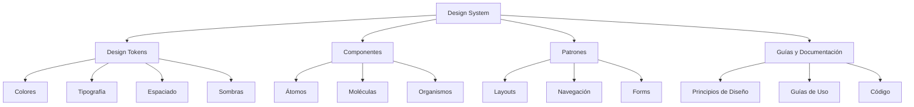

# UNIDAD 2: FUNDAMENTOS DE UI (LO VISUAL)

**Propósito de la Unidad:** Dominar los principios visuales que determinan la usabilidad y la estética en las interfaces, estableciendo las bases para la creación de sistemas de diseño coherentes y accesibles.

---

## 2.1. Fundamentos del Diseño Visual

El diseño visual en interfaces digitales trasciende la mera estética; constituye un sistema estructurado de comunicación que facilita la comprensión, reduce la carga cognitiva y guía la interacción del usuario. Los principios fundamentales del diseño visual encuentran sus raíces en teorías perceptuales, psicología cognitiva y décadas de práctica en diseño gráfico.

### 2.1.1. Principios de Gestalt Aplicados al Diseño

Los principios de Gestalt, desarrollados por psicólogos alemanes en la década de 1920, describen cómo el cerebro humano organiza elementos visuales en grupos o todos unificados. Estos principios son fundamentales para crear interfaces intuitivas y comprensibles.

**Ley de Proximidad (Law of Proximity)**

Los elementos próximos entre sí tienden a percibirse como relacionados o formando un grupo.

**Aplicación en UI:**
- Agrupar campos de formulario relacionados
- Separar secciones de contenido con espaciado
- Asociar labels con sus controles correspondientes

**Ejemplo práctico en EduConnect:**
```
INCORRECTO:
[Nombre]  [Input]
[Email]   [Input]
[Edad]    [Input]
[País]    [Input]

CORRECTO:
Información Personal
  [Nombre]  [Input]
  [Email]   [Input]

Información Demográfica
  [Edad]    [Input]
  [País]    [Input]
```

**Ley de Similitud (Law of Similarity)**

Los elementos que comparten características visuales (color, forma, tamaño, orientación) se perciben como relacionados.

**Aplicación en UI:**
- Botones primarios en mismo color
- Íconos de navegación con estilo consistente
- Tags o categorías con tratamiento visual similar

**Ejemplo en EduConnect:**
- Todos los cursos de "Programación" usan badge azul
- Todos los cursos de "Diseño" usan badge morado
- Todos los cursos de "Data" usan badge verde

**Ley de Continuidad (Law of Continuity)**

Los elementos dispuestos en línea o curva se perciben como relacionados y siguiendo un patrón.

**Aplicación en UI:**
- Flujos de progreso lineales
- Navegación horizontal
- Timelines y cronologías

**Ley de Cierre (Law of Closure)**

El cerebro completa formas incompletas basándose en información previa.

**Aplicación en UI:**
- Uso de íconos simplificados que sugieren objetos completos
- Loaders circulares con gaps
- Breadcrumbs con separadores

**Ley de Figura-Fondo (Figure-Ground)**

La capacidad de distinguir un objeto (figura) de su contexto (fondo).

**Aplicación en UI:**
- Modales que oscurecen el fondo
- Tarjetas elevadas sobre background
- Contraste entre texto y fondo

**Ley de Región Común (Law of Common Region)**

Los elementos dentro de un boundary claramente definido se perciben como grupo.

**Aplicación en UI:**
- Tarjetas de contenido (cards)
- Paneles y secciones con bordes
- Grupos de controles en contenedores

**Implementación en EduConnect:**

```
┌────────────────────────────────────────────────┐
│ CURSO RECOMENDADO PARA TI                      │
│ ┌────────────────────────────────────────────┐ │
│ │ [Imagen del curso]                         │ │
│ │                                            │ │
│ │ Introducción a UX Design                   │ │
│ │ ○○○○○ 4.8 (234 reviews)                    │ │
│ │                                            │ │
│ │ 🕐 8 horas  📊 Principiante  📱 Online    │ │
│ │                                            │ │
│ │ [Iniciar Curso]                            │ │
│ └────────────────────────────────────────────┘ │
└────────────────────────────────────────────────┘
```

Aplicación de principios Gestalt:
- **Región común:** El borde define el grupo
- **Proximidad:** Elementos relacionados agrupados
- **Similitud:** Íconos con mismo estilo visual
- **Continuidad:** Disposición vertical del contenido

### 2.1.2. Jerarquía Visual y Peso Gráfico

La jerarquía visual es el ordenamiento de elementos según su importancia, guiando la atención del usuario en secuencia intencional.

**Factores que establecen jerarquía:**

1. **Tamaño:** Elementos más grandes atraen más atención
2. **Color:** Colores brillantes o contrastantes destacan
3. **Contraste:** Diferencias tonales crean énfasis
4. **Posición:** Ubicación en el layout (esquina superior izquierda tiene primacía en culturas occidentales)
5. **Espaciado:** Más espacio alrededor = mayor importancia
6. **Tipografía:** Peso, estilo y familia afectan prominencia
7. **Forma:** Formas irregulares vs. regulares

**Peso Visual (Visual Weight)**

La fuerza de atracción visual que ejerce un elemento. Determinado por:

- **Tamaño:** Más grande = mayor peso
- **Color:** Oscuro > claro en fondos claros
- **Textura:** Texturas complejas > lisas
- **Posición:** Superior > inferior, izquierda > derecha
- **Densidad:** Áreas densas > dispersas

**Jerarquía en tres niveles:**

**Nivel 1 - Primario (Primera impresión):**
- Título principal (H1)
- CTA principal
- Imagen hero
- Objetivo: Capturar atención en <3 segundos

**Nivel 2 - Secundario (Contexto):**
- Subtítulos (H2, H3)
- Imágenes de soporte
- CTAs secundarios
- Objetivo: Proporcionar contexto y opciones

**Nivel 3 - Terciario (Detalle):**
- Texto de cuerpo
- Metadata
- Enlaces de navegación
- Objetivo: Información detallada para usuarios comprometidos

**Ejemplo aplicado a tarjeta de curso en EduConnect:**

```tex
┌─────────────────────────────────────────┐
│ INTRODUCCIÓN A PYTHON          [Nivel 1]│  ← H2, 24px, Bold
│                                         │
│ Aprende los fundamentos de     [Nivel 2]│  ← P, 16px, Regular
│ programación con Python                 │
│                                         │
│ ⭐ 4.8  👥 1,234 estudiantes  [Nivel 3]│  ← Small, 14px, Light
│ 🕐 12 horas                             │
│                                         │
│ [COMENZAR AHORA]               [Nivel 1]│  ← CTA, contraste alto
└─────────────────────────────────────────┘
```

**Principios de jerarquía efectiva:**

1. **Un punto focal dominante:** No más de 1-2 elementos de peso visual alto por pantalla
2. **Progresión lógica:** De más a menos importante
3. **Consistencia:** Mismos niveles, mismo tratamiento
4. **Contraste suficiente:** Diferencia clara entre niveles
5. **Balance:** Distribución equilibrada de peso visual

### 2.1.3. Balance, Contraste y Énfasis

**Balance (Equilibrio)**

Distribución del peso visual para crear estabilidad compositiva.

**Tipos de balance:**

1. **Balance Simétrico:**
   - Elementos equidistantes de un eje central
   - Crea sensación formal, estable, tradicional
   - Ejemplo: Modal centrado con contenido simétrico

2. **Balance Asimétrico:**
   - Pesos visuales diferentes equilibrados por posición
   - Más dinámico, moderno, interesante
   - Ejemplo: Imagen grande a la izquierda + texto a la derecha

3. **Balance Radial:**
   - Elementos irradian desde punto central
   - Ejemplo: Gráficos circulares, menús radiales

4. **Balance Mosaic/Crystallographic:**
   - Elementos distribuidos sin punto focal obvio
   - Ejemplo: Grids de Pinterest, galerías de imágenes

**Balance en EduConnect Dashboard:**

```
┌───────────────────────────────────────────────────────┐
│  [Logo]           EduConnect            [Perfil] [🔔] │
├───────────────────────────────────────────────────────┤
│                                                       │
│  ┌──────────────┐  ┌──────────────────────────────┐   │
│  │  SIDEBAR     │  │  CONTENIDO PRINCIPAL         │   │
│  │  (Peso: 20%) │  │  (Peso: 80%)                 │   │
│  │              │  │                              │   │
│  │  Navegación  │  │  Cards de cursos en grid     │   │
│  │  principal   │  │                              │   │
│  └──────────────┘  └──────────────────────────────┘   │
│                                                       │
└───────────────────────────────────────────────────────┘
```

Balance asimétrico: Sidebar estrecho + contenido ancho = equilibrio funcional.

**Contraste**

Diferencia entre elementos que los hace distinguibles.

**Tipos de contraste:**

1. **Contraste de Valor (Light/Dark):**
   - Texto oscuro sobre fondo claro (o viceversa)
   - Ratio mínimo 4.5:1 para texto normal (WCAG AA)

2. **Contraste de Color:**
   - Colores complementarios
   - Saturación vs. desaturación

3. **Contraste de Tamaño:**
   - Tipografía grande vs. pequeña
   - Elementos prominentes vs. sutiles

4. **Contraste de Forma:**
   - Orgánico vs. geométrico
   - Redondeado vs. angular

5. **Contraste de Textura:**
   - Liso vs. rugoso
   - Plano vs. con patrón

**Aplicación de contraste en UI:**

- **Interacción:** Estados default vs. hover deben contrastar claramente
- **Jerarquía:** Títulos vs. texto de cuerpo
- **Funcionalidad:** Botones primarios vs. secundarios
- **Comunicación:** Estados de éxito (verde) vs. error (rojo)

**Énfasis**

Hacer que elementos importantes destaquen.

**Técnicas de énfasis:**

1. **Aislamiento:** Espacio negativo alrededor de elemento
2. **Color:** Único elemento en color sobre escala de grises
3. **Tamaño:** Significativamente más grande que elementos circundantes
4. **Posición:** Colocación estratégica (center stage)
5. **Movimiento:** Animación o microinteracción
6. **Forma:** Diferente de elementos circundantes

**Ejemplo de énfasis en CTA de EduConnect:**

```
┌────────────────────────────────────────┐
│                                        │
│        Completa tu perfil para         │
│        recomendaciones personalizadas  │
│                                        │
│                                        │
│        ┌──────────────────────┐        │  ← Aislamiento
│        │  COMPLETAR PERFIL    │        │  ← Tamaño grande
│        └──────────────────────┘        │  ← Color contrastante
│                                        │
│             [omitir por ahora]         │  ← Secundario, sutil
│                                        │
└────────────────────────────────────────┘
```

### 2.1.4. Espaciado, Proporción y Ritmo Visual

**Espaciado (Whitespace/Negative Space)**

El espacio vacío entre elementos no es "desperdiciado"; es un elemento de diseño activo.

**Funciones del espaciado:**

1. **Agrupación:** Crear relaciones visuales
2. **Respiración:** Prevenir sensación de saturación
3. **Enfoque:** Dirigir atención
4. **Legibilidad:** Facilitar lectura y escaneo
5. **Elegancia:** Sensación premium, sofisticada

**Tipos de espaciado:**

- **Micro whitespace:** Entre letras, líneas, pequeños elementos (2-8px)
- **Macro whitespace:** Entre secciones mayores, márgenes (16-64px+)

**Sistema de espaciado consistente (8pt Grid System):**

Múltiplos de 8 para espaciado y dimensionamiento:
- 8px: Micro espaciado (padding interno)
- 16px: Espaciado estándar entre elementos
- 24px: Espaciado entre grupos relacionados
- 32px: Espaciado entre secciones
- 48px+: Márgenes principales

**Beneficios del 8pt grid:**
- Consistencia visual
- Facilita responsive design (divisible por 2)
- Alineación precisa
- Escalabilidad matemática

**Ejemplo de espaciado en componente de EduConnect:**

```
┌────────────────────────────────────┐
│ [32px padding top]                 │
│                                    │
│ [Título del curso]                 │
│ [8px]                              │
│ [Descripción del curso]            │
│ [16px]                             │
│ [Metadata: duración, nivel]        │
│ [24px]                             │
│ ┌──────────────────────────────┐   │
│ │ [CTA: Inscribirse]           │   │
│ │ [16px padding interno]       │   │
│ └──────────────────────────────┘   │
│ [32px padding bottom]              │
└────────────────────────────────────┘
```

**Proporción (Scale & Proportion)**

Relación de tamaño entre elementos.

**Proporción Áurea (Golden Ratio: 1:1.618):**

Proporción matemática encontrada en naturaleza, asociada con belleza estética.

**Aplicación en UI:**
- Relación entre sidebar y contenido principal (1:1.6)
- Escala tipográfica
- Dimensiones de tarjetas/cards

**Escalas Tipográficas:**

Progresión matemática de tamaños de texto.

**Escala Mayor Segunda (1.125):**
- 12px → 13.5px → 15.19px → 17.09px → 19.22px → 21.62px

**Escala Tercera Mayor (1.25):**
- 12px → 15px → 18.75px → 23.44px → 29.3px → 36.62px

**Escala Cuarta Perfecta (1.333):**
- 12px → 16px → 21.28px → 28.37px → 37.82px → 50.41px

**Implementación en EduConnect:**

```
H1 (Título Principal): 48px (ratio 1.5)
H2 (Subtítulo Mayor): 32px (ratio 1.33)
H3 (Subtítulo Menor): 24px (ratio 1.33)
Body Large: 18px (ratio 1.125)
Body: 16px (base)
Small: 14px (ratio 0.875)
Caption: 12px (ratio 0.75)
```

**Ritmo Visual**

Patrón de repetición que crea sensación de movimiento y cohesión.

**Tipos de ritmo:**

1. **Regular:** Repetición constante (grid uniforme)
2. **Progresivo:** Incremento/decremento gradual (escala tipográfica)
3. **Fluido:** Curvatura y ondulación
4. **Alternante:** Patrón A-B-A-B

**Ritmo en lista de cursos de EduConnect:**

```
[Card Curso 1]
[16px spacing]
[Card Curso 2]
[16px spacing]
[Card Curso 3]
[16px spacing]
[Card Curso 4]
...
```

Ritmo regular crea previsibilidad y facilita escaneo.

### 2.1.5. Leyes Fundamentales del Diseño

**Ley de Prägnanz (Ley de la Simplicidad)**

Las personas perciben e interpretan imágenes ambiguas de la manera más simple posible.

**Aplicación:**
- Interfaces minimalistas
- Íconos simples y reconocibles
- Reducción de elementos decorativos innecesarios

**Ley de la Similitud de Destino Común**

Los elementos que se mueven en la misma dirección se perciben como relacionados.

**Aplicación:**
- Animaciones coordinadas
- Transiciones de página
- Scroll parallax

**Ley de Simetría y Orden**

Las personas perciben objetos simétricos como pertenecientes juntos.

**Aplicación:**
- Layouts centrados
- Iconografía balanceada
- Composiciones espejadas

---

## 2.2. Teoría del Color

El color es uno de los elementos más poderosos del diseño visual. Más allá de la estética, el color comunica significado, evoca emociones, establece jerarquía, mejora usabilidad y refuerza identidad de marca.

### 2.2.1. Modelos de Color: RGB, HSL, HSB

**RGB (Red, Green, Blue)**

Modelo aditivo basado en luz, utilizado en pantallas digitales.

**Características:**
- Combinación de luz roja, verde y azul
- Valores de 0-255 para cada canal
- Total: 16,777,216 colores posibles (256³)
- 0,0,0 = Negro | 255,255,255 = Blanco

**Ventajas:**
- Estándar en diseño digital
- Representación directa de píxeles en pantalla

**Desventajas:**
- No intuitivo para diseñadores
- Difícil predecir resultado de mezclas

**Ejemplo:**
```
Azul EduConnect: RGB(41, 98, 255)
Verde Éxito: RGB(16, 185, 129)
Rojo Error: RGB(239, 68, 68)
```

**HSL (Hue, Saturation, Lightness)**

Modelo cilíndrico más intuitivo para diseñadores.

**Componentes:**
1. **Hue (Matiz):** Posición en rueda de color (0-360°)
   - 0° = Rojo
   - 120° = Verde
   - 240° = Azul

2. **Saturation (Saturación):** Intensidad del color (0-100%)
   - 0% = Gris
   - 100% = Color puro

3. **Lightness (Luminosidad):** Cantidad de luz (0-100%)
   - 0% = Negro
   - 50% = Color puro
   - 100% = Blanco

**Ventajas:**
- Intuitivo y predecible
- Fácil crear variaciones
- Control independiente de características

**Ejemplo de paleta en HSL:**
```
Azul Base: HSL(224°, 100%, 58%)
Azul Claro: HSL(224°, 100%, 75%)  ← Misma matiz, mayor luminosidad
Azul Oscuro: HSL(224°, 100%, 40%) ← Misma matiz, menor luminosidad
```

**HSB/HSV (Hue, Saturation, Brightness/Value)**

Similar a HSL pero usa Brightness en lugar de Lightness.

**Diferencia clave:**
- HSL: 50% lightness = color puro
- HSB: 100% brightness = color puro

**Conversión entre modelos:**

```
RGB → HSL:
1. Normalizar RGB (dividir por 255)
2. Identificar max y min valores
3. Calcular lightness: L = (max + min) / 2
4. Calcular saturation y hue mediante fórmulas

HSL → RGB:
1. Calcular chroma: C = (1 - |2L - 1|) × S
2. Calcular componentes intermedios
3. Ajustar por lightness
```

**Herramientas para conversión:**
- Calculadoras online
- DevTools del navegador
- Plugins de Figma/Sketch

### 2.2.2. Psicología del Color y Significados Culturales

El color tiene asociaciones psicológicas y culturales que influyen en percepción y comportamiento.

**Rojo**

**Asociaciones Psicológicas:**
- Energía, pasión, urgencia
- Peligro, advertencia, error
- Excitación, estimulación

**Aplicaciones UI:**
- Botones de acción crítica (eliminar, cancelar)
- Notificaciones de error
- Indicadores de alerta
- CTAs de urgencia ("Oferta termina hoy")

**Consideraciones Culturales:**
- Occidente: Peligro, amor
- China: Suerte, celebración
- Sudáfrica: Color de luto

**Naranja**

**Asociaciones:**
- Entusiasmo, creatividad
- Amigable, accesible
- Llamativo sin agresividad del rojo

**Aplicaciones UI:**
- CTAs amigables
- Notificaciones de advertencia (menos críticas que error)
- Elementos de gamificación

**Amarillo**

**Asociaciones:**
- Optimismo, felicidad
- Atención, precaución
- Energía joven

**Aplicaciones UI:**
- Highlights y resaltados
- Tooltips informativos
- Alertas de advertencia

**Precaución:**
- Bajo contraste sobre blanco (problemas de accesibilidad)
- Puede generar fatiga visual en exceso

**Verde**

**Asociaciones:**
- Éxito, confirmación
- Crecimiento, naturaleza
- Seguridad, armonía

**Aplicaciones UI:**
- Confirmaciones de éxito
- Indicadores de progreso positivo
- Botones de acción positiva ("Confirmar", "Aceptar")

**Verde en EduConnect:**
```
Verde Éxito: HSL(158°, 64%, 52%)
Uso: "Curso completado", "Respuesta correcta", "Guardado exitosamente"
```

**Azul**

**Asociaciones:**
- Confianza, estabilidad
- Profesionalismo, tecnología
- Calma, serenidad

**Aplicaciones UI:**
- Color corporativo predominante
- Links y elementos interactivos (convención web)
- Aplicaciones financieras, médicas, tecnológicas

**Razón de predominancia:**
- Color favorito global (~40% de personas)
- No tiene connotaciones negativas fuertes
- Alta accesibilidad en variaciones

**Azul en EduConnect:**
```
Azul Principal: HSL(224°, 100%, 58%)
Uso: Branding, CTAs primarios, links, navegación principal
```

**Morado**

**Asociaciones:**
- Creatividad, imaginación
- Lujo, sofisticación
- Espiritualidad, misterio

**Aplicaciones UI:**
- Productos creativos/premium
- Elementos de gamificación (logros especiales)
- Diferenciación de marca

**Morado en EduConnect:**
```
Morado Diseño: HSL(270°, 70%, 60%)
Uso: Categoría "Diseño y Creatividad", badges premium
```

**Rosa**

**Asociaciones:**
- Romance, dulzura
- Creatividad, juventud
- Compasión

**Aplicaciones UI:**
- Productos dirigidos a audiencia femenina (estereotipo a considerar)
- Elementos lúdicos
- Notificaciones positivas suaves

**Gris**

**Asociaciones:**
- Neutralidad, balance
- Profesionalismo, formalidad
- Modernidad, minimalismo

**Aplicaciones UI:**
- Texto de cuerpo
- Backgrounds
- Elementos secundarios
- Estados deshabilitados

**Sistema de grises en EduConnect:**
```
Gray 900 (Texto principal): HSL(0°, 0%, 13%)
Gray 700 (Texto secundario): HSL(0°, 0%, 32%)
Gray 500 (Borders, dividers): HSL(0°, 0%, 62%)
Gray 300 (Backgrounds sutiles): HSL(0°, 0%, 83%)
Gray 100 (Backgrounds claros): HSL(0°, 0%, 96%)
```

**Blanco y Negro**

**Blanco:**
- Pureza, limpieza
- Minimalismo, simplicidad
- Espacio, apertura

**Negro:**
- Elegancia, sofisticación
- Poder, autoridad
- Lujo, premium

**Aplicaciones UI:**
- Blanco: Backgrounds principales, crear respiración
- Negro: Texto de alto contraste, acentos dramáticos

**Consideraciones Culturales Críticas:**

| Color | Occidente | China | India | Medio Oriente |
|-------|-----------|-------|-------|---------------|
| Rojo | Peligro/Pasión | Suerte, felicidad | Pureza, fertilidad | Peligro |
| Blanco | Pureza, boda | Luto, muerte | Paz | Pureza |
| Negro | Luto, elegancia | Estabilidad | Mal | Misterio |
| Amarillo | Felicidad | Imperial, sagrado | Conocimiento | Prosperidad |

**Recomendación para productos globales:**
- Investigar audiencia objetivo
- Ofrecer temas personalizables cuando sea posible
- Usar color funcionalmente (verde=éxito) respetando convenciones internacionales UI

### 2.2.3. Armonías Cromáticas

Las armonías cromáticas son combinaciones de colores basadas en relaciones matemáticas en la rueda de color que crean conjuntos visualmente cohesivos.

**Rueda de Color (Color Wheel):**

```
        Amarillo (60°)
            |
    YG      |      YO
            |
Verde ------+------ Naranja
(120°)      |       (30°)
    GC      |      RO
            |
    Cian ---+--- Rojo (0°/360°)
    (180°)  |     
       BC   |   RM
            |
        Azul ---- Magenta
       (240°)    (300°)
```

**1. Monocromática (Monochromatic)**

Variaciones de un solo matiz cambiando saturación y luminosidad.

**Ventajas:**
- Extremadamente cohesiva
- Fácil de implementar
- Sensación armoniosa y sofisticada

**Desventajas:**
- Puede ser monótona
- Difícil crear suficiente contraste

**Aplicación:**
```
Base: Azul HSL(224°, 100%, 58%)

Variaciones:
Muy Claro: HSL(224°, 100%, 95%) - Backgrounds
Claro: HSL(224°, 100%, 75%) - Hover states
Base: HSL(224°, 100%, 58%) - Primario
Oscuro: HSL(224°, 90%, 40%) - Hover primario
Muy Oscuro: HSL(224°, 85%, 25%) - Texto sobre azul
```

**2. Análoga (Analogous)**

3-5 colores adyacentes en la rueda (separados por 30°).

**Ejemplo:**
```
Azul: 240°
Azul-Cian: 210°
Cian: 180°
```

**Ventajas:**
- Armoniosa y placentera
- Versatilidad manteniendo cohesión
- Natural (común en naturaleza)

**Desventajas:**
- Falta de contraste fuerte
- Puede necesitar neutral para balance

**Aplicación en EduConnect:**
```
Primario (Azul): HSL(224°, 100%, 58%)
Secundario (Azul-Violeta): HSL(254°, 90%, 60%)
Terciario (Azul-Cian): HSL(194°, 85%, 55%)
```

**3. Complementaria (Complementary)**

Dos colores opuestos en la rueda (180° de separación).

**Ejemplo:**
```
Azul (240°) ↔ Naranja (60°)
Rojo (0°) ↔ Cian (180°)
```

**Ventajas:**
- Máximo contraste visual
- Vibrante y energético
- Ideal para CTAs que deben destacar

**Desventajas:**
- Puede ser demasiado intenso
- Difícil de equilibrar (ratio 60-30-10)

**Aplicación:**
```
Primario (Azul): HSL(224°, 100%, 58%)
Acento Complementario (Naranja): HSL(44°, 100%, 58%)

Uso: Azul para interfaz general, Naranja para CTAs críticos
```

**4. Complementaria Dividida (Split-Complementary)**

Un color base + los dos colores adyacentes a su complementario.

**Ejemplo:**
```
Base: Azul (240°)
Complementarios divididos:
  - Amarillo-Naranja (50°)
  - Rojo-Naranja (10°)
```

**Ventajas:**
- Contraste fuerte pero más sofisticado que complementaria
- Tres colores proporcionan más versatilidad
- Menos tensión visual que complementaria pura

**5. Tríada (Triadic)**

Tres colores equidistantes en la rueda (120° de separación).

**Ejemplo:**
```
Primario: Azul (240°)
Secundario: Rojo (0°)
Terciario: Amarillo (120°)
```

**Ventajas:**
- Vibrante y balanceada
- Versatilidad de tres colores distintos

**Desventajas:**
- Difícil de armonizar sin experiencia
- Puede parecer infantil si todos son saturados

**Recomendación:** Usar un color dominante (60%), otro secundario (30%), y el tercero como acento (10%).

**6. Tetrádica/Doble Complementaria (Tetradic)**

Dos pares de colores complementarios.

**Ejemplo:**
```
Par 1: Azul (240°) - Naranja (60°)
Par 2: Verde (120°) - Rojo (0°)
```

**Ventajas:**
- Rica en variedad
- Múltiples opciones de contraste

**Desventajas:**
- Muy compleja de balancear
- Fácilmente puede parecer caótica

**Recomendación para EduConnect:**

**Paleta Principal (Análoga + Complementaria):**

```
┌─────────────────────────────────────────┐
│ COLORES PRIMARIOS (Análogos)            │
├─────────────────────────────────────────┤
│ Azul Principal: HSL(224°, 100%, 58%)    │ → Branding, navegación
│ Azul-Violeta: HSL(254°, 90%, 60%)       │ → Categoría Diseño
│ Azul-Cian: HSL(194°, 85%, 55%)          │ → Categoría Data
│                                         │
├─────────────────────────────────────────┤
│ ACENTOS COMPLEMENTARIOS                 │
├─────────────────────────────────────────┤
│ Naranja: HSL(44°, 100%, 58%)            │ → CTAs críticos
│ Amarillo: HSL(54°, 95%, 65%)            │ → Warnings
│                                         │
├─────────────────────────────────────────┤
│ SEMÁNTICOS                              │
├─────────────────────────────────────────┤
│ Verde: HSL(158°, 64%, 52%)              │ → Éxito
│ Rojo: HSL(4°, 84%, 60%)                 │ → Error
└─────────────────────────────────────────┘
```

### 2.2.4. Paletas de Color Funcionales

Una paleta funcional trasciende la estética; debe soportar todos los casos de uso de una interfaz.

**Estructura de Paleta Completa:**

**1. Colores de Marca (Brand Colors):**
- Primario (60% del uso)
- Secundario (30% del uso)
- Acento (10% del uso)

**2. Colores Semánticos (Semantic Colors):**
- Success (verde)
- Warning (amarillo/naranja)
- Error (rojo)
- Info (azul claro)

**3. Escala de Grises:**
- 9-11 valores de negro a blanco
- Texto, borders, backgrounds

**4. Variaciones Tonales:**
- 5-9 shades por color principal
- Hover states, backgrounds, tints

**Sistema de Nomenclatura:**

```
[color]-[valor]

Ejemplos:
blue-50   (más claro)
blue-100
blue-200
...
blue-500  (base)
...
blue-900  (más oscuro)
```

**Paleta Completa de EduConnect:**

```css
/* PRIMARIOS */
--blue-50: hsl(224, 100%, 97%);   /* Backgrounds sutiles */
--blue-100: hsl(224, 100%, 92%);  
--blue-200: hsl(224, 100%, 84%);  
--blue-300: hsl(224, 100%, 75%);  /* Hover backgrounds */
--blue-400: hsl(224, 100%, 66%);  
--blue-500: hsl(224, 100%, 58%);  /* BASE - Primario */
--blue-600: hsl(224, 90%, 48%);   /* Hover primario */
--blue-700: hsl(224, 85%, 38%);   
--blue-800: hsl(224, 80%, 28%);   
--blue-900: hsl(224, 75%, 20%);   /* Texto sobre azul claro */

/* GRISES */
--gray-50: hsl(0, 0%, 98%);
--gray-100: hsl(0, 0%, 96%);      /* Backgrounds */
--gray-200: hsl(0, 0%, 90%);
--gray-300: hsl(0, 0%, 83%);      /* Borders */
--gray-400: hsl(0, 0%, 68%);
--gray-500: hsl(0, 0%, 62%);      /* Placeholders */
--gray-600: hsl(0, 0%, 46%);
--gray-700: hsl(0, 0%, 32%);      /* Texto secundario */
--gray-800: hsl(0, 0%, 20%);
--gray-900: hsl(0, 0%, 13%);      /* Texto principal */

/* SEMÁNTICOS */
--success-50: hsl(158, 64%, 97%);
--success-500: hsl(158, 64%, 52%);  /* Base éxito */
--success-700: hsl(158, 64%, 38%);

--error-50: hsl(4, 84%, 97%);
--error-500: hsl(4, 84%, 60%);      /* Base error */
--error-700: hsl(4, 84%, 45%);

--warning-50: hsl(54, 95%, 95%);
--warning-500: hsl(54, 95%, 65%);   /* Base warning */
--warning-700: hsl(54, 95%, 48%);

--info-50: hsl(194, 85%, 95%);
--info-500: hsl(194, 85%, 55%);     /* Base info */
--info-700: hsl(194, 85%, 40%);
```

**Reglas de Uso:**

1. **Texto sobre backgrounds:**
   - Texto principal: gray-900
   - Texto secundario: gray-700
   - Texto terciario: gray-500
   - Texto deshabilitado: gray-400

2. **Backgrounds:**
   - Página principal: white o gray-50
   - Secciones alternadas: gray-100
   - Cards elevados: white con shadow

3. **Bordes:**
   - Divisores sutiles: gray-200
   - Bordes inputs: gray-300
   - Bordes focus: blue-500

4. **Estados interactivos:**
   - Default: color-500
   - Hover: color-600
   - Active/Pressed: color-700
   - Disabled: gray-300

### 2.2.5. Color y Accesibilidad (Ratios de Contraste WCAG)

La accesibilidad cromática asegura que usuarios con diferentes capacidades visuales puedan percibir y usar interfaces.

**Web Content Accessibility Guidelines (WCAG 2.1):**

**Criterio 1.4.3 - Contraste Mínimo (Nivel AA):**

La relación de contraste entre texto y fondo debe ser al menos:
- **4.5:1** para texto normal (< 18pt o < 14pt bold)
- **3:1** para texto grande (≥ 18pt o ≥ 14pt bold)

**Criterio 1.4.6 - Contraste Mejorado (Nivel AAA):**
- **7:1** para texto normal
- **4.5:1** para texto grande

**Criterio 1.4.11 - Contraste No-Textual (Nivel AA):**
- **3:1** para componentes UI (bordes de inputs, íconos, gráficos)

**Cálculo de Ratio de Contraste:**

```
Luminosidad Relativa (L):
Para RGB normalizado (0-1):
  Si C ≤ 0.03928: C/12.92
  Si C > 0.03928: ((C+0.055)/1.055)^2.4

L = 0.2126*R + 0.7152*G + 0.0722*B

Ratio de Contraste:
(L_lighter + 0.05) / (L_darker + 0.05)

Rango: 1:1 (sin contraste) a 21:1 (máximo contraste)
```

**Ejemplos de Ratios:**

```
Blanco (#FFFFFF) sobre Negro (#000000): 21:1 ✓ AAA
Azul EduConnect (#2962FF) sobre Blanco: 5.1:1 ✓ AA (texto normal)
Gris 700 (#525252) sobre Blanco: 4.6:1 ✓ AA (texto normal)
Gris 500 (#9E9E9E) sobre Blanco: 2.4:1 ✗ FALLA
```

**Validación en EduConnect:**

| Combinación | Ratio | WCAG AA | WCAG AAA |
|-------------|-------|---------|----------|
| gray-900 / white | 15.8:1 | ✓ Pasa | ✓ Pasa |
| gray-700 / white | 7.2:1 | ✓ Pasa | ✓ Pasa |
| gray-600 / white | 4.7:1 | ✓ Pasa | ✗ Falla |
| blue-500 / white | 5.1:1 | ✓ Pasa | ✗ Falla |
| blue-600 / white | 7.3:1 | ✓ Pasa | ✓ Pasa |
| success-500 / white | 3.5:1 | ✗ Falla texto normal | - |
| success-700 / white | 5.9:1 | ✓ Pasa | ✗ Falla |

**Correcciones necesarias:**

```css
/* ANTES (falla accesibilidad) */
.text-secondary {
  color: var(--gray-500); /* Ratio 2.9:1 */
}

/* DESPUÉS (cumple AA) */
.text-secondary {
  color: var(--gray-600); /* Ratio 4.7:1 */
}
```

**Consideraciones Adicionales:**

**1. No depender solo de color:**

```
X INCORRECTO:
Campo con error: Solo borde rojo

✓ CORRECTO:
Campo con error: Borde rojo + ícono + mensaje texto
```

**2. Estados de foco visibles:**

```css
/* Visible focus indicator */
.button:focus {
  outline: 2px solid var(--blue-500);
  outline-offset: 2px;
}
```

**3. Links distinguibles:**

```css
/* No confiar solo en color para links */
.link {
  color: var(--blue-600);
  text-decoration: underline; /* Crítico para accesibilidad */
}
```

**Herramientas de Verificación:**

1. **WebAIM Contrast Checker:** webaim.org/resources/contrastchecker/
2. **Contrast Ratio:** contrast-ratio.com
3. **Chrome DevTools:** Audits > Accessibility
4. **Figma Plugins:** Stark, Contrast
5. **Color Oracle:** Simulador de daltonismo

**Tipos de Daltonismo:**

- **Protanopia:** Deficiencia de rojo (~1% hombres)
- **Deuteranopia:** Deficiencia de verde (~1% hombres)
- **Tritanopia:** Deficiencia de azul (raro, ~0.001%)
- **Acromatopsia:** Visión monocromática (muy raro)

**Estrategias para daltonismo:**

1. Usar patrones además de color
2. Suficiente contraste de luminosidad (no solo color)
3. Evitar rojo/verde como único diferenciador
4. Testear con simuladores
5. Permitir temas de alto contraste

---

## 2.3. Tipografía y Legibilidad

La tipografía es la columna vertebral de la comunicación en interfaces digitales. El 95% del contenido web es texto, haciendo que las decisiones tipográficas sean críticas para usabilidad y experiencia.

### 2.3.1. Anatomía Tipográfica

Comprender la estructura de las letras permite tomar decisiones informadas sobre selección y uso tipográfico.

**Componentes Principales:**

```
     ┌── Cap Height ──┐
     │                │
     │    ALTURA      │  ← Altura de mayúsculas
     │                │
  ───┼────────────────┼─── Baseline (línea base)
     │    altura x    │
     │                │  ← Altura de minúsculas sin ascendentes
  ───┼────────────────┼─── x-height
     │                │
     └── Descender ───┘  ← Partes que bajan (g, p, q, y)

  Ascender: Partes que suben (h, l, k, b)
  Descender: Partes que bajan (g, j, p, q, y)
```

**Términos Anatómicos:**

1. **Baseline:** Línea sobre la que se asientan las letras
2. **Cap Height:** Altura de las letras mayúsculas
3. **x-height:** Altura de letras minúsculas sin ascendentes (como "x")
4. **Ascender:** Parte que se extiende sobre x-height (h, b, l)
5. **Descender:** Parte que se extiende bajo baseline (p, g, y)
6. **Bowl:** Parte curva cerrada (b, d, o, p)
7. **Counter:** Espacio blanco dentro de letras (o, e, a)
8. **Stem:** Trazo vertical principal
9. **Serif:** Remate decorativo en extremos de trazos
10. **Sans-serif:** Sin remates
11. **Aperture:** Abertura de letras parcialmente cerradas (c, e)
12. **Axis:** Ángulo de estrés en trazos curvos
13. **Terminal:** Extremo de trazo sin serif
14. **Ligature:** Dos o más letras combinadas (fi, fl)

**x-height y Legibilidad:**

Fuentes con mayor x-height (relativo a cap height) son generalmente más legibles en pantalla:

```
Fuente A (x-height bajo):  ALTURA  ← Cap height grande
                           altura  ← x-height pequeña

Fuente B (x-height alto):  ALTURA  ← Cap height moderada
                           altura  ← x-height grande
```

Fuente B será más legible en tamaños pequeños.

### 2.3.2. Clasificación de Fuentes y Selección Tipográfica

**Clasificación Principal:**

**1. Serif (Con Remates)**

Características:
- Remates en extremos de trazos
- Eje generalmente inclinado
- Contraste entre trazos gruesos y finos

Subcategorías:
- **Old Style:** Garamond, Caslon (contraste moderado, eje inclinado)
- **Transitional:** Times New Roman, Baskerville (mayor contraste)
- **Modern/Didone:** Bodoni, Didot (alto contraste, eje vertical)
- **Slab Serif:** Rockwell, Courier (serifs gruesos, bajo contraste)

Uso apropiado:
- Texto largo impreso (mejor legibilidad en papel)
- Sensación tradicional, formal, establecida
- Contenido editorial, publicaciones

Ejemplos digitales: Georgia, Merriweather, Lora

**2. Sans-Serif (Sin Remates)**

Características:
- Sin decoración en extremos
- Generalmente sin contraste de trazo
- Formas más simples

Subcategorías:
- **Grotesque:** Franklin Gothic (formas cuadradas)
- **Neo-Grotesque:** Helvetica, Arial (neutral, funcional)
- **Humanist:** Gill Sans, Open Sans (variación orgánica)
- **Geometric:** Futura, Gotham (basadas en formas geométricas)

Uso apropiado:
- Interfaces digitales (mejor legibilidad en pantalla)
- Sensación moderna, limpia, profesional
- Señalética, navegación

Ejemplos digitales: Inter, Roboto, SF Pro, Segoe UI

**3. Monospace (Ancho Fijo)**

Características:
- Todos los caracteres ocupan mismo ancho
- Alineación vertical predecible

Uso apropiado:
- Código fuente
- Datos tabulares
- Terminales, consolas

Ejemplos: Courier, Consolas, Fira Code, JetBrains Mono

**4. Display/Decorative**

Características:
- Diseñadas para títulos grandes
- Alta personalidad, menos legibilidad
- No apropiadas para texto largo

Uso apropiado:
- Headers de alto impacto
- Branding distintivo
- Uso limitado y estratégico

**5. Script/Handwriting**

Características:
- Simulan escritura a mano
- Conectadas o sueltas
- Difícil legibilidad en digital

Uso apropiado:
- Muy limitado en UI
- Elementos decorativos
- Evitar en navegación o texto de cuerpo

**Criterios de Selección para Interfaces:**

**1. Legibilidad:**
- x-height generoso
- Counters abiertos (espacios internos)
- Diferenciación clara entre caracteres similares (I, l, 1)

```
Test de diferenciación:
Il1O0 - ¿Puedes distinguir fácilmente cada carácter?
```

**2. Versatilidad:**
- Múltiples pesos (Light, Regular, Medium, Bold, etc.)
- Soporte de cursivas
- Caracteres especiales y diacríticos

**3. Performance:**
- Tamaño de archivo razonable
- Variable fonts (opcional pero ideal)
- Subsets optimizados

**4. Licenciamiento:**
- Uso web permitido
- Costo vs. presupuesto
- Alternativas open-source

**Google Fonts Recomendadas (Gratuitas):**

```
Sans-Serif:
- Inter: Moderna, optimizada para UI, variable font
- Roboto: Amigable, versátil, familia extensa
- Open Sans: Neutral, altamente legible
- Nunito: Redondeada, amigable
- Work Sans: Moderna, geométrica

Serif:
- Merriweather: Legible en pantalla
- Lora: Contraste moderado, versátil
- Crimson Text: Editorial, elegante

Monospace:
- Roboto Mono: Moderna, limpia
- Fira Code: Con ligatures para código
- JetBrains Mono: Optimizada para programación
```

**Selección para EduConnect:**

```
Fuente Principal (UI):
  Inter (Google Fonts)
  - Variable font (flexibilidad de pesos)
  - Excelente legibilidad en pantalla
  - x-height generoso
  - Neutro pero con carácter
  - Soporta múltiples idiomas

Fuente Secundaria (Contenido Editorial):
  Merriweather (Google Fonts)
  - Para artículos largos, blogs
  - Mayor legibilidad en texto extenso
  - Contraste con Inter

Fuente Código (Snippets técnicos):
  Fira Code
  - Ligatures para operadores
  - Optimizada para código
```

### 2.3.3. Jerarquía Tipográfica y Escalas Modulares

La jerarquía tipográfica establece niveles de importancia visual a través de variaciones de tamaño, peso, color y espaciado.

**Elementos de Jerarquía:**

1. **Tamaño (Size)**
2. **Peso (Weight):** Light (300), Regular (400), Medium (500), Bold (700)
3. **Color/Contraste**
4. **Espaciado:** Letter-spacing, line-height
5. **Caso:** UPPERCASE, Sentence case, Title Case

**Escala Tipográfica Modular:**

Progresión matemática de tamaños basada en un ratio.

**Ratios Comunes:**

```
Minor Second: 1.067
Major Second: 1.125
Minor Third: 1.200
Major Third: 1.250
Perfect Fourth: 1.333
Golden Ratio: 1.618
```

**Escala Tipográfica de EduConnect (Ratio 1.250 - Major Third):**

```
Base: 16px (1rem)

Escala hacia arriba:
16px × 1.25 = 20px
20px × 1.25 = 25px
25px × 1.25 = 31.25px ≈ 32px
32px × 1.25 = 40px
40px × 1.25 = 50px
50px × 1.25 = 62.5px ≈ 64px

Escala hacia abajo:
16px ÷ 1.25 = 12.8px ≈ 13px
13px ÷ 1.25 = 10.4px ≈ 10px
```

**Sistema Tipográfico Completo:**

```css
/* EduConnect Typography System */

/* DISPLAY - Para landing pages, headlines impactantes */
.text-display-lg {
  font-size: 64px;
  font-weight: 700;
  line-height: 1.1;
  letter-spacing: -0.02em;
}

.text-display-md {
  font-size: 50px;
  font-weight: 700;
  line-height: 1.15;
  letter-spacing: -0.01em;
}

.text-display-sm {
  font-size: 40px;
  font-weight: 700;
  line-height: 1.2;
}

/* HEADINGS - Para secciones y jerarquía de contenido */
.text-h1 {
  font-size: 32px;
  font-weight: 700;
  line-height: 1.25;
}

.text-h2 {
  font-size: 25px;
  font-weight: 600;
  line-height: 1.3;
}

.text-h3 {
  font-size: 20px;
  font-weight: 600;
  line-height: 1.4;
}

.text-h4 {
  font-size: 18px;
  font-weight: 600;
  line-height: 1.4;
}

/* BODY - Para texto de contenido */
.text-body-lg {
  font-size: 18px;
  font-weight: 400;
  line-height: 1.6;
}

.text-body {
  font-size: 16px;      /* BASE */
  font-weight: 400;
  line-height: 1.5;
}

.text-body-sm {
  font-size: 14px;
  font-weight: 400;
  line-height: 1.5;
}

/* SUPPORTING - Para metadata, captions */
.text-caption {
  font-size: 13px;
  font-weight: 400;
  line-height: 1.4;
  color: var(--gray-600);
}

.text-overline {
  font-size: 12px;
  font-weight: 600;
  line-height: 1.5;
  text-transform: uppercase;
  letter-spacing: 0.08em;
  color: var(--gray-700);
}

/* INTERACTIVE - Para botones, links */
.text-button {
  font-size: 16px;
  font-weight: 600;
  line-height: 1;
  letter-spacing: 0.01em;
}

.text-link {
  font-size: inherit;
  font-weight: 500;
  color: var(--blue-600);
  text-decoration: underline;
}
```

**Aplicación de Jerarquía:**

```html
<!-- Página de Curso en EduConnect -->
<article>
  <!-- Nivel 1: Título Principal -->
  <h1 class="text-h1">Introducción al Diseño UX</h1>
  
  <!-- Nivel 2: Metadata -->
  <div class="text-caption">
    8 horas · Principiante · 1,234 estudiantes
  </div>
  
  <!-- Nivel 3: Secciones -->
  <h2 class="text-h2">Qué aprenderás</h2>
  
  <!-- Nivel 4: Contenido -->
  <p class="text-body">
    Este curso te introducirá a los fundamentos del diseño
    de experiencia de usuario...
  </p>
  
  <!-- Nivel 5: Subsecciones -->
  <h3 class="text-h3">Módulo 1: Fundamentos</h3>
  
  <!-- Nivel 6: Lista de contenido -->
  <ul class="text-body-sm">
    <li>Introducción al UX</li>
    <li>Diseño centrado en el usuario</li>
  </ul>
</article>
```

**Contraste de Peso:**

Combinar pesos diferentes crea jerarquía sin cambiar tamaño:

```css
/* Mismo tamaño, diferente peso */
.stat-value {
  font-size: 48px;
  font-weight: 700;     /* Bold - énfasis */
}

.stat-label {
  font-size: 48px;
  font-weight: 300;     /* Light - secundario */
  color: var(--gray-600);
}
```

### 2.3.4. Contraste, Tamaño y Espaciado Óptimo

**Line Height (Interlineado)**

Espacio vertical entre líneas de texto.

**Reglas generales:**

```
Texto de cuerpo (body):
  Line-height: 1.5 - 1.75
  (24-28px para texto de 16px)

Títulos (headings):
  Line-height: 1.1 - 1.3
  (Menor porque son más grandes y no multilínea típicamente)

Texto UI compacto:
  Line-height: 1.3 - 1.4
```

**Por qué importa:**
- Muy ajustado (< 1.3): Difícil de leer, texto se siente comprimido
- Muy espacioso (> 2.0): Líneas se sienten desconectadas, dificulta seguimiento

**Line-height en EduConnect:**

```css
.text-body {
  font-size: 16px;
  line-height: 1.5;  /* 24px */
}

.text-body-long-form {
  font-size: 18px;
  line-height: 1.7;  /* 30.6px - más espacioso para lectura larga */
}

.text-h1 {
  font-size: 32px;
  line-height: 1.25; /* 40px */
}
```

**Letter Spacing (Tracking)**

Espacio horizontal entre caracteres.

**Reglas generales:**

```
Texto grande (headers):
  Letter-spacing: -0.02em a -0.01em (ligeramente negativo)
  
Texto normal (body):
  Letter-spacing: 0 (tracking natural de fuente)
  
Texto pequeño:
  Letter-spacing: 0.01em a 0.02em (ligeramente positivo)
  
UPPERCASE:
  Letter-spacing: 0.05em a 0.1em (más espacioso)
```

**Por qué importa:**
- Tracking muy ajustado: Letras se tocan, difícil de leer
- Tracking muy espacioso: Palabras se desintegran visualmente

**Ejemplo:**

```css
.text-display-lg {
  font-size: 64px;
  letter-spacing: -0.02em;  /* -1.28px - más compacto en grande */
}

.text-overline {
  font-size: 12px;
  text-transform: uppercase;
  letter-spacing: 0.08em;   /* +0.96px - UPPERCASE necesita espacio */
}

.text-body {
  letter-spacing: 0;        /* Natural */
}
```

**Measure (Longitud de Línea)**

Ancho óptimo de columna de texto.

**Regla de oro:**
- **45-75 caracteres** por línea (óptimo: ~65 caracteres)
- Equivalente a **30-40em** basado en font-size

**Por qué importa:**
- Muy corta (< 40 chars): Lectura entrecortada, muchos saltos de línea
- Muy larga (> 90 chars): Difícil encontrar siguiente línea, cansancio visual

**Implementación:**

```css
.article-content {
  max-width: 65ch;  /* 65 caracteres - usa unidad 'ch' */
  margin: 0 auto;
}

/* Alternativa con em */
.article-content-alt {
  max-width: 35em;  /* ~35em = ~65 chars */
  font-size: 18px;
  line-height: 1.7;
}
```

**Espaciado de Párrafos:**

```css
/* Párrafos con sangría (indentación) */
.article p + p {
  text-indent: 1.5em;
  margin-top: 0;
}

/* Párrafos con espacio entre (preferido para web) */
.article-web p + p {
  margin-top: 1em;      /* 1x tamaño de fuente */
  text-indent: 0;
}
```

### 2.3.5. Buenas Prácticas de Legibilidad en Pantalla

**1. Usar fuentes optimizadas para pantalla:**

```
✓ Sistema: -apple-system, BlinkMacSystemFont, "Segoe UI", Roboto
✓ Web fonts diseñadas para pantalla: Inter, Open Sans, Lato
✗ Fuentes decorativas en texto de cuerpo
✗ Fuentes de bajo contraste (stroke fino)
```

**2. Tamaño mínimo para texto de cuerpo:**

```
Desktop: 16px (mínimo absoluto: 14px)
Mobile: 16px (evita zoom automático iOS)
Texto legal/footnotes: 13px mínimo
```

**3. Contraste texto-fondo:**

```
✓ Negro/gris oscuro sobre blanco: Ratio 12:1+
✓ Gris 700 sobre blanco: Ratio 7:1 (AA text)
✗ Gris claro sobre blanco: Ratio < 4.5:1
✗ Texto gris sobre fondo gris
```

**4. Evitar all-caps en texto largo:**

```
✓ OVERLINE SECTION LABELS (corto, metadata)
✗ PÁRRAFOS ENTEROS EN MAYÚSCULAS (difícil de leer)
```

Las mayúsculas reducen velocidad de lectura ~10-15% porque eliminan diferencias de forma (todas son rectángulos).

**5. Alineación:**

```
Texto largo:
  ✓ Alineado a la izquierda (occidental)
  ✗ Justificado (crea "rivers" de espacio)
  ✗ Centrado (difícil encontrar inicio de línea)

Títulos/Headers cortos:
  ✓ Centrado (aceptable)
  ✓ Izquierda (siempre seguro)
```

**6. Color de texto sobre fondos:**

```css
/* Texto sobre fondo claro */
.text-on-light {
  color: var(--gray-900);  /* Alto contraste */
}

/* Texto sobre fondo oscuro */
.text-on-dark {
  color: var(--gray-50);   /* Blanco levemente atenuado */
  /* Nunca #FFFFFF puro - demasiado brillante, cansa vista */
}

/* Texto sobre imagen */
.text-on-image {
  color: white;
  text-shadow: 0 2px 4px rgba(0,0,0,0.5);  /* Sombra para legibilidad */
}
/* O usar overlay oscuro sobre imagen */
```

**7. Responsive Typography:**

```css
/* Escala fluida con clamp() */
.text-h1 {
  font-size: clamp(28px, 5vw, 48px);
  /* min: 28px, preferido: 5% viewport, max: 48px */
}

/* Media queries tradicionales */
.text-body {
  font-size: 16px;
  line-height: 1.5;
}

@media (max-width: 768px) {
  .text-body {
    font-size: 16px;     /* No reducir en móvil */
    line-height: 1.6;    /* Ligeramente más espacioso */
  }
}
```

**8. Optimización de rendering:**

```css
body {
  /* Suavizado de fuentes (anti-aliasing) */
  -webkit-font-smoothing: antialiased;
  -moz-osx-font-smoothing: grayscale;
  
  /* Optimización de renderizado */
  text-rendering: optimizeLegibility;
  
  /* Kerning */
  font-feature-settings: "kern" 1;
}
```

**9. Fallback fonts:**

```css
body {
  font-family: 
    'Inter',                    /* Fuente principal */
    -apple-system,              /* San Francisco (macOS/iOS) */
    BlinkMacSystemFont,         /* San Francisco (macOS) */
    'Segoe UI',                 /* Windows */
    'Roboto',                   /* Android */
    'Helvetica Neue',           /* macOS legacy */
    Arial,                      /* Universal fallback */
    sans-serif;                 /* Generic fallback */
}
```

**10. Performance de web fonts:**

```html
<!-- Preload critical fonts -->
<link rel="preload" href="/fonts/inter-var.woff2" as="font" type="font/woff2" crossorigin>

<!-- Font display swap (evita FOIT - Flash of Invisible Text) -->
<style>
  @font-face {
    font-family: 'Inter';
    src: url('/fonts/inter-var.woff2') format('woff2');
    font-display: swap;  /* Muestra fallback mientras carga */
  }
</style>
```

**Checklist de Legibilidad:**

```
□ Tamaño de fuente ≥ 16px para texto de cuerpo
□ Line-height entre 1.5-1.75 para párrafos
□ Longitud de línea entre 45-75 caracteres
□ Contraste texto/fondo ≥ 4.5:1 (WCAG AA)
□ x-height generoso para legibilidad en pequeño
□ Espaciado consistente (8pt grid)
□ Fuente optimizada para pantalla
□ Fallback fonts definidos
□ Font-display: swap configurado
□ No all-caps en texto largo
□ Alineación izquierda para texto largo
□ Letter-spacing apropiado por tamaño
```

---

## 2.4. Iconografía y Elementos Gráficos

Los íconos son elementos visuales que comunican significado de manera instantánea, superando barreras de idioma y reduciendo carga cognitiva. Sin embargo, su efectividad depende de diseño consistente y uso apropiado.

### 2.4.1. Sistemas de Iconos

**Estilos de Íconos:**

**1. Outline (Contorno)**

Características:
- Líneas sin relleno
- Ligeros, minimalistas
- Versátiles, funcionan en fondos claros y oscuros

Uso apropiado:
- Navegación principal
- Interfaces limpias y modernas
- Cuando se necesita sutileza

```
Ejemplo Outline:
   ┌─┐
   │ │  ← Casa (home) con solo contorno
   └─┘
  ╱  ╲
```

**2. Filled (Relleno Sólido)**

Características:
- Formas completamente rellenas
- Mayor peso visual
- Destacan más

Uso apropiado:
- Estados activos/seleccionados
- Íconos que necesitan alta visibilidad
- CTAs con íconos

**3. Dual-Tone (Dos Tonos)**

Características:
- Combinación de relleno + contorno
- Dos niveles de opacidad o color
- Más dimensión visual

Uso apropiado:
- Diferenciación visual
- Ilustraciones más expresivas
- Categorización por color

**4. Round (Redondeado)**

Características:
- Terminaciones curvas
- Sensación amigable, suave
- Asociado con Google Material Design

**5. Sharp (Angular)**

Características:
- Terminaciones cuadradas
- Sensación moderna, técnica
- Mayor precisión visual

**Consistencia en Sistemas de Íconos:**

**Reglas de diseño:**

1. **Grid System:** Todos los íconos en misma grilla (ej: 24x24px)
2. **Stroke Width:** Mismo grosor de línea (ej: 2px)
3. **Corner Radius:** Mismo radio de redondeo (ej: 2px)
4. **Optical Alignment:** Ajuste visual, no matemático
5. **Safe Area:** Padding interno consistente (ej: 2px)

**Grid de 24x24px para íconos:**

```
┌────────────────────┐
│ ██████████████████ │ ← 24px total
│ ██ ░░░░░░░░░░░░ ██ │ ← 2px padding
│ ██ ░ ÍCONO    ░ ██ │ ← 20px área de dibujo
│ ██ ░░░░░░░░░░░░ ██ │
│ ██████████████████ │
└────────────────────┘
```

**Librería de Íconos para EduConnect:**

**Opción 1: Heroicons (Tailwind Labs)**
- Outline y Solid variants
- MIT License (gratuito)
- Moderno, limpio
- React components disponibles

**Opción 2: Material Icons (Google)**
- Múltiples variantes (Outlined, Filled, Round, Sharp, Two-tone)
- Extensísima librería (2000+ íconos)
- Apache License 2.0

**Opción 3: Lucide Icons**
- Fork comunitario de Feather Icons
- Consistente, simple
- MIT License

**Selección para EduConnect: Heroicons**

Razón:
- Estilo alineado con diseño moderno
- Dos variantes (Outline/Solid) suficientes
- Excelente para React
- Mantenimiento activo

### 2.4.2. Creación y Selección de Iconografía

**Principios de Diseño de Íconos:**

**1. Reconocibilidad (Recognition)**

Usar metáforas visuales universalmente reconocidas:

```
✓ Casa para "Home"
✓ Lupa para "Buscar"
✓ Corazón para "Favorito"
✓ Engranaje para "Configuración"
✓ Campana para "Notificaciones"

✗ Metáforas ambiguas o culturalmente específicas
```

**2. Simplicidad**

Reducir a elementos esenciales:

```
Complejo (evitar):
  Ícono con 10+ elementos, detalles finos
  
Simple (preferir):
  Ícono con 3-5 elementos principales, formas básicas
```

**3. Distinción**

Íconos deben ser únicos y distinguibles:

```
Problema:
  🔍 Buscar   vs   🔎 Zoom  ← Muy similares
  
Solución:
  🔍 Buscar   vs   🔍+ Zoom In  ← Agregar diferenciador
```

**4. Consistencia**

Mismo estilo visual para todos:

```
Inconsistente:
  [Outline] Home  [Filled] Search  [3D] Settings
  
Consistente:
  [Outline] Home  [Outline] Search  [Outline] Settings
```

**Tamaños de Íconos:**

```
16x16px: Inline con texto (muy pequeño)
20x20px: Navegación compacta
24x24px: Estándar UI (recomendado)
32x32px: Navegación prominente
48x48px: Feature icons
64x64px+: Ilustraciones, empty states
```

**Accesibilidad en Íconos:**

**Nunca confiar solo en íconos:**

```html
<!-- ✗ INCORRECTO: Solo ícono -->
<button>
  <svg>...</svg>
</button>

<!-- ✓ CORRECTO: Ícono + Label -->
<button>
  <svg>...</svg>
  <span>Buscar</span>
</button>

<!-- ✓ ACEPTABLE: Ícono + aria-label -->
<button aria-label="Buscar">
  <svg aria-hidden="true">...</svg>
</button>
```

**Testing de Íconos:**

1. **Test de reconocimiento:** Usuarios identifican correctamente sin label (>80%)
2. **Test de distinción:** No confunden íconos similares
3. **Test de tamaño:** Legibles al tamaño mínimo de uso
4. **Test de contexto:** Funcionan en diferentes fondos

### 2.4.3. Ilustración en Interfaces Digitales

Las ilustraciones van más allá de la decoración; pueden comunicar conceptos complejos, crear atmósfera emocional y reforzar brand identity.

**Tipos de Ilustración UI:**

**1. Empty States (Estados Vacíos)**

Cuando no hay contenido que mostrar.

```
Contexto: Usuario nuevo sin cursos inscritos

┌────────────────────────────────┐
│                                │
│     [Ilustración de            │
│      personaje explorando]     │
│                                │
│   ¡Empieza tu viaje de         │
│   aprendizaje!                 │
│                                │
│   Explora nuestro catálogo     │
│   de más de 1000 cursos        │
│                                │
│   [Explorar Cursos]            │
│                                │
└────────────────────────────────┘
```

**Propósito:**
- Explicar por qué está vacío
- Guiar hacia acción
- Mantener engagement (evitar frustración)

**2. Onboarding Illustrations**

Explican valor o funcionalidad durante proceso inicial.

**3. Error States**

Ilustraciones empáticas para errores.

```
Error 404:
┌────────────────────────────────┐
│  [Ilustración de persona       │
│   con telescopio buscando]     │
│                                │
│  Página no encontrada          │
│                                │
│  La página que buscas no       │
│  existe o fue movida           │
│                                │
│  [Volver al inicio]            │
└────────────────────────────────┘
```

**4. Spot Illustrations**

Pequeñas ilustraciones decorativas/informativas.

**Estilos de Ilustración:**

**1. Flat/Vector:**
- Formas simples, colores planos
- Escalable sin pérdida de calidad
- Consistente con UI moderna

**2. Isométrico:**
- Perspectiva 3D estilizada
- Popular en tech/SaaS
- Transmite profundidad sin complejidad

**3. Line Art:**
- Solo contornos
- Minimalista, elegante
- Versátil en colores

**4. Cartoon/Character:**
- Personajes expresivos
- Amigable, accesible
- Efectivo para educación

**Estilo para EduConnect: Flat/Vector con Characters**

Características:
- Personajes amigables, diversos
- Paleta limitada a colores de marca
- Formas orgánicas pero simples
- Expresivo sin infantilizar

**Principios de Uso:**

1. **Propósito claro:** No decoración sin función
2. **Consistencia estilo:** Mismo illustrator/style guide
3. **Performance:** Optimizar tamaño de archivo
4. **Accesibilidad:** No transmitir info crítica solo con imagen

### 2.4.4. Imágenes, Fotografía y Medios Visuales

**Fotografía en UI:**

**Tipos:**

1. **Hero Images:** Grandes, impactantes, definen atmósfera
2. **Thumbnails:** Pequeñas, preview de contenido
3. **Avatares:** Representan usuarios
4. **Contenido generado por usuario:** Fotos en reviews, posts

**Guías de Fotografía para EduConnect:**

**Estilo fotográfico:**
- **Natural, auténtico** (no stock genérico)
- **Diversos** (representar audiencia global)
- **Contexto educativo** (personas aprendiendo, colaborando)
- **Luz natural, colores cálidos**
- **Composición espaciosa** (permite superposición de UI)

**Aspectos Técnicos:**

**1. Aspect Ratios:**

```
16:9  - Video, hero images landscape
4:3   - Fotos de contenido general
1:1   - Avatares, thumbnails cuadrados
3:2   - Fotografía estándar
9:16  - Vertical, mobile-first, stories
```

**2. Optimización:**

```
Formatos:
- JPEG: Fotografías (compresión con pérdida)
- PNG: Gráficos con transparencia
- WebP: Moderno, mejor compresión (usar con fallback)
- AVIF: Futuro, compresión superior

Responsive images:

```

**3. Lazy Loading:**

```html

```

**4. Tratamiento de Imágenes:**

**Overlay para legibilidad de texto:**

```css
.hero-image {
  position: relative;
}

.hero-image::after {
  content: '';
  position: absolute;
  top: 0;
  left: 0;
  width: 100%;
  height: 100%;
  background: linear-gradient(
    to bottom,
    rgba(0,0,0,0.2),
    rgba(0,0,0,0.6)
  );
}
```

**Blur para backgrounds:**

```css
.background-image {
  filter: blur(8px) brightness(0.7);
}
```

**Accesibilidad:**

```html
<!-- Alt text descriptivo -->


<!-- Imagen decorativa -->

```

**Íconos vs. Imágenes:**

```
Usar Íconos cuando:
- Concepto abstracto (buscar, configuración)
- Necesita escalabilidad perfecta
- Interactivo (hover states)
- Monocromático

Usar Imágenes cuando:
- Contenido específico (rostro de instructor)
- Contexto rico (foto de estudiantes)
- Emoción/atmósfera
- Contenido real (no simbólico)
```

---

## 2.5. Estados de Interfaz

Los estados de interfaz comunican feedback del sistema y posibilidades de interacción, elementos críticos para usabilidad.

### 2.5.1. Estados de Componentes UI

**Estados Fundamentales:**

**1. Default (Reposo)**

Estado inicial sin interacción.

```css
.button-primary {
  background: var(--blue-500);
  color: white;
  border: none;
  cursor: pointer;
}
```

**2. Hover (Sobre elemento)**

Usuario posiciona cursor sobre elemento interactivo.

```css
.button-primary:hover {
  background: var(--blue-600);  /* Más oscuro */
  transform: translateY(-1px);   /* Lift effect */
  box-shadow: 0 4px 8px rgba(0,0,0,0.15);
}
```

**Principio:** Debe ser obvio que elemento es interactivo.

**3. Active/Pressed (Presionado)**

Usuario hace clic/tap.

```css
.button-primary:active {
  background: var(--blue-700);  /* Aún más oscuro */
  transform: translateY(0);      /* Reset lift */
  box-shadow: 0 2px 4px rgba(0,0,0,0.1);
}
```

**Principio:** Feedback táctil, elemento "se hunde".

**4. Focus (Enfocado)**

Elemento recibe foco de teclado.

```css
.button-primary:focus {
  outline: 2px solid var(--blue-500);
  outline-offset: 2px;
}

/* Mejor: focus-visible (solo teclado, no clic) */
.button-primary:focus-visible {
  outline: 3px solid var(--blue-400);
  outline-offset: 2px;
}
```

**Principio:** CRÍTICO para accesibilidad de teclado. Nunca `outline: none` sin alternativa.

**5. Disabled (Deshabilitado)**

Elemento no disponible para interacción.

```css
.button-primary:disabled {
  background: var(--gray-300);
  color: var(--gray-500);
  cursor: not-allowed;
  opacity: 0.6;
}
```

**Principios:**
- Visualmente obvio que no es interactivo
- No reacciona a hover
- Cursor indica no disponible

**6. Loading (Cargando)**

Elemento procesando acción.

```css
.button-primary.is-loading {
  position: relative;
  color: transparent;  /* Ocultar texto */
  cursor: wait;
}

.button-primary.is-loading::after {
  content: '';
  position: absolute;
  width: 16px;
  height: 16px;
  border: 2px solid white;
  border-top-color: transparent;
  border-radius: 50%;
  animation: spin 0.6s linear infinite;
}

@keyframes spin {
  to { transform: rotate(360deg); }
}
```

**7. Selected/Active (Seleccionado)**

Elemento actualmente activo (navegación, tabs).

```css
.nav-item {
  color: var(--gray-700);
}

.nav-item.is-active {
  color: var(--blue-600);
  font-weight: 600;
  border-bottom: 2px solid var(--blue-600);
}
```

**Matriz de Estados - Botón Primario EduConnect:**

| Estado | Background | Color | Cursor | Transform | Outline |
|--------|-----------|-------|--------|-----------|---------|
| Default | blue-500 | white | pointer | none | none |
| Hover | blue-600 | white | pointer | translateY(-1px) | none |
| Active | blue-700 | white | pointer | none | none |
| Focus | blue-500 | white | pointer | none | 2px solid blue-400 |
| Disabled | gray-300 | gray-500 | not-allowed | none | none |
| Loading | blue-500 | transparent | wait | none | none |

### 2.5.2. Estados de Error y Validación

**Validación de Forms:**

**Estados de Input:**

**1. Default (Sin interacción)**

```html
<div class="form-field">
  <label for="email">Email</label>
  <input 
    type="email" 
    id="email" 
    placeholder="tu@email.com"
  >
</div>
```

```css
.form-field input {
  border: 1px solid var(--gray-300);
  padding: 12px;
  border-radius: 8px;
}
```

**2. Focus (Usuario está escribiendo)**

```css
.form-field input:focus {
  border-color: var(--blue-500);
  outline: none;
  box-shadow: 0 0 0 3px rgba(41, 98, 255, 0.1);
}
```

**3. Valid (Validación exitosa)**

```html
<div class="form-field is-valid">
  <label for="email">Email</label>
  <input 
    type="email" 
    id="email" 
    value="usuario@example.com"
    aria-invalid="false"
  >
  <span class="success-icon">✓</span>
  <span class="success-message">Email válido</span>
</div>
```

```css
.form-field.is-valid input {
  border-color: var(--success-500);
}

.success-icon {
  color: var(--success-600);
}
```

**4. Error (Validación fallida)**

```html
<div class="form-field is-error">
  <label for="email">Email</label>
  <input 
    type="email" 
    id="email" 
    value="usuario@"
    aria-invalid="true"
    aria-describedby="email-error"
  >
  <span class="error-icon">⚠</span>
  <span class="error-message" id="email-error">
    Ingresa un email válido
  </span>
</div>
```

```css
.form-field.is-error input {
  border-color: var(--error-500);
}

.form-field.is-error input:focus {
  box-shadow: 0 0 0 3px rgba(239, 68, 68, 0.1);
}

.error-message {
  color: var(--error-600);
  font-size: 14px;
  margin-top: 4px;
  display: flex;
  align-items: center;
  gap: 4px;
}
```

**Principios de Mensajes de Error:**

1. **Específicos, no genéricos:**
   - ✗ "Error en el formulario"
   - ✓ "El email debe contener un @"

2. **Constructivos:**
   - ✗ "Email inválido"
   - ✓ "Ingresa un email válido (ej: nombre@dominio.com)"

3. **Cerca del problema:**
   - Inline bajo campo, no solo al final del form

4. **Múltiples canales:**
   - Color + ícono + texto (no solo color)

**Validación en Tiempo Real vs. On Submit:**

```javascript
// Validación en tiempo real (mientras escribe)
input.addEventListener('input', (e) => {
  if (validateEmail(e.target.value)) {
    showSuccess();
  } else {
    showError();
  }
});

// Mejor: Validación on blur (al salir del campo)
input.addEventListener('blur', (e) => {
  if (e.target.value && !validateEmail(e.target.value)) {
    showError();
  }
});
```

**Recomendación:** Validar on blur, no on input (evita errores mientras usuario aún escribe).

### 2.5.3. Feedback Visual y Affordances

**Affordance:** Propiedad de un objeto que sugiere cómo debe ser usado.

**Affordances en UI:**

**1. Botones Deben Parecer Presionables:**

```css
/* ✓ BUENO: Parece botón */
.button {
  background: var(--blue-500);
  padding: 12px 24px;
  border-radius: 8px;
  box-shadow: 0 2px 4px rgba(0,0,0,0.1);
  cursor: pointer;
}

.button:hover {
  box-shadow: 0 4px 8px rgba(0,0,0,0.15);
  transform: translateY(-1px);
}

/* ✗ MALO: No parece clickeable */
.button-bad {
  background: transparent;
  padding: 0;
  border: none;
  color: black;  /* Parece texto normal */
}
```

**2. Links Deben Ser Distinguibles:**

```css
/* ✓ BUENO: Obvio que es link */
.link {
  color: var(--blue-600);
  text-decoration: underline;
}

.link:hover {
  color: var(--blue-700);
  text-decoration: none;
}

/* ✗ MALO: Indistinguible de texto */
.link-bad {
  color: inherit;  /* Mismo color que texto normal */
  text-decoration: none;
}
```

**3. Campos de Input Deben Invitar a Escribir:**

```css
/* ✓ BUENO: Parece editable */
.input {
  background: white;
  border: 1px solid var(--gray-300);
  padding: 12px;
  border-radius: 4px;
}

/* ✗ MALO: Parece texto estático */
.input-bad {
  background: transparent;
  border: none;
  padding: 0;
}
```

**Feedback Inmediato:**

**Microinteracciones de Feedback:**

```css
/* Click en botón favorito */
.favorite-button {
  transition: transform 0.1s;
}

.favorite-button:active {
  transform: scale(1.1);  /* "Burst" effect */
}

.favorite-button.is-favorited {
  color: var(--error-500);  /* Rojo = favorito */
  animation: heartbeat 0.3s;
}

@keyframes heartbeat {
  0%, 100% { transform: scale(1); }
  50% { transform: scale(1.2); }
}
```

**Toast Notifications:**

```html
<div class="toast toast-success">
  <span class="toast-icon">✓</span>
  <span class="toast-message">Curso guardado en favoritos</span>
  <button class="toast-close">✕</button>
</div>
```

```css
.toast {
  position: fixed;
  bottom: 24px;
  right: 24px;
  background: white;
  padding: 16px;
  border-radius: 8px;
  box-shadow: 0 8px 24px rgba(0,0,0,0.15);
  display: flex;
  align-items: center;
  gap: 12px;
  animation: slideInUp 0.3s ease-out;
}

@keyframes slideInUp {
  from {
    transform: translateY(100%);
    opacity: 0;
  }
  to {
    transform: translateY(0);
    opacity: 1;
  }
}

.toast-success {
  border-left: 4px solid var(--success-500);
}

.toast-error {
  border-left: 4px solid var(--error-500);
}

.toast-info {
  border-left: 4px solid var(--info-500);
}
```

**Progreso y Carga:**

```html
<!-- Barra de progreso -->
<div class="progress-bar">
  <div class="progress-bar-fill" style="width: 65%"></div>
  <span class="progress-label">65% Completado</span>
</div>
```

```css
.progress-bar {
  position: relative;
  width: 100%;
  height: 8px;
  background: var(--gray-200);
  border-radius: 4px;
  overflow: hidden;
}

.progress-bar-fill {
  height: 100%;
  background: linear-gradient(
    90deg,
    var(--blue-500),
    var(--blue-400)
  );
  transition: width 0.3s ease;
}

.progress-label {
  position: absolute;
  top: 12px;
  right: 0;
  font-size: 14px;
  color: var(--gray-600);
}
```

### 2.5.4. Indicadores de Progreso y Loading States

**Tipos de Loading States:**

**1. Skeleton Screens (Placeholders)**

Muestran estructura mientras carga contenido real.

```html
<div class="course-card skeleton">
  <div class="skeleton-image"></div>
  <div class="skeleton-title"></div>
  <div class="skeleton-text"></div>
  <div class="skeleton-text short"></div>
</div>
```

```css
.skeleton {
  animation: pulse 1.5s ease-in-out infinite;
}

@keyframes pulse {
  0%, 100% { opacity: 1; }
  50% { opacity: 0.5; }
}

.skeleton-image {
  width: 100%;
  height: 160px;
  background: var(--gray-200);
  border-radius: 8px;
}

.skeleton-title {
  height: 24px;
  width: 70%;
  background: var(--gray-200);
  border-radius: 4px;
  margin-top: 16px;
}

.skeleton-text {
  height: 16px;
  width: 100%;
  background: var(--gray-200);
  border-radius: 4px;
  margin-top: 8px;
}

.skeleton-text.short {
  width: 60%;
}
```

**2. Spinners (Indicadores Circulares)**

```html
<div class="spinner"></div>
```

```css
.spinner {
  width: 40px;
  height: 40px;
  border: 4px solid var(--gray-200);
  border-top-color: var(--blue-500);
  border-radius: 50%;
  animation: spin 0.8s linear infinite;
}

@keyframes spin {
  to { transform: rotate(360deg); }
}

/* Variante con múltiples círculos */
.spinner-dots {
  display: flex;
  gap: 8px;
}

.spinner-dots span {
  width: 12px;
  height: 12px;
  background: var(--blue-500);
  border-radius: 50%;
  animation: bounce 1.4s ease-in-out infinite;
}

.spinner-dots span:nth-child(2) {
  animation-delay: 0.2s;
}

.spinner-dots span:nth-child(3) {
  animation-delay: 0.4s;
}

@keyframes bounce {
  0%, 80%, 100% { transform: scale(0); }
  40% { transform: scale(1); }
}
```

**3. Progress Bars (Barras de Progreso)**

Para procesos con duración conocida.

```html
<!-- Determinado (conoces el porcentaje) -->
<div class="progress" role="progressbar" aria-valuenow="45" aria-valuemin="0" aria-valuemax="100">
  <div class="progress-fill" style="width: 45%"></div>
</div>

<!-- Indeterminado (no sabes cuánto falta) -->
<div class="progress-indeterminate">
  <div class="progress-fill-indeterminate"></div>
</div>
```

```css
/* Determinado */
.progress {
  width: 100%;
  height: 4px;
  background: var(--gray-200);
  border-radius: 2px;
  overflow: hidden;
}

.progress-fill {
  height: 100%;
  background: var(--blue-500);
  transition: width 0.3s ease;
}

/* Indeterminado */
.progress-indeterminate {
  width: 100%;
  height: 4px;
  background: var(--gray-200);
  border-radius: 2px;
  overflow: hidden;
}

.progress-fill-indeterminate {
  width: 30%;
  height: 100%;
  background: var(--blue-500);
  animation: indeterminate 1.5s ease-in-out infinite;
}

@keyframes indeterminate {
  0% { transform: translateX(-100%); }
  100% { transform: translateX(400%); }
}
```

**Cuándo Usar Cada Tipo:**

| Tipo | Cuándo Usar | Ejemplo |
|------|-------------|---------|
| Skeleton | Carga inicial de página/sección | Feed de cursos cargando |
| Spinner | Acción corta (< 2s) | Enviando formulario |
| Progress Bar | Proceso largo con % conocido | Subiendo archivo |
| Progress Indeterminate | Proceso largo sin % | Generando reporte |

**Mejores Prácticas:**

1. **Mostrar loading inmediatamente** (< 100ms después de acción)
2. **No usar spinners para >2s** (usar skeleton/progress)
3. **Proveer context:** "Cargando cursos..." no solo spinner
4. **Permitir cancelación** en procesos largos
5. **Accesibilidad:** Usar `role="status"`, `aria-live="polite"`

```html
<!-- Loading accesible -->
<div role="status" aria-live="polite" aria-label="Cargando contenido">
  <div class="spinner"></div>
  <span class="sr-only">Cargando cursos recomendados...</span>
</div>
```

---

## 2.6. Sistemas de Diseño

Un sistema de diseño es el conjunto de estándares, componentes reutilizables y guías que aseguran consistencia y eficiencia en el desarrollo de productos digitales.

### 2.6.1. Fundamentos de Design Systems

**Definición:**

Un sistema de diseño es más que una librería de componentes; es un lenguaje compartido que alinea diseño, desarrollo y producto.

**Componentes de un Design System:**



**Beneficios:**

1. **Consistencia:** Experiencia uniforme en todo el producto
2. **Eficiencia:** Reutilización reduce tiempo de diseño/desarrollo
3. **Escalabilidad:** Fácil mantener y expandir
4. **Colaboración:** Lenguaje común entre equipos
5. **Calidad:** Componentes testeados y optimizados
6. **Onboarding:** Nuevos miembros se integran más rápido

**Niveles de Madurez:**

**Nivel 1 - Style Guide:**
- Guía de colores, tipografía, logos
- No componentes interactivos
- Estático, difícil de mantener

**Nivel 2 - Pattern Library:**
- Componentes documentados
- Ejemplos de uso
- Código copiable

**Nivel 3 - Design System:**
- Librería de componentes vivos
- Versionado
- Principios y filosofía
- Proceso de contribución

**Nivel 4 - Living Design System:**
- Automatizado
- Integrado en workflow
- Métricas de adopción
- Evolución continua

### 2.6.2. Guías de Estilo, Patrones y Componentes

**Guía de Estilo (Style Guide):**

Documento que define elementos visuales fundamentales.

**Contenido típico:**

**1. Marca (Brand):**
- Logo y variaciones
- Uso correcto/incorrecto
- Espacio de protección
- Colores de marca

**2. Colores:**
- Paleta completa
- Uso semántico
- Ratios de contraste
- Código (HEX, RGB, HSL)

**3. Tipografía:**
- Familias tipográficas
- Escala de tamaños
- Pesos disponibles
- Line heights
- Casos de uso

**4. Iconografía:**
- Estilo de íconos
- Tamaños
- Librería completa
- Guías de uso

**5. Espaciado:**
- Sistema de grid
- Escala de espaciado
- Márgenes y padding

**6. Elevación/Sombras:**
- Niveles de elevación
- Valores de box-shadow

**Ejemplo - Sección de Colores en Style Guide:**

```markdown
## Colores

### Primarios

**Azul Principal**
- Uso: Branding, CTAs primarios, links
- Hex: #2962FF
- RGB: rgb(41, 98, 255)
- HSL: hsl(224, 100%, 58%)

Variaciones:
- blue-50: #E8EEFF
- blue-100: #C5D4FF
- ...
- blue-900: #0D2454

### Semánticos

**Success (Éxito)**
- Uso: Confirmaciones, mensajes de éxito
- Hex: #10B981
- Uso incorrecto: ✗ No usar para CTAs generales

**Error**
- Uso: Mensajes de error, alertas críticas
- Hex: #EF4444
```

**Patrones de Diseño:**

Soluciones reutilizables para problemas comunes de diseño.

**Ejemplos de Patrones:**

1. **Navegación:**
   - Tab Navigation
   - Sidebar Navigation
   - Breadcrumbs
   - Pagination

2. **Formularios:**
   - Validación inline
   - Multi-step forms
   - Search patterns

3. **Contenido:**
   - Card grids
   - Lists
   - Tables
   - Empty states

4. **Feedback:**
   - Toasts/Snackbars
   - Modals
   - Alerts
   - Loading states

**Documentación de Patrón:**

```markdown
## Patrón: Card de Curso

### Cuándo usar
- Mostrar preview de curso en grids
- Navegación de catálogo
- Resultados de búsqueda

### Cuándo NO usar
- Detalles completos de curso (usar página dedicada)
- Listas compactas (usar List Item)

### Anatomía
1. Thumbnail (16:9)
2. Categoría badge
3. Título (máx 2 líneas)
4. Instructor
5. Rating
6. Metadata (duración, nivel, estudiantes)
7. CTA (opcional)

### Variantes
- Default
- Con progreso (para "Mis Cursos")
- Compacta (sin imagen, para sidebar)

### Comportamiento
- Hover: Elevación aumenta, CTA aparece
- Click en card: Navega a página de curso
- Click en instructor: Navega a perfil

### Código
[Link a componente en Figma]
[Link a código React]
```

### 2.6.3. Diseño Atómico

Metodología de Brad Frost que organiza componentes en jerarquía inspirada en química.

**Los 5 Niveles:**

**1. Átomos**

Elementos básicos e indivisibles.

Ejemplos:
- Botón
- Input
- Label
- Ícono
- Color token
- Tipografía

```html
<!-- Átomo: Button -->
<button class="btn btn-primary">
  Inscribirse
</button>
```

**2. Moléculas**

Combinación de átomos que funciona como unidad.

Ejemplos:
- Search bar (input + button)
- Form field (label + input + error message)
- Card header (avatar + nombre + metadata)

```html
<!-- Molécula: Search Bar -->
<div class="search-bar">
  <input type="search" placeholder="Buscar cursos..." />
  <button class="btn-icon">
    <svg><!-- search icon --></svg>
  </button>
</div>
```

**3. Organismos**

Secciones complejas de interfaz.

Ejemplos:
- Header completo (logo + navegación + search + perfil)
- Card de curso completa
- Formulario de registro

```html
<!-- Organismo: Course Card -->
<article class="course-card">
  
  <div class="course-card-content">
    <span class="badge">Diseño UX</span>
    <h3>Introducción al Diseño UX</h3>
    <div class="instructor">
      
      <span>Laura Gutiérrez</span>
    </div>
    <div class="rating">⭐ 4.8 (234)</div>
    <div class="metadata">
      <span>8 horas</span>
      <span>Principiante</span>
    </div>
    <button class="btn btn-primary">Ver Curso</button>
  </div>
</article>
```

**4. Templates**

Estructuras de página que organizan organismos.

Ejemplos:
- Grid de cursos (3 columnas)
- Layout de página de curso
- Dashboard layout

```html
<!-- Template: Course Catalog -->
<main class="catalog-template">
  <aside class="filters">
    <!-- Organismo: Filter Panel -->
  </aside>
  
  <section class="results">
    <div class="results-header">
      <!-- Molécula: Sort Controls -->
    </div>
    
    <div class="course-grid">
      <!-- Múltiples Organismos: Course Cards -->
    </div>
    
    <div class="pagination">
      <!-- Molécula: Pagination -->
    </div>
  </section>
</main>
```

**5. Pages**

Templates con contenido real.

Ejemplo:
- Catálogo de Cursos de EduConnect con datos reales

**Ventajas del Diseño Atómico:**

1. **Modularidad:** Componentes reutilizables
2. **Consistencia:** Mismos átomos en todas partes
3. **Mantenibilidad:** Cambio en átomo se propaga
4. **Colaboración:** Vocabulario compartido
5. **Testing:** Testear átomos, confiar en moléculas

**Implementación en EduConnect:**

```
Átomos:
- Button (primary, secondary, text, icon)
- Input (text, email, password, search)
- Badge
- Avatar
- Icon
- Typography tokens

Moléculas:
- Form Field (label + input + helper/error)
- Search Bar
- Rating Display (stars + count)
- Instructor Badge (avatar + name)
- Course Metadata (icon + text items)

Organismos:
- Header (logo + nav + search + profile)
- Course Card
- Filter Panel
- Progress Tracker
- Comment Thread

Templates:
- Catalog Page Layout
- Course Detail Layout
- Dashboard Layout
- Profile Layout

Pages:
- Homepage
- Course Catalog - "Programación"
- Curso: "Intro a Python"
- Mi Dashboard
```

### 2.6.4. Tokens de Diseño

Los design tokens son variables que almacenan valores de diseño reutilizables, permitiendo consistencia y facilitando cambios a escala.

**Definición:**

Los tokens son la capa de abstracción entre decisiones de diseño y código.

**Niveles de Tokens:**

**1. Global Tokens (Primitivos):**

Valores base, no semánticos.

```css
/* Color primitives */
--blue-500: hsl(224, 100%, 58%);
--gray-700: hsl(0, 0%, 32%);

/* Spacing primitives */
--space-2: 8px;
--space-4: 16px;
--space-6: 24px;

/* Font size primitives */
--font-size-sm: 14px;
--font-size-base: 16px;
--font-size-lg: 18px;
```

**2. Semantic Tokens (Alias):**

Referencias semánticas a primitivos.

```css
/* Semantic color tokens */
--color-primary: var(--blue-500);
--color-text-primary: var(--gray-900);
--color-text-secondary: var(--gray-700);
--color-success: var(--green-500);
--color-error: var(--red-500);

/* Semantic spacing */
--spacing-component-padding: var(--space-4);
--spacing-section-gap: var(--space-8);

/* Semantic typography */
--font-body: var(--font-size-base);
--font-heading-1: var(--font-size-3xl);
```

**3. Component Tokens:**

Tokens específicos de componentes.

```css
/* Button tokens */
--button-padding-x: var(--space-4);
--button-padding-y: var(--space-3);
--button-border-radius: 8px;
--button-primary-bg: var(--color-primary);
--button-primary-color: white;

/* Card tokens */
--card-padding: var(--space-6);
--card-border-radius: 12px;
--card-shadow: 0 2px 8px rgba(0,0,0,0.1);
```

**Categorías de Tokens:**

**Color Tokens:**
```css
--color-primary-*: [50-900]
--color-secondary-*: [50-900]
--color-success-*: [50-900]
--color-warning-*: [50-900]
--color-error-*: [50-900]
--color-gray-*: [50-900]
```

**Typography Tokens:**
```css
--font-family-sans: 'Inter', sans-serif;
--font-family-serif: 'Merriweather', serif;
--font-family-mono: 'Fira Code', monospace;

--font-size-xs: 12px;
--font-size-sm: 14px;
--font-size-base: 16px;
--font-size-lg: 18px;
--font-size-xl: 20px;
--font-size-2xl: 24px;
--font-size-3xl: 32px;
--font-size-4xl: 40px;

--font-weight-light: 300;
--font-weight-regular: 400;
--font-weight-medium: 500;
--font-weight-semibold: 600;
--font-weight-bold: 700;

--line-height-tight: 1.25;
--line-height-normal: 1.5;
--line-height-relaxed: 1.75;
```

**Spacing Tokens:**
```css
--space-1: 4px;
--space-2: 8px;
--space-3: 12px;
--space-4: 16px;
--space-5: 20px;
--space-6: 24px;
--space-8: 32px;
--space-10: 40px;
--space-12: 48px;
--space-16: 64px;
--space-20: 80px;
--space-24: 96px;
```

**Border Radius Tokens:**
```css
--radius-none: 0;
--radius-sm: 4px;
--radius-base: 8px;
--radius-lg: 12px;
--radius-xl: 16px;
--radius-2xl: 24px;
--radius-full: 9999px;
```

**Shadow Tokens:**
```css
--shadow-sm: 0 1px 2px rgba(0,0,0,0.05);
--shadow-base: 0 2px 4px rgba(0,0,0,0.1);
--shadow-md: 0 4px 8px rgba(0,0,0,0.1);
--shadow-lg: 0 8px 16px rgba(0,0,0,0.1);
--shadow-xl: 0 16px 32px rgba(0,0,0,0.15);
```

**Gestión de Tokens:**

**Formato JSON (plataforma-agnóstico):**

```json
{
  "color": {
    "primary": {
      "50": "#E8EEFF",
      "500": "#2962FF",
      "900": "#0D2454"
    }
  },
  "spacing": {
    "4": "16px",
    "8": "32px"
  },
  "typography": {
    "fontFamily": {
      "sans": "'Inter', sans-serif"
    },
    "fontSize": {
      "base": "16px"
    }
  }
}
```

**Herramientas:**

1. **Style Dictionary (Amazon):** Transforma tokens JSON a CSS, SCSS, JS, etc.
2. **Theo (Salesforce):** Similar a Style Dictionary
3. **Figma Tokens Plugin:** Sincroniza tokens entre Figma y código

**Beneficios:**

1. **Single Source of Truth:** Un cambio se propaga automáticamente
2. **Consistencia:** Imposible usar valores arbitrarios
3. **Theming:** Fácil crear temas (dark mode)
4. **Multi-plataforma:** Mismo token → CSS, iOS, Android

**Dark Mode con Tokens:**

```css
:root {
  --color-bg-primary: white;
  --color-text-primary: var(--gray-900);
}

[data-theme="dark"] {
  --color-bg-primary: var(--gray-900);
  --color-text-primary: var(--gray-50);
}

/* Componentes usan tokens semánticos */
.card {
  background: var(--color-bg-primary);
  color: var(--color-text-primary);
}
```

### 2.6.5. Análisis de Sistemas: Material Design, Human Interface Guidelines, Fluent Design

**Material Design (Google)**

**Filosofía:**
- Inspirado en papel y tinta
- Movimiento con significado
- Diseño adaptable

**Principios Clave:**

1. **Material como metáfora:**
   - Superficies y bordes
   - Elevación (z-axis)
   - Sombras realistas

2. **Bold, Graphic, Intentional:**
   - Tipografía audaz
   - Grid systems
   - Color deliberado

3. **Motion provides meaning:**
   - Transiciones compartidas
   - Coreografía
   - Feedback responsive

**Componentes Característicos:**

- **Floating Action Button (FAB):** Botón circular para acción primaria
- **Cards:** Contenedores con elevación
- **Bottom Navigation:** Navegación principal en móvil
- **Snackbar:** Feedback temporal

**Material Design 3 (Material You):**
- Personalización dinámica de color
- Temas adaptativos
- Mayor énfasis en expresión personal

**Cuándo usar Material:**
- Apps Android nativas
- Productos Google-adjacent
- Necesitas sistema completo y documentado
- Audiencia espera convenciones Android

**Human Interface Guidelines (Apple)**

**Filosofía:**
- Claridad, deferencia, profundidad
- Simplicidad ante todo
- Contenido sobre chrome

**Principios Clave:**

1. **Claridad:**
   - Texto legible a todos los tamaños
   - Íconos precisos y lúcidos
   - Adornos sutiles y apropiados

2. **Deferencia:**
   - UI no compite con contenido
   - Uso inteligente de blur y translucencia
   - Minimizar bezels y gradients

3. **Profundidad:**
   - Capas visuales
   - Movimiento realista
   - Jerarquía perceptible

**Componentes Característicos:**

- **Tab Bar:** Navegación principal iOS
- **Navigation Bar:** Header con título y controles
- **Sheets:** Modales desde abajo
- **SF Symbols:** Sistema de íconos San Francisco

**Diseño Nativo iOS:**
- Large Titles
- Swipe actions
- System fonts (SF Pro)
- Haptic feedback

**Cuándo usar HIG:**
- Apps iOS/macOS nativas
- Audiencia espera convenciones Apple
- Integración profunda con sistema operativo

**Fluent Design System (Microsoft)**

**Filosofía:**
- Luz, profundidad, movimiento, material, escala
- Coherencia cross-platform
- Adaptable a input (touch, mouse, voz)

**Principios Clave:**

1. **Light (Luz):**
   - Luz como guía de atención
   - Iluminación en interfaces

2. **Depth (Profundidad):**
   - Capas y elevación
   - Parallax effects

3. **Motion (Movimiento):**
   - Transiciones fluidas
   - Animaciones con propósito

4. **Material:**
   - Acrílico (blur translúcido)
   - Reveal highlight

5. **Scale:**
   - Adaptive desde móvil a Surface Hub
   - Responsive design

**Componentes Característicos:**

- **Acrylic Material:** Backgrounds translúcidos con blur
- **Reveal:** Highlight que sigue cursor
- **Command Bar:** Toolbar adaptativo
- **Navigation View:** Navegación expandible/colapsable

**Cuándo usar Fluent:**
- Apps Windows nativas
- Microsoft 365 ecosystem
- Necesitas diseño muy adaptable (input methods)

**Comparación:**

| Aspecto | Material Design | HIG | Fluent Design |
|---------|----------------|-----|---------------|
| **Plataforma** | Android, Web | iOS, macOS | Windows, Web |
| **Metáfora** | Papel y tinta | Contenido físico | Luz y material |
| **Navegación** | Bottom nav, FAB | Tab bar, Navigation bar | Command bar, Nav view |
| **Elevación** | Sombras fuertes | Sombras sutiles | Blur y acrílico |
| **Tipografía** | Roboto | SF Pro | Segoe UI |
| **Personalización** | Alta (M3) | Baja (sistema) | Media |

**Aplicación a EduConnect:**

EduConnect no necesita adherir estrictamente a ningún sistema nativo, pero puede tomar lo mejor de cada uno:

```
De Material:
- Sistema de elevación claro
- FAB para "Nuevo Curso" en instructor dashboard
- Bottom navigation en móvil

De HIG:
- Claridad tipográfica
- Espaciado generoso
- Sheets para modales en móvil

De Fluent:
- Adaptabilidad cross-platform
- Reveal effects sutiles en hover
- Sistema de comandos claro

Resultado:
Sistema de diseño híbrido optimizado para web
y móvil, sin sentirse nativo de ninguna plataforma
específica.
```

---

## 2.7. Accesibilidad e Inclusión

Diseñar accesiblemente no es solo cumplir regulaciones; es asegurar que todas las personas, independientemente de sus capacidades, puedan usar el producto.

### 2.7.1. Principios WCAG (Perceptible, Operable, Comprensible, Robusto)

**Web Content Accessibility Guidelines (WCAG 2.1):**

Estándar internacional para accesibilidad web, organizado en 4 principios fundamentales.

**PRINCIPIO 1: PERCEPTIBLE**

La información y componentes de UI deben presentarse de manera que los usuarios puedan percibirlos.

**Directrices:**

**1.1 - Alternativas de Texto:**

Proveer alternativas textuales para contenido no-textual.

```html
<!-- Imágenes informativas -->


<!-- Imágenes decorativas -->


<!-- Íconos funcionales -->
<button aria-label="Buscar">
  <svg aria-hidden="true">
    <!-- search icon -->
  </svg>
</button>

<!-- Gráficos complejos -->

```

**1.2 - Medios Tiempo-Dependientes:**

Proveer alternativas para video y audio.

```html
<!-- Video con captions y transcript -->
<video controls>
  <source src="curso-intro.mp4" type="video/mp4">
  <track kind="captions" src="captions-es.vtt" srclang="es" label="Español">
  <track kind="descriptions" src="descriptions-es.vtt" srclang="es">
</video>

<details>
  <summary>Ver transcripción</summary>
  <p>Bienvenidos al curso de UX Design...</p>
</details>
```

**1.3 - Adaptable:**

Contenido que puede presentarse de diferentes formas sin perder información.

```html
<!-- ✓ Estructura semántica -->
<article>
  <header>
    <h1>Introducción al Diseño UX</h1>
    <p>Por Laura Gutiérrez</p>
  </header>
  
  <section>
    <h2>Descripción</h2>
    <p>Este curso...</p>
  </section>
</article>

<!-- ✗ Estructura no semántica -->
<div>
  <div class="title">Introducción al Diseño UX</div>
  <div class="author">Por Laura Gutiérrez</div>
</div>
```

**1.4 - Distinguible:**

Hacer fácil ver y oír contenido.

```css
/* Contraste suficiente */
.text-primary {
  color: #1A1A1A;  /* Ratio 16:1 sobre blanco */
}

/* No usar solo color para significado */
.required-field label::after {
  content: " *";
  color: red;
  /* Además, asterisco visible para daltonismo */
}

/* Texto sobre imagen legible */
.hero-text {
  color: white;
  text-shadow: 0 2px 4px rgba(0,0,0,0.8);
  background: rgba(0,0,0,0.4);
  padding: 16px;
}
```

**PRINCIPIO 2: OPERABLE**

Componentes de UI y navegación deben ser operables.

**Directrices:**

**2.1 - Accesible por Teclado:**

Toda funcionalidad disponible desde teclado.

```html
<!-- Navegación por teclado -->
<nav>
  <a href="#main" class="skip-link">Saltar al contenido</a>
  
  <ul>
    <li><a href="/">Inicio</a></li>
    <li><a href="/cursos">Cursos</a></li>
  </ul>
</nav>

<!-- Custom components con keyboard support -->
<div 
  role="button" 
  tabindex="0"
  onclick="handleClick()"
  onkeydown="handleKeyDown(event)"
>
  Acción Custom
</div>
```

```javascript
function handleKeyDown(event) {
  // Enter o Space activan el botón
  if (event.key === 'Enter' || event.key === ' ') {
    event.preventDefault();
    handleClick();
  }
}
```

**Orden de tabulación lógico:**

```html
<!-- ✓ Orden DOM = orden visual = orden tab -->
<form>
  <input name="nombre" tabindex="1">
  <input name="email" tabindex="2">
  <button tabindex="3">Enviar</button>
</form>

<!-- ✗ No forzar orden artificial con tabindex alto -->
<button tabindex="99">Último</button>
```

**2.2 - Tiempo Suficiente:**

Usuarios tienen tiempo suficiente para leer y usar contenido.

```javascript
// Sesión con warning antes de expirar
const SESSION_TIMEOUT = 20 * 60 * 1000; // 20 min
const WARNING_TIME = 2 * 60 * 1000;     // 2 min antes

setTimeout(() => {
  showWarning("Tu sesión expirará en 2 minutos. ¿Extender sesión?");
}, SESSION_TIMEOUT - WARNING_TIME);

// No usar timeouts sin opción de extender
```

**2.3 - Convulsiones:**

No diseñar contenido que cause convulsiones.

```css
/* ✗ EVITAR: Flashes rápidos */
.bad-animation {
  animation: flash 0.1s infinite;
}

/* ✓ SEGURO: Transiciones suaves */
.safe-animation {
  transition: opacity 0.3s ease;
}
```

Regla: No más de 3 flashes por segundo.

**2.4 - Navegable:**

Proveer formas de ayudar a usuarios navegar y encontrar contenido.

```html
<!-- Skip links -->
<a href="#main-content" class="skip-link">
  Saltar al contenido principal
</a>

<!-- Breadcrumbs -->
<nav aria-label="Breadcrumb">
  <ol>
    <li><a href="/">Inicio</a></li>
    <li><a href="/cursos">Cursos</a></li>
    <li aria-current="page">UX Design</li>
  </ol>
</nav>

<!-- Títulos de página descriptivos -->
<title>Introducción al Diseño UX - EduConnect</title>

<!-- Landmarks ARIA -->
<header role="banner">...</header>
<nav role="navigation">...</nav>
<main role="main" id="main-content">...</main>
<aside role="complementary">...</aside>
<footer role="contentinfo">...</footer>
```

**2.5 - Modalidades de Input:**

Funcionalidad operable via varias inputs.

```javascript
// Soporte touch y mouse
element.addEventListener('click', handleInteraction);
element.addEventListener('touchend', handleInteraction);

// Gestos alternativos
// ✗ MALO: Solo pinch-zoom
// ✓ BUENO: Pinch-zoom + botones +/-
```

**PRINCIPIO 3: COMPRENSIBLE**

Información y operación de UI deben ser comprensibles.

**Directrices:**

**3.1 - Legible:**

Texto legible y comprensible.

```html
<!-- Idioma de página -->
<html lang="es">

<!-- Cambios de idioma -->
<p>El término <span lang="en">responsive design</span> se refiere a...</p>

<!-- Explicación de jerga -->
<abbr title="User Experience">UX</abbr>
```

**3.2 - Predecible:**

Páginas aparecen y operan de formas predecibles.

```javascript
// ✓ BUENO: Focus no cambia contexto sin advertencia
input.addEventListener('focus', () => {
  // Solo highlight, no navegar
});

// ✗ MALO: Focus automáticamente cambia página
input.addEventListener('focus', () => {
  window.location.href = '/otra-pagina';
});

// ✓ BUENO: Navegación consistente
// Same nav en todas las páginas, mismo orden
```

**3.3 - Asistencia de Input:**

Ayudar a usuarios evitar y corregir errores.

```html
<!-- Labels claros -->
<label for="email">
  Correo electrónico
  <span class="required" aria-label="requerido">*</span>
</label>
<input 
  type="email" 
  id="email"
  aria-required="true"
  aria-describedby="email-help"
>
<span id="email-help" class="help-text">
  Usaremos tu email para enviarte actualizaciones del curso
</span>

<!-- Errores claros y constructivos -->
<div class="error" role="alert">
  <strong>Error:</strong> El email debe incluir un @
  <br>
  Ejemplo: nombre@dominio.com
</div>

<!-- Confirmación en acciones críticas -->
<form onsubmit="return confirm('¿Confirmas eliminar tu cuenta? Esta acción no se puede deshacer.')">
  <button type="submit">Eliminar Cuenta</button>
</form>
```

**PRINCIPIO 4: ROBUSTO**

Contenido debe ser suficientemente robusto para ser interpretado por variedad de user agents, incluyendo tecnologías asistivas.

**Directrices:**

**4.1 - Compatible:**

Maximizar compatibilidad con user agents actuales y futuros.

```html
<!-- HTML válido -->
<!-- ✓ Tags cerrados correctamente -->
<div>
  <p>Contenido</p>
</div>

<!-- ✗ Tags sin cerrar -->
<div>
  <p>Contenido
</div>

<!-- IDs únicos -->
<!-- ✓ BUENO -->
<input id="nombre-input">
<label for="nombre-input">Nombre</label>

<!-- ✗ MALO: ID duplicado -->
<input id="input">
<input id="input">

<!-- ARIA usado correctamente -->
<button 
  aria-expanded="false"
  aria-controls="menu-dropdown"
>
  Menú
</button>
<ul id="menu-dropdown" hidden>
  <li><a href="#">Opción 1</a></li>
</ul>
```

### 2.7.2. Niveles de Conformidad (A, AA, AAA)

WCAG define tres niveles de conformidad:

**Nivel A (Mínimo):**

Requisitos básicos. Su falta crea barreras significativas.

Ejemplos:
- Alt text en imágenes
- Funcionalidad por teclado
- Evitar solo color para información

**Nivel AA (Recomendado):**

Objetivo estándar para la mayoría de sitios web. Remueve barreras significativas.

Ejemplos:
- Contraste 4.5:1 para texto
- Resize texto hasta 200% sin pérdida
- Navegación consistente
- Labels o instrucciones en forms

**Objetivo recomendado:** **WCAG 2.1 Nivel AA**

**Nivel AAA (Óptimo):**

Nivel más alto. Difícil de alcanzar para todo el contenido.

Ejemplos:
- Contraste 7:1 para texto
- Sin límites de tiempo
- Sign language para video

**No siempre posible para todo el sitio.**

**Checklist AA para EduConnect:**

```
Perceptible:
□ Alt text en todas las imágenes informativas
□ Captions en videos
□ Contraste texto ≥ 4.5:1
□ Contraste componentes UI ≥ 3:1
□ Contenido no depende solo de color
□ Texto puede redimensionarse 200%

Operable:
□ Toda funcionalidad accesible por teclado
□ Sin keyboard traps
□ Focus visible en todos los elementos interactivos
□ Múltiples formas de encontrar páginas (nav, search, sitemap)
□ Headings y labels descriptivos
□ Focus order lógico

Comprensible:
□ Idioma de página definido (lang="es")
□ Navegación consistente entre páginas
□ Labels en todos los form inputs
□ Errores de input claramente identificados
□ Sugerencias de corrección en errores

Robusto:
□ HTML válido (W3C validator)
□ Name, Role, Value en componentes custom
□ Status messages identificables por screen readers
```

### 2.7.3. Diseño para Navegación por Teclado

**Fundamentos:**

1. **Todo debe ser accesible vía teclado**
2. **Orden lógico de tabulación**
3. **Focus visible**
4. **No keyboard traps**
5. **Shortcuts claros**

**Teclas Estándar:**

- **Tab:** Navegar adelante
- **Shift + Tab:** Navegar atrás
- **Enter:** Activar links/buttons
- **Space:** Activar buttons, checkboxes
- **Arrow keys:** Navegación dentro de componentes (tabs, select)
- **Esc:** Cerrar modals/menús

**Focus Management:**

```css
/* ✓ Focus visible */
:focus-visible {
  outline: 3px solid var(--blue-500);
  outline-offset: 2px;
}

/* NUNCA hacer esto sin alternativa */
/* ✗ MALO */
*:focus {
  outline: none;
}

/* ✓ Permitido si provees alternativa */
button:focus {
  outline: none;
  box-shadow: 0 0 0 3px rgba(41, 98, 255, 0.3);
}
```

**Skip Links:**

```html
<a href="#main-content" class="skip-link">
  Saltar al contenido principal
</a>

<style>
.skip-link {
  position: absolute;
  top: -40px;
  left: 0;
  background: var(--blue-600);
  color: white;
  padding: 8px;
  text-decoration: none;
  z-index: 100;
}

.skip-link:focus {
  top: 0;
}
</style>
```

**Modales Accesibles:**

```javascript
// Al abrir modal
function openModal(modalId) {
  const modal = document.getElementById(modalId);
  const lastFocusedElement = document.activeElement;
  
  modal.hidden = false;
  modal.setAttribute('aria-hidden', 'false');
  
  // Focus primer elemento focusable en modal
  const firstFocusable = modal.querySelector('button, [href], input, select, textarea, [tabindex]:not([tabindex="-1"])');
  firstFocusable.focus();
  
  // Trap focus dentro de modal
  trapFocus(modal);
  
  // Guardar elemento previo para restaurar
  modal.dataset.returnFocus = lastFocusedElement;
}

// Al cerrar modal
function closeModal(modalId) {
  const modal = document.getElementById(modalId);
  modal.hidden = true;
  modal.setAttribute('aria-hidden', 'true');
  
  // Restaurar focus
  const returnElement = document.querySelector(`[data-return-focus="${modal.dataset.returnFocus}"]`) || document.body;
  returnElement.focus();
}

// Trap focus (no salir de modal con Tab)
function trapFocus(element) {
  const focusableElements = element.querySelectorAll(
    'button, [href], input, select, textarea, [tabindex]:not([tabindex="-1"])'
  );
  const firstElement = focusableElements[0];
  const lastElement = focusableElements[focusableElements.length - 1];
  
  element.addEventListener('keydown', function(e) {
    if (e.key === 'Tab') {
      if (e.shiftKey && document.activeElement === firstElement) {
        e.preventDefault();
        lastElement.focus();
      } else if (!e.shiftKey && document.activeElement === lastElement) {
        e.preventDefault();
        firstElement.focus();
      }
    }
    
    if (e.key === 'Escape') {
      closeModal(element.id);
    }
  });
}
```

**Dropdowns/Menús:**

```html
<button 
  aria-expanded="false"
  aria-controls="user-menu"
  aria-haspopup="true"
  id="user-menu-button"
>
  Mi Cuenta
</button>

<ul 
  id="user-menu" 
  role="menu"
  aria-labelledby="user-menu-button"
  hidden
>
  <li role="none">
    <a href="/perfil" role="menuitem">Mi Perfil</a>
  </li>
  <li role="none">
    <a href="/cursos" role="menuitem">Mis Cursos</a>
  </li>
  <li role="none">
    <a href="/configuracion" role="menuitem">Configuración</a>
  </li>
</ul>
```

```javascript
const menuButton = document.getElementById('user-menu-button');
const menu = document.getElementById('user-menu');

menuButton.addEventListener('click', toggleMenu);
menuButton.addEventListener('keydown', handleMenuButtonKeys);

function toggleMenu() {
  const isExpanded = menuButton.getAttribute('aria-expanded') === 'true';
  menuButton.setAttribute('aria-expanded', !isExpanded);
  menu.hidden = isExpanded;
  
  if (!isExpanded) {
    menu.querySelector('[role="menuitem"]').focus();
  }
}

function handleMenuButtonKeys(e) {
  if (e.key === 'ArrowDown') {
    e.preventDefault();
    toggleMenu();
  }
}

// Arrow navigation dentro del menú
menu.addEventListener('keydown', (e) => {
  const menuItems = Array.from(menu.querySelectorAll('[role="menuitem"]'));
  const currentIndex = menuItems.indexOf(document.activeElement);
  
  if (e.key === 'ArrowDown') {
    e.preventDefault();
    const nextIndex = (currentIndex + 1) % menuItems.length;
    menuItems[nextIndex].focus();
  } else if (e.key === 'ArrowUp') {
    e.preventDefault();
    const prevIndex = (currentIndex - 1 + menuItems.length) % menuItems.length;
    menuItems[prevIndex].focus();
  } else if (e.key === 'Escape') {
    menu.hidden = true;
    menuButton.focus();
  }
});
```

### 2.7.4. Diseño Inclusivo y Diversidad

Diseño inclusivo va más allá de accesibilidad técnica; considera diversidad de usuarios en todas sus dimensiones.

**Dimensiones de Diversidad:**

**1. Capacidades Físicas:**
- Movilidad limitada
- Destreza reducida
- Fuerza limitada

**Consideraciones:**
- Botones suficientemente grandes (mínimo 44x44px touch)
- No requerir gestos complejos
- Tiempo suficiente para interacción

**2. Capacidades Visuales:**
- Ceguera
- Baja visión
- Daltonismo
- Sensibilidad a luz

**Consideraciones:**
- Screen reader support
- Contraste suficiente
- No solo color para información
- Modo oscuro disponible

**3. Capacidades Auditivas:**
- Sordera
- Pérdida auditiva parcial

**Consideraciones:**
- Captions en videos
- Transcripciones
- Alternativas visuales a alertas sonoras

**4. Capacidades Cognitivas:**
- Dislexia
- ADHD
- Autismo
- Ansiedad

**Consideraciones:**
- Lenguaje claro y simple
- Instrucciones paso a paso
- Evitar distracciones innecesarias
- Consistencia en UI
- Opciones de personalización (fuente, espaciado)

**5. Diversidad Cultural:**
- Idiomas
- Convenciones locales
- Valores culturales

**Consideraciones:**
- Internacionalización (i18n)
- Formatos de fecha/hora locales
- Sensibilidad cultural en imágenes/contenido
- RTL support para idiomas como árabe

**6. Diversidad Demográfica:**
- Edad
- Género
- Etnia
- Experiencia técnica

**Consideraciones:**
- Representación visual diversa
- Lenguaje inclusivo (género neutro cuando apropiado)
- No asumir nivel de expertise

**Principios de Diseño Inclusivo:**

**1. Equitativo:**
Útil y comercializable para personas con habilidades diversas.

```
✗ MALO: Solo login con reconocimiento facial
✓ BUENO: Múltiples opciones de autenticación
```

**2. Flexible:**
Acomoda rango amplio de preferencias y habilidades.

```
✓ Tamaño de texto ajustable
✓ Modo oscuro/claro
✓ Atajos de teclado configurables
✓ Velocidad de animación ajustable
```

**3. Simple e Intuitivo:**
Fácil de entender, independiente de experiencia.

```
✓ Iconos + labels (no solo íconos)
✓ Lenguaje plano
✓ Flujos lineales para tareas complejas
```

**4. Información Perceptible:**
Comunica información efectivamente independiente de condiciones ambientales.

```
✓ Contraste suficiente (funciona en luz brillante)
✓ Texto grande disponible (legible desde distancia)
✓ Feedback multi-sensorial (visual + sonoro + háptico)
```

**5. Tolerante a Errores:**
Minimiza consecuencias de errores.

```
✓ Confirmación en acciones destructivas
✓ Undo disponible
✓ Validación antes de submit
✓ Guardar progreso automáticamente
```

**6. Bajo Esfuerzo Físico:**
Usado eficientemente con mínimo esfuerzo.

```
✓ Elementos grandes y espaciados
✓ No requerir precisión extrema
✓ Atajos para acciones frecuentes
```

**7. Tamaño y Espacio Apropiado:**
Tamaño apropiado para aproximación y uso.

```
✓ Touch targets ≥ 44x44px
✓ Espaciado entre elementos interactivos
✓ Responsive a diferentes tamaños de pantalla
```

**Implementación en EduConnect:**

```html
<!-- Representación diversa -->


<!-- Lenguaje inclusivo -->
<h2>Bienvenido/a a tu Panel de Aprendizaje</h2>
<!-- O mejor: -->
<h2>Te damos la bienvenida a tu Panel de Aprendizaje</h2>

<!-- Personalización -->
<section class="preferences">
  <h3>Preferencias de Accesibilidad</h3>
  
  <label>
    <input type="checkbox" id="reduce-motion">
    Reducir animaciones
  </label>
  
  <label>
    <input type="checkbox" id="high-contrast">
    Alto contraste
  </label>
  
  <label for="font-size">Tamaño de texto:</label>
  <select id="font-size">
    <option value="small">Pequeño</option>
    <option value="medium" selected>Mediano</option>
    <option value="large">Grande</option>
    <option value="xlarge">Extra Grande</option>
  </select>
</section>
```

```css
/* Respetar preferencias de usuario */
@media (prefers-reduced-motion: reduce) {
  * {
    animation-duration: 0.01ms !important;
    animation-iteration-count: 1 !important;
    transition-duration: 0.01ms !important;
  }
}

@media (prefers-color-scheme: dark) {
  :root {
    --color-bg: var(--gray-900);
    --color-text: var(--gray-50);
  }
}

@media (prefers-contrast: high) {
  :root {
    --color-text: #000000;
    --color-bg: #FFFFFF;
  }
}
```

### 2.7.5. Herramientas de Evaluación de Accesibilidad

**Herramientas Automatizadas:**

**1. axe DevTools (Browser Extension)**
- Chrome/Firefox extension
- Escaneo automático de páginas
- Identifica problemas WCAG
- Guías de corrección

**2. WAVE (WebAIM)**
- Evaluación visual en página
- Identifica errores, alerts, features
- Gratuito

**3. Lighthouse (Chrome DevTools)**
- Audit de accesibilidad integrado
- Score de 0-100
- Parte de performance/SEO audit

**4. Pa11y**
- CLI tool
- Automatizable en CI/CD
- Genera reportes

**Herramientas Manuales:**

**1. Screen Readers:**
- **NVDA (Windows):** Gratuito, popular
- **JAWS (Windows):** Profesional, pagado
- **VoiceOver (macOS/iOS):** Integrado
- **TalkBack (Android):** Integrado

**Testear con screen reader:**
```
1. Activar screen reader
2. Navegar solo con teclado
3. Escuchar lo que anuncia
4. Verificar que tiene sentido sin ver pantalla
5. Probar landmarks (navegar por headers, links, forms)
```

**2. Simuladores de Daltonismo:**
- **Color Oracle:** App gratuita, simula 3 tipos
- **Chrome DevTools:** Emular visión en DevTools > Rendering
- **Figma Plugins:** Stark, Color Blind

**3. Contrast Checkers:**
- **WebAIM Contrast Checker**
- **Contrast Ratio (Lea Verou)**
- **Colour Contrast Analyser (TPGi)**

**4. Validadores:**
- **W3C Markup Validator:** HTML válido
- **W3C CSS Validator:** CSS válido

**Proceso de Testing:**

**1. Automatizado (Primera Pasada):**
```bash
# Lighthouse audit
lighthouse https://educonnect.com --view

# axe-core
npm install -D @axe-core/cli
axe https://educonnect.com

# Pa11y
npm install -g pa11y
pa11y https://educonnect.com
```

**2. Manual Keyboard:**
```
□ Desconectar mouse
□ Navegar solo con Tab/Shift+Tab
□ Verificar focus visible en cada paso
□ Activar todas las funciones con Enter/Space
□ Probar Esc en modales
□ Verificar no hay keyboard traps
```

**3. Screen Reader:**
```
□ Activar NVDA/VoiceOver
□ Escuchar página de inicio a fin
□ Verificar alt text tiene sentido
□ Probar navegación por landmarks (headings, regions)
□ Verificar formularios son comprensibles
□ Probar que estados dinámicos se anuncian
```

**4. Visual:**
```
□ Aumentar zoom a 200%
□ Verificar nada se corta o sobrepone
□ Probar en mobile (320px width)
□ Simular daltonismo (3 tipos)
□ Verificar contraste con checker
```

**5. Cognitivo:**
```
□ ¿Lenguaje es claro?
□ ¿Instrucciones son paso a paso?
□ ¿Hay demasiadas opciones simultáneas?
□ ¿Errores son explicados claramente?
```

**Checklist de Accesibilidad para Lanzamiento:**

```
WCAG 2.1 AA Compliance:
□ Contraste ≥ 4.5:1 texto, ≥ 3:1 UI
□ Todo operable por teclado
□ Focus visible en todos los interactivos
□ Alt text en imágenes informativas
□ Forms con labels
□ Headings en orden lógico
□ HTML semántico (nav, main, article, etc.)
□ Lang attribute en <html>
□ Resize texto 200% sin pérdida
□ No flashes >3/segundo
□ Skip links presentes
□ Errors claramente identificados
□ ARIA usado correctamente

Testing Manual:
□ Testeado con NVDA/VoiceOver
□ Navegación completa solo teclado
□ Simulación daltonismo
□ Zoom 200% funcional
□ Validadores HTML/CSS pasados
□ Lighthouse score >90

Documentación:
□ Statement de accesibilidad publicado
□ Forma de reportar problemas
□ Roadmap de mejoras
```

---

## EJEMPLO PRÁCTICO INTEGRADO: Sistema de Diseño Visual para EduConnect

### Contexto

Basándose en la investigación UX de la Unidad 1, ahora desarrollaremos el sistema visual completo que materializará la experiencia de EduConnect.

**Recordatorio de Insights Clave (Unidad 1):**
- Usuarios se sienten abrumados por opciones
- Necesitan orientación clara y personalizada
- Valoran logros rápidos (quick wins)
- Diversidad de perfiles (estudiantes, profesionales, mentores)

**Objetivo Visual:**
Crear un sistema de diseño que sea:
- **Accesible:** WCAG 2.1 AA compliant
- **Moderno:** Contemporáneo pero no efímero
- **Confiable:** Profesional, educativo
- **Amigable:** Acogedor, no intimidante
- **Eficiente:** Fácil de escanear y navegar

### Fase 1: Definición de Paleta de Color

**Estrategia de Color:**

Análoga + Complementaria + Semántica

**Colores Primarios:**

```css
/* AZUL - Color Principal de Marca */
/* Significado: Confianza, tecnología, aprendizaje */
--blue-50: hsl(224, 100%, 97%);
--blue-100: hsl(224, 100%, 92%);
--blue-200: hsl(224, 100%, 84%);
--blue-300: hsl(224, 100%, 75%);
--blue-400: hsl(224, 100%, 66%);
--blue-500: hsl(224, 100%, 58%);   /* BASE */
--blue-600: hsl(224, 90%, 48%);    /* Hover primario */
--blue-700: hsl(224, 85%, 38%);
--blue-800: hsl(224, 80%, 28%);
--blue-900: hsl(224, 75%, 20%);

/* VIOLETA - Secundario, Categoría Diseño */
/* Significado: Creatividad, imaginación */
--violet-50: hsl(270, 70%, 97%);
--violet-500: hsl(270, 70%, 60%);
--violet-700: hsl(270, 65%, 45%);

/* CIAN - Terciario, Categoría Data */
/* Significado: Tecnología, análisis */
--cyan-50: hsl(194, 85%, 95%);
--cyan-500: hsl(194, 85%, 55%);
--cyan-700: hsl(194, 85%, 40%);
```

**Colores Complementarios:**

```css
/* NARANJA - Acento, CTAs Críticos */
/* Complementario de azul, alta energía */
--orange-50: hsl(24, 100%, 96%);
--orange-500: hsl(24, 100%, 58%);
--orange-600: hsl(24, 95%, 48%);
```

**Colores Semánticos:**

```css
/* SUCCESS */
--success-50: hsl(158, 64%, 97%);
--success-100: hsl(158, 64%, 90%);
--success-500: hsl(158, 64%, 52%);
--success-700: hsl(158, 64%, 38%);

/* ERROR */
--error-50: hsl(4, 84%, 97%);
--error-100: hsl(4, 84%, 90%);
--error-500: hsl(4, 84%, 60%);
--error-700: hsl(4, 84%, 45%);

/* WARNING */
--warning-50: hsl(44, 95%, 95%);
--warning-100: hsl(44, 95%, 88%);
--warning-500: hsl(44, 95%, 58%);
--warning-700: hsl(44, 90%, 45%);

/* INFO */
--info-50: hsl(194, 85%, 95%);
--info-500: hsl(194, 85%, 55%);
--info-700: hsl(194, 85%, 40%);
```

**Grises (Neutrales):**

```css
/* Sistema de grises completo */
--gray-50: hsl(220, 10%, 98%);     /* Backgrounds muy sutiles */
--gray-100: hsl(220, 10%, 96%);    /* Backgrounds */
--gray-200: hsl(220, 10%, 90%);    /* Borders sutiles */
--gray-300: hsl(220, 9%, 83%);     /* Borders, dividers */
--gray-400: hsl(220, 8%, 68%);     /* Disabled, placeholders */
--gray-500: hsl(220, 7%, 62%);     /* Placeholders */
--gray-600: hsl(220, 8%, 46%);     /* Texto terciario */
--gray-700: hsl(220, 10%, 32%);    /* Texto secundario */
--gray-800: hsl(220, 12%, 20%);    /* Texto primario oscuro */
--gray-900: hsl(220, 15%, 13%);    /* Texto principal */
```

**Validación de Contraste:**

```
Texto Principal (gray-900 sobre white):
Ratio: 15.8:1 ✓ AAA

Texto Secundario (gray-700 sobre white):
Ratio: 7.3:1 ✓ AAA

Botón Primario (white sobre blue-500):
Ratio: 5.1:1 ✓ AA

Botón Primario Hover (white sobre blue-600):
Ratio: 7.4:1 ✓ AAA

Links (blue-600 sobre white):
Ratio: 7.4:1 ✓ AAA

Success Text (success-700 sobre white):
Ratio: 5.9:1 ✓ AA

Error Text (error-700 sobre white):
Ratio: 6.2:1 ✓ AA
```

### Fase 2: Sistema Tipográfico

**Selección de Fuentes:**

```css
/* Fuente Principal: Inter */
@import url('https://fonts.googleapis.com/css2?family=Inter:wght@300;400;500;600;700&display=swap');

:root {
  --font-sans: 'Inter', -apple-system, BlinkMacSystemFont, 'Segoe UI', 
                Roboto, 'Helvetica Neue', Arial, sans-serif;
  --font-mono: 'Fira Code', 'Courier New', monospace;
}
```

**Escala Tipográfica (Ratio 1.25):**

```css
/* DISPLAY - Landing pages, Hero sections */
--text-display-2xl: 72px;
--text-display-xl: 60px;
--text-display-lg: 48px;
--text-display-md: 40px;
--text-display-sm: 36px;

/* HEADINGS - Content hierarchy */
--text-h1: 32px;
--text-h2: 24px;
--text-h3: 20px;
--text-h4: 18px;
--text-h5: 16px;
--text-h6: 14px;

/* BODY - Content text */
--text-body-xl: 20px;
--text-body-lg: 18px;
--text-body: 16px;      /* BASE */
--text-body-sm: 14px;
--text-body-xs: 13px;

/* SUPPORTING - Captions, labels */
--text-caption: 12px;
--text-overline: 11px;
```

**Line Heights:**

```css
--leading-tight: 1.25;
--leading-snug: 1.375;
--leading-normal: 1.5;
--leading-relaxed: 1.625;
--leading-loose: 1.75;
```

**Font Weights:**

```css
--font-light: 300;
--font-regular: 400;
--font-medium: 500;
--font-semibold: 600;
--font-bold: 700;
```

**Classes Tipográficas:**

```css
.display-2xl {
  font-size: var(--text-display-2xl);
  font-weight: var(--font-bold);
  line-height: var(--leading-tight);
  letter-spacing: -0.02em;
}

.h1 {
  font-size: var(--text-h1);
  font-weight: var(--font-bold);
  line-height: var(--leading-tight);
  color: var(--gray-900);
}

.h2 {
  font-size: var(--text-h2);
  font-weight: var(--font-semibold);
  line-height: var(--leading-snug);
  color: var(--gray-900);
}

.body {
  font-size: var(--text-body);
  font-weight: var(--font-regular);
  line-height: var(--leading-normal);
  color: var(--gray-700);
}

.body-sm {
  font-size: var(--text-body-sm);
  font-weight: var(--font-regular);
  line-height: var(--leading-normal);
  color: var(--gray-600);
}

.caption {
  font-size: var(--text-caption);
  font-weight: var(--font-regular);
  line-height: var(--leading-normal);
  color: var(--gray-600);
}

.overline {
  font-size: var(--text-overline);
  font-weight: var(--font-semibold);
  line-height: var(--leading-normal);
  text-transform: uppercase;
  letter-spacing: 0.1em;
  color: var(--gray-700);
}
```

### Fase 3: Espaciado (8pt Grid System)

```css
/* Sistema de espaciado basado en 8px */
--space-0: 0;
--space-1: 4px;
--space-2: 8px;
--space-3: 12px;
--space-4: 16px;
--space-5: 20px;
--space-6: 24px;
--space-8: 32px;
--space-10: 40px;
--space-12: 48px;
--space-16: 64px;
--space-20: 80px;
--space-24: 96px;
--space-32: 128px;
```

**Uso Semántico:**

```css
/* Component spacing */
--spacing-xs: var(--space-1);
--spacing-sm: var(--space-2);
--spacing-md: var(--space-4);
--spacing-lg: var(--space-6);
--spacing-xl: var(--space-8);

/* Layout spacing */
--spacing-section: var(--space-16);
--spacing-container: var(--space-6);
```

### Fase 4: Elevación y Sombras

```css
/* Sistema de sombras */
--shadow-xs: 0 1px 2px rgba(0, 0, 0, 0.05);
--shadow-sm: 0 1px 3px rgba(0, 0, 0, 0.1),
             0 1px 2px rgba(0, 0, 0, 0.06);
--shadow-md: 0 4px 6px rgba(0, 0, 0, 0.07),
             0 2px 4px rgba(0, 0, 0, 0.05);
--shadow-lg: 0 10px 15px rgba(0, 0, 0, 0.1),
             0 4px 6px rgba(0, 0, 0, 0.05);
--shadow-xl: 0 20px 25px rgba(0, 0, 0, 0.1),
             0 10px 10px rgba(0, 0, 0, 0.04);
--shadow-2xl: 0 25px 50px rgba(0, 0, 0, 0.15);

/* Shadow especial para focus */
--shadow-focus: 0 0 0 3px rgba(41, 98, 255, 0.15);
```

**Niveles de Elevación:**

```
Level 0 (flat): No shadow - backgrounds, dividers
Level 1 (raised): shadow-sm - cards en reposo
Level 2 (floating): shadow-md - hover de cards
Level 3 (lifted): shadow-lg - dropdowns, popovers
Level 4 (modal): shadow-xl - modales
Level 5 (maximum): shadow-2xl - notificaciones importantes
```

### Fase 5: Border Radius

```css
--radius-none: 0;
--radius-sm: 4px;
--radius-md: 8px;      /* Default */
--radius-lg: 12px;
--radius-xl: 16px;
--radius-2xl: 24px;
--radius-full: 9999px;
```

### Fase 6: Iconografía

**Selección: Heroicons v2**

```html
<!-- Instalación -->
<script src="https://unpkg.com/heroicons@2.0.0/dist/outline.min.js"></script>
```

**Sistema de Tamaños:**

```css
.icon-sm {
  width: 16px;
  height: 16px;
}

.icon-md {
  width: 20px;
  height: 20px;
}

.icon-lg {
  width: 24px;    /* Default UI */
  height: 24px;
}

.icon-xl {
  width: 32px;
  height: 32px;
}
```

**Íconos Clave en EduConnect:**

```
Navegación:
- Home (casa)
- Search (lupa)
- User (perfil)
- Bell (notificaciones)
- Menu (hamburger)

Cursos:
- Play (video)
- Book (lectura)
- CheckCircle (completado)
- Clock (duración)
- Users (estudiantes)
- Star (rating)

Acciones:
- Plus (agregar)
- Heart (favorito)
- Share (compartir)
- Download (descargar)
- Settings (configuración)

Estados:
- CheckCircle (éxito)
- ExclamationCircle (advertencia)
- XCircle (error)
- InformationCircle (info)
```

### Fase 7: Componentes Fundamentales

**Botones:**

```html
<!-- Botón Primario -->
<button class="btn btn-primary">
  Inscribirse al Curso
</button>

<!-- Botón Secundario -->
<button class="btn btn-secondary">
  Ver Más
</button>

<!-- Botón Texto -->
<button class="btn btn-text">
  Cancelar
</button>

<!-- Botón con Ícono -->
<button class="btn btn-primary">
  <svg class="icon-lg"><!-- play icon --></svg>
  Comenzar Ahora
</button>
```

```css
/* Base button */
.btn {
  display: inline-flex;
  align-items: center;
  justify-content: center;
  gap: var(--space-2);
  padding: var(--space-3) var(--space-6);
  font-size: var(--text-body);
  font-weight: var(--font-semibold);
  line-height: 1;
  border-radius: var(--radius-md);
  border: none;
  cursor: pointer;
  transition: all 0.15s ease;
  white-space: nowrap;
}

.btn:disabled {
  opacity: 0.5;
  cursor: not-allowed;
}

/* Primary button */
.btn-primary {
  background: var(--blue-500);
  color: white;
}

.btn-primary:hover:not(:disabled) {
  background: var(--blue-600);
  transform: translateY(-1px);
  box-shadow: var(--shadow-md);
}

.btn-primary:active:not(:disabled) {
  background: var(--blue-700);
  transform: translateY(0);
}

.btn-primary:focus-visible {
  outline: none;
  box-shadow: var(--shadow-focus);
}

/* Secondary button */
.btn-secondary {
  background: white;
  color: var(--blue-600);
  border: 2px solid var(--blue-500);
}

.btn-secondary:hover:not(:disabled) {
  background: var(--blue-50);
  border-color: var(--blue-600);
}

/* Text button */
.btn-text {
  background: transparent;
  color: var(--blue-600);
  padding: var(--space-2) var(--space-4);
}

.btn-text:hover:not(:disabled) {
  background: var(--blue-50);
}

/* Sizes */
.btn-sm {
  padding: var(--space-2) var(--space-4);
  font-size: var(--text-body-sm);
}

.btn-lg {
  padding: var(--space-4) var(--space-8);
  font-size: var(--text-body-lg);
}
```

**Form Inputs:**

```html
<div class="form-field">
  <label for="email" class="form-label">
    Correo electrónico
    <span class="required">*</span>
  </label>
  <input 
    type="email" 
    id="email" 
    class="form-input"
    placeholder="tu@email.com"
    required
    aria-required="true"
  >
  <span class="form-helper">
    Te enviaremos confirmación a este correo
  </span>
</div>

<!-- Estado de error -->
<div class="form-field is-error">
  <label for="email-error" class="form-label">
    Correo electrónico
  </label>
  <input 
    type="email" 
    id="email-error" 
    class="form-input"
    value="usuario@"
    aria-invalid="true"
    aria-describedby="email-error-message"
  >
  <span class="form-error" id="email-error-message">
    <svg class="icon-md"><!-- exclamation icon --></svg>
    Ingresa un correo válido
  </span>
</div>
```

```css
.form-field {
  display: flex;
  flex-direction: column;
  gap: var(--space-2);
}

.form-label {
  font-size: var(--text-body-sm);
  font-weight: var(--font-medium);
  color: var(--gray-900);
}

.required {
  color: var(--error-500);
}

.form-input {
  padding: var(--space-3) var(--space-4);
  font-size: var(--text-body);
  color: var(--gray-900);
  background: white;
  border: 2px solid var(--gray-300);
  border-radius: var(--radius-md);
  transition: all 0.15s ease;
}

.form-input::placeholder {
  color: var(--gray-500);
}

.form-input:focus {
  outline: none;
  border-color: var(--blue-500);
  box-shadow: var(--shadow-focus);
}

.form-input:disabled {
  background: var(--gray-100);
  color: var(--gray-500);
  cursor: not-allowed;
}

.form-helper {
  font-size: var(--text-body-xs);
  color: var(--gray-600);
}

/* Error state */
.form-field.is-error .form-input {
  border-color: var(--error-500);
}

.form-field.is-error .form-input:focus {
  box-shadow: 0 0 0 3px rgba(239, 68, 68, 0.15);
}

.form-error {
  display: flex;
  align-items: center;
  gap: var(--space-2);
  font-size: var(--text-body-sm);
  color: var(--error-700);
}

/* Success state */
.form-field.is-valid .form-input {
  border-color: var(--success-500);
}

.form-success {
  display: flex;
  align-items: center;
  gap: var(--space-2);
  font-size: var(--text-body-sm);
  color: var(--success-700);
}
```

**Card de Curso:**

```html
<article class="course-card">
  <div class="course-card-image">
    
    <span class="course-badge">Diseño UX</span>
  </div>
  
  <div class="course-card-content">
    <h3 class="course-card-title">
      Introducción al Diseño de Experiencia de Usuario
    </h3>
    
    <div class="course-card-instructor">
      
      <span>Laura Gutiérrez</span>
    </div>
    
    <div class="course-card-rating">
      <div class="stars">
        ⭐⭐⭐⭐⭐
      </div>
      <span class="rating-count">4.8 (234)</span>
    </div>
    
    <div class="course-card-meta">
      <span class="meta-item">
        <svg class="icon-md"><!-- clock --></svg>
        8 horas
      </span>
      <span class="meta-item">
        <svg class="icon-md"><!-- chart --></svg>
        Principiante
      </span>
      <span class="meta-item">
        <svg class="icon-md"><!-- users --></svg>
        1,234 estudiantes
      </span>
    </div>
    
    <button class="btn btn-primary btn-full">
      Ver Curso
    </button>
  </div>
</article>
```

```css
.course-card {
  display: flex;
  flex-direction: column;
  background: white;
  border-radius: var(--radius-lg);
  overflow: hidden;
  box-shadow: var(--shadow-sm);
  transition: all 0.2s ease;
}

.course-card:hover {
  box-shadow: var(--shadow-lg);
  transform: translateY(-2px);
}

.course-card-image {
  position: relative;
  aspect-ratio: 16 / 9;
  overflow: hidden;
}

.course-card-image img {
  width: 100%;
  height: 100%;
  object-fit: cover;
}

.course-badge {
  position: absolute;
  top: var(--space-3);
  left: var(--space-3);
  padding: var(--space-1) var(--space-3);
  font-size: var(--text-body-xs);
  font-weight: var(--font-semibold);
  color: white;
  background: var(--violet-500);
  border-radius: var(--radius-full);
}

.course-card-content {
  display: flex;
  flex-direction: column;
  gap: var(--space-4);
  padding: var(--space-6);
}

.course-card-title {
  font-size: var(--text-h3);
  font-weight: var(--font-semibold);
  line-height: var(--leading-snug);
  color: var(--gray-900);
  margin: 0;
  /* Limitar a 2 líneas */
  display: -webkit-box;
  -webkit-line-clamp: 2;
  -webkit-box-orient: vertical;
  overflow: hidden;
}

.course-card-instructor {
  display: flex;
  align-items: center;
  gap: var(--space-2);
  font-size: var(--text-body-sm);
  color: var(--gray-700);
}

.avatar {
  border-radius: var(--radius-full);
}

.avatar-sm {
  width: 24px;
  height: 24px;
}

.course-card-rating {
  display: flex;
  align-items: center;
  gap: var(--space-2);
  font-size: var(--text-body-sm);
}

.stars {
  color: var(--warning-500);
}

.rating-count {
  color: var(--gray-600);
}

.course-card-meta {
  display: flex;
  flex-wrap: wrap;
  gap: var(--space-4);
}

.meta-item {
  display: flex;
  align-items: center;
  gap: var(--space-1);
  font-size: var(--text-body-xs);
  color: var(--gray-600);
}

.meta-item svg {
  color: var(--gray-500);
}

.btn-full {
  width: 100%;
}
```

### Fase 8: Documentación del Sistema

**Style Guide - Sección de Ejemplo:**

````markdown
# EduConnect Design System

## Colores

### Primarios

**Azul - Color de Marca**
Usado para branding, CTAs primarios, links y elementos interactivos clave.

- blue-500: `hsl(224, 100%, 58%)` #2962FF
- Contraste sobre blanco: 5.1:1 (AA)
- Uso: Botones primarios, links, navegación activa

✗ **No usar para:**
- Textos largos (fatiga visual)
- Backgrounds grandes sin contenido
- Múltiples CTAs en misma pantalla

✓ **Usar para:**
- Botón de acción principal
- Links en texto
- Estados activos en navegación

## Tipografía

### Escala

Basada en ratio 1.25 (Major Third)

**Display**
- display-lg: 48px / 700 / 1.25 - Hero sections
- display-md: 40px / 700 / 1.25 - Landing pages

**Headings**
- h1: 32px / 700 / 1.25 - Títulos de página
- h2: 24px / 600 / 1.375 - Secciones mayores
- h3: 20px / 600 / 1.5 - Subsecciones

**Body**
- body: 16px / 400 / 1.5 - Texto de contenido
- body-sm: 14px / 400 / 1.5 - Texto secundario

### Uso

```html
<h1 class="h1">Título de Página</h1>
<p class="body">Contenido principal del artículo...</p>
<p class="body-sm">Metadata o información secundaria</p>
```

## Componentes

### Botones

Tres variantes principales: Primary, Secondary, Text

**Primario**
Uso: Acción principal en cada pantalla (idealmente solo uno visible)
```html
<button class="btn btn-primary">Inscribirse</button>
```

**Secundario**
Uso: Acciones alternativas, menos críticas
```html
<button class="btn btn-secondary">Ver Más</button>
```

**Estados**
- Default
- Hover: Elevación aumenta, color más oscuro
- Active: Sin elevación
- Focus: Outline azul (accesibilidad)
- Disabled: 50% opacity, cursor not-allowed
- Loading: Spinner reemplaza texto

### Accesibilidad

Todos los componentes cumplen WCAG 2.1 AA:

- Contraste texto ≥ 4.5:1
- Contraste UI ≥ 3:1
- Focus visible en todos los interactivos
- Operables por teclado
- Labels en formularios
- Estados anunciados a screen readers
````

---

## Referencias y Lecturas Complementarias

### Referencias Fundamentales

**Libros esenciales:**

39. Lupton, E., & Phillips, J.C. (2015). *Graphic Design Thinking: Beyond Brainstorming*. Princeton Architectural Press.
    - Exploración del proceso creativo en diseño visual.

40. Dabner, D., Stewart, S., & Zempol, E. (2017). *Graphic Design School: The Principles and Practice of Graphic Design* (6th ed.). Wiley.
    - Fundamentos comprehensivos de diseño gráfico aplicables a UI.

41. Lidwell, W., Holden, K., & Butler, J. (2010). *Universal Principles of Design* (Revised ed.). Rockport Publishers.
    - 125 principios de diseño con aplicaciones prácticas.

42. Samara, T. (2017). *Making and Breaking the Grid: A Graphic Design Layout Workshop* (2nd ed.). Rockport Publishers.
    - Sistemas de grillas y composición visual.

**Color:**

43. Bellantoni, P., & Woolman, M. (1999). *Type in Motion: Innovations in Digital Graphics*. Thames & Hudson.
    - Teoría del color aplicada a medios digitales.

44. Stone, T.L. (2008). *The Designer's Guide to Color Combinations*. Chronicle Books.
    - Paletas de color y armonías prácticas.

45. Eiseman, L. (2017). *The Complete Color Harmony Workbook*. Rockport Publishers.
    - Ejercicios prácticos de teoría del color.

**Tipografía:**

46. Bringhurst, R. (2013). *The Elements of Typographic Style* (4th ed.). Hartley & Marks.
    - La biblia de la tipografía, principios atemporales.

47. Butterick, M. (2015). *Typography for Lawyers* (2nd ed.). Jones McClure Publishing.
    - Principios de tipografía práctica (aplicable más allá de legal).
    - Disponible online: typographyforlawyers.com

48. Coles, S. (2012). *The Anatomy of Type*. Harper Design.
    - Historia y estructura de typefaces clásicas.

49. Saltz, I. (2019). *Typography Essentials Revised and Updated*. Rockport Publishers.
    - Fundamentos de tipografía para diseño contemporáneo.

**Sistemas de Diseño:**

50. Frost, B. (2016). *Atomic Design*. Brad Frost Web.
    - Metodología completa de diseño atómico.
    - Disponible online: atomicdesign.bradfrost.com

51. Curtis, S. (2019). *Modular Web Design: Creating Reusable Components for User Experience Design and Documentation*. New Riders.
    - Construcción de sistemas modulares escalables.

52. Suarez, M., Sylor-Miller, K., & Mounter, D. (2022). *Design Systems Handbook*. DesignBetter.Co.
    - Guía práctica para crear y mantener design systems.
    - Disponible online: designbetter.co/design-systems-handbook

**Accesibilidad:**

53. Horton, S., & Quesenbery, W. (2013). *A Web for Everyone: Designing Accessible User Experiences*. Rosenfeld Media.
    - Diseño inclusivo y accesibilidad web.

54. Pickering, H. (2016). *Inclusive Design Patterns*. Smashing Magazine.
    - Patrones de diseño accesibles con código.

55. Holmes, K. (2018). *Mismatch: How Inclusion Shapes Design*. MIT Press.
    - Filosofía de diseño inclusivo.

### Recursos Online

**Documentación Oficial:**

56. Material Design (2023). Google. https://m3.material.io/
    - Sistema de diseño completo con componentes y principios.

57. Human Interface Guidelines (2023). Apple. https://developer.apple.com/design/human-interface-guidelines/
    - Principios de diseño para plataformas Apple.

58. Fluent 2 Design System (2023). Microsoft. https://fluent2.microsoft.design/
    - Sistema de diseño cross-platform de Microsoft.

59. Polaris Design System (2023). Shopify. https://polaris.shopify.com/
    - Excelente ejemplo de design system para productos SaaS.

60. Carbon Design System (2023). IBM. https://carbondesignsystem.com/
    - Sistema robusto enterprise-grade.

**Herramientas y Recursos:**

61. Adobe Color (color.adobe.com)
    - Creación y exploración de paletas de color.

62. Coolors (coolors.co)
    - Generador de paletas, trending colors.

63. Type Scale (type-scale.com)
    - Generador de escalas tipográficas.

64. Modular Scale (modularscale.com)
    - Calculador de ratios para escalas.

65. Google Fonts (fonts.google.com)
    - Repositorio de fuentes open-source de alta calidad.

66. Font Pair (fontpair.co)
    - Combinaciones de Google Fonts.

67. Heroicons (heroicons.com)
    - Sistema de íconos SVG (usado en EduConnect).

68. Lucide Icons (lucide.dev)
    - Alternativa moderna a Feather Icons.

69. Huemint (huemint.com)
    - AI para generar paletas de color accesibles.

70. Contrast Ratio (contrast-ratio.com)
    - Calculador de contraste por Lea Verou.

71. Who Can Use (whocanuse.com)
    - Simulador de visión de color y contraste.

**Comunidades y Aprendizaje:**

72. Figma Community (figma.com/community)
    - Templates, UI kits, design systems compartidos.

73. Dribbble (dribbble.com)
    - Inspiración de diseño visual UI/UX.

74. Behance (behance.net)
    - Proyectos completos de diseño con case studies.

75. Laws of UX (lawsofux.com)
    - Colección de principios psicológicos aplicados a UX/UI.

76. Inclusive Design Principles (inclusivedesignprinciples.org)
    - 7 principios fundamentales de diseño inclusivo.

### Artículos y Guías Específicas

**Color y Contraste:**

77. WebAIM. "Contrast and Color Accessibility". https://webaim.org/articles/contrast/
    - Guía comprehensiva de contraste accesible.

78. Smashing Magazine. "A Guide To Modern CSS Colors". https://www.smashingmagazine.com/
    - Uso de HSL, modern color functions.

**Tipografía:**

79. Practical Typography (practicaltypography.com)
    - Guía gratuita online de tipografía práctica.

80. Iain Bean. "Typography for User Interfaces". https://viljamis.com/2016/typography-for-user-interfaces/
    - Tipografía específica para UI.

**Sistemas de Diseño:**

81. Nathan Curtis. "Design Systems Articles". https://medium.com/@nathanacurtis
    - Serie extensa sobre construcción de design systems.

82. Alla Kholmatova. "Design Systems" (2017). Smashing Magazine.
    - Libro sobre arquitectura de design systems.

**Accesibilidad:**

83. WebAIM. "Introduction to Web Accessibility". https://webaim.org/intro/
    - Introducción comprehensiva a accesibilidad web.

84. A11y Project (a11yproject.com)
    - Recursos comunitarios de accesibilidad.

85. Deque. "axe Accessibility Testing Guide". https://www.deque.com/axe/
    - Guías de testing de accesibilidad.

---

## Ejercicios Prácticos

### Ejercicio 1: Creación de Paleta de Color Accesible

**Objetivo:** Desarrollar una paleta de color completa que cumpla WCAG AA.

**Pasos:**

1. Selecciona un color primario para una aplicación ficticia
2. Genera 9 variaciones (50-900) usando HSL
3. Agrega colores semánticos (success, error, warning, info)
4. Crea escala de grises (9 valores)
5. Valida contraste:
   - Texto principal sobre blanco ≥ 4.5:1
   - Texto secundario sobre blanco ≥ 4.5:1
   - Botones sobre blanco ≥ 3:1
6. Documenta uso de cada color

**Entregable:** Archivo CSS con todas las variables y documentación de uso.

---

### Ejercicio 2: Sistema Tipográfico Escalable

**Objetivo:** Crear escala tipográfica coherente y responsive.

**Pasos:**

1. Selecciona fuente sans-serif de Google Fonts
2. Define tamaño base (16px)
3. Elige ratio de escala (1.2, 1.25, 1.333, etc.)
4. Genera escala completa (6 tamaños arriba, 2 abajo)
5. Define line-heights apropiados por tamaño
6. Crea clases CSS para cada nivel
7. Implementa responsive (reducir ratio en móvil)

**Entregable:** 
- Página HTML con todos los niveles tipográficos
- CSS con sistema completo
- Tabla documentando cuándo usar cada nivel

---

### Ejercicio 3: Diseño de Componente Card Atómico

**Objetivo:** Diseñar y documentar card component según metodología atómica.

**Pasos:**

1. **Identificar átomos:**
   - Tipografía (título, texto, caption)
   - Imagen
   - Badge
   - Botón
   - Ícono

2. **Crear moléculas:**
   - Header (imagen + badge)
   - Metadata (ícono + texto)
   - Rating (stars + contador)

3. **Ensamblar organismo:**
   - Card completo con todas las partes

4. **Definir estados:**
   - Default
   - Hover
   - Focus
   - Disabled

5. **Documentar:**
   - Anatomía
   - Variantes
   - Espaciado (8pt grid)
   - Accesibilidad

**Entregable:**
- Diseño en Figma con componentes
- HTML/CSS funcional
- Documentación de uso

---

### Ejercicio 4: Auditoría de Accesibilidad

**Objetivo:** Evaluar y mejorar accesibilidad de una página existente.

**Pasos:**

1. Selecciona sitio web público
2. Ejecuta Lighthouse audit
3. Ejecuta axe DevTools
4. Prueba navegación solo con teclado:
   - ¿Todo es accesible?
   - ¿Focus es visible?
   - ¿Orden lógico?
5. Prueba con screen reader (NVDA/VoiceOver):
   - ¿Alt text apropiado?
   - ¿Landmarks claros?
   - ¿Forms comprensibles?
6. Valida contraste de colores
7. Documenta 10 problemas encontrados
8. Propón soluciones específicas

**Entregable:**
- Reporte de auditoría con screenshots
- Lista priorizada de issues
- Código de ejemplo de correcciones

---

### Ejercicio 5: Sistema de Íconos Consistente

**Objetivo:** Crear set de 12 íconos consistentes.

**Pasos:**

1. Define grid (24x24px)
2. Define stroke width (2px)
3. Define corner radius (2px)
4. Define padding interno (2px)
5. Diseña 12 íconos siguiendo reglas:
   - Home
   - Search
   - User
   - Settings
   - Heart
   - Star
   - Plus
   - Check
   - X
   - Arrow Right
   - Menu
   - Bell

6. Asegura:
   - Mismo peso visual
   - Mismo nivel de detalle
   - Recognizability a 16px

**Entregable:**
- SVG de cada ícono
- Documentación de grid system
- Guía de uso

---

### Ejercicio 6: Dark Mode Implementation

**Objetivo:** Implementar tema oscuro usando design tokens.

**Pasos:**

1. Toma diseño existente (puede ser del Ejercicio 3)
2. Define tokens semánticos:
   ```css
   --color-bg-primary
   --color-bg-secondary
   --color-text-primary
   --color-text-secondary
   --color-border
   ```
   
3. Crea valores para light mode
4. Crea valores para dark mode
5. Implementa switch:
   ```css
   [data-theme="dark"] {
     --color-bg-primary: ...;
   }
   ```
6. Asegura contraste suficiente en ambos modos
7. Persiste preferencia (localStorage)

**Entregable:**
- Página con switch light/dark funcional
- Documentación de tokens
- Tabla de contraste para ambos temas

---

## Checklist de Aprendizaje - Unidad 2

Utilice esta lista para verificar la comprensión de conceptos clave:

### Fundamentos del Diseño Visual

- [ ] Comprendo y puedo aplicar principios de Gestalt
- [ ] Puedo crear jerarquía visual efectiva usando tamaño, peso, color
- [ ] Entiendo balance simétrico vs. asimétrico
- [ ] Puedo usar contraste para enfatizar elementos
- [ ] Domino uso de espaciado (whitespace) para organización
- [ ] Comprendo proporción y escalas modulares
- [ ] Puedo crear ritmo visual consistente

### Teoría del Color

- [ ] Comprendo diferencias entre RGB, HSL, HSB
- [ ] Conozco psicología de colores principales
- [ ] Puedo crear armonías cromáticas (monocromática, análoga, complementaria, etc.)
- [ ] Sé desarrollar paleta de color funcional completa
- [ ] Comprendo y valido ratios de contraste WCAG
- [ ] Puedo diseñar para daltonismo
- [ ] Entiendo cuándo usar cada tipo de armonía

### Tipografía y Legibilidad

- [ ] Conozco anatomía tipográfica básica
- [ ] Puedo clasificar fuentes (serif, sans-serif, etc.)
- [ ] Entiendo cómo seleccionar fuentes para proyectos
- [ ] Puedo crear escalas tipográficas con ratios
- [ ] Domino line-height, letter-spacing, measure
- [ ] Sé aplicar mejores prácticas de legibilidad en pantalla
- [ ] Puedo crear jerarquía tipográfica efectiva

### Iconografía y Elementos Gráficos

- [ ] Comprendo diferentes estilos de íconos
- [ ] Puedo seleccionar librería de íconos apropiada
- [ ] Entiendo principios de diseño de íconos
- [ ] Sé cuándo usar íconos vs. imágenes
- [ ] Comprendo accesibilidad en iconografía
- [ ] Puedo optimizar imágenes para web
- [ ] Entiendo uso de ilustración en UI

### Estados de Interfaz

- [ ] Domino estados fundamentales (default, hover, active, focus, disabled)
- [ ] Puedo diseñar validación de formularios accesible
- [ ] Comprendo affordances y feedback visual
- [ ] Sé implementar indicadores de progreso apropiados
- [ ] Entiendo cuándo usar skeleton vs. spinner
- [ ] Puedo diseñar estados de error constructivos

### Sistemas de Diseño

- [ ] Comprendo qué es un design system y sus beneficios
- [ ] Conozco metodología de diseño atómico
- [ ] Entiendo design tokens y su implementación
- [ ] Puedo documentar componentes efectivamente
- [ ] Conozco Material Design, HIG, Fluent Design
- [ ] Sé cuándo crear vs. adoptar design system existente

### Accesibilidad e Inclusión

- [ ] Comprendo 4 principios WCAG (POUR)
- [ ] Conozco niveles A, AA, AAA y sus requisitos
- [ ] Puedo diseñar para navegación por teclado
- [ ] Entiendo diseño inclusivo más allá de accesibilidad técnica
- [ ] Sé usar herramientas de evaluación (axe, Lighthouse, screen readers)
- [ ] Puedo implementar focus management en componentes complejos
- [ ] Comprendo cómo testear accesibilidad manualmente

### Aplicación Práctica

- [ ] He completado el sistema de diseño de EduConnect
- [ ] Puedo crear paleta de color completa y accesible
- [ ] Soy capaz de diseñar componentes siguiendo metodología atómica
- [ ] Puedo implementar dark mode con tokens
- [ ] He practicado auditoría de accesibilidad

---

## Glosario de Términos Clave

- **8pt Grid System:** Sistema de espaciado donde todas las medidas son múltiplos de 8 píxeles, facilitando consistencia y escalabilidad.
- **Affordance:** Cualidad de un objeto que sugiere cómo debe usarse (ej: botón que parece presionable).
- **ARIA (Accessible Rich Internet Applications):** Conjunto de atributos HTML que mejoran accesibilidad de contenido dinámico.

- **Armonía Cromática:** Combinación de colores basada en relaciones matemáticas en la rueda de color que resulta visualmente placentera.

- **Atomic Design:** Metodología de Brad Frost que organiza componentes UI en jerarquía: átomos, moléculas, organismos, templates, páginas.

- **Baseline:** Línea invisible sobre la que se asientan las letras en tipografía.

- **Color Space:** Modelo matemático para representar colores (RGB, HSL, CMYK, etc.).

- **Component Library:** Colección de componentes UI reutilizables con código y documentación.

- **Contrast Ratio:** Medida numérica de diferencia de luminosidad entre dos colores, expresada como ratio (ej: 4.5:1).

- **Design Token:** Variable que almacena valor de diseño reutilizable (color, espaciado, tipografía), permitiendo consistencia y facilitando cambios.

- **Focus State:** Estado visual de elemento cuando recibe foco de teclado, crítico para accesibilidad.

- **Gestalt Principles:** Principios psicológicos que describen cómo percibimos patrones visuales.

- **HSL (Hue, Saturation, Lightness):** Modelo de color cilíndrico más intuitivo que RGB para diseñadores.

- **Iconography:** Sistema de íconos visuales que representan acciones, objetos o conceptos.

- **Kerning:** Ajuste de espacio entre pares específicos de letras.

- **Leading:** Espacio vertical entre líneas de texto (line-height).

- **Legibility:** Facilidad con la que letras individuales pueden distinguirse unas de otras.

- **Measure:** Longitud de línea de texto, idealmente 45-75 caracteres.

- **Modular Scale:** Progresión de valores relacionados matemáticamente por un ratio constante.

- **Optical Alignment:** Ajuste visual (no matemático) de elementos para que parezcan alineados.

- **POUR:** Acrónimo de principios WCAG: Perceptible, Operable, Understandable (Comprensible), Robust (Robusto).

- **Readability:** Facilidad con la que bloques de texto pueden leerse y comprenderse.

- **Responsive Typography:** Tipografía que se adapta a diferentes tamaños de pantalla.

- **Sans-serif:** Fuente sin remates decorativos en extremos de trazos.

- **Screen Reader:** Tecnología asistiva que lee contenido de pantalla en voz alta para usuarios con discapacidad visual.

- **Semantic Color:** Color nombrado por su propósito (primary, success, error) en lugar de su apariencia (blue, green, red).

- **Serif:** Fuente con remates pequeños en extremos de trazos.

- **Skeleton Screen:** Placeholder que muestra estructura de contenido mientras carga.

- **Tracking:** Espacio uniforme entre todos los caracteres (letter-spacing).

- **Visual Hierarchy:** Organización de elementos según importancia relativa.

- **WCAG (Web Content Accessibility Guidelines):** Estándar internacional para accesibilidad de contenido web.

- **Whitespace (Negative Space):** Espacio vacío entre elementos, elemento activo de diseño.

- **x-height:** Altura de letras minúsculas sin ascendentes ni descendentes (como 'x').

---

## Notas Finales de la Unidad 2

Esta unidad ha explorado los fundamentos visuales que transforman estrategia UX en interfaces tangibles y efectivas. Los principios, herramientas y metodologías presentados constituyen el lenguaje visual con el que comunicamos y materializamos experiencias de usuario.

### Puntos Clave para Recordar

1. **El diseño visual no es decoración:** Cada decisión visual (color, tipografía, espaciado, iconografía) debe tener propósito y fundamentación. La estética sirve a la función.

2. **La consistencia es poder:** Sistemas de diseño y design tokens multiplican eficiencia y aseguran coherencia. La inversión inicial en sistema se recupera exponencialmente.

3. **La accesibilidad es diseño de calidad:** No es un "extra" o "nice to have". Productos accesibles son simplemente productos mejor diseñados que sirven a más personas.

4. **El color comunica más allá de la estética:** Cada color lleva asociaciones psicológicas, culturales y funcionales. Usar color responsablemente considerando significado, contraste y accesibilidad.

5. **La tipografía es la voz de la interfaz:** 95% del contenido web es texto. Decisiones tipográficas impactan directamente legibilidad, jerarquía y tono.

6. **Los estados informan interacción:** Usuarios necesitan feedback constante. Diseñar todos los estados (no solo default) es fundamental para usabilidad.

7. **Diseñar es tomar decisiones informadas:** No hay respuestas absolutas, pero hay principios y datos. Testear, medir, iterar.

### Integración con Otras Unidades

**De Unidad 1 (UX) a Unidad 2 (UI):**
- Personas → Decisiones visuales (colores amigables para estudiantes, profesional para instructores)
- Journey maps → Estados de interfaz (éxito, error, loading en momentos clave)
- Arquitectura de información → Jerarquía visual y tipográfica

**De Unidad 2 (UI) a Unidad 3 (Web):**
- Sistema de color → Aplicación en layouts responsive
- Tipografía → Escalas fluidas para diferentes viewports
- Componentes → Implementación técnica en HTML/CSS
- Tokens → Variables CSS y sistemas de theming

**De Unidad 2 (UI) a Unidad 4 (Integración):**
- Design system → Documentación para handoff desarrollo
- Accesibilidad → Testing automatizado y manual
- Componentes → Librería React/Vue implementada

### Evolución del Caso EduConnect

En esta unidad hemos establecido:

**Sistema Visual Completo:**
- Paleta de color accesible y significativa
- Tipografía escalable (Inter + sistema de tamaños)
- Iconografía consistente (Heroicons)
- Espaciado sistemático (8pt grid)
- Componentes fundamentales (buttons, inputs, cards)

**Decisiones Clave:**
- **Azul primario:** Confianza, tecnología, educación
- **Naranja complementario:** Energía para CTAs críticos
- **Categorías por color:** Violet=Diseño, Cyan=Data, Blue=Programación
- **Tipografía moderna sin intimidar:** Inter (friendly pero profesional)
- **Accesibilidad AA:** Todo el sistema validado contra WCAG

**Próximos Pasos (Unidad 3):**
- Implementar sistema visual en layouts web concretos
- Responsive design: adaptar componentes a mobile/tablet/desktop
- Grids y alineación: CSS Grid y Flexbox
- Navegación: implementar patrones definidos
- Performance: optimizar assets visuales

### Reflexión sobre Accesibilidad

La accesibilidad no es opcional ni es solo cumplir checklist. Es:
- **Ética:** Todas las personas merecen acceso igual a información y servicios
- **Legal:** Muchas jurisdicciones lo requieren por ley
- **Negocio:** 15% de población mundial tiene alguna discapacidad - es mercado significativo
- **Calidad:** Productos accesibles son usables para todos

**Errores comunes a evitar:**
- "Lo haremos accesible después" → Nunca sucede, o cuesta 10x más
- "No tenemos usuarios con discapacidad" → Probablemente sí, simplemente no pueden usar tu producto
- "Accesibilidad arruina el diseño" → Falso, accesibilidad es restricción creativa que mejora diseño
- "Solo cumplir WCAG AA automatizado" → Testing manual esencial, especialmente screen readers

### Recursos para Profundización

**Para dominar color:**
- Experimentar con Coolors, Adobe Color
- Estudiar paletas de productos admirados
- Leer "Interaction of Color" de Josef Albers

**Para dominar tipografía:**
- Practicar en type-scale.com
- Estudiar fuentes en fonts.google.com
- Completar ejercicios de Practical Typography

**Para dominar sistemas de diseño:**
- Estudiar Carbon, Polaris, Material Design
- Construir sistema propio (como ejercicio)
- Contribuir a design system open source

**Para dominar accesibilidad:**
- Usar productos con screen reader semanalmente
- Navegar web solo con teclado regularmente
- Seguir a profesionales en Twitter/LinkedIn:
  - Marcy Sutton (@marcysutton)
  - Léonie Watson (@LeonieWatson)
  - Heydon Pickering (@heydonworks)
  - Sara Soueidan (@SaraSoueidan)

### Preparación para Unidad 3

Antes de avanzar a la Unidad 3 (Fundamentos del Diseño Web), asegúrese de:

**Técnico:**
- [ ] Tener configurado entorno de desarrollo (editor, browser DevTools)
- [ ] Conocimientos básicos de HTML y CSS (si no, estudiar MDN Web Docs)
- [ ] Figma instalado y familiarizado con interfaz básica

**Conceptual:**
- [ ] Comprender sistema de diseño de EduConnect desarrollado
- [ ] Tener claros componentes y sus estados
- [ ] Revisar tokens y variables definidas
- [ ] Familiarizarse con principios de responsive design

**Práctico:**
- [ ] Completar al menos 3 de los 6 ejercicios propuestos
- [ ] Revisar referencias sugeridas (al menos 5 recursos)
- [ ] Practicar con herramientas de color y tipografía
- [ ] Testear un sitio web con screen reader

---

## Caso de Estudio Continuado: Próximos Pasos para EduConnect

### Lo que Hemos Logrado

**Unidad 1 - Fundamentos UX:**
- Investigación de usuarios (entrevistas, encuestas, analytics)
- 3 User Personas validadas (María, Carlos, Laura)
- Journey maps identificando pain points
- Arquitectura de información validada con card sorting
- Hipótesis UX definidas para validar

**Unidad 2 - Fundamentos UI:**
- Sistema de color completo y accesible
- Tipografía escalable y responsive
- Iconografía consistente
- Componentes fundamentales diseñados
- Estados de interfaz definidos
- Design tokens implementados

### Lo que Viene (Unidad 3)

**Implementación Técnica:**
1. **Layouts Responsive:**
   - Homepage de EduConnect (desktop, tablet, mobile)
   - Página de catálogo con grid adaptativo
   - Página de detalle de curso
   - Dashboard de estudiante

2. **Navegación:**
   - Header principal con mega-menu
   - Navegación móvil (hamburger menu)
   - Breadcrumbs
   - Pagination en listados

3. **Grids y Composición:**
   - Sistema de grillas CSS Grid
   - Flexbox para componentes
   - Espaciado consistente con tokens

4. **Interacciones:**
   - Hover states implementados
   - Microinteracciones (favoritos, like, share)
   - Transiciones suaves
   - Loading states en contexto

**Validación (Unidad 4):**
1. **Prototipo Funcional:**
   - Alta fidelidad en Figma
   - Interactivo con flujos completos
   - Responsive en 3 breakpoints

2. **Testing:**
   - Pruebas de usabilidad con 5-8 usuarios
   - Validación de hipótesis UX
   - Testing de accesibilidad (AA compliance)
   - Performance audit

3. **Refinamiento:**
   - Iteración basada en feedback
   - Optimización de flujos
   - Ajustes de accesibilidad

4. **Documentación:**
   - Design system completo documentado
   - Guías de implementación para desarrollo
   - Case study del proyecto

### Métricas de Éxito Esperadas

Recordando las métricas HEART definidas en Unidad 1:

**Baseline (Antes de Rediseño):**
- Tasa de inicio de curso < 24h: 35%
- Tiempo hasta primera acción: 45 min
- Cursos explorados antes de elegir: 8+
- DAU/MAU: 0.22
- Completación de primer módulo: 22%

**Objetivos (Post Rediseño):**
- Tasa de inicio de curso < 24h: 55% (+57%)
- Tiempo hasta primera acción: 15 min (-67%)
- Cursos explorados antes de elegir: 3 (-62%)
- DAU/MAU: 0.35 (+59%)
- Completación de primer módulo: 50% (+127%)

**Cómo el Diseño Visual Contribuye:**
- Color y tipografía clara → Menor carga cognitiva → Decisiones más rápidas
- Jerarquía visual fuerte → Orientación clara → Menos exploración errática
- Feedback de estados → Confianza → Mayor engagement
- Accesibilidad → Más usuarios pueden participar → Mejor retención
- Consistencia visual → Previsibilidad → Curva de aprendizaje reducida

---

## Reflexión Final

El diseño de interfaces es la intersección de arte, ciencia y empatía. Requiere:

- **Rigor técnico:** Entender principios, herramientas, restricciones
- **Sensibilidad estética:** Crear experiencias visualmente placenteras
- **Pensamiento sistémico:** Diseñar componentes que escalan
- **Empatía profunda:** Considerar diversidad de usuarios
- **Pragmatismo:** Balancear ideal vs. posible

Como diseñadores UI, somos arquitectos de experiencias visuales. Cada píxel, cada color, cada letra tiene propósito. Nuestro trabajo es hacer que lo complejo se sienta simple, lo desconocido se sienta familiar, y lo digital se sienta humano.

**El mejor diseño de interfaz es invisible:** No se nota porque simplemente funciona. Los usuarios logran sus objetivos sin fricción, sin confusión, sin barreras. Ese es nuestro objetivo.


---

## Agradecimientos

Esta unidad se ha beneficiado del trabajo y conocimiento compartido por la comunidad de diseño global. Agradecimientos especiales a:

- **Brad Frost** por Atomic Design
- **Don Norman** y **Jakob Nielsen** por investigación fundamental en UX/UI
- **Lea Verou** por herramientas de color accesibles
- **WebAIM** por recursos educativos de accesibilidad
- **Google, Apple, Microsoft** por design systems open-source
- Todos los profesionales que comparten conocimiento abiertamente

El diseño es una disciplina colaborativa. Pararse en hombros de gigantes nos permite ver más lejos.
